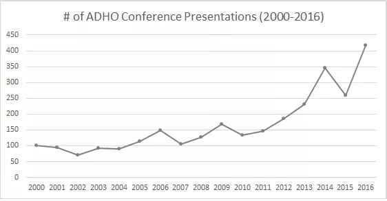
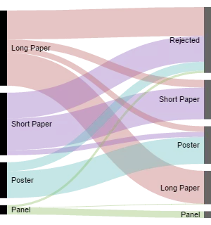
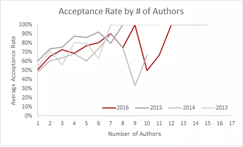

<!-- page 1 -->

[note: originally published as draft on March 17th, 2016]

DH2016 announced their [final(ish) program](https://www.conftool.pro/dh2016/sessions.php) yesterday and, of course, that means it’s analysis time. Every year, I ~~steal~~ scrape submission data from the reviewer interface, and then scrape the final conference program, to report acceptance rates and basic stats for the annual event. See [my previous 7.2 million previous posts on the subject](http://scottbot.net/tag/dhconf/). Nobody gives me data, I take it (capta, amiright?), so take these results with as many grains of salt as you’ll find at the [DH2016 salt mines](https://en.wikipedia.org/wiki/Wieliczka_Salt_Mine).

As expected, this will be the biggest ADHO conference to date, continuing a mostly-consistent trend of yearly growth. Excluding workshops & keynotes, this year’s ADHO conference in Kraków, Poland will feature 417 posters & presentations, up from 259 in 2015 (an outlier, held in Australia) and the previous record of 345 in 2014 (Switzerland). At this rate, the number of DH presentations should surpass our human population by the year 2126 (or earlier in the case of unexpected zombies).

Number of conference presentations since 2000.

<!-- page 2 -->

Acceptance rates this year are on par with previous years. An email from ADHO claims this year’s overall acceptance rate to be 62%, and my calculations put it at 64%. Previous years were within this range: 2013 Nebraska (64%), 2014 Switzerland (59%), and 2015 Australia (72%). Regarding form, the most difficult type of presentation to get through review is a long paper, with only 44% of submitted long papers being accepted as long papers. Another 7.5% of long papers were accepted as posters, and 10% as short papers. In total, 62% of long paper submissions were accepted in some form. Reviewers accepted 75% of panels and posters, leaving them mostly in their original form. The category least likely to get accepted in any form was the short paper, with an overall 59% acceptance rate (50% accepted as short papers; 8% accepted as posters). The moral of the story is that your best bet to get accepted to DH is to submit a poster. If you hate posters, submit a long paper; even if it’s not accepted as a long paper, it might still get in as a short or a poster. But if you do hate posters, maybe just avoid this conference.

Proportion of acceptances by type, 2016. Submission type on left, acceptance type or rejection on right.

About a third of this year’s presentations are single-authored, another third dual-authored, and the last third are authored by three or more people. As with 2013-2015, more authors means a more likely acceptance: reviewers accepted 51% of single-authored presentations, 66% of dual-authored presentations, and 74% of three-or-more-authored presentations.

<!-- page 3 -->

Acceptance rate by number of authors.

Topically, the landscape of DH2016 will surprise few. A quarter of all presentations will involve text analysis, followed by historical studies (23% of all presentations), archives (21%), visualizations (20%), text/data mining (20%), and literary studies (20%). DH self-reflection is always popular, with this year’s hot-button issues being DH diversity (10%), DH pedagogy (10%), and DH facilities (7%). Surprisingly, other categories pertaining to pedagogy are also growing compared to previous years, though mostly it’s due to more submissions in that area. Reviewers still don’t rate pedagogy presentations very highly, but more on that in the next post. Some topical low spots compared to previous years include social media (2% of all presentations), anthropology (3%), VR/AR (3%), crowdsourcing (4%), and philosophy (5%).

This year will likely be the most linguistically diverse conference thus-far: 92% English, 7% French, 0.5% German, with other presentations in Spanish, Italian, Polish, etc. (And by “most linguistically diverse” obviously I mean “really not very diverse but have you seen the previous conferences?”) Submitting in a non-English language doesn’t appreciably affect acceptance rates.

That’s all for now. Stay-tuned for Pt. 2, with more thorough comparisons to previous years, actual granular data/viz on topics, analyses of gender and geography, as well as interpretations of what the changing landscape means for DH.

---

<!-- page 3 -->

## Reader Comments

> **[triproftri](http://triproftri.wordpress.com/)**, March 22, 2016 at 4:54 pm
>
> Thank you for another great analysis of the DHC. I’m really surprised that Digital Pedagogy is still not being rated very high among the reviewers. That’s greatly disappointing. I’m looking forward to reading part 2 of this post.

<!-- page 4 -->

>> **scott b. weingart**, March 23, 2016 at 4:13 pm
>>
>> Haven’t delved too deeply yet, but although digital pedagogy still isn’t strongly present, my preliminary sense is trends do point positively. Thanks for the positive feedback, more soon.
