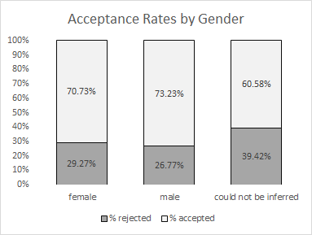
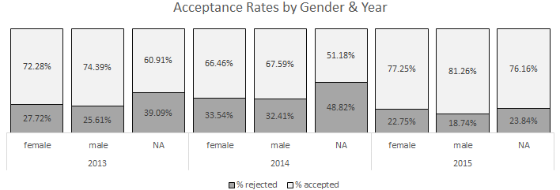
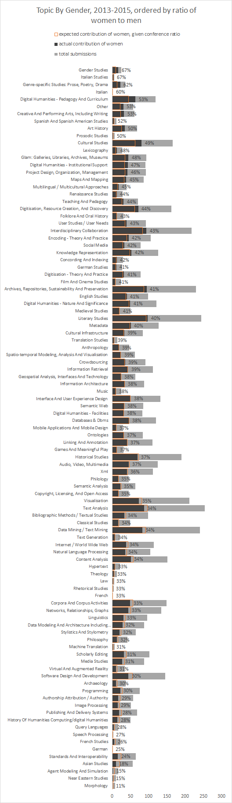

<!-- page 1 -->

**tl;dr**

Women are (nearly but not quite) as likely as men to be accepted by peer reviewers at DH conferences, but names foreign to the US are less likely than either men or women to be accepted to these conferences. Some topics are more likely to be written on by women (gender, culture, teaching DH, creative arts & art history, GLAM, institutions), and others more likely to be discussed by men (standards, archaeology, stylometry, programming/software).

**Introduction**

You may know I’m writing a [series on Digital Humanities conferences](http://www.scottbot.net/HIAL/?tag=dhconf), of which this is the zillionth post.[^1] This post has nothing to do with [DH2015](http://dh2015.org/), but instead looks at DH2013, DH2014, and DH2015 all at once. I continue my recent trend of looking at diversity in Digital Humanities conferences, drawing especially on these two posts ([1](/blog/acceptances-to-digital-humanities-2015-part-3/), [2](/blog/acceptances-to-digital-humanities-2015-part-2/)) about topic, gender, and acceptance rates.

This post will be longer than usual, since Heather Froehlich rightly [pointed out](https://twitter.com/heatherfro/status/614873987785564160) my methods in these posts aren’t as transparent as they ought to be, and I’d like to change that.

> *[@scott\_bot](https://twitter.com/scott_bot) [@nmhouston](https://twitter.com/nmhouston) don’t get me wrong – i think they’re interesting and useful but i don’t think they’re 100% transparent*
>
> *— heather froehlich (@heatherfro) [June 27, 2015](https://twitter.com/heatherfro/status/614873987785564160)*

<!-- page 2 -->

**Brute Force Guessing**

As someone who deals with algorithms and large datasets, I desperately seek out those moments when really stupid algorithms wind up aligning with a research goal, rather than getting in the way of it.

In the humanities, stupid algorithms are much more likely to get in the way of my research than help it along, and afford me the ability to make insensitive or reductivist decisions in the name of “scale”. For example, in looking for ethnic diversity of a discipline, I can think of two data-science-y approaches to solving this problem: analyzing last names for country of origin, or analyzing the color of recognized faces in pictures from recent conferences.

Obviously these are awful approaches, for a billion reasons that I need not enumerate, but including the facts that ethnicity and color are often not aligned, and last names (especially in the states) are rarely indicative of anything at all. But they’re *easy solutions*, so you see people doing them pretty often. I try to avoid that.

Sometimes, though, the stars align and the easy solution is the best one for the question. Let’s say we were looking to understand immediate reactions of racial bias; in that case, analyzing skin tone may get us something useful because we *don’t actually care about the race of the person*, what we care about is the *immediate perceived race* by other people, which is much more likely to align with skin tone. Simply: if a person looks black, they’re more likely to be treated as such by the world at large.

This is what I’m banking on for peer review data and bias. For the majority of my data on DH conferences, [Nickoal Eichmann](http://nickoal.com/) and I have been going in and hand-coding every single author with a gender that we glean from their website, pictures, etc. It’s quite slow, far from perfect (see [my note](/blog/acceptances-to-digital-humanities-2015-part-3/#note-41355-1)), but it’s at least more sensitive than the brute force method, we hope to improve it quite soon with user-submitted genders, and it gets us a rough estimate of gender ratios in DH conferences.

<!-- page 3 -->

But let’s say we want to discuss bias, rather than diversity. In that case, I actually prefer the brute force method, because instead of giving me a sense of the *actual gender of an author*, it can give me a sense of what the peer reviewers *perceive an author’s gender to be*. That is, <u>if a peer reviewer sees the name “Mary” as the primary author of an article, how likely is the reviewer to think the author is written by a woman, and will this skew their review?</u>

That’s my goal today, so instead of hand-coding like usual, I went to Lincoln Mullen’s [fabulous package for inferring gender](https://github.com/ropensci/genderdata) from first names in the programming language R. It does so by looking in the US Census and Social Security Database, looking at the percentage of men and women with a certain first name, and then gives you both the ratio of men-to-women with that name, and the most likely guess of the person’s gender.

**Inferring Gender for Peer Review**

I don’t have a [palantír](https://en.wikipedia.org/wiki/Palant%C3%ADr) and my DH data access is not limitless. In fact, everything I have I’ve scraped from public or semi-public spaces, which means I have no knowledge of who reviewed what for ADHO conferences, the scores given to submissions, etc. What I do have the titles and author names for every submission to an ADHO conference since 2013 ([explanation](/blog/analyzing-submissions-to-dh-2013/)), and the final program of those conferences. This means I can see which submissions don’t make it to the presentation stage; that’s not always a reflection of whether an article gets accepted, but it’s probably pretty close.

So here’s what I did: created a list of every first name that appears on every submission, rolled the list it into Lincoln Mullen’s gender inference machine, and then looked at how often authors guessed to be men made it through to the presentation stage, versus how often authors guessed to women made it through. That is to say, if an article is co-authored by one man and three women, and it makes it through, I count it as one acceptance for men and three for women. It’s not the only way to do it, but it’s the way I did it.

<!-- page 4 -->

I’m arguing this can be used as a proxy for gender bias in reviews and editorial decisions: that if first names that look like women’s names are more often rejected[^2] than ones that look like men’s names, there’s likely bias in the review process.

**Results: Bias in Peer Review?**

Totaling all authors from 2013-2015, the inference machine told me 1,008 names looked like women’s names; 1,707 looked like men’s names; and 515 could not be inferred. “Could not be inferred” is code for “the name is foreign-sounding and there’s not enough data to guess”. Remember as well, this is counting every authorship as a separate event, so if Melissa Terras submits one paper in 2013 and one in 2014, the name “Melissa” appears in my list twice.

\*drum roll\*

*Figure 1. Acceptance rates to DH2013-2015 by gender.*

So we see that in 2013-2015, 70.3% of woman-authorship-events get accepted, 73.2% of man-authorship-events get accepted, *and only 60.6% of uninferrable-authorship-events* get accepted. I’ll discuss gender more soon, but this last bit was totally shocking to me. It took me a second to realize what it meant: that if your first name isn’t a standard name on the US Census or Social Security database, you’re much less likely to get accepted to a Digital Humanities conference. Let’s break it out by year.

<!-- page 5 -->

*Figure 2. Acceptance rates to DH2013-2015 by gender and year.*

We see an interesting trend here, some surprising, some not. Least surprising is that the acceptance rates for non-US names is most equal this year, when the conference is being held so close to Asia (which the inference machine seems to have the most trouble with). My guess is that A) more non-US people who submit are actually able to attend, and B) reviewers this year are more likely to be from the same sorts of countries that the program is having difficulties with, so they’re less likely to be biased towards non-US first names. There’s also potentially a language issue here: that non-US submissions are more likely to be rejected because they are either written in another language, or written in a way that native English speakers may find difficult to understand.

But the fact of the matter is, <u>there’s a very clear bias against submissions by people with names non-standard to the US</u>. The bias, oddly, is most pronounced in 2014, when the conference was held in Switzerland. I have no good guesses as to why.

So now that we have the big effect out of the way, let’s get to the small one:

<!-- page 6 -->

gender disparity. Honestly, I had expected it to be worse; it *is* worse this years than the two previous, but that may just be statistical noise. It’s true that women do fair worse overall by 1-3%, which isn’t huge, but it’s big enough to mention. *However*.

**Topics and Gender**

*However*, it turns out that the entire gender bias effect we see is explained by the topical bias [I already covered the other day](/blog/acceptances-to-digital-humanities-2015-part-2/). (Scroll down for the rest of the post.)

<!-- page 8 -->

*Figure 3. Topic by gender. Total size of horizontal grey bar equals the number of submissions to a topic. Horizontal black bar shows the percentage of that topic with women authors. Orange line shows the 38% mark, which is the expected number of submissions by women given the 38% submission ratio to DH conferences. Topics are ordered top-to-bottom by highest proportion of women. The smaller the grey bar, the more statistical noise / less trustworthy the result.*

What’s shown here will be fascinating to many of us, and some of it more surprising than others. A full 67% of authors on the 25 DH submissions labeled “gender studies” are labeled as women by Mullen’s algorithm. And remember, many of those may be the same author; for example if “Scott Weingart” is listed as an author on multiple submissions, this chart counts those separately.

Other topics that are heavily skewed towards women: drama, poetry, art history, cultural studies, GLAM, and (importantly), institutional support and DH infrastructure. Remember how I said a large percentage of of those responsible for running DH centers, committees, and organizations are women? This is apparently the topic they’re publishing in.

If we look instead at the bottom of the chart, those topics skewed towards men, we see stylometrics, programming & software, standards, image processing, network analysis, etc. Basically either the CS-heavy topics, or the topics from when we were still “humanities computing”, a more CS-heavy community. These topics, I imagine, inherit their gender ratio problems from the various disciplines we draw them from.

You may notice I left out pedagogical topics from my list above, which are heavily skewed towards women. I’m singling that out specially because, if you recall from my previous post, pedagogical topics are especially unlikely to be accepted to DH conferences. In fact, a lot of the topics women are submitting in [aren’t getting accepted to DH conferences](/blog/acceptances-to-digital-humanities-2015-part-2/), you may recall.

<!-- page 9 -->

<u>It turns out that the gender bias in acceptance ratios is entirely accounted for by the topical bias</u>. When you break out topics that are not gender-skewed (ontologies, UX design, etc.), the acceptance rates between men and women are the same – the bias disappears. What this means is the small gender bias is coming at the topical level, rather than at the gender level, and since women are writing more about those topics, they inherit the peer review bias.

**Does this mean there is no gender bias in DH conferences?**

No. Of course not. I already [showed yesterday](/blog/acceptances-to-digital-humanities-2015-part-2/) that 46% of attendees to DH2015 are women, whereas only 35% of authors are. What it means is the bias against topics is gendered, but in a peculiar way that actually may be (relatively) easy to solve, and if we do solve it, it’d also likely go a long way in solving that attendee/authorship ratio too.

Get more women peer reviewing for DH conferences.

Although I don’t know who’s doing the peer reviews, I’d guess that the gender ratio of peer reviewers is about the same as the ratio of authors; 34% women, 66% men. If that is true, then it’s unsurprising that the topics women tend to write about are not getting accepted~~, because by definition these are the topics that men publishing at DH conferences find less interesting or relevant~~[^3]. If reviewers gravitate towards topics of their own interest, and if their interests are skewed by gender, it’d also likely skew results of peer review. If we are somehow able to improve the reviewer ratio, I suspect the bias in topic acceptance, and by extension gender acceptance, will significantly reduce.

Jacqueline Wernimont points out in a comment below that another way improving the situation is to break the “gender lines” I’ve drawn here, and make sure to attend presentations on topics that are outside your usual scope if (like me) you gravitate more towards one side than another.

<!-- page 10 -->

Obviously this is all still preliminary, and I plan to show the breakdown of acceptances by topic and gender in a later post so you don’t just have to trust me on it, but at the 2,000-word-mark this is getting long-winded, and I’d like feedback and thoughts before going on.

Notes:

[^1]: rounding up to the nearest zillion

[^2]: more accurately, if they don’t make it to the final program

[^3]: see Jacqueline Wernimont’s comment below

---

## Reader Comments

> **John Muccigrosso**, June 29, 2015
>
> What’s the overall sex ratio in DH at large, conference aside?

>> **Scott Weingart**, June 29, 2015
>>
>> I’m not sure how to count that…

>>> **John Muccigrosso.**, July 1, 2015
>>>
>>> I was trying to get at the possibility that conferences in general may not reflect the field at large. For all we know, for example, women are more likely to go to conferences, while men are more likely to submit papers. (Totally random statement there.)
>>>
>>> I’d also suggest that Brett is on to some confounding factors too. I’ll add to his short list seniority, where you’d expect there to be different sex ratios from the overall one.
>>>
>>> In any case, an interesting discussion.

> [**Brett Bobley**](http://www.neh.gov/odh/), June 29, 2015
>
> Thanks for this detailed analysis, Scott.
>
> It would also be interesting to factor in how many times each person has sent in papers to the DH conference in the past. A paper proposal (like a grant proposal) might be an example of writing that you get better at with experience. And each conference may have its own genre of writing that differs from other conferences. Do more experienced applicants get accepted at a higher rate? Do newer-to-the-field (or newer-to-the-conference) applicants have a tougher time? Will those same applicants have a higher acceptance rate when they try for the second time?
>
> It seems to me these are interesting data points, particularly as the DH world expands and more new folks are applying to conferences like this.
>
> Brett

>> **Scott Weingart**, June 29, 2015
>>
>> That’s a phenomenal idea, thanks Brett. I haven’t de-duped authors yet in 2014 or 2015, and I won’t be able to know repeat offenders until I’ve done that, but you may be interested in a preliminary analysis Nickoal and I have already done. We found that, 2004-2013, the rate of new authors was increasing even taking into account the increased size of the conference, which means either the field is getting less insular, or people are playing DH tourist more often from other areas. It’d be great to see the barrier-to-entry for newcomers as a next step.

> [**jwernimont**](http://jwernimont.wordpress.com/), June 29, 2015
>
> a friendly thought – it might be too strong to say that men “by definition” find the topics that women are working less interesting or relevant. I know that part of what you’re doing is talking about the way that this approach has defined “male” and “female” topics. But I’d like to hope that DH reviewers (and reviewers in general) are not only able to identify their research areas as interesting and I want to be sure to mark the difference between sex and gendering for your readers. There are a couple of reasons I make this observation:  
> 1) Knowledge is gendered by convention, so we might do well to separate the sex of the author from the gendering of the topic.  
> 2) I’m tired of seeing topics on any of the intersectional subject positions mostly attended by people who themselves inhabit those positions (one more panel with the label feminist and no men in the audience and I’m going to pull my hair out)  
> 3) the stakes of recognizing bias exist not only for women and POC, but for white, straight, cis men too – and we can all do a better job of making that clear.
>
> I

>> **Scott Weingart**, June 29, 2015
>>
>> Thanks for the observation, I see what you mean. I’ll do some editing and point to your comment here.

> [**Maha Bali**](http://blog.mahabali.me/), July 1, 2015
>
> Thanks for the details, Scott. My field isn’t DH – more like ed tech/higher ed but your research has made me think of what I know of reviewers of ed tech journals (i only know that most editors I have come across in the recent past have been men, and since it’s a mainly white male field it might be interesting to look at that data). I have seen research on gender in more controlled environments but i like that yours is based on real data as controlled studies raise many more questions for me. Thanks again for sharing.
>
> What i would love to see in general is peer reviewers who say, “this paper is not in my field of expertise therefore I am unqualified to judge its quality” instead of giving totally irrelevant feedback (which i have received MANY times in the past year because people don’t understand what a cMOOC is or what collaborative autoethnography is)
