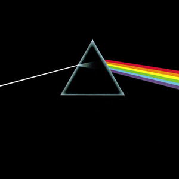
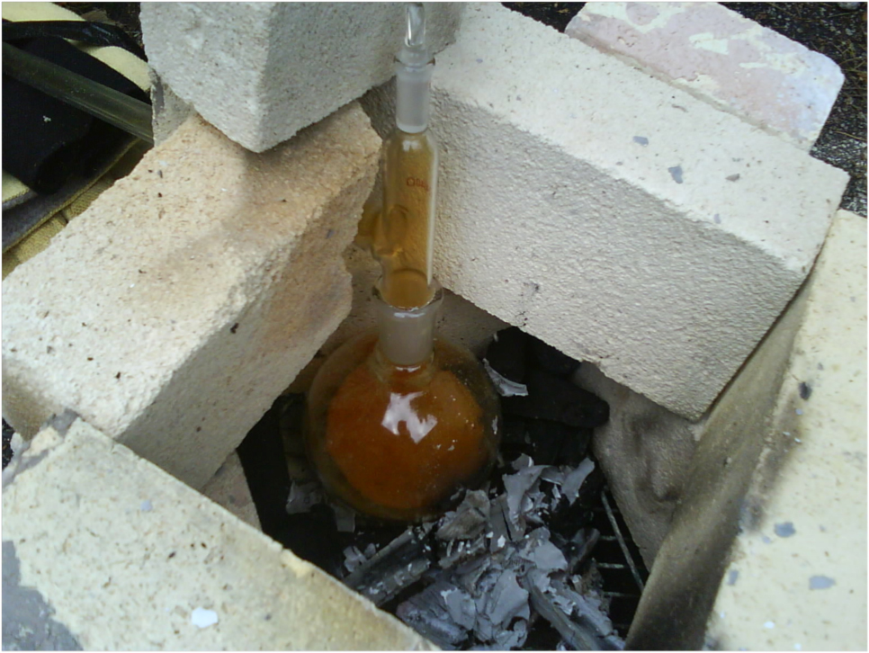
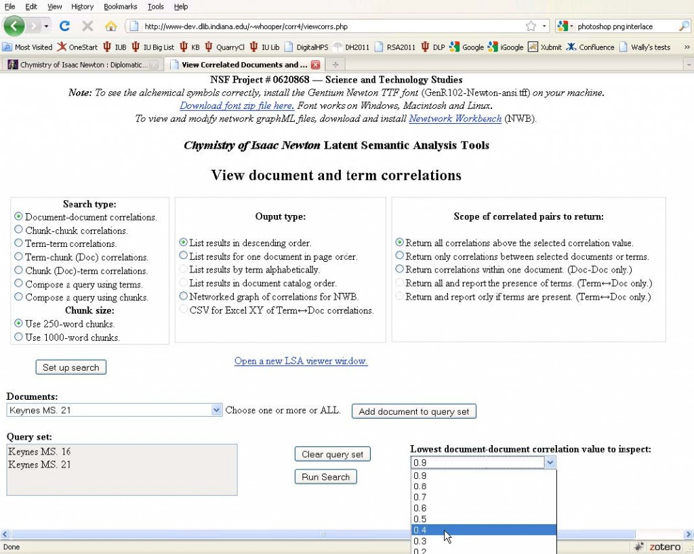
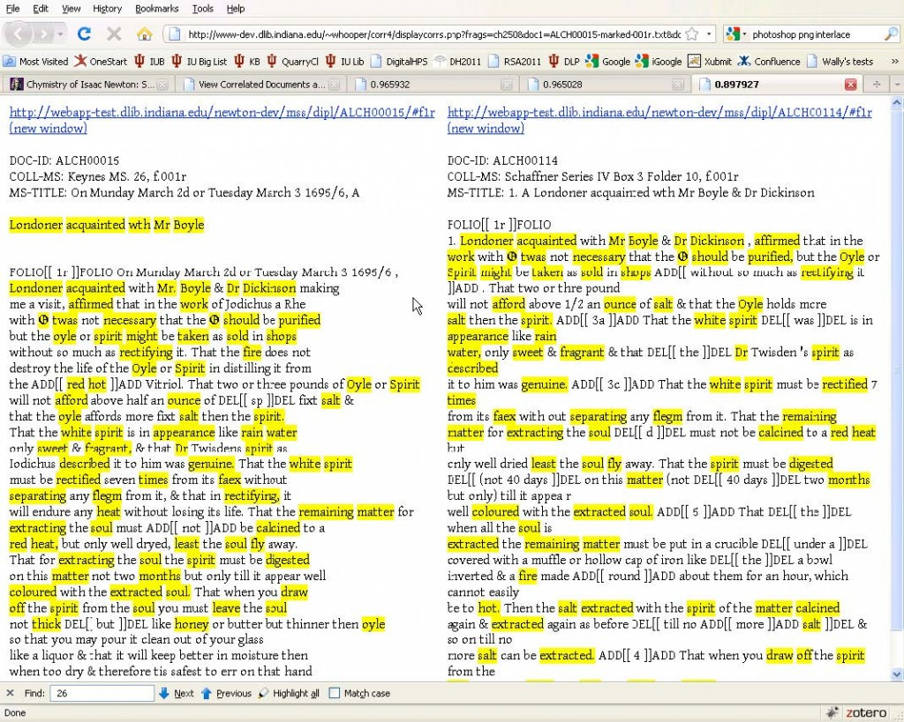
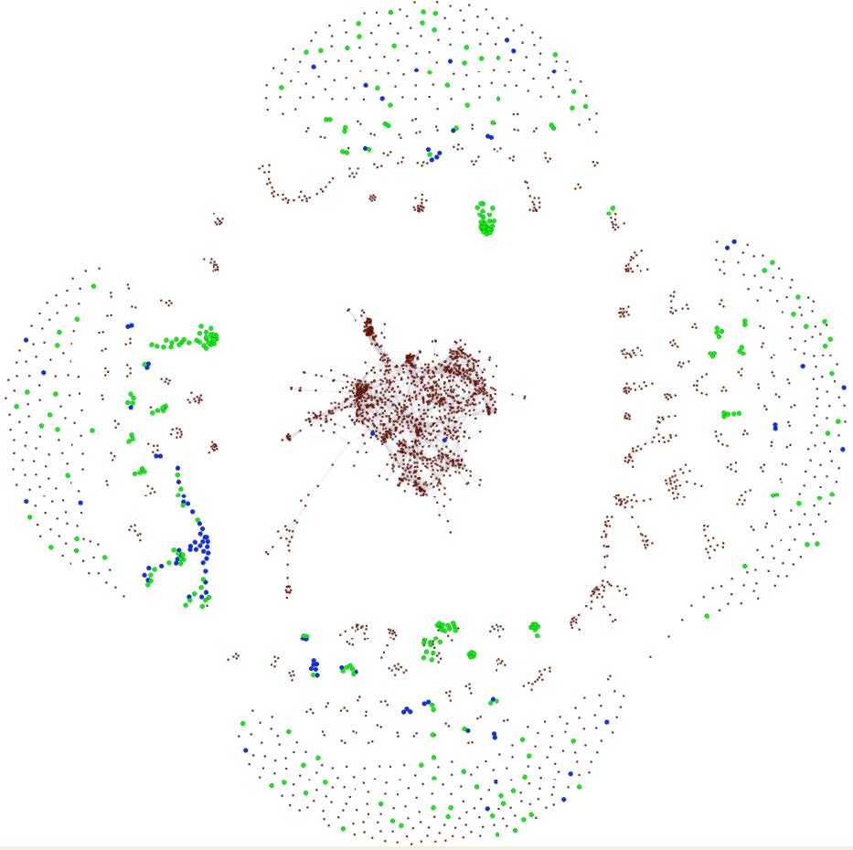

“Newton wrote and transcribed about a million words on the subject of alchemy.” –[chymistry.org](http://www.chymistry.org/)

Beside bringing us things like calculus, universal gravitation, and perhaps the inspiration for [certain Pink Floyd albums](http://en.wikipedia.org/wiki/The_Dark_Side_of_the_Moon), Isaac Newton spent many years researching what was then known as “chymistry,” a multifaceted precursor to, among other things, what we now call chemistry, pharmacology, and alchemy.

Pink Floyd and the Occult: Discuss.

Researchers at Indiana University, notably [William R. Newman](http://mypage.iu.edu/~wnewman/), [John A. Walsh](http://www.slis.indiana.edu/faculty/jawalsh/), Dot Porter, and Wallace Hooper, have spent the last several years developing [The Chymistry of Isaac Newton](http://www.chymistry.org/), an absolutely wonderful history of science resource which, as of this past month, has digitized all 59 of Newton’s alchemical manuscripts assembled by John Keynes in 1936. Among the sites features are heavily annotated transcriptions, manuscript images, often scholarly synopses, and examples of alchemical experiments. That you can [try at home](http://webapp1.dlib.indiana.edu/newton/reference/mineral.do). That’s right, you can do *alchemy* with this website. They also managed to [introduce alchemical symbols into unicode](http://std.dkuug.dk/jtc1/sc2/wg2/docs/n3584.pdf) (U+1F700 – U+1F77F), which is just indescribably cool.

Alchemical experiments at home! http://webapp1.dlib.indiana.edu/newton/reference/mineral.do

What I really want to highlight, though, is a brand new feature introduced by Wallace Hooper: [automated Latent Semantic Analysis (LSA) of the entire corpus](http://www.dlib.indiana.edu/education/brownbags/fall2011/newton/newton.pdf). For those who are not familiar with it, LSA is somewhat similar LDA, the algorithm driving the increasingly popular Topic Models used in Digital Humanities. They both have their strengths and weaknesses, but essentially what they do is show how documents and terms relate to one another.

Newton Project LSA

In this case, the entire corpus of Newton’s alchemical texts is fed into the LSA implementation ([try it for yourself](http://webapp1.dlib.indiana.edu/newton/lsa/index.php)), and then based on the user’s preferences, the algorithm spits out a network of terms, documents, or both together. That is, if the user chooses document-document correlations, a list is produced of the documents that are *most similar* to one another based on similar word use within them. That list includes weights – how similar are they to one another? – and those weights can be used to create a network of document similarity.

Similar Documents using LSA

One of the really cool features of this new service is that it can export the network either as CSV for the technical among us, or as an [nwb](http://nwb.cns.iu.edu/) file to be loaded into the [Network Workbench](http://nwb.cns.iu.edu/) or the [Sci² Tool](https://sci2.cns.iu.edu/user/index.php). From there, you can analyze or visualize the alchemical networks, or you can export the files into a network format of your choice.

Network of how Newton's alchemical documents relate to one-another visualized using NWB.

It’s great to see more sophisticated textual analyses being automated and actually used. Amber Welch recently posted on [Moving Beyond the Word Cloud](http://blogs.library.duke.edu/dukelibrariesinstruction/2011/10/31/moving-beyond-the-word-cloud/) using the wonderful [TAPoR](http://portal.tapor.ca/portal/portal), and Michael Widner just posted a [thought-provoking article](http://pedagogy.dwrl.utexas.edu/content/automated-text-analysis-revision) on using [Voyeur Tools](http://voyeurtools.org/) for the process of paper revision. With tools this easy to use, it won’t be long now before the first thing a humanist does when approaching a text (or a million texts) is to glance at all the high-level semantic features and various document visualizations before digging in for the close read.
