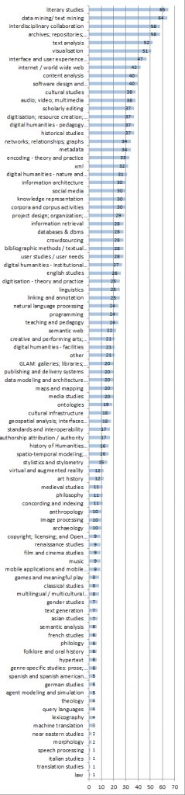
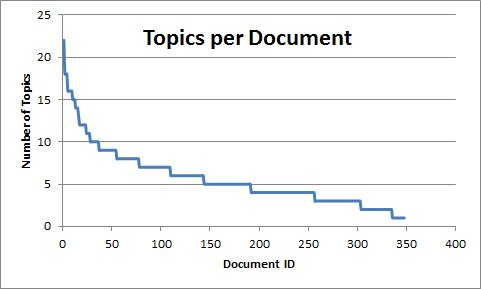
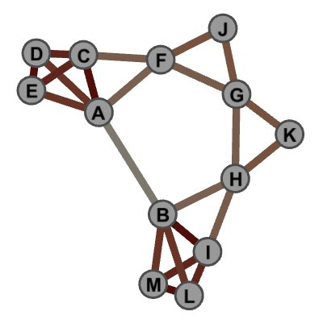
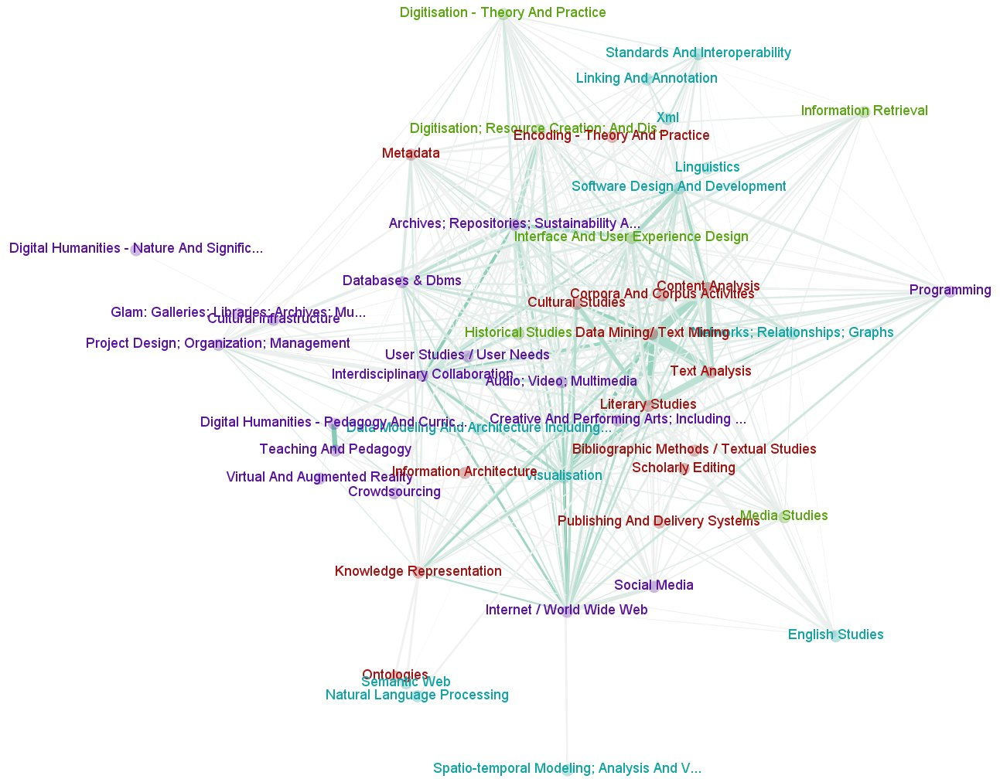
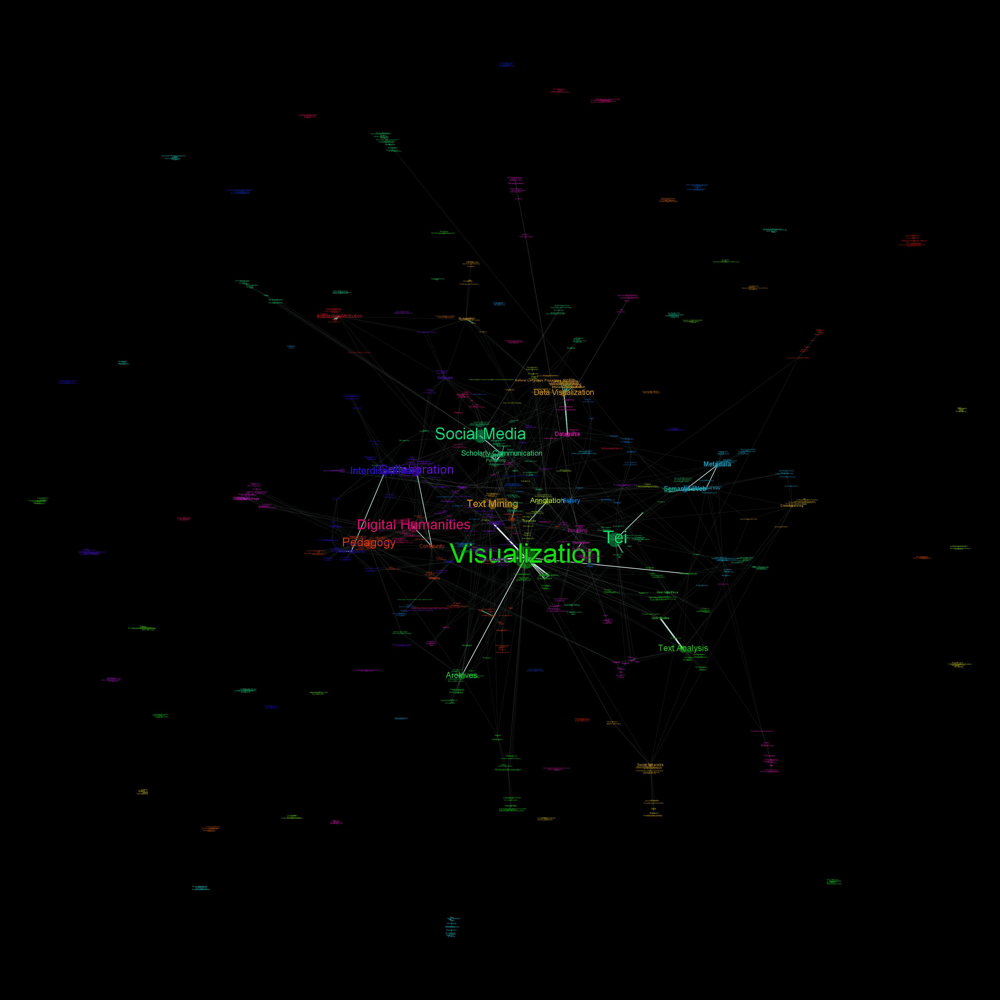

[Digital Humanities 2013 is on its way](http://dh2013.unl.edu/);
submissions are closed, peers will be reviewing them shortly, and (most
importantly for this post) the people behind the conference are
experimenting with a new method of matching submissions to reviewers.
It’s a bidding process; reviewers take a look at the many submissions
and state their reviewing preferences or, when necessary, conflicts of
interest. It’s unclear the extent to which these preferences will be
accommodated, as this is an experiment on their part. [Bethany Nowviskie describes it here](http://nowviskie.org/2012/cats-and-ships/).
As a potential reviewer, I just went through the process of listing my
preferences, and managed to do some data scraping while I was there. How
could I not? All 348 submission titles were available to me, as well as
their authors, topic selections, and keywords, and given that my
submission for this year is *all about quantitatively analyzing DH*,
it was an opportunity I could not pass up. Given that these data are
sensitive, and those who submitted did so under the assumption that
rejected submissions would remain private, I’m opting not to release the
data or any non-aggregated information. I’m also doing my best not to
actually read the data in the interest of the privacy of my peers; I
suppose you’ll all just have to trust me on that one, though.

So what are people submitting? According to the topics authors
assigned to their 348 submissions, 65 submitted articles related to
“literary studies,” trailed closely by 64 submissions which pertained to
“data mining/ text mining.” Work on archives and visualizations are
also up near the top, and only about half as many authors submitted
historical studies (37) as those who submitted literary ones (65). This
confirms my long suspicion that our current wave of DH (that is, what’s *trending*
and exciting) focuses quite a bit more on literature than history. This
makes me sad.  You can see the breakdown in Figure 1 below, and
further analysis can be found after.

*Figure 1: Number of documents with each topic authors assigned to submissions for DH2013 (click to enlarge).*

The majority of authors attached fewer than five topics to their
submissions; a small handful included over 15.  Figure 2 shows the
number of topics assigned to each document.

*Figure 2: The number of topics attached to each document, in order of rank.*

I was curious how strongly each topic coupled with other topics, and
how topics tended to cluster together in general, so I extracted a topic
co-occurrence network. That is, whenever two topics appear on the same
document, they are connected by an edge (see [Networks Demystified Pt. 1](/blog/demystifying-networks/)
for a brief introduction to this sort of network); the more times two
topics co-occur, the stronger the weight of the edge between them.

Topping off the list at 34 co-occurrences were “Data Mining/ Text
Mining” and “Text Analysis,” not terrifically surprising as the the
latter generally requires the former, followed by “Data Mining/
Text Mining” and “Content Analysis” at 23 co-occurrences, “Literary
Studies” and “Text Analysis” at 22 co-occurrences, “Content Analysis”
and “Text Analysis” at 20 co-occurrences, and “Data Mining/ Text
Mining” and “Literary Studies” at 19 co-occurrences. Basically what I’m
saying here is that Literary Studies, Mining, and Analysis seem to go
hand-in-hand.

Knowing my readers, about half of you are already angry with me
counting co-occurrences, and rightly so. That measurement is heavily
biased by the sheer total number of times a topic is used; if “literary
studies” is attached to 65 submissions, it’s much more likely that it
will co-occur with any particular topic than topics (like “teaching and
pedagogy”) which simply appear more infrequently. The highest frequency
topics will co-occur with one another simply by an accident of
magnitude.

To account for this, I measured the *neighborhood overlap*
of each node on the topic network. This involves first finding the
number of other topics  a pair of two topics shares. For example,
“teaching and pedagogy” and “digital humanities – pedagogy and
curriculum” each co-occur with several other of the same topics,
including “programming,” “interdisciplinary collaboration,” and “project
design, organization, management.” I summed up the number topical
co-occurrences between each pair of topics, and then divided that total
by the number of co-occurrences each node in the pair had individually.
In short, I looked at which pairs of topics tended to share similar
other topics, making sure to take into account that some topics which
are used very frequently might need some normalization. There are better
normalization algorithms out there, but I opt to use this one for its
simplicity for pedagogical reasons. The method does a great job leveling
the playing field between pairs of infrequently-used topics compared to
pairs of frequently-used topics, but doesn’t fair so well when looking
at a pair where one topic is popular and the other is not. The algorithm
is well-described in Figure 3, where the darker the edge, the higher
the neighborhood overlap.

*Figure 3: The neighborhood overlap between two nodes is how many neighbors (or connections) that pair of nodes shares. As such, A and B share very few connections, so their overlap is low, whereas D and E have quite a high overlap. Via Jaroslav Kuchar .*

Neighborhood overlap paints a slightly different picture of the
network. The pair of topics with the largest overlap was “Internet /
World Wide Web” and “Visualization,” with 90% of their neighbors
overlapping. Unsurprisingly, the next-strongest pair was “Teaching and
Pedagogy” and “Digital Humanities – Pedagogy and Curriculum.” The
data might be used to suggest multiple topics that might be merged into
one, and this pair seems to be a pretty good candidate. “Visualization”
also closely overlaps “Data Mining/ Text Mining”, which itself (as we
saw before) overlaps with “Cultural Studies” and “Literary Studies.”
What we see from this close clustering both in overlap and in connection
strength is the traces of a fairly coherent subfield out of DH, that of
quantitative literary studies. We see a similarly tight-knit cluster
between topics concerning archives, databases, analysis, the web,
visualizations, and interface design, which suggests another genre in
the DH community: the (relatively) recent boom of user interfaces as
workbenches for humanists exploring their archives. Figure 4 represents
the pairs of topics which overlap to the highest degree; topics without
high degrees of pair correspondence don’t appear on the network graph.

*Figure 4: Network of topical neighborhood overlap. Edges between topics are weighted according to how structurally similar the two topics are. Topics that are structurally isolated are not represented in this network visualization.*

The topics authors chose for each submission were from a controlled
vocabulary. Authors also had the opportunity to attach their own
keywords to submissions, which unsurprisingly yielded a much more
diverse (and often redundant) network of co-occurrences. The resulting
network revealed a few surprises: for example, “topic modeling” appears
to be much more closely coupled with “visualization” than with “text
analysis” or “text mining.” Of course some pairs are not terribly
surprising, as with the close connection between “Interdisciplinary” and
“Collaboration.” The graph also shows that the organizers have done a
pretty good job putting the curated topic list together, as a
significant chunk of the high thresholding keywords are also
available in the topic list, with a few notable exceptions. “Scholarly
Communication,” for example, is a frequently used keyword but not
available as a topic – perhaps next year, this sort of analysis can be
used to help augment the curated topic list. The keyword network appears
in Figure 5. I’ve opted not to include a truly high resolution image to
dissuade readers from trying to infer individual documents from the
keyword associations.

*Figure 5: Which keywords are used together on documents submitted to DH2013? Nodes are colored by cluster, and edges are weighted by number of co-occurrences. Click to enlarge.*

There’s quite a bit of rich data here to be explored, and anyone who
does have access to the bidding can easily see that the entire point of
my group’s submission is exploring the landscape of DH, so there’s
definitely more to come on the subject from this blog. I especially look
forward to seeing what decisions wind up being made in the peer review
process, and whether or how that skews the scholarly landscape at the
conference.

On a more reflexive note, looking at the data makes it pretty clear
that DH isn’t as fractured as some occasionally suggest (New Media vs.
Archives vs. Analysis, etc.). Every document is related to a few others,
and they are all of them together connected in a rich family, a
network, of Digital Humanities. There are no islands or isolates. While
there might be no “The” Digital Humanities, no unifying factor
connecting all research, there are Wittgensteinian
family resemblances  connecting all of these submissions
together, in a cohesive enough whole to suggest that yes, we can
reasonably continue to call our confederation a single community.
Certainly, there are many sub-communities, but there still exists an
internal cohesiveness that allows us to differentiate ourselves from,
say, geology or philosophy of mind, which themselves have their own
internal cohesiveness.
