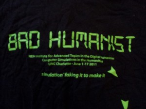

There has been a [recent](http://www.michaeljkramer.net/issuesindigitalhistory/blog/?p=377) [slew](http://historyproef.org/blog/digital-humanities/critical-discourse-in-the-digital-humanities/) of [fantastic](http://liu.english.ucsb.edu/where-is-cultural-criticism-in-the-digital-humanities/) [posts](http://digitalhumanitiesnow.org/2011/11/digital-humanities-and-theory-round-up/)
about critical theory and discourse in the digital humanities. To sum
up: hacking, yacking, we need more of it, we already have enough of it
thank you very much, just deal with the French names already, openness,
data, Hope! The unabridged version is available for free at an Internet
near you. At this point in the conversation, it seems the majority
involved agree that the digital needs more humanity, the humans need
more digital, and the two aren’t necessarily as distinct as they seem.

The conversation reminds me of a theme that came at the NEH Institute on [Computer Simulations in the Humanities](http://complexity.uncc.edu/nehinstitute) this past summer. At the beginning of the workshop, [Tony Beavers](http://faculty.evansville.edu/tb2/)
introduced himself as a Bad Humanist. What is a bad humanist? We tossed
the phrase out a lot during those three weeks — we even made ourselves a
shirt — but there was never much real discussion of what that meant. We
just had the general sense that we were all relatively bad humanists.

One participant was from “The Centre for Exact Humanities” (what is
that everyone else is doing?) in Hyderabad, India; many
participants had backgrounds in programming or mathematics or economics.
All of our projects were heavily computational, some were economic or
arguably positivist, and absolutely none of them felt like anything I’d
ever read in a humanities journal. Are these sorts of computational
humanistic projects Bad Humanities? Of course the question is absurd.
These are not Bad Humanities projects, they’re simply new types of
research. They are created by people with humanities training, who are
studying things about humans and doing so in legitimate (if
as-yet-untested) ways.

Stephen Crowley printed this wonderful t-shirt for the workshop participants.

Fast forward to this October at the [bounceback](http://www.ipam.ucla.edu/schedule.aspx?pc=hum2011)
for NEH’s Network Analysis in the Humanities summer institute. The same
guy who called himself a bad humanist, Tony Beavers, brought up the
question of whether we were just adopting old social science methods
without bothering to become familiar with the theory behind the social
science. As he put it, “are we just bad social scientists?” There is a
real danger in adopting tools and methods developed outside of our field
for our own uses, especially if we lack the training to know their
limitations.

In my mind, however, both the ideas of a bad humanist (lacking the
appropriate yack) or of a bad social scientist (lacking the appropriate
hack) fundamentally miss the point. The discourse and theory discussion
has touched on the changing notions of disciplinarity, [as did I the other day](http://www.scottbot.net/HIAL/?p=190).
A lot of us are writing and working on projects that don’t fit well
within traditional disciplinary structures; their subjects and methods
draw liberally from history, linguistics, computer science, sociology,
complexity theory, and whatever else seems necessary at the time.

As long as we remain aware of and well-grounded in whatever we’re
drawing from, it doesn’t really matter what we call what we do — so long
as it’s done well. People studying humans would do well not to ignore
the last half-century of humanities research. People using, for example,
network analysis should become very familiar with its theoretical and
methodological limitations. By and large, though, the computational
humanities projects I’ve come across are thoughtful, well-informed, and
ultimately *good research*. Whether it actually is still *good humanities*, *good social science*, or *good* anything else doesn’t feel terribly relevant.

---

## Reader Comments

> **Allen Riddell**, November 21, 2011 at 3:34 pm
>
> Naturally, I agree with everything here. These categories are becoming less relevant.
>
> I had a conversation with professor (emerita) recently who described 
my generation as a “cusp” generation for the humanities. That is, 
broadly speaking, the kind of student who studied the humanities when I 
was an undergraduate no longer does; they go into different fields. 
These fields include, I suspect, the array of interdisciplinary / 
transdisciplinary offerings that didn’t exist ten years ago.
>
> Some food for thought. I don’t think this is good news for the existing disciplinary arrangements.

>> **Scott Weingart**, November 22, 2011 at 3:42 pm
>>
>> That’s very true, although if it’s not good news for existing 
disciplinary arrangements, what is it good news for? I wonder where 
we’ll go, or if the academy will restructure before it collapses under 
its own centuries of weight..
