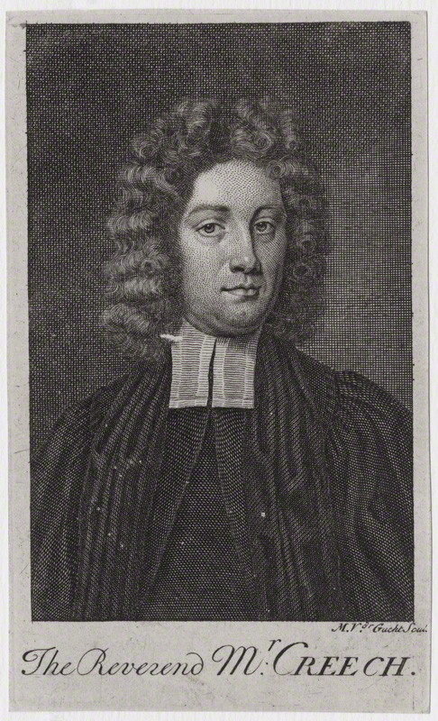

*Well* I fulfilled my promise of irregularity. Over ten years I blogged at least once a year, and often several times a month. Then, in 2020, I stopped.

Then a bunch of stuff happened. I got a job at the University of Notre Dame, then a kid, then another job at the National Endowment for the Humanities, then got DOGE'd, and now I'm at the Library of Virginia (the state library and archive in Richmond, not the university library in Charlottesville).

Irregular readers of *the irregular* might recall me to be a historian developing and using computational methods to study the past. And I still do that casually! My day job is totally different now, as it has been for over half a decade.

Frankly I don't know what this blog will be about going forward. Stuff I think is neat, probably.

The first several new posts will likely be about my current passion project, a biography of [17th century translator Thomas Creech](https://en.wikipedia.org/wiki/Thomas_Creech). I started writing it in 2006 when I noticed a bunch of historians getting basic facts about his life wrong. Since it's so niche I've never focused my attention on the bio, but it's getting to a point where I'm comfortable sharing bits and pieces.

Creech's life was eclipsed by his death, a highly sensationalized suicide around which rumors swirled that persist to this day. He was just a normal dude who deserves a better memory, so I'm writing it. Maybe it'll be a book, if any publishers care to take it on. If not, I'll just dump it online here.

Some blog posts might relate to AI, as a computational tool like any of the others I've used to study history. Long time readers will know my approach to be a critical one: I advocate for careful, constrained use in only those circumstances in which an approach is directly relevant, rather than "driven" by tool, method, or data. When teaching methods workshops, I usually start by saying "I hope 90% of you realize after this workshop that this method is the wrong one for your need."

Rest assured every word of this blog is and will always be 100% Certified Human Extruded™. You deserve better than for me to feed you Content™ you could have as easily generated yourself with an LLM. When I use AI (which I will, including in creating the code behind this site) I will tell you, along with the why/how/who/what/where/when/wakawakawaka/etc.