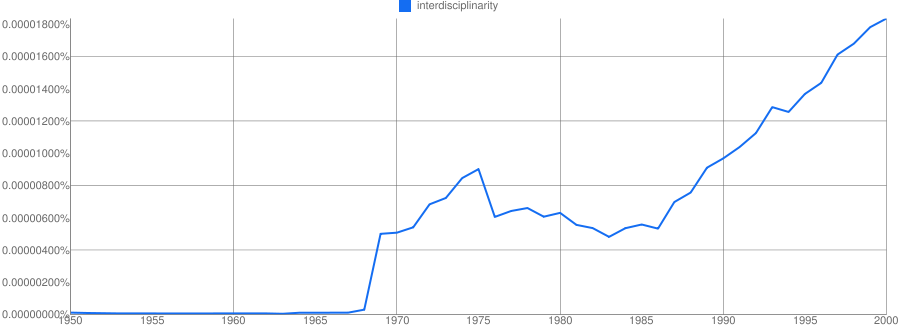
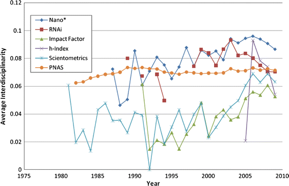
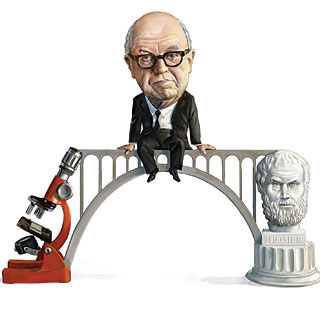

<!-- page 1 -->

Traditional disciplinary silos have always been useful fictions. They help us organize our research centers, our journals, our academies, and our lives. However much simplicity we gain from quickly and easily being able to place research X into box Y, however, is offset by the requirement of fitting research X into one *and only one* box Y. What we gain in simplicity, we lose in flexibility.

The academy is facing convergence on two fronts.

A turn toward computation, complicated methodologies, and more nuanced approaches to research is erecting increasingly complex barriers to entry on basic scholarship. Where once disparate disciplines had nothing in common besides membership in the academy, now they are connected by a joint need for computer infrastructure, algorithm expertise, and methodological training. I recently commiserated with a high energy physicist and a geneticist on the difficulties of parallelizing certain data analysis algorithms. Somehow, in the space of minutes, we three *very* unrelated researchers reached *common ground*.

An increasing reliance on consilience provides the other converging factor. A [steady but relentless rise in interest in interdisciplinarity](#) has manifested itself in scholarly writings through increasingly wide citation patterns. That is, scholars are drawing from sources further from their own, and with growing frequency.[^1] Much of this may be attributed to the rise of computer-aided document searches. Whatever the reasons, scholars are drawing from a much wider variety of research, and this in turn often brings more variety to *their* research.

<!-- page 2 -->

*Google Ngrams shows us how much people like to say "interdisciplinarity."*

*Measuring the interdisciplinarity of papers over time. From Guo, Hanning, Scott B. Weingart, and Katy Börner. 2011. “Mixed-indicators model for identifying emerging research areas.” Scientometrics 89 (June 21): 421-435.*

Methodological and infrastructural convergence, combined with subject consilience, is dislodging scholarship from its traditional disciplinary silos. Perhaps, in an age when one-item-one-box taxonomies are rapidly being replaced by more flexible categorization schemes and machine-assisted self-organizations, these disciplinary distinctions are no longer as useful as they once were.

<!-- page 3 -->

Unfortunately, the boom of interdisciplinary centers and institutes in the 70’s and 80’s left many graduates untenurable. By focusing on problems out the scope of any one traditional discipline, graduates from these programs often found themselves outside the scope of any particular group that might hire them. A university system that has existed in some recognizable form for the last thousand years cannot help but pick up inertia, and that indeed is what has happened here. While a flexible approach to disciplinarity might be better *if starting all over again*, the truth is we have to work with what we have, and a total overhaul is unlikely.

The question is this: what are the smallest and easiest possible changes we can make, at the local level, to improve the environment for increasingly convergent research in the long term? Is there a minimal amount of work one can do such that the returns are sufficiently large to support flexibility? One inspiring step is [Bethany Nowviskie](#)‘s (and many others’) [#alt-ac project](#) and the movement surrounding it, which pushes for alternative or unconventional academic careers.

*Alternative Academic Careers*

The #alt-ac movement seems to be picking up the most momentum with those straddling the tech/humanities divide, however it is equally important for those crossing all traditional academic divides. This includes divides between traditionally diverse disciplines (e.g., literature and social science), between methods (e.g., unobtrusive measures and surveys), between methodologies (e.g., quantitative and qualitative), or in general between C.P. Snow’s “Two Cultures” of science and the humanities.

<!-- page 4 -->

These divides are often useful and, given that they are reinforced by tradition, it’s usually not worth the effort to attempt to move beyond them. The majority of scholarly work still fits reasonably well within some pre-existing community. For those working across these largely constructed divides, however, an infrastructure needs to exist to support their research. National and private funding agencies have answered this call admirably, however significant challenges still exist at the career level.

*C.P. Snow bridging the "Two Cultures." Image from Scientific American.*

Novel and surprising research often comes from connecting previously unrelated silos. For any combination of communities, if there exists interesting research which could be performed at their intersection, it stands to reason that those which have been most difficult to connect would be the most fruitful if combined. These combinations would likely be the ones with the most low-hanging fruit.

The walls between traditional scholarly communities are fading. In order for the academy to remain agile and flexible, it must facilitate and adapt to the changing scholarly landscape. “The academy,” however, is not some unified entity which can suddenly change directions at the whim of a few; it is all of us. What can we do to affect the desired change? On the scholarly communication front, scholars are adapting  by [signing pledges](#) to limit publications and reviews to open access venues. We can talk about increasing interdisciplinarity, but what does interdisciplinarity mean when disciplines themselves are so amorphous?

<!-- page 5 -->

Have any great ideas on what we can do to improve things? Want to tell me how starry-eyed and ignorant I am, and how unnecessary these changes would be? All comments welcome!

\[Note: Surprise! I have a conflict of interest. I’m “interdisciplinary” and eventually want to find a job. Help?\]

[^1]: Increasingly interdisciplinary citation patterns is a trend I noticed when working on [a paper I recently co-authored in *Scientometrics*](#). Over the last 30 years, publications in the *Proceedings of the National Academy of Sciences* have shown a small but statistically significant trend in the interdisciplinarity of citations. Whereas a paper 30 years ago may have cited sources from one or a small set of closely related journals, papers now are somewhat more likely to cite a larger number of journals in increasingly disparate fields of study. This does take into account the average number of references per paper. A similar but more pronounced trend was shown in the journal *Scientometrics*. While this is by no means a perfect indicator for the rise of interdisciplinarity, a combination of this study and anecdotal evidence leads me to believe it is the case.
