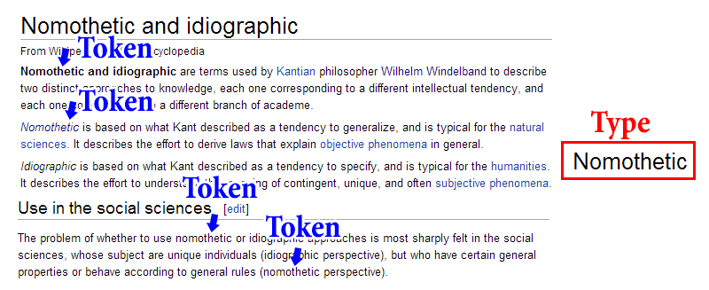
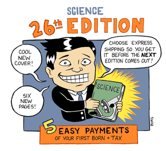
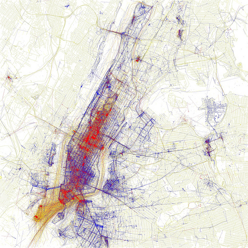

<!-- page 1 -->

There’s an oft-spoken and somewhat strawman tale of how the digital humanities is bridging C.P. Snow’s “Two Culture” divide, between the sciences and the humanities. This story is sometimes true (it’s fun putting together Ocean’s Eleven-esque teams comprising every discipline needed to get the job done) and sometimes false (plenty of people on either side still view the other with skepticism), but as a historian of science, I don’t find the divide all that interesting. As Snow’s title suggests, this divide is first and foremost *cultural*. There’s another overlapping divide, a bit more epistemological, methodological, and ontological, which I’ll explore here. It’s the nomothetic(type)/idiographic(token) divide, and I’ll argue here that not only are its barriers falling, but also that the distinction itself is becoming less relevant.

**Nomothetic** (Greek for “establishing general laws”-ish) and **Idiographic** (Greek for “pertaining to the individual thing”-ish) approaches to knowledge have often split the sciences and the humanities. I’ll offload the hard work onto Wikipedia:

<!-- page 2 -->

> *Nomothetic is based on what Kant described as a tendency to generalize, and is typical for the natural sciences. It describes the effort to derive laws that explain objective phenomena in general.*
>
> *Idiographic is based on what Kant described as a tendency to specify, and is typical for the humanities. It describes the effort to understand the meaning of contingent, unique, and often subjective phenomena.*

These words are long and annoying to keep retyping, and so in the long-standing humanistic tradition of using new words for words which already exist, henceforth I shall refer to nomothetic as **type** and idiographic as **token**.[^1]  I use these because a lot of my digital humanities readers will be familiar with their use in text mining. If you counted the number of unique words in a text, you’d be be counting the number of types. If you counted the number of total words in a text, you’d be counting the number of tokens, because each token (word) is an individual instance of a type. You can think of a type as the platonic ideal of the word (notice the word *typical*?), floating out there in the ether, and every time it’s actually used, it’s one specific token of that general type.

*The Token/Type Distinction*

<!-- page 3 -->

Usually the natural and social sciences look for general principles or causal laws, of which the phenomena they observe are specific instances. A social scientist might note that every time a student buys a $500 textbook, they actively seek a publisher to punch, but when they purchase $20 textbooks, no such punching occurs. This leads to the discovery of a new law linking student violence with textbook prices. It’s worth noting that these laws can and often are nuanced and carefully crafted, with an awareness that they are neither wholly deterministic nor ironclad.

*\[[via](http://tinypic.com/view.php?pic=qnuqeh&s=5#.UtqQhZ4o7RY)\]*

The humanities (or at least history, which I’m more familiar with) are more interested in what *happened* than in what *tends to happen*. Without a doubt there are general theories involved, just as in the social sciences there are specific instances, but the intent is most-often to flesh out details and create a particular internally consistent narrative. They look for tokens where the social scientists look for types. Another way to look at it is that the humanist wants to know what makes a thing unique, and the social scientist wants to know what makes a thing comparable.

It’s been noted these are fundamentally different goals. Indeed, how can you in the same research articulate the subjective contingency of an event while simultaneously using it to formulate some general law, applicable in all such cases? Rather than answer that question, it’s worth taking time to survey some recent research.

<!-- page 4 -->

A recent digital humanities panel at MLA elicited responses by [Ted Underwood](http://tedunderwood.com/2014/01/14/new-models-of-literary-collectivity/) and [Haun Saussy](http://printculture.com/literature-at-the-macroscale/), of which this post is in part itself a response. One of the [papers](http://lucian.uchicago.edu/blogs/literarynetworks/) at the panel, by Long and So, explored the extent to which haiku-esque poetry preceded what is commonly considered the beginning of haiku in America by about 20 years. They do this by teaching the computer the form of the haiku, and having it algorithmically explore earlier poetry looking for similarities. Saussy comments on this work:

> *\[…\] macroanalysis leads us to reconceive one of our founding distinctions, that between the individual work and the generality to which it belongs, the nation, context, period or movement. We differentiate ourselves from our social-science colleagues in that we are primarily interested in individual cases, not general trends. But given enough data, the individual appears as a correlation among multiple generalities.*

One of the significant difficulties faced by digital humanists, and a driving force behind critics like Johanna Drucker, is the fundamental opposition between the traditional humanistic value of stressing subjectivity, uniqueness, and contingency, and the formal computational necessity of filling a database with hard decisions. A database, after all, requires you to make a series of binary choices in well-defined categories: is it or isn’t it an example of haiku? Is the author a man or a woman? Is there an author or isn’t there an author?

Underwood addresses this difficulty in his response:

> *Though we aspire to subtlety, in practice it’s hard to move from individual instances to groups without constructing something like the sovereign in the frontispiece for Hobbes’ Leviathan – a homogenous collection of instances composing a giant body with clear edges.*

<!-- page 5 -->

But he goes on to suggest that the initial constraint of the digital media may not be as difficult to overcome as it appears. Computers may even offer us a way to move beyond the categories we humanists use, like *genre* or *period*.

> *Aren’t computers all about “binary logic”? If I tell my computer that this poem both is and is not a haiku, won’t it probably start to sputter and emit smoke?*
>
> *Well, maybe not. And actually I think this is a point that should be obvious but just happens to fall in a cultural blind spot right now. The whole point of quantification is to get beyond binary categories — to grapple with questions of degree that aren’t well-represented as yes-or-no questions. Classification algorithms, for instance, are actually very good at shades of gray; they can express predictions as degrees of probability and assign the same text different degrees of membership in as many overlapping categories as you like.*

Here we begin to see how the questions asked of digital humanists (on the one side; computational social scientists are tackling these same problems) are forcing us to reconsider the divide between the general and the specific, as well as the meanings of categories and typologies we have traditionally taken for granted. However, this does not yet cut across the token/type divide: this has gotten us to the macro scale, but it does not address general principles or laws that might *govern* specific instances. Historical laws are a murky subject, prone to inducing fits of anti-deterministic rage. Complex Systems Science and the lessons we learn from Agent-Based Modeling, I think, offer us a way past that dilemma, but more on that later.

For now, let’s talk about influence. Or diffusion. Or intertextuality.[^2] [Matthew Jockers](http://www.matthewjockers.net/) has been exploring these concepts, most recently in his book [Macroanalysis](http://www.amazon.com/Macroanalysis-Digital-Methods-Literary-Humanities/dp/0252079078). The undercurrent of his research (I think I’ve heard him call it his “dangerous idea”) is a thread of *almost*-determinism. It is the simple idea that an author’s environment influences her writing in profound and easy to measure ways. On its surface it seems fairly innocuous, but it’s tied into a decades-long argument about the role of choice, subjectivity, creativity, contingency, and determinism. One word that people have used to get around the debate is [**affordances**](http://en.wikipedia.org/wiki/Affordance), and it’s as good a word as any to invoke here. What Jockers has found is a set of environmental conditions which afford certain writing styles and subject matters to an author. It’s not that authors are predetermined to write certain things at certain times, but that a series of factors combine to make the conditions ripe for certain writing styles, genres, etc., and not for others. The history of science analog would be the idea that, had Einstein never existed, relativity and quantum physics would still have come about; perhaps not as quickly, and perhaps not from the same person or in the same form, but they were ideas whose time had come. The environment was primed for their eventual existence.[^3]

<!-- page 6 -->

*An example of shape affording certain actions by constraining possibilities and influencing people. \[[via](http://www.danlockton.com/dwi/Perceived_affordances)\]*

It is here we see the digital humanities battling with the token/type distinction, and finding that distinction less relevant to its self-identification. It is no longer a question of whether one can impose or generalize laws on specific instances, because the axes of interest have changed. More and more, especially under the influence of new macroanalytic methodologies, we find that the specific and the general contextualize and augment each other.

<!-- page 7 -->

The computational social sciences are converging on a similar shift. Jon Kleinberg likes to compare some old work by Stanley Milgram[^4], where he had people draw maps of cities from memory, with digital city reconstruction projects which attempt to bridge the subjective and objective experiences of cities. The result in both cases is an attempt at something new: not quite objective, not quite subjective, and not quite intersubjective. It is a representation of collective individual experiences which in its whole has meaning, but also can be used to contextualize the specific. That these types of observations can often lead to shockingly accurate predictive “laws” isn’t really the point; they’re accidental results of an attempt to understand unique and contingent experiences at a grand scale.[^5]

<!-- page 8 -->

*Manhattan. Dots represent where people have taken pictures; blue dots are by locals, red by tourists, and yellow are uncertain. \[via [Eric Fischer](http://www.flickr.com/photos/walkingsf/4671594023/in/set-72157624209158632)\]*

It is no surprise that the token/type divide is woven into the subjective/objective divide. However, as Daston and Galison have pointed out, **objectivity** is not an ahistorical category.[^6]  It has a history, is only positively defined in relation to **subjectivity**, and neither were particularly useful concepts before the 19th century.

I would argue, as well, that the nomothetic and idiographic divide is one which is outliving its historical usefulness. Work from both the digital humanities and the computational social sciences is converging to a point where the objective and the subjective can peaceably coexist, where contingent experiences can be placed alongside general predictive principles without any cognitive dissonance, under a framework that allows both deterministic and creative elements. It is not that purely nomothetic or purely idiographic research will no longer exist, but that they no longer represent a binary category which can usefully differentiate research agendas. We still have Snow’s primary cultural distinctions, of course, and a bevy of disciplinary differences, but it will be interesting to see where this shift in axes takes us.

Notes:

[^1]: I am not the first to do this. Aviezer Tucker (2012) has a great chapter in *The Oxford Handbook of Philosophy of Social Science*, “Sciences of Historical Tokens and Theoretical Types: History and the Social Sciences” which introduces and historicizes the vocabulary nicely.

[^2]: Underwood’s post raises these points, as well.

[^3]: This has sometimes been referred to as [environmental possibilism](http://en.wikipedia.org/wiki/Possibilism_(geography)).

[^4]: Milgram, Stanley. 1976. “Pyschological Maps of Paris.” In *Environmental Psychology: People and Their Physical Settings*, edited by Proshansky, Ittelson, and Rivlin, 104–124. New York. ———. 1982. “Cities as Social Representations.” In *Social Representations*, edited by R. Farr and S. Moscovici, 289–309.

<!-- page 9 -->

[^5]: If you’re interested in more thoughts on this subject specifically, I wrote a bit about it in relation to single-authorship in the humanities [here](/blog/on-the-importance-of-a-single-historical-author/)

[^6]: Daston, Lorraine, and Peter Galison. 2007. *Objectivity*. New York, NY: Zone Books.
