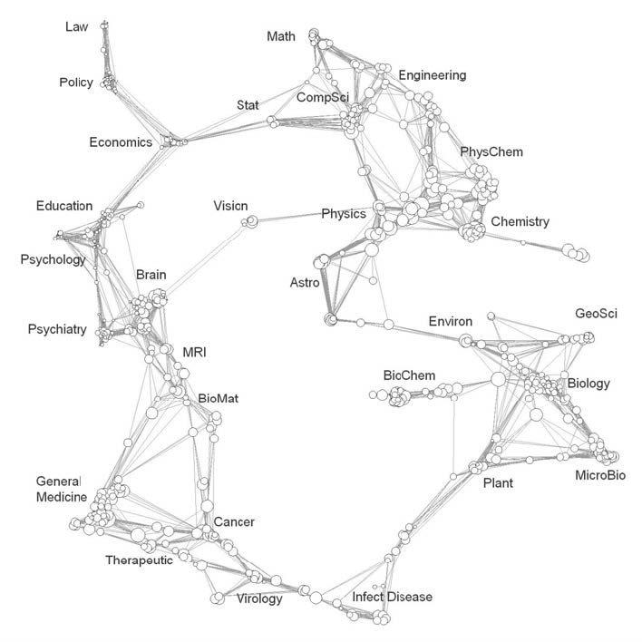
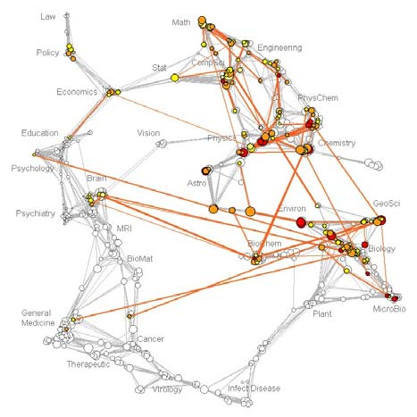
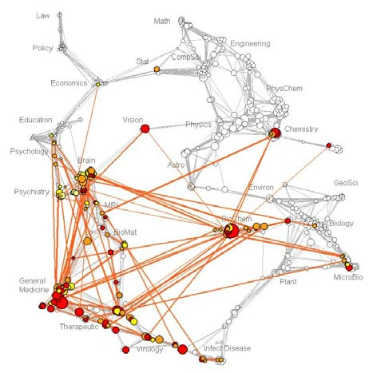
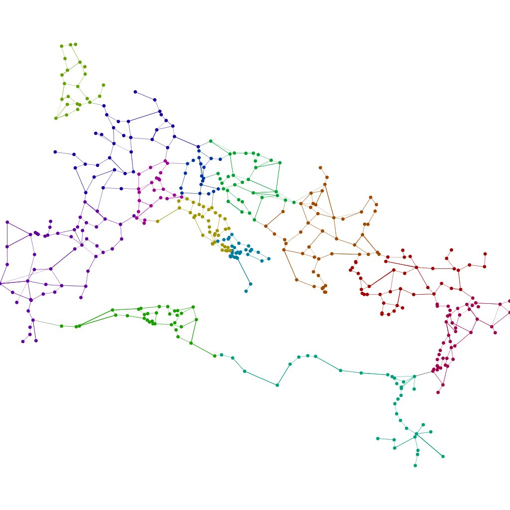
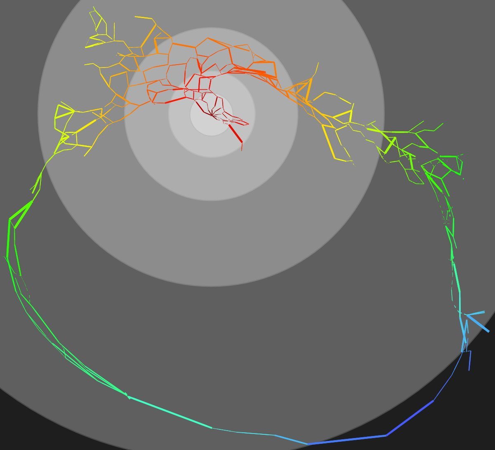
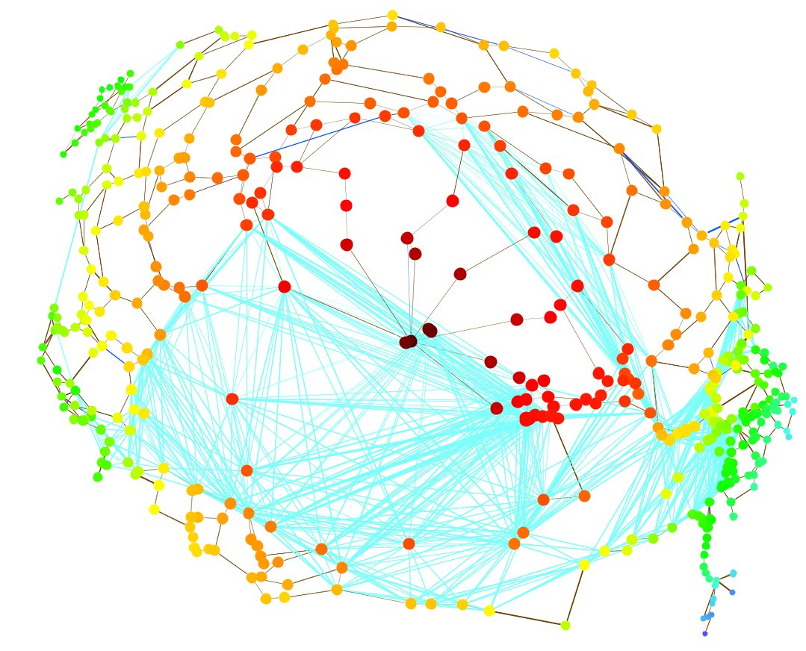
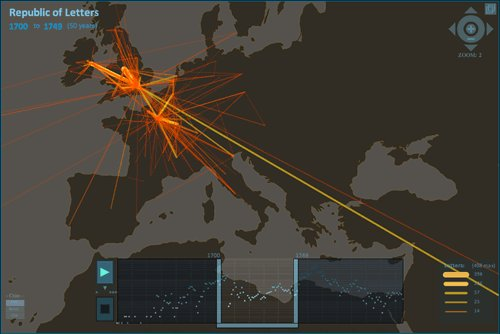
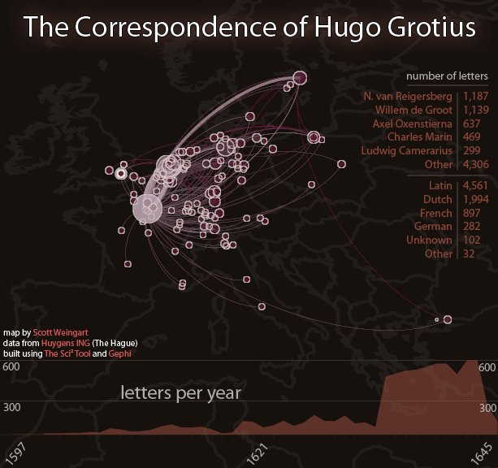

Last post, I talked about [combining textual and network analysis](/blog/topic-modeling-and-network-analysis/).
Both are becoming standard tools in the methodological toolkit of the
digital humanist, sitting next to GIS in what seems to be becoming the
Big Three in computational humanities.

## Data as Context, Data as Contextualized

Humanists are starkly aware that no particular aspect of a subject
sits in a vacuum; context is key. A network on its own is a set of
meaningless relationships without a knowledge of what travels through
and across it, what entities make it up, and how that network interacts
with the larger world.  The network must be contextualized by the content.
Conversely, the networks in which people and processes are situated
deeply affect those entities: medium shapes message and topology shapes
influence. The content must be contextualized by the network.

At the risk of the iPhonification of methodologies [^1],
 textual, network, and geographic analysis may be combined with
each other and traditional humanities research so that they might all
inform one another. That last post on textual and network analysis was
missing one key component for digital humanities: the humanities.
Combining textual and network analysis with traditional humanities
research (rather than merely using the humanities to inform text and
network analysis, or vice-versa) promises to transform the sorts of
questions asked and projects undertaken in Academia at large.

Just as networks can be used to contextualize text (and vice-versa),
the same can be said of networks and maps (or texts and maps for that
matter, or all three, but I’ll leave those for later posts). Now,
instead of starting with the maps we all know and love, we’ll start by
jumping into the deep end by discussing maps as any sort of
representative landscape in which a network can be situated. In fact,
I’m going to start off by using the network *as a map* against
which certain relational properties can be overlaid. That is, I’m
starting by using a map to contextualize a network, rather than the more
intuitive other way around.

## Using Maps to Contextualize a Network

The base map we’re discussing here is a map of science. They’ve made
their rounds, so you’ve probably seen one, but just in case you haven’t
here’s a brief description: some researchers (in this case Kevin Boyack
and Richard Klavans) take tons on information from scholarly databases
(in this case the Science Citation Index Expanded and the Social Science
Citation Index) and create a network diagram from some set of metrics
(in this case, citation similarity). They call this network
representation a Map of Science.

Base Map of Science built by Boyack and Klavans from 2002 SCIE and SSCI data.

We can debate about the merits of these maps ’till we’re blue in the
face, but let’s avoid that for now. To my mind, the maps are useful,
interesting, and incomplete, and the map-makers are generally well-aware
of their deficiencies. The point here is that it is a map: a
landscape against which one can situate oneself, and with which one may
be able to find paths and understand the lay of the land.

NSF Funding Profile

In Boyack, Börner [^2],
and Klavans (2007), the three authors set out to use the map of science
to explore the evolution of chemistry research. The purpose of the
paper doesn’t really matter here, though; what matters is the idea of
overlaying information atop a base network map.

NIH Funding Profile

The images above are the funding profiles of the NIH (National
Institutes of Health) and NSF (National Science Foundation). The authors
collected publication information attached to all the grants funded by
the NSF and NIH and looked at how those publications cited one another.
The orange edges show connections between disciplines on the map of
science that were more prevalent within the context a particular funding
agency than they were compared to the entire map of science. Boyack,
Börner [^3],
and Klavans created a map and used it to contextualize certain funding
agencies. They and other parties have since used such maps to
contextualize universities, authors, disciplines, and other publication
groups.

## From Network Maps to Geographic Maps

Of course,  the Where’s The Beef™ section of this post still has
yet to be discussed, with the beef in this case being geography. How
can we use existing topography to contextualize network topology?
Network *space* rarely corresponds to geographic *place*,
however neither of them alone can ever fully represent the landscape
within which we are situated. A purely geographic map of ancient Rome
would not accurately represent the world in which the ancient Romans
lived, as it does not take into account the shortening of distances
through well-trod trade routes.

Roman Network by Elijah Meeks, nodes laid out geographically

Enter Stanford DH ninja Elijah Meeks. In two recent posts, Elijah discussed the topology/topography divide. In the [first](https://dhs.stanford.edu/spatial-humanities/visualization-of-network-distance/),
he created a network layout algorithm which took a network with nodes
originally placed in their geographic coordinates, and then distorted
the network visualization to emphasize network distance. The
visualization above shows the network laid out geographically. The one
below shows the Imperial Roman trade routes with network distances
emphasized. As Elijah says, “everything of the same color in the above
map is the same network distance from Rome.”

Roman Network by Elijah Meeks, nodes laid out geographically and by network distance.

Of course, the savvy reader has probably observed that this does not
take everything into account. These are only land routes; what about the
sea?

Elijah’s [second post](https://dhs.stanford.edu/hgis/negotiating-the-transition-from-topology-to-topography-in-geographic-networks/)
addressed just that, impressively applying GIS techniques to determine
the likely route ships took to get from one port to another. This
technique drives home the point he was trying to make about
transitioning from network topology to network topography. The picture
below, incidentally, is Elijah’s re-rendering of the last visualization
taking into account both land and see routes. As you can see, the
distance from any city to any other has decreased significantly, even
taking into account his network-distance algorithm.

Roman Network by Elijah Meeks, nodes laid out using geography and network distance, taking into account two varieties of routes.

The above network visualization combines geography, two types of
transportation routes, and network science to provide a more nuanced
at-a-glance view of the Imperial Roman landscape. The work he
highlighted in his post transitioning from topology to topography in
edge shapes is also of utmost importance, however that topic will need
to wait for another post.

## The Republic of Letters (A Brief Interlude)

Elijah was also involved in another Stanford-based project, one very
dear to my heart, Mapping the Republic of Letters. Much of my own
research has dealt with the Republic of Letters, especially my time
spent under [Bob Hatch](http://www.clas.ufl.edu/users/ufhatch/pages/),
and Paula Findlen, Dan Edelstein, and Nicole Coleman at Stanford have
been heading up an impressive project on that very subject. I’ll go into
more details about the Republic in another post (I know, promises
promises), but for now the important thing to look at is their interface
for navigating the Republic.

Stanford’s Mapping the Republic of Letters

The team has gone well beyond the interface that currently faces the
public, however even the original map is an important step. Overlaid
against a map of Europe are the correspondences of many early modern
scholars. The flow of information is apparent temporally, spatially, and
through the network topology of the Republic itself. Now as any good
explorer knows, no map is any substitute for a thorough knowledge of the
land itself; instead, it is to be used for finding unexplored areas and
for synthesizing information at a large scale. For contextualizing.

If you’ll allow me a brief diversion, I’d like to talk about tools
for making these sorts of maps, now that we’re on the subject of
letters. Elijah’s post on [visualizing network distance](https://dhs.stanford.edu/spatial-humanities/visualization-of-network-distance/) included a plugin for [Gephi](http://gephi.org/)
to emphasize network distance. Gephi’s a great tool for making really
pretty network visualizations, and it also comes with a small but potent
handful of network analysis algorithms.

I’m on the development team of another program, the [Sci² Tool](https://sci2.cns.iu.edu/user/index.php),
which shares a lot of Gephi’s functionality, although it has a much
wider scope and includes algorithms for textual, geographic, and
statistical analysis, as well as a somewhat broader range of network
analysis algorithms.

This is by no means a suggestion to use Sci² over Gephi; they
both have their strengths and weaknesses. Gephi is dead simple to use,
produces the most beautiful graphs on the market, and is all-around
fantastic software. They both excel in different areas, and by using
them (and other tools!) together, it is possible to create maps
combining geographic and network features without ever having to resort
to programming.

The Correspondence of Hugo Grotius

The above image was generated by combining the Sci² Tool with Gephi.
It is the correspondence network of Hugo Grotius, a dataset I worked on
while at Huygens ING in The Hague. They are a great group, and another
team doing fantastic Republic of Letters research, and they provided
this letters dataset. We just developed this particular functionality in
Sci² yesterday, so it will take a bit of time before we work out the
bugs and release it publicly, however as soon as it is released
I’ll be sure to post a full tutorial on how to make maps like the one
above.

This ends the public service announcement.

## Moving Forward

These maps are not without their critics. Especially prevalent were
questions along the lines of “But how is this showing me anything I
didn’t already know?” or “All of this is just an artefact of population
densities and standard trade routes – what are these maps telling us
about the Republic of Letters?” These are legitimate critiques, however
as mentioned before, *these maps are still useful* for
at-a-glance synthesis of large scales of information, or learning
something new about areas one is not yet an expert in. Another problem
has been that the lines on the map don’t represent actual travel routes;
those sorts of problems are beginning to be addressed by the type of
work Elijah Meeks and other GIS researchers are doing.

To tackle the suggestion that these are merely representing
population data, I would like to propose what I believe to be a novel
idea. I haven’t published on this yet, and I’m not trying to claim
scholarly territory here, but I would ask that if this idea inspires
research of your own, please cite this blog post or my publication on
the subject, whenever it comes out.

We have a lot of data. Of course it doesn’t feel like we have enough, and it never will, but we have *a lot* of
data. We can use what we have, for example collecting all the
correspondences from early modern Europe, and place them on a map like
this one. The more data we have, the smaller time slices we can have in
our maps. We create a base map that is a combination of geographic
properties, statistical location properties, and network properties.

Start with a map of the world. To account for population or related correlations, do something similar to what Elijah did in [this post](https://dhs.stanford.edu/spatial-humanities/comparing-population-density-and-wikipedia-density-on-gis-day/),
 encoding population information (or average number of
publications per city, or whatever else you’d like to account for) into
the map. On top of that, place the biggest network of whatever it is
that you’re looking at that you can find. Scholarly communication,
citations, whatever. It’s your big Map of YourFavoriteThingHere. All of
these together are your base map.

Atop that, place whatever or whomever you are studying. The
correspondence of Grotius can be put on this map, like the NIH was
overlaid atop the Map of Science, and areas would light up and become
larger if they are surprising against the base map. Are there more
letters between Paris and The Hague in the Grotius dataset then one
would expect if the dataset was just randomly plucked from the whole
Republic of Letters? If so, make that line brighter and thicker.

By combining geography, point statistics, and networks, we can create
base maps against which we can contextualize whatever we happen to be
studying. This is just one possible combination; base maps can be
created from any of a myriad of sources of data. The important thing is
that we, as humanists, ought to be able to contextualize our data in the
same way that we always have. Now that we’re working with a lot more of
it, we’re going to need help in those contextualizations. Base maps are
one solution.

It’s worth pointing out one major problem with base maps: bias. Until
recently, those Maps of Science making their way around the blogosphere
represented the humanities as a small island off the coast of social
sciences, if they showed them at all. This is because the primary
publication venues of the arts and humanities were not represented in
the datasets used to create these science maps. We must watch out for
similar biases when constructing our own base maps, however the problem
is significantly more difficult for historical datasets because the
underrepresented are too dead to speak up.  For a brief discussion
of historical biases, you can read my UCLA presentation [here](/blog/humnets-paperreview/).

Boyack, Kevin W., Katy Börner, and Richard Klavans. 2008. “Mapping the Structure and Evolution of Chemistry Research.” *Scientometrics* 79 (November 13): 45–60. doi:10.1007/s11192-009-0403-5. [http://www.akademiai.com/content/8045802g53150477/](http://www.akademiai.com/content/8045802g53150477/ "Mapping the structure and evolution of chemistry research").

Notes:

1. putting every tool imaginable in one box and using them all at once [↩](#return-note-1942-1)
2. Full disclosure: she’s my advisor. She’s also awesome. Hi Katy! [↩](#return-note-1942-2)
3. Hi again, Katy! [↩](#return-note-1942-3)

[^1]: putting every tool imaginable in one box and using them all at once
[^2]: Full disclosure: she’s my advisor. She’s also awesome. Hi Katy!
[^3]: Hi again, Katy!

---

## Reader Comments

> **Elijah Meeks**, 2011-11-22T15:55:06+00:00
>
> Hey Scott, excellent post as always.
> While I haven’t tried to formally contextualize my maps (network or
> geographic–I much prefer “map” over “visualization”, which still sounds
> to me to be some kind of New Age self-help tool) using a standard
> basemap, I have noticed that whenever I’ve done something approaching
> that, I receive the biggest ho-hum response. It’s almost as if
> contextualizing a map makes it less exciting, abstract and/or
> sophisticated. I wonder if there is a subtle pressure to produce a
> unique flower that fundamentally only exists in the world of study
> you’re currently engaged in, as if reference or grounding in a larger
> world is instead seen as a sign of the derivative nature of the work,
> rather than its connection to a larger system.
>
> Oh, and I hope you’ll join me for a Gephi/Sci2 knifefight complete with choreographed dance and rhythmic background music.

>> **Scott Weingart**, 2011-11-22T16:10:30+00:00
>>
>> That’s unfortunate news, but I suppose
>> not too surprising. It also might be invoking the anti-positivist
>> movement in the humanities, under the assumption that any base map is
>> trying to represent an objective reality. The way I sidestep this issue
>> is pointing out that neither the union nor the intersection of all
>> subjective experience is equivalent to objective reality. And it doesn’t
>> matter. The union of all this data is still *really useful* for
>> situating one or a small group of subjective experiences against the
>> larger set.
>>
>> Of course. There will be synchronized snapping.
