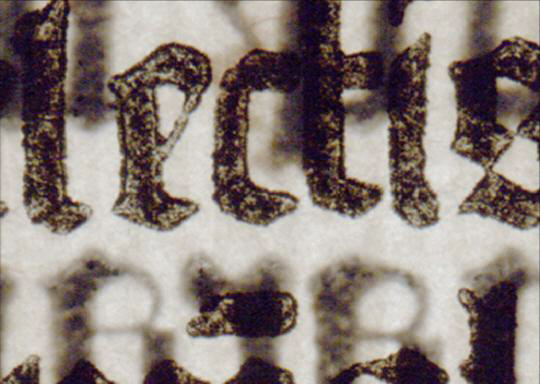
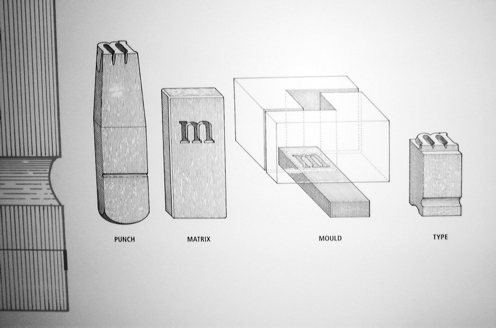
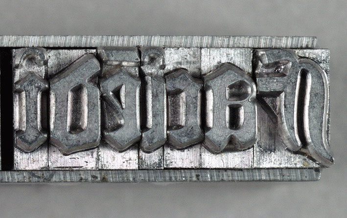
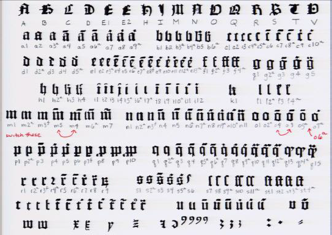
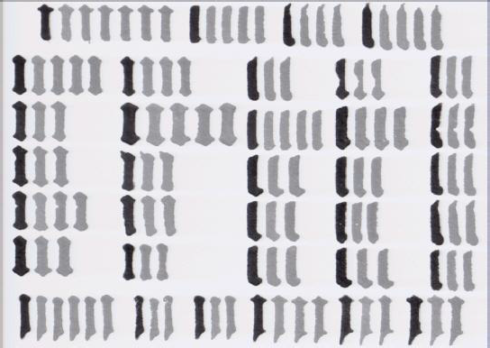
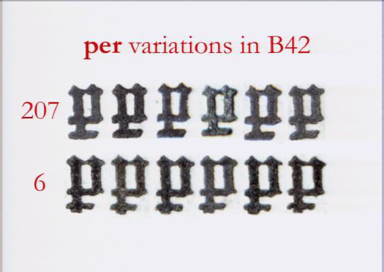

<!-- page 1 -->

\[**edit**: I’m realizing I [didn’t make it clear](https://twitter.com/captain_primate/status/433320996762689536) in this post that I’m aware many historians consider themselves scientists, and that there’s plenty of scientific historical archaeology and anthropology. That’s exactly what I’m advocating there be more of, and more varied.\] Short Answer: Yes.

<!-- page 2 -->

Less Snarky Answer: Historians need to be flexible to fresh methods, fresh perspectives, and fresh blood. Maybe not that last one, I guess, as it might invite vampires.Okay, I suppose this answer wasn’t actually less snarky.

## Long Answer

The long answer is that historians don’t necessarily need scientists, but that we do need fresh scientific methods. Perhaps as an accident of our association with the ill-defined “humanities”, or as a result of our being placed in an entirely different culture (see: C.P. Snow), most historians seem fairly content with methods rooted in thinking about text and other archival evidence. This isn’t true of all historians, of course – there are economic historians who use statistics, historians of science who recreate old scientific experiments, classical historians who augment their research with archaeological findings, archival historians who use advanced ink analysis,  and so forth. But it wouldn’t be stretching the truth to say that, for the most part, historiography is the practice of thinking cleverly about words to make more words.

I’ll argue here that our reliance on traditional methods (or maybe more accurately, our odd habit of rarely discussing method) is crippling historiography, and is making it increasingly likely that the most interesting and innovative historical work will come from non-historians. Sometimes these studies are ill-informed, especially when the authors decide not to collaborate with historians who know the subject, but to claim that a few ignorant claims about history negate the impact of these new insights is an exercise in pedantry.

In defending the humanities, we like to say that scientists and technologists with liberal arts backgrounds are more well-rounded, better citizens of the world, more able to contextualize their work. Non-humanists benefit from a liberal arts education in pretty much all the ways that are impossible to quantify (and thus, extremely difficult to defend against budget cuts). We argue this in the interest of rounding a person’s knowledge, to make them aware of their past, of their place in a society with staggering power imbalances and systemic biases.

<!-- page 3 -->

Humanities departments should take a page from their own books. Sure, a few general ed requirements force some basic science and math… but I got an undergraduate history degree in a nice university, and I’m well aware how little STEM I actually needed to get through it. Our departments are just as guilty of narrowness as those of our STEM colleagues, and often because of it, we rely on applied mathematicians, statistical physicists, chemists, or computer scientists to do our innovative work for (or sometimes, thankfully, *with*) us.

Of course, there’s still lots of innovative work to be done from a textual perspective. I’m not downplaying that. *Not everyone needs to use crazy physics/chemistry/computer science/etc. methods*. But there’s a lot of low hanging fruit at the intersection of historiography and the natural sciences, and we’re not doing a great job of plucking it.

The story below is illustrative.

### Gutenberg

Last night, [Blaise Agüera y Arcas](http://en.wikipedia.org/wiki/Blaise_Ag%C3%BCera_y_Arcas) presented his research on Gutenberg to a packed house at our rare books library. He’s responsible for a lot of the cool things that have come out of Microsoft in the last few years, and just got a job at Google, where presumably he will continue to make cool things. Blaise has degrees in physics and applied mathematics. And, a decade ago, Blaise and historian/librarian Paul Needham sent ripples through the History of the Book community by showing that Gutenberg’s press did not work at all the way people expected.

It was generally assumed that Gutenberg employed a method called punchcutting in order to create a standard font. A letter carved into a metal rod (a “punch”) would be driven into a softer metal (a “matrix”) in order to create a mold. The mold would be filled with liquid metal which hardened to form a small block of a single letter (a “type”), which would then be loaded onto the press next to other letters, inked, and then impressed onto a page. Because the mold was metal, many duplicate “types” could be made of the same letter, thus allowing many uses of the same letter to appear identical on a single pressed page.

<!-- page 4 -->

*Punch matrix system. \[[via](http://typofonderie.com/gazette/post/punchcutting-at-imprimerie-nationale/)\]*

<!-- page 5 -->

*Type to be pressed. \[[via](http://www.hrc.utexas.edu/exhibitions/permanent/gutenbergbible/process/)\]*

This process is what allowed all the duplicate letters to appear identical in Gutenberg’s published books. Except, of course, careful historians of early print noticed that letters *weren’t*, in fact, identical. In the 1980s, Paul Needham and a colleague attempted to produce an inventory of all the different versions of letters Gutenberg used, but they stopped after frequently finding 10 or more obviously distinct versions of the same letter.

*Needham’s inventory of Gutenberg type. \[[via](http://research.microsoft.com/apps/video/dl.aspx?id=104803)\]*

This was perplexing, but the subject was bracketed away for a while, until Blaise Agüera y Arcas came to Princeton and decided to work with Needham on the problem. Using extremely high-resolution imagining techniques, Blaise noted that there were in fact hundreds of versions of every letter. Not only that, there were actually variations and regularities in the smaller elements that made up letters. For example, an “n” was formed by two adjacent vertical lines, but occasionally the two vertical lines seem to have flipped places entirely. The extremely basic letter “i” itself had many variations, but within those variations, many odd self-similarities.

<!-- page 6 -->

*Variations in the letter “i” in Gutenberg’s type. \[[via](http://research.microsoft.com/apps/video/dl.aspx?id=104803)\]*

Historians had, until this analysis, assumed most letter variations were due to wear of the type blocks. This analysis blew that hypothesis out of the water. These “i”s were clearly not all made in the same mold; but then, how had they been made? To answer this, they looked even closer at the individual letters.

<!-- page 7 -->

*Close up of Gutenberg letters, with light shining through page. \[[via](http://research.microsoft.com/apps/video/dl.aspx?id=104803)\]*

It’s difficult to see at first glance, but they found something a bit surprising. The letters appeared to be formed of overlapping smaller parts: a vertical line, a diagonal box, and so forth. The below figure shows a good example of this. The glyphs on the bottom have have a stem dipping below the bottom horizontal line, while the glyphs at the top do not.

<!-- page 8 -->

*Abbreviation of ‘per’. \[[via](http://research.microsoft.com/apps/video/dl.aspx?id=104803)\]*

The conclusion Needham and Agüera y Arcas drew, eventually, was that the punchcutting method must not have been used for Gutenberg’s early material. Instead, a set of carved “strokes” were pushed into hard sand or soft clay, configured such that the strokes would align to form various letters, not unlike the formation of cuneiform. This mold would then be used to cast letters, creating the blocks we recognize from movable type. The catch is that this soft clay could only cast letters a few times before it became unusable and would need to be recreated. As Gutenberg needed multiple instances of individual letters per page, many of those letters would be cast from slightly different soft molds.

### Low-Hanging Fruit

At the end of his talk, Blaise made an offhand comment: how is it that historians/bibliographers/librarians have been looking at these Gutenbergs for so long, discussing the triumph of their identical characters, and not noticed that the characters are anything but uniform? Or, of those who had noticed it, why hadn’t they raised any red flags?

The insights they produced weren’t staggering feats of technology. He used a nice camera, a light shining through the pages of an old manuscript, and a few simple image recognition and clustering algorithms. The clustering part could even have been done by hand, and actually had been, by Paul Needham. And yes, it’s true, everything is obvious in hindsight, but there were a lot of eyes on these bibles, and odds are if some of them had been historians who were trained in these techniques, this insight could have come sooner. Every year students do final projects and theses and dissertations, but what percent of those use techniques from outside historiography?

In short, there’s a lot of very basic assumptions we make about the past that could probably be updated significantly if we had the right skillset, or knew how to collaborate with those who did. I think people like William Newman, who [performs Newton’s alchemical experiments](http://webapp1.dlib.indiana.edu/newton/), is on the right track. As is [Shawn Graham](http://electricarchaeology.ca/about/), who reanimates the trade networks of ancient Rome using agent-based simulations, or [Devon Elliott](http://devonelliott.net/about/), who creates computational and physical models of objects from the history of stage magic. Elliott’s models have shown that certain magic tricks couldn’t possibly have worked as they were described to.

<!-- page 9 -->

The challenge is how to encourage this willingness to reach outside traditional historiographic methods to learn about the past. Changing curricula to be more flexible is one way, but that is a slow and institutionally difficult process. Perhaps faculty could assign group projects to students taking their gen-ed history courses, encouraging disciplinary mixes and non-traditional methods. It’s an open question, and not an easy one, but it’s one we need to tackle.

---

## Reader Comments

> [**Frederik Elwert**](http://senereko.ceres.rub.de/en/personen/details/frederik-elwert/), February 18, 2014
>
> Interesting and thought-provoking read!
>
> As someone who sees himself as a digital humanist, I would intuitively agree. Historians (and humanists in general) often are too easy dismissing methods as irrelevant before even really understanding how they work. I think it is necessary to encourage students to search for new methods that help them tackling the questions they’re after, even if they are from other disciplines. And this is especially true for the “low hanging fruit” you mention.
>
> On the other hand, and maybe speaking with my social science hat on, I don’t think that the lack of science is really the issue. I think that, more generally, it is the lack of methods. You write: “I’ll argue here that our reliance on traditional methods (or maybe more accurately, our odd habit of rarely discussing method) is crippling historiography \[…\].” The examples you give are fascinating, but one might argue they have a certain positivist bias: There is great work about the discursive formation of the category of “magic” itself, and I believe it works perfectly fine without investigating how certain “magical tricks” actually worked. While there certainly is a lot of value in these applications of STEM knowledge, there are also good reasons why the unique, “hermeneutical” or “qualitative” humanities approach generates insight not possible with STEM methodology.
>
> But still, I believe that your more generic point remains valid: Even if one is into, say, historical discourse analysis, I think too few historians actually reflect on what this means methodologically. Once you start reflecting on questions like “what do I mean with discourse?” and “how can I analyze it?”, then the question of “what tools do I need for that?” is only a logical next step. The answer then might include STEM methodology, but it might also only include qualitative methods of a certain kind. So in the end, one might stick to “thinking cleverly about words to make more words”, but this cleverness is then subject to methodological reflection, and not an expression of mere genius.

>> **Scott Weingart**, February 18, 2014
>>
>> Thanks for the comment, Frederik. I completely agree with you with regards to your middle paragraph; I’m not saying STEM methods should replace those of the humanities, just that they should have a larger role than they currently do.

> **c hibbs**, January 23, 2015
>
> History is the right place and time to be a revolutionary and genius in waiting. There are all sorts of developments in science with direct mappings to dimensions of history. The only remaining research camp at the frontiers, still faithful to science over self-interest (i.e. still requiring scientific standards of itself) involves history at intimate levels. Reasonable to say, that direction could not be realized, absent a new kind of Hard Science History
