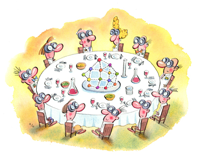
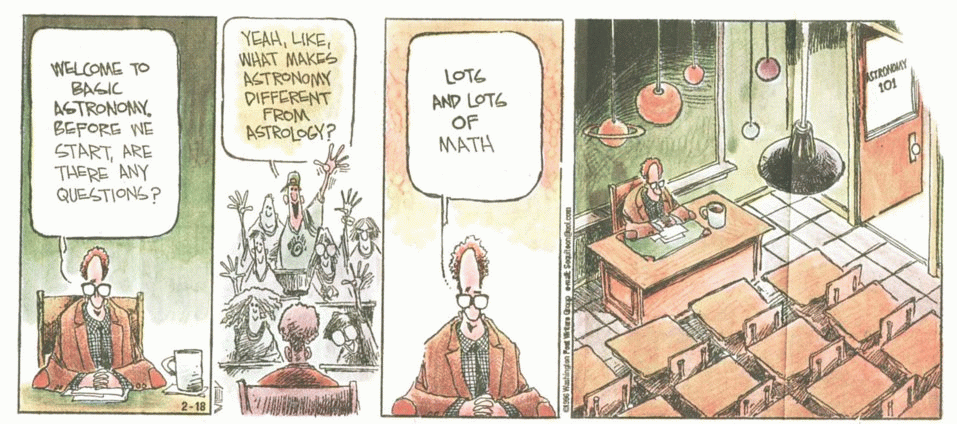
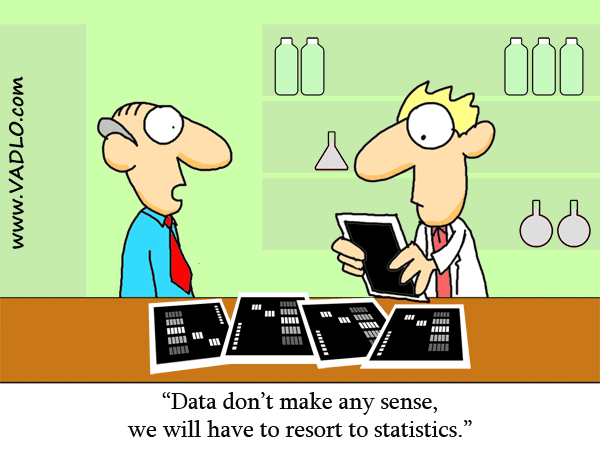
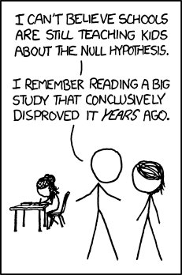

A few months ago, *Science* published [a Thanksgiving article on what scientists can be grateful for](http://sciencecareers.sciencemag.org/career_magazine/previous_issues/articles/2011_11_25/caredit.a1100131). It’s got a lot of good points, like being thankful for family members who accept the crazy hours we work, or for those *really useful* research projects that make science cool enough for us to get funding for the merely *really interesting*. It does have one unfortunate reference to humanists:

> We are thankful that Ph.D. programs in the sciences, as
> much as we complain about them, aren’t nearly as horrifying as, say,
> Ph.D. programs in the humanities. I just heard today from a friend in
> his ninth year of a comparative literature Ph.D. who thinks he might
> finish “in a year and a half.” At least the job market for comp lit
> Ph.D. awardees is thriving, right?

Ouch. I suppose the truth hurts. The particularly interesting point that inspired this post, however, was:

> We are thankful for that one colleague who knows statistics. There’s always one.

*A Scientist's Thanksgiving. (Image from the above Science article)*

## The State of Things

The above quote about statisticians is so true it hurts, as (we just discovered) the truth is wont to do. It’s even *more* true
 in the humanities than it is in the more natural and quantitative
sciences. When we talk about a colleague who knows statistics, we
generally don’t mean someone down the hall; usually, we mean that one
statistician who we met in the pub that one night and has a bizarre
interest in the humanities. That’s not to say humanist statisticians
don’t exist, but I doubt you’re likely to find one in any given
humanities department.

This unfortunately is not only true of statistics, but also of GIS,
network science, computer science, textual analysis, and many other
disciplines we digital humanists love to borrow from. Thankfully, the
NEH ODH’s [Institutes for Advanced Topics in the Humanities](http://www.neh.gov/grants/guidelines/IATDH.html), UVic’s [Digital Humanities Summer Institutes](http://www.dhsi.org/),
 and other programs out there are improving our collective expertise,
but a quick look for GIS/Stats/SNA/etc. courses in most humanities
departments still produces slim pickings.

*Math is scary. (I can't find attribution, sorry. Anybody know who drew this?)*

One of the best things to come out of the #hacker movement in the
Digital Humanities has been the spirit to get our collective hands dirty
 and learn the techniques ourselves. It’s been a long time coming, and
happier days are sure to follow, but one skill still seems
underrepresented from the DH purview: statistics.

## Why Statistics? Why Bayesian Statistics?

In a recent post by [Elijah Meeks](https://dhs.stanford.edu/visualization/more-networks/),
 he called Text Analysis, Spatial Analysis, and Network Analysis the
“three pillars” of DH research, with a sneaking suspicion that Image
Analysis should fit somewhere in there as well. This seems to be the
converging sentiment in most DH circles, and although when asked most
would say statistics is also important, it still doesn’t seem to be
among the first subjects named.

With another round of [Digging Into Data](http://www.diggingintodata.org/)
 winners chosen, and a bevy of panels and presentations dedicating
themselves to Big Data in the Humanities, the first direction we should
point is statistics. Statistics is a tool uniquely built for
understanding lots of data, and it was developed with full knowledge
that the data may be incomplete, biased, or otherwise imperfect, and has
 legitimate work-arounds for most such occasions. Of course, all
the caveats in my [first Networks Demystified](/blog/demystifying-networks/) post apply here: don’t use it without fully understanding it, and changing it where necessary.

*http://vadlo.com/cartoons.php?id=71*

Many Humanists, even digital ones, frequently seem to have a
(justifiably) knee-jerk reaction to statistics. If you’ve been following
 the Twitter and blog conversations about [AHA 2012](http://www.historians.org/annual/2012/index.cfm),  you probably caught a flurry of discussion over [Google Ngrams](http://books.google.com/ngrams). Conversation tended toward horrified screams of the dangers of correlation vs. causation (or at least references to [xkcd](http://xkcd.com/552/)),
 and the ease with which one might lie via statistics or omission.
These are all valid cautions, especially where ngrams is concerned, but I
 sometimes fear we get so caught up in bad examples that we spend more
time apologizing for them than fixing them. Ted Underwood has [a great post about just this](http://tedunderwood.wordpress.com/2012/01/03/a-brief-outburst-about-numbers/), which I will touch on again shortly. (And, to Ted and [Allen](http://ariddell.org/) specifically, I’m guessing you both will enjoy this post.)

In short: statistics is useful. To quote the above-linked xkcd comic:

> Correlation doesn’t imply causation, but it does waggle
> its eyebrows suggestively and gesture furtively while mouthing ‘look
> over there’.

So how do we go about using statistics? In a comment on Ted’s recent post about statistics, [Trevor Owens](http://www.trevorowens.org/) wrote:

> if you just start signing up for statistics courses you
> are going to end up getting a rundown on using t-tests and ANOVAs as
> tools for hypothesis testing. The entire hypothesis testing idea remains
>  a core part of how a lot of folks in the social sciences think about
> things and it is deeply at odds with what humanists want to do.

The key is not appropriation but adaption. We must learn statistics,
even the hypothesis testing, so that we might find what methods are
useful, what might be changed, and how we can get it to work for us.
We’re humanists. We’re *really* *good* at methodological critique.

One of the areas of statistics most likely to bear fruit for humanists is *[Bayesian statistics](http://en.wikipedia.org/wiki/Bayesian_statistics)*. Some
 of us already use it in our text mining algorithms, although the math
involved remains occult to most. It basically builds uncertainty and
belief directly into statistics. Instead of coming up with one *correct*
 answer, Bayesian analysis often yields a range of more or less probable
 answers depending what seems to be the case from prior evidence, and
can update and improve that range as more is learned.

*The one XKCD comic nobody seems to have linked to. (http://xkcd.com/892/)*

For humanists, this importance is (at least) two-fold. Ted Underwood sums up the first reason nicely:

> [Bayesian inference] is amazingly,
> almost bizarrely willing to incorporate subjective belief into its
> definition of knowledge. It insists that definitions of probability have
>  to depend not only on observed evidence, but on the “prior
> probabilities” that we expected before we saw the evidence. If humanists
>  were more familiar with Bayesian statistics, I think it would blow a
> lot of minds.

The second and more specific reason worth mentioning here deals with
the ranges I discussed above. If a historian, for example, is trying to
understand how and why some historical event happened, Bayesian analysis
 could yield which set of occurrences were more or less likely, and
which were so far off as to not be worth considering. By trying to find
reasonable boundary conditions rather than exact explanations to answer
our questions, humanists can retain that core knowledge that humans and
human situations are not wholly deterministic machines, who all act the
same and reproduce the same results in every situation.

We are intrinsically and inextricably *inexact*, and until we get computers that see and remember *everything*,
 and model it all perfectly, we should avoid looking for exact answers.
Bayesian statistics, instead, can help us find a range of *reasonable* answers, with full awareness and use of the beliefs and evidence we have going in.

## A Call to Arms

After I read that post about a scientist’s thanksgiving, I realized I
 didn’t want to have to rely on that one colleague who knows statistics.
 *Nobody* should. That’s why I decided to enroll in a Bayesian Data Analysis course this semester, taught by and using [the book of John K. Kruschke](http://www.indiana.edu/~kruschke/DoingBayesianDataAnalysis/). It’s a *very* readable
 book, directed toward people with no prior knowledge in statistics or
programming, and takes you through the basics of both. Kruschke’s got a [blog](http://doingbayesiandataanalysis.blogspot.com/) worth reading, as does [Andrew Gelman](http://en.wikipedia.org/wiki/Andrew_Gelman), an author of the book [Bayesian Data Analysis](http://www.stat.columbia.edu/~gelman/book/). I’m sure a [basic Google search](https://www.google.com/search?gcx=c&sourceid=chrome&ie=UTF-8&q=bayesian+statistics+lectures) can point you to video lectures, if that’s your thing. I’ll also try to blog about it over the coming months as I learn more.

There are several (occasionally apocryphal) anecdotes about
 the great theoretical physicists of the early 20th century needing to
go back to school to learn basic statistics. Some still weren’t terribly
 happy about it (“God does not play dice with the universe”), but in the
 end, pressures from the changing nature of their theories required a
thorough understanding of statistics. As humanists begin to deal with a
glut of information we never before had access to, it’s time we adapt in
 a similar fashion.

The wide angle, the distant reading, the longue durée will all
benefit from a deeper understanding of statistics. That knowledge, in
tandem with traditional close reading skills, will surely become one of
the pillars of humanities research as Big Data becomes ever-more common.

---

## Reader Comments (6)

> **Ryan Shaw**, Jan 10, 2012 3:01 pm
>
> You might be interested in Aviezer Tucker’s book [Our Knowledge of the Past](http://books.google.com/books?id=siS5DK1HdwsC), which argues that historiographical practice is best understood from a Bayesian perspective.

>> **Scott Weingart**, Jan 10, 2012 6:29 pm
>>
>> This is fantastic, thank you! I will definitely take a look at it.

> **Ted Underwood**, Jan 11, 2012 1:46 pm
>
> You’re right that I enjoyed the post! Also, Kruschke’s book looks a 
> lot more accessible than the one I got out of our library. I’ve 
> convinced myself that I mostly “understand” that one, but I might just 
> read Kruschke’s to make sure that I actually do!

> **Allen Riddell**, Jan 12, 2012 2:49 am
>
> Great post. Thanks Scott.
>
> Here’s my favorite quote on the subject:
>
> The atmosphere of the Bayesian revival is captured in a comment by 
> Rivett on [Dennis] Lindley’s move to University College London and the 
> premier chair of statistics in Britain: “it was as though a Jehovah’s 
> Witness had been elected Pope.”
>
> Also worth mentioning might be a recent book from Yale UP that is addressed to a general audience: *The Theory That Would Not Die* by Sharon Mcgrayne [https://www.powells.com/biblio/62-9780300169690-0](https://www.powells.com/biblio/62-9780300169690-0)

> **Ben**, Jan 12, 2012 5:50 am
>
> I agree that the publication of Kruschke’s book probably going to be a
>  watershed moment in making Bayesian statistics widely accessible. I’d 
> also recommend Simon Jackman’s ‘Bayesian Analysis for the Social 
> Sciences’ (2009) and his class notes here: [http://jackman.stanford.edu/classes/BASS](http://jackman.stanford.edu/classes/BASS/). Another decent one is Ntzoufras’ ‘Bayesian Modeling Using WinBUGS: An introduction’ (2009) [http://stat-athens.aueb.gr/~jbn/winbugs_book](http://stat-athens.aueb.gr/~jbn/winbugs_book/)

>> **Scott Weingart**, Jan 12, 2012 11:15 am
>>
>> Thanks, Ben, those look like fantastic resources. It’s worth pointing
>>  out that both Jackman and Kruschke suggest using JAGS over BUGS for 
>> markov chains.
