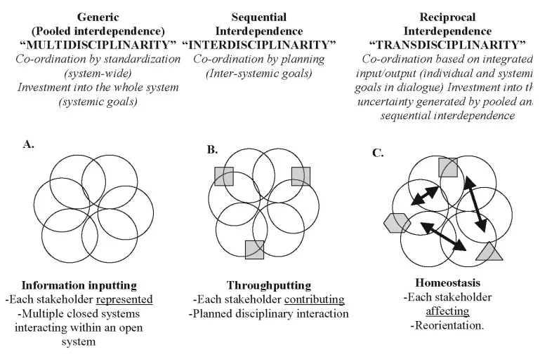

**tl;dr** Academics’ individual policing of disciplinary boundaries at the expense of intellectual merit does a disservice to our global research community, which is already structured to reinforce disciplinarity at every stage. We should work harder to encourage research misfits to offset this structural pull.

**The academic game is stacked to reinforce old community practices**. PhDs aren’t only about specialization, but about teaching you to think, act, write, and cite like the discipline you’ll soon join. Tenure is about proving to your peers you are like *them*. Publishing and winning grants are as much about goodness of fit as about quality of work.

This isn’t bad. One of science’s most important features is that it’s often cumulative or at least agglomerative, that scientists don’t start from scratch with every new project, but build on each other’s work to construct an edifice that often resembles progress. **The scientific pipeline uses PhDs, tenure, journals, and grants as built-in funnels, ensuring everyone is squeezed snugly inside the pipes at every stage of their career. It’s a clever institutional trick to keep science cumulative.**

But the funnels work too well. Or at least, there’s no equally entrenched clever institutional mechanism for building new pipes, for allowing the development of new academic communities that break the mold. Publishing in established journals that enforce their community boundaries is necessary for your career; <!-- page 2 --> most of the world’s scholarly grant programs are earmarked for and evaluated by specific academic communities. It’s easy to be disciplinary, and hard to be a misfit.

To be sure, **this is a known problem**. Patches abound. Universities set aside funds for “interdisciplinary research” or “underfunded areas”; postdoc positions, centers, and antidsciplinary journals exist to encourage exactly the sort of weird research I’m claiming has no little place in today’s university. **These solutions are insufficient.**

University or even external grant programs fostering “interdisciplinarity” for its own sake become mostly useless because of the laws of [Goodhart](https://en.wikipedia.org/wiki/Goodhart%27s_law) & [Campbell](https://en.wikipedia.org/wiki/Campbell%27s_law). They’re usually designed to bring disciplines together rather than to sidestep disciplinarity altogether, which while admirable, is a system that’s pretty easy to game, and often leads to awkward alliances of convenience.

*Dramatic rendition of types of -disciplinarity from [Lotrecchiano in 2010](http://www.ijtr.org/lotrecchiano-ijtr-vol5-iss-1.pdf), shown here never actually getting outside disciplines.*

Universities do a bit better in encouraging certain types of centers that, rather <!-- page 3 --> than being “interdisciplinary”, are focused on a specific goal, method, or topic that doesn’t align easily with the local department structure. A new pipe, to extend my earlier bad metaphor. The problems arise here because centers often lack the institutional benefits available to departments: they rely on soft money, don’t get kickback from grant overheads, don’t get money from cross-listed courses, and don’t get tenure lines. Antidisciplinary postdoc positions suffer a similar fate, allowing misfits to thrive for a year or so before having to go back on the job market to rinse & repeat.

In short, **the overwhelming inertial force of academic institutions pulls towards disciplinarity despite frequent but half-assed or poorly-supported attempts to remedy the situation**. Even when new disciplinary configurations break free of institutional inertia, presenting themselves as means to knowledge every bit as legitimate as traditional departments (chemistry, history, sociology, etc.), it can take decades for them to even be given the chance to fail.

It is perhaps unsurprising that [the community](https://en.wikipedia.org/wiki/Cybernetics) which taught us about [autopoiesis](https://en.wikipedia.org/wiki/Autopoiesis) proved incapable of sustaining itself, though half a century on its influences are glaringly apparent and far-reaching across today’s research universities. I wonder if we reconfigured the organization of colleges and departments from scratch today, whether there would be more departments of [environmental studies](https://en.wikipedia.org/wiki/List_of_environmental_degree-granting_institutions_in_the_United_States) and fewer departments of [redacted].[^1]

I bring this all up to raise awareness of the difficulty facing good work with no discernible home, and to advocate for some individual action which, though it won’t change the system overnight, will hopefully make the world a bit easier for those who deserve it.

It is this: **relax the reflexive disciplinary boundary drawing, and foster programs or communities which celebrate misfits.** [I wrote a bit about this last year in the context of history and culturomics](/blog/digital-history-can-never-be-new/); historians clamored to show that culturomics was *bad history*, but culturomics never attempted to be good history—it attempted to be good culturomics. Though I’d argue it often failed at that as well, it should have been evaluated by its own criteria, not the criteria of some related but <!-- page 4 --> different discipline.

Some potential ways to move forward:

- If you are reviewing for a journal or grant and the piece is great, but doesn’t quite fit, and you can’t think of a better home for it, push against the editor to let it in anyway.
- If you’re a journal editor or grant program officer, be more flexible with submissions which don’t fit your mold but don’t have easy homes elsewhere.
- If you control funds for research grants, earmark half your money for good work that lacks a home. Not “good work that lacks a home but still looks like the humanities”, or “good work that looks like economics but happens to involve a computer scientist and a biologist”, but truly homeless work. I realize this won’t happen, but if I’m advocating, I might as well advocate big!
- If you are training graduate students, hiring faculty, or evaluating tenure cases, relax the boundary-drawing urge to say “her work is fascinating, but it’s not exactly our department.”
- If you have administrative and financial power at a university, commit to supporting nondisciplinary centers and agendas with the creation of tenure lines, the allocation of course & indirect funds, and some of the security offered to departments.

Ultimately, we need clever systems to foster nondisciplinary thinking which are as robust as those systems that foster cumulative research. This problem is above my paygrade. In the meantime, though, we can at least **avoid the urge to equate disciplinary fitness with intellectual quality**.

Notes:

[^1]: You didn’t seriously expect me to name names, did you?

<!-- page 5 -->
