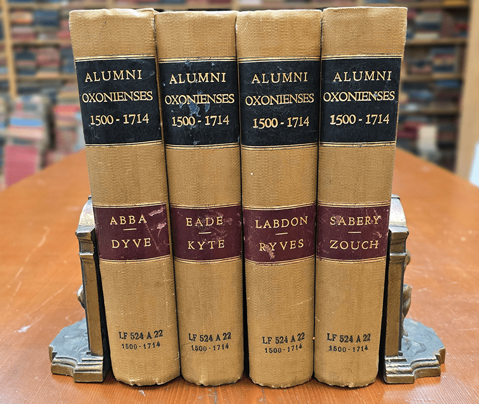
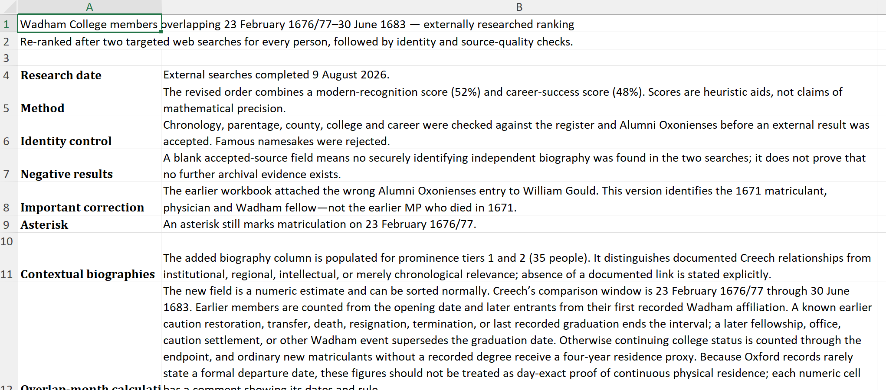
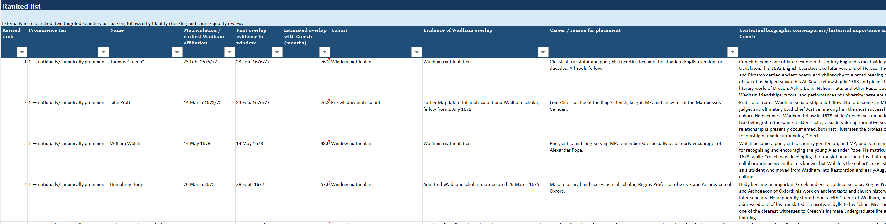

From age sixteen to twenty two, [Thomas Creech](/blog/thomas-creech-intro/) attended Wadham College in Oxford. He published his renowned translation of *De rerum natura* while there. As now, college then was as much about who you met as it was about what you learned. And during Creech's time at Wadham from 1677 to 1683, he met *a lot* of people. Including friends he'd keep his entire life.

There's some evidence of who he met, which of course is of obvious interest to me as a biographer. But I'm equally interested in who he *might have met* while at Wadham. What was his circle of possibility? Who collectively helped construct the conversations of the day? This post is about how "AI" is helping me answer that question.

*David Loggan. Collegium Wadhamense (Oxonia Illustrata). 1675. Folger Shakespeare Library.*

## The Connections

Nearly 250 scholars overlapped with Creech during his time at the college: quite a few, but small enough that it's possible he crossed paths with each of them. Of those, half overlapped with the translator for at least three of his six years at Wadham. Below are some people with **no documented social connection** to Creech, but who by their presence nevertheless helped define his formative years:

- Future Lord Chief Justice [John Pratt](https://en.wikipedia.org/wiki/John_Pratt_(judge))
- Future poet [William Walsh](https://en.wikipedia.org/wiki/William_Walsh_(poet))
- Wadham's Warden [Gilbert Ironside](https://en.wikipedia.org/wiki/Gilbert_Ironside_the_younger)
- Future mathematician [John Caswell](https://en.wikipedia.org/wiki/John_Caswell) (though limited overlap)
- Future Archbishop [Thomas Lindsay](https://en.wikipedia.org/wiki/Thomas_Lindsay_(bishop)), who also happened to go to grammar school with Creech.
- Future mystic [William Freke](https://en.wikipedia.org/wiki/William_Freke)
- Future poet [William Coward](https://en.wikipedia.org/wiki/William_Coward), who later criticized one of Creech's translations in print.
- Future theologian [William Nicholls](https://en.wikipedia.org/wiki/William_Nicholls_(theologian))
- Edward Digges

That last one, Edward Digges, was an interesting case. Four years younger than Creech, he constantly chased him: After Wadham, he joined All Souls College after Creech moved there. When Creech resigned his rectorship at Elmley, Digges took on the role. After Creech died in his position as rector of Welwyn, Digges moved into that job too. Beyond that, no documented connection between the two exists, but I have to imagine they knew each other well.

As part of the bio, I'm slowly going through the list of these 242 overlapping individuals. It's a useful effort in understanding Creech's context.

I'll be honest: my full-time job does not give me research time. When I'm not doing my full-time job, I like to be a present dad to my preschooler. When I'm not being a present dad to my preschooler, I'm (finally, after eighteen years) finishing my dissertation. Creech is priority #4, but I still want to get the bio done in my lifetime.

So, here and there, I turn to my remarkably stupid and often useful research assistant robot, Claude. It makes a lot of mistakes, but I'm not relying on its accuracy. Today, I'm relying on its ability to write code and organize data a bit faster than I can, to get me to my "first pass" at this research question somewhat sooner.

There are two sources to find all of Creech's contemporaries at Wadham College: the [Registers of Wadham College from 1613 to 1719](https://archive.org/details/registersofwadha00wadhuoft), and [Alumnni Oxonienses from 1500 to 1714](https://www.british-history.ac.uk/alumni-oxon/1500-1714). The *Registers* is helpfully arranged in chronological order; *Alumni Oxonienses* is annoyingly alphabetical. 

*The Alumni Oxonienses, photo from booksbythefoot.com*

They contain slightly different information, and I want a spreadsheet that:

- Combines the details from both sources,
- Tells me how long any one Wadhamite overlapped with Creech,
- Provides brief biographical sketches, and
- Roughly "scores" each Wadham affiliate on two aspects: their relative importance at the time, and the attention today's historians give to them. (This is just to help me focus who I'm doing the most research on in my first pass.)

In a perfect world, I compile this spreadsheet myself. Every additional minute in the sources is another opportunity for my brain to digest information and make connections I might not have otherwise.

But frankly I don't have time to cross-reference *Alumni Oxonienses* and the *Registers*, to calculate every period of overlap by hand, and to look up every name in every biographical dictionary. Is the juice worth that squeeze? Nah.

I'm already pouring hundreds or probably thousands of hours into this project; if the robot makes a reasonably accurate spreadsheet for me, I can use my time to attend my focus towards those co-Wadhamites warranting the most care.

## The Approach

So I open up my ~~whatever the hell we want to call it today~~ 🙄 "co-working interface" 🙄, *which is different from the chatbot interface that most of you are used to*. Co-working interfaces facilitate more complex actions: writing and executing more code, reading and writing directly to/from files, orchestrating "sub-agents" to work on different tasks, etc. They genuinely open new possibilities for historians than chatbots alone allow.

I give Claude access to *Alumni Oxonienses* and the *Registers*, along with a pretty simple prompt:

    Using the attached documents, please create an exhaustive list of everyone at Wadham college between February 1676/77 and June 1683. Give them two rough scores on how recognizable they would be today and how important they were to their contemporaries. Please put an asterisk next to names of people who matriculated on February 23, 1676/77. 
    
    Include 2-4 sentence biographies of each, highlighting particularly anything of potential relevance to the life, learning, and career of Thomas Creech.
    
    Include a column indicating their overlap (in months) at Wadham with the dates listed.

It fails a few times:

1. It neglects to note anyone who matriculated at Wadham before Creech's arrival in February 1676. I tell it that it's the wrong approach and it succeeds the second time.
2. It does a good job finding when people started at Wadham but it takes several additional prompts to figure out when they left. *Alumni Oxonienses* proves a useful cross-reference here, but I'm still not fully confident in the durations it reports. No biggie.
3. It mismatches some names (e.g., looking up a biography for George Pitt the Younger, it finds one for George Pitt the Elder.) I ask it to cross-reference against other biographical dictionaries I provide and it fixes most, but not all, of those issues.

I hand-check the spreadsheet it spits out against a few random pages of *Alumni Oxonienses* and the *Registers*, and the accuracy varies depending on column: 

- name and matriculation dates are basically 100% accurate, 
- bios are 90%ish accurately matched, and
- "importance" scores (it ranks them into five categories each for contemporary and historical importance) align pretty closely with my own understanding based on just being steeped in the records for twenty years. I don't know how to quantify that, but they're pretty accurate.
- Durations of someone's time at Wadham are pretty abysmal, but it's also the least important column.

*First page of Claude's spreadsheet output*

*Second page of Claude's spreadsheet output*

All told it takes under an hour of back-and-forth, and results in a great place for me to start my research: a spreadsheet with 242 names. I didn't even know how many names I should expect! If that number is off, it's probably only off by 25-50 in either direction.

If I were doing this myself a year ago, combining regular expressions, academic database searches, hand-entry, etc., this could easily have taken me twenty hours (about five minutes per person).

Now I get to focus my time on the fun part: researching relevant people for whom there are actual historical traces easily found, to get a sense of who they were and the problems that mattered to them.

For the purposes of ordering my research activities, I'll rank the names by some combination of both importance scores and duration overlap with Creech (even though the accuracy on that is low). Then I'll start my searches at the top of the list and work my way down. Once I feel like I've read the same thing over and over and I have a general sense of the social millieu of Wadham, I'll stop.

## The Defenses

*How can you know you picked the right names to research?*

I suppose I don't, but also I probably wouldn't have had time to do this part of the project (understanding contemporary Wadhamites never mentioned in the records of Creech) at all had I not turned to AI. So in the spirit of "something is better than nothing," this seems like a fine compromise.

*Are you worried important people will be left out of your research?*

No. This is neither the start nor the end of my research process. Creech's connections during his Wadham years show up elsewhere in his life and elsewhere in the sources, and I already have files on each of 'em. I'm going to keep this whole 242-person list and reference it when other individuals come up in the course of my research to see if there's an unexpected connection.

(This already worked, actually! I knew, like Creech, Edward Digges was at All Souls', Elmley, and Welwyn, but I hadn't realized he was also at Wadham until today.)

*What about copyright?*

The sources were parsed on my desktop, and anyway these materials are well out of copyright, so I'm not concerned by it.

*What about water usage?*

Okay okay these questions from fictional you, dear reader, are getting much bigger than this little post demands. I promise I'll address my ethical stance on AI, but not here on my post about making a spreadsheet.

## Postscript

The next step of this work, actually researching a few dozen or more Wadhamites with no documented connection to Creech, may take me 20ish hours. I'll stop myself if it goes much more than that.

I don't know if I'd have bothered with this whole part of the project were it not for AI making this part faster. Essentially, it compressed a 40-hour project into a 20-hour one. With my time at a premium, this allowed me the space to actually pursue a diversion that may contribute meaningfully to the final book.