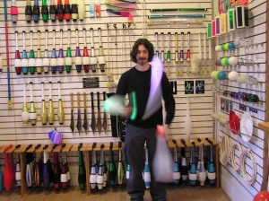
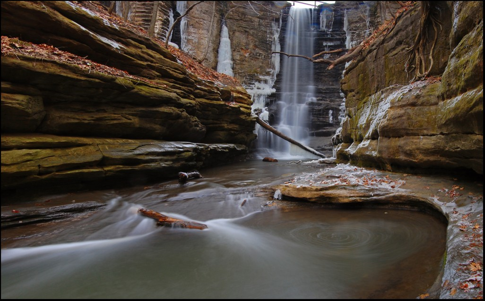

> Thirty spokes unite in one nave and on that which is non-existent \[on the hole in the nave\] depends the wheel’s utility. Clay is moulded into a vessel and on that which is non-existent \[on its hollowness\] depends the vessel’s utility. By cutting out doors and windows we build a house and on that which is non-existent \[on the empty space within\] depends the house’s utility. Therefore, existence renders actual but non-existence renders useful.
>
> -Laozi, Tao Te Ching, Susuki Translation

(NOTE 1: Although it may not seem it from the introduction, this post is actually about humanities research, eventually. Stick with it and it may pay off!)

(NOTE 2: I’ve warned in the past about invoking concepts you know little about; let me be the first to say I know next to nothing about Eastern philosophy or *t’ai chi ch’uan*, though I do know a bit about emergence and a bit about juggling. This post uses the above concepts as helpful metaphors, fully apologizing to those who know a bit more about the concepts for the butchering of them that will likely ensue.)

The astute reader may have noticed that, besides being a sometimes-historian and a sometimes-data-scientist, the third role I often take on is that of a circus artist. Juggling and prop manipulation have been part of my life for over a decade now, and though I don’t perform as much as I used to, the feeling I get from practicing is still fairly essential in keeping me sane. What juggling provides me that I cannot get elsewhere is what prop manipulators generally call a state of “flow.”

Look! It's me in a candy store!

The concept [draws from a positive psychology term](http://en.wikipedia.org/wiki/Flow_(psychology)) developed by Mihály Csíkszentmihályi, and is roughly equivalent to being in “the zone.” Although I haven’t quite experienced it, this feeling apparently comes to programmers working late at night trying to solve a problem. It’s also been described by dancers, puzzle solvers, and pretty much anyone else who gets so into something they feel, if only for a short time, they have totally lost themselves in their activity. A fellow contact juggler, Richard Hartnell, recently filmed a [fantastic video](http://www.youtube.com/watch?v=BKizrvTeO1A) describing what flow means to him as a performer. I make no claims here to any meaning behind the flow state. The human brain is complex beyond my understanding, and though I do not ascribe any mystical properties to the experience, having felt “flow” so deeply, I can certainly see why some do treat it as a religious experience.

<!-- page 2 -->

The most important contribution to my ability to experience this state while juggling was, oddly enough, a *t’ai chi ch’uan* course. Really, it was *one concept* from the course, called *song kua*, “relax the hips,” that truly opened up flow for me. It’s a complex concept, but the part I’d like to highlight here is the relationship between exertion and relaxation, between a push and a pull. When you move your body, that movement generally starts with an *intention*. I want my hand to move to the right, so I move it to the right. There is, however, another way to move parts of the body, and this is via *relaxation*. If I’m standing in a certain way, and I relax my hip in one directoin, my body will naturally shift in the opposite direction. My body naturally gets *pulled* one way, rather than me *pushing* it to go there. In the circus arts, I can now quickly reach a flow state by creating a system between myself and whatever prop I’m using, and allowing the state of that system to *pull* me to the next state, rather than intentionally *pushing* myself and my prop in some intentional way. It was, for me, a mind-blowing shift in perspective, and one that had absolutely nothing to do with my academic pursuits until last night, on a short plane ride back from [Chicago APA](http://www.apaonline.org/).

In the past two weeks, I’ve been finishing up the first draft of a humanities paper that uses concepts from complex systems and network analysis. In it, I argue (among other things) that there are statistical regularities in human behavior, and that we as historians can use that backdrop as a context against which we can study history, finding actions and events which deviate from the norm. Much recent research has gone into showing that people, *on average,* behave in certain ways, generally due to constraints placed on us by physics, biology, and society. This is not to say humans are inherently *predictable* - merely that there are boundaries beyond which certain actions are unlikely or even impossible given the constraints of our system. In the paper, I further go on to suggest that the way we develop our social networks also exhibits regularities across history, and the differences against those regularities, and the mechanisms by which they occur, are historically interesting.

Fast-forward to last night: I’m reading a fantastic essay by anthropologist Terrence W. Deacon about the emergence of self-organizing biological systems on the plane-ride home.[^1] In the essay, Deacon attempts to explain why entropy seems to decrease enough to allow, well, Life, The Universe, and Everything, given the [second law of thermodynamics](http://en.wikipedia.org/wiki/Second_law_of_thermodynamics). His answer is that there are [basins of attraction](http://en.wikipedia.org/wiki/Attractor) in the dynamics of most processes which inherently and inevitably produce order. That is, as a chaotic system interacts with itself, there are dynamical states which the system can inhabit which are *inherently self-sustaining*. After a chaotic system shuffles around for long enough, it will eventually and randomly reach a state that “attracts” toward a self-sustaining dynamical state, and once it falls into that basin of attraction, the system will feed back on itself, remaining in its state, creating apparent order from chaos for a sustained period of time.

Deason invokes a similar *Tao Te Ching* section as was quoted above, suggesting that empty or negative space, if constrained properly and possessing the correct qualities, act as a kind of *potential energy*. The existence of the walls of a clay pot are what allows it to be a clay pot, but the function of it rests in the constrained negative space bounded by those walls. In the universe, Deason suggests, constraints are implicit and temporally sensitive; if only a few state structures are self-sustaining, those states, if reached, will naturally persist. Similar to that basic tenant of natural selection, *that which can persist tends to*.

The example Deason first uses is that of a whirlpool forming in the empty space behind a rock in a flowing river.

> Consider a whirlpool, stably spinning behind a boulder in a stream. As moving water enters this location it is compensated for by a corresponding outflow. The presence of an obstruction imparts a lateral momentum to the molecules in the flow. The previous momentum is replaced by introducing a reverse momentum imparted to the water as it flows past the obstruction and rushes to fill the comparatively vacated region behind the rock. So not only must excess water move out of the local vicinity at a constant rate; these vectors of perturbed momentum must also be dissipated locally so that energy and water doesn’t build up. The spontaneous instabilities that result when an obstruction is introduced will effectively induce irregular patterns of build-up and dissipation of flow that ‘explore’ new possibilities, and the resulting dynamics tends toward the minimization of the constantly building instabilities. This ‘exploration’ is essentially the result of chaotic dynamics that are constantly self-undermining. To the extent that characteristics of component interactions or boundary conditions allow any degree of regularity to develop (e.g. circulation within a trailing eddy), these will come to dominate, because there are only a few causal architectures that are not self-undermining. This is also the case for semi-regular patterns (e.g. patterns of eddies that repeatedly form and disappear over time), which are just less self-undermining than other configurations.
>
> …
>
> *The flow is not forced to form a whirlpool. This dynamical geometry is not ‘pushed’ into existence, so to speak, by specially designed barriers and guides to the flow. Rather, the system as a whole will tend to spend more time in this semi-regular behaviour because the dynamical geometry of the whirlpool affords one of the few ways that the constant instabilities can most consistently compensate for one another.* \[Deason, 2009, emphasis added\]

<!-- page 3 -->

Self-Organizing System (http://www.flickr.com/photos/lapstrake/3164577339/)

Essentially, when lots of things interact at random, there are some *self-organized* constraints to their interactions which allow order to arise from chaos. This order may be fleeting or persistent. Rather than using the designed constraint of a clay pot, walls of a room, or spokes around a hub, the constraints to the system arise from the potential in the context of the interactions, and in the properties of the interacting objects themselves.

<!-- page 4 -->

So what in the world does this have to do with the humanities?

My argument in the above paper was that people naturally interact in certain ways; there are certain *basins of attraction*, properties of societies that tend to self-organize and persist. These are stochastic regularities; people do not always interact in the same way, and societies do not come to the same end, nor meet their ends in the same fashion. However, there are properties which make social organization more likely, and *knowing* how societies tend to form, historians can use that knowledge to frame questions and focus studies.

Explicit, data-driven models of the various mechanisms of human development and interaction will allow a more nuanced backdrop against which the actualities of the historical narrative can be studied. [Elijah Meeks recently posted](https://dhs.stanford.edu/spatial-humanities/models-as-product-process-and-publication/), about models,

> \[T\]he beauty of a model is that all of these \[historical\] assumptions are formalized and embedded in the larger argument…  That formalization can be challenged, extended, enhanced and amended \[by more historical research\]… Rather than a linear text narrative, the model itself is an argument.

It is striking how seemingly unrelated strands of my life came together last night. The pull and flow of juggling, the bounded ordering of emergent behaviors, and the regularities in human activities. Perhaps this is indicative of the [consilience](http://en.wikipedia.org/wiki/Consilience) of human endeavors; perhaps it is simply the overactive pattern-recognition circuits in my brain doing what they do best. In any case, even if the relationships are merely loose metaphors, it seems clear that a richer understanding of complexity theory, modeling, and data-driven humanities leading to a more nuanced, humanistic understanding of [human dynamics](http://en.wikipedia.org/wiki/Human_dynamics) would benefit all. This understanding can help ground the study of history in the [Age of Abundance](http://chnm.gmu.edu/essays-on-history-new-media/essays/?essayid=6). A balance can be drawn between the uniquely human and individual, on one side, and the statistically regular ordering of systems, on the other; both sides need to be framed in terms of the other. Unfortunately, the dialogue on this topic in the public eye has thus-far been dominated by applied mathematicians and statistical physicists who tend not to take into account the insights gained from centuries of qualitative humanistic inquiry. That probably means it’s our job to learn from them, because it seems unlikely that they will try to learn from us.

Notes:

[^1]: in *The Re-Emergence of Emergence*, 2009, edited by Philip Clayton & Paul Davies.
