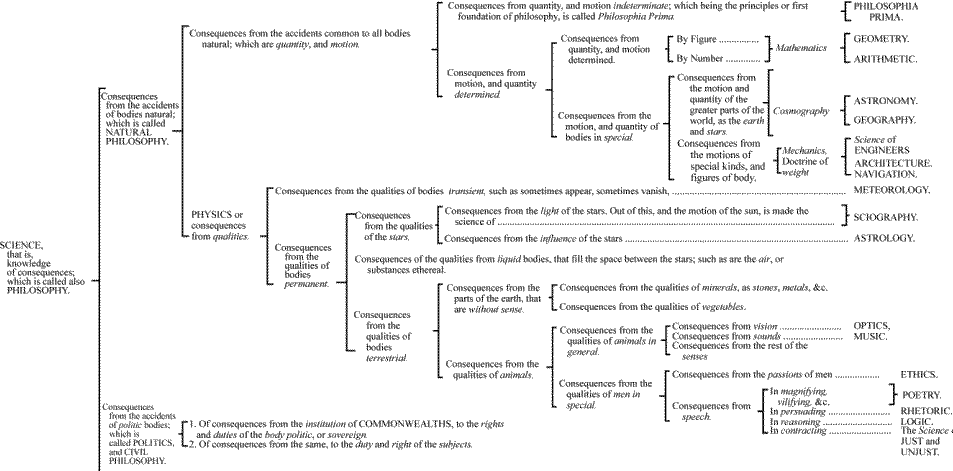
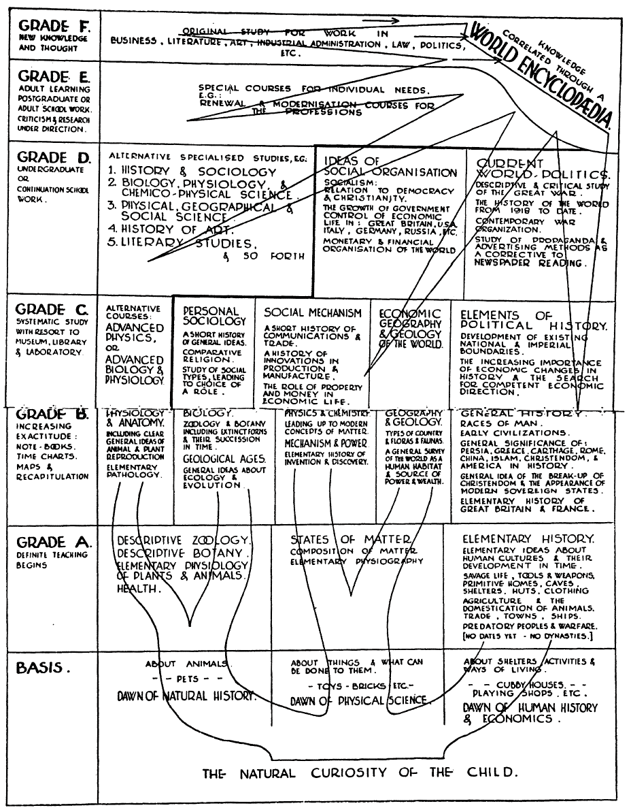

<!-- page 1 -->

The blog’s been quiet lately; my attention has been occupied by various journal submissions and a [new book in the works](http://www.themacroscope.org/), but I figured my readers would be interested in one of those forthcoming publications. [This is an article \[preprint\]](http://www.scottbot.net/HIAL/wp-content/uploads/2013/08/WeingartUDC2013PrePrint.pdf) I’m presenting at the [Universal Decimal Classification Seminar](http://seminar.udcc.org/2013/index.php) in The Hague this October, on **the history of how we’ve illustrated the interconnections of knowledge and scholarly domains**. It’s basically two stories: one of how we shifted from understanding the world hierarchically to understanding it as a flat web of interconnected parts, and the other of how *the thing itself* and *knowledge of that thing* became separated.

A few caveats worth noting: first, because I didn’t want to deal with the copyright issues, there are no actual illustrations in the paper. For the presentation, I’m going to compile a powerpoint with all the necessary attributions and post it alongside this paper so you can all see the relevant pretty pictures. For your viewing pleasure, though, I’ve included some of the illustrations in this blog post.

<!-- page 2 -->

*An interpretation of the classification of knowledge from Hobbes’ Leviathan. \[[via e-ducation](http://e-ducation.net/classifications.htm)\]*

Second, because the this is a presentation directed at information scientists, the paper is organized linearly and with a sense of inevitability; or, as my fellow historians would say, it’s very [whiggish](http://en.wikipedia.org/wiki/Whig_history). I regret not having the space to explore the nuances of the historical narrative, but it would distract from the point and context of this presentation. I plan on writing a more thorough article to submit to a history journal at a later date, hopefully fitting more squarely in the historiographic rhetorical tradition.

<!-- page 3 -->

<!-- page 4 -->

*H.G. Wells’ idea of how students should be taught. \[via H.G. Wells, 1938. World Brain. Doubleday, Doran & Co., Inc\]*

In the meantime, if you’re interested in reading the pre-print draft, [here it is](http://www.scottbot.net/HIAL/wp-content/uploads/2013/08/WeingartUDC2013PrePrint.pdf)! All comments are welcome, as like I said, I’d like to make this into a fuller scholarly article beyond the published conference proceedings. I was excited to put this up now, but I’ll probably have a new version with full citation information within the week, if you’re looking to enter this into Zotero/Mendeley/etc. Also, hey! I think this is the first post on the Irregular that has absolutely nothing to do with data analysis.

<!-- page 5 -->

*Recent map of science by Kevin Boyack, Dick Klavans, W. Bradford Paley, and Katy Börner. \[via [SEED](http://seedmagazine.com/content/article/scientific_method_relationships_among_scientific_paradigms/) magazine\]*
