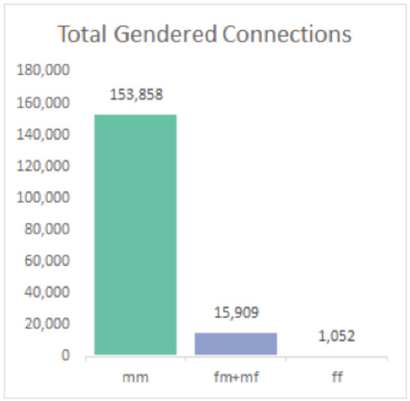
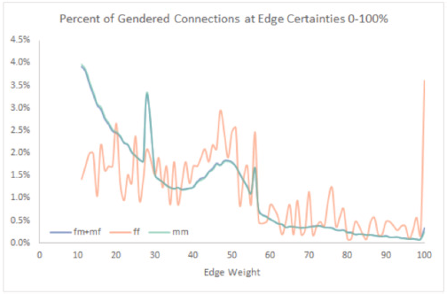
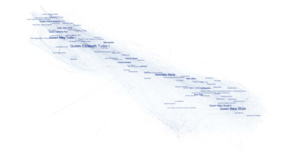
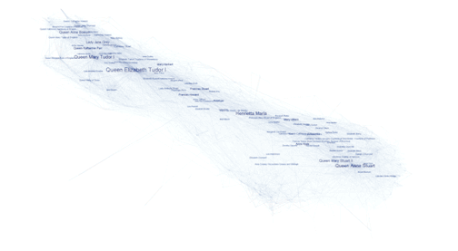

<!-- page 1 -->

Computational methods are great at bringing voice to the historically marginalized (see [Michelle Moravec](https://twitter.com/professmoravec) or [Elaine Parsons](https://twitter.com/profefp)). We may never learn much about specific actors who produced few written records compared to their affluent white male counterparts, but by collecting the underrepresented together, we can hear in aggregate what’s often too quiet to discern individually.

This reconstruction is never easy, and rarely sensitive. Categorizing people dehumanizes the humanities, and when we increase the volume, we lose the nuance. We also constantly battle what computer scientists call GIGO ([Garbage In, Garbage Out](https://en.wikipedia.org/wiki/Garbage_in,_garbage_out)); analysis is only as good as the underlying data. At *Six Degrees*, we want our network to represent and reinforce the full diversity of early modern social ties, but a combination of historical scarcity and editorial decisions in our sources prevents the network from living up to this potential. In many ways, this mirrors the period itself: more open and egalitarian in ideal than reality. We can [do something about that](http://networkingwomen.sixdegreesoffrancisbacon.com/), but first we have to notice what’s missing.

[Gender](http://6dfb.tumblr.com/tagged/gender) is a good place to start. For example, biographies of women represent only 5.4% of early modern entries in the *Oxford Dictionary of National Biography* (ODNB), which is itself the source of *Six Degrees*’ initial dataset. Our algorithm mining the ODNB for historical names then biases towards men even further, because women are often named in relation to the men around them, [preventing our system from realizing they’re worth documenting](http://6dfb.tumblr.com/post/99911050256/behind-every-great-man-tales-from-the-raw-ner). Several layers of bias against women (evidentiary, editorial, and algorithmic) add up, and this blog post describes how the scales are tipped before we begin balancing them this January. We’ll write a follow-up post after our [Networking Women Add-a-Thon](http://networkingwomen.sixdegreesoffrancisbacon.com/) describing how it goes.

As most people in early modern Britain bore one of approximately one hundred highly gendered given names, it was possible to assign genders to most of our dataset according to their given names. A John (2000+ people), Thomas (1200+), or William (1200+) was male, while an Elizabeth (100+), Mary (100+), or Anne (75+) was female. Manual examination of original biographies helped identify the gender of the remaining people in our dataset, including the multi-named Christian Davies—also known as Catherine, Christopher, and Richard—who defied binary gender categorizations and helped motivate our tripartite division of genders. As we only know of one such individual in the dataset at present, our current analysis will work with male and female genders.

So where does that leave *Six Degrees*? Thankfully, even given the algorithmic bias against women’s names, we managed to get just a smidge closer to gender parity than the ODNB, in which [534 of 9,929 (5.4%) of early modern biographies are of women’s lives](http://global.oup.com/oxforddnb/info/print/intro/tables/). By contrast, Six Degrees currently includes 13,443 names, 886 of which are women’s, resulting in **women comprising 6.6% of the *Six Degrees* network**. Not great, but at least closer.

<!-- page 2 -->

Of course, *Six Degrees*, unlike the ODNB, is instantiated primarily as a network. It is a reconstruction of early modern relationships combining crowdsourced information and data from mining the ODNB. If we’re worried about gender diversity, we want to ensure not simply that the counts of names reach parity, but that the richness of connections between individuals of all genders are well-represented. It gets historiographically complex here, because while there were roughly equal numbers of men and women in early modern Britain, we can’t be certain how gender norms affected the making of social ties, and we must take care that an effort towards data equality doesn’t cover up the harsher realities of the past.

In this case, we can construct a sort of pseudo-Bechdel test to see between whom social ties exist in our dataset. As of December 2015, *Six Degrees* connected 13,443 names via 170,819 ties. Of those ties, 15,909 of them connected a woman to a man, and 1,052 of them connected two women. Thus **9.9% of ties involved a woman in some capacity,** and **0.6% of ties connected two women**. Although 0.6% sounds low, it’s still slightly more connections than is probable given the distribution of men and women in the dataset. If we were working with a complete network—in which everyone knew everyone else—only 0.4% of those ties would be between women, yet woman-woman connections actually comprise 0.6% of the total number of ties in *Six Degrees*.

The next obvious question is, how many ties is any given individual likely to have to others within the dataset? Broken down by gender, **men connect on average to 25.7 other people (median 15 other people)**, and **women connect on average to 20.3 other people (median 15 other people)**. While the averages show a noteworthy bias towards men, it is only a few incredibly well-connected male figures with *many* connections who skew the numbers so drastically. The equivalent medians do a better job representing the majority of individuals: men and women in *Six Degrees* tend to connect to the same number of people.

The same effect is seen when looking at the structural roles men and women play in the network. One measure of structural centrality in a network is [eigenvector centrality](http://djjr-courses.wikidot.com/soc180:eigenvector-centrality), a number assigned to an individual representing their place in the global network. High values indicate very central figures in the overall network, and low values indicate an individual’s place on the network’s periphery. **Men on average have an eigenvector centrality of 0.020 (median 0.013)**, and **women have an average eigenvector centrality of 0.017 (median 0.013)**. Again we see a few very central early modern men skewing their gender’s numbers higher, but in general men and women show little difference when it comes to their structural centrality in the network. That’s an encouraging result. We also didn’t notice any funny business in the distribution of centralities between genders—that is, women comprise 6.6% of the most central figures, of the least central figures, and so forth.  This is perfectly in keeping with the overall 6.6% representation of women.

All relationships in *Six Degrees* have numerical certainties, or confidence estimates, and we were a bit concerned whether the distribution of tie certainties reflected hidden gender biases. Our statistical method ascribes certainty to a connection based on its text mining of the *ODNB*; basically if two people are mentioned together a lot of and in many contexts, we can be reasonably certain they were connected, and that certainty decreases as those co-mentions become sparser. Or at least, that’s the broad strokes of our operating assumption. If a historian manually adds a connection, though, it’s generally a connection they know existed, so the certainty is often 100%. We were worried most of the woman-to-woman connections would be very uncertain, given how infrequently they are mentioned, but the opposite proved true (see below).

<!-- page 3 -->

We were relieved to find that **the connection certainty distribution is the same for connections between men**, **and connections between women and men**. Connections solely between women, because they numbered so few, show an erratic but generally matching pattern. The exceptions are at the low end, where women share fewer very uncertain connections, and the high end, where they share proportionally more 100% certain connections. Historians adding manual ties make up a larger proportion of woman-woman connections explains the high proportion of 100% certainty connections, but we do not yet have an explanation for low proportion of very uncertain connections.

Lastly, because everyone loves vaguely-shaped blobs titled “networks”, and because sometimes it’s nice to see the names of people we’re actually talking about, below are a few network visualizations which show the entirety of *Six Degrees* with and without men, names sized by their eigenvector centrality, to give you a sense of how many more men are in the network, and the names of the most central men and women. The network is ordered roughly by time.

Everyone:

Just women:

<!-- page 4 -->

Comparing network of men and women:

Readers who are interested in further exploring early modern networks and gender should join us for our Networking Women Add-a-thon on January 23rd, 2016. Two in-person sessions will be held at Carnegie Mellon University, in Pittsburgh PA, and the Folger Shakespeare Library, in Washington D.C. People can also participate remotely, joining in on the conversation through Twitter (#NetworkingWomen) and our Slack channel. For further details, check out our [Networking Women website](http://networkingwomen.sixdegreesoffrancisbacon.com/).
