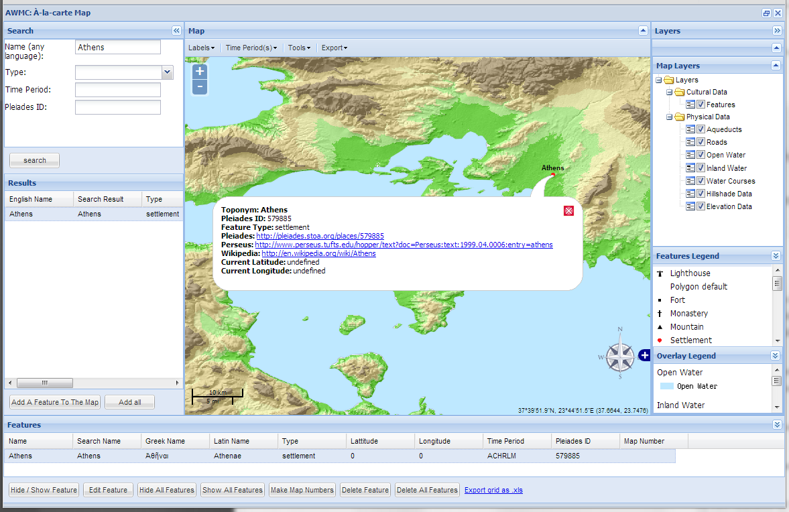
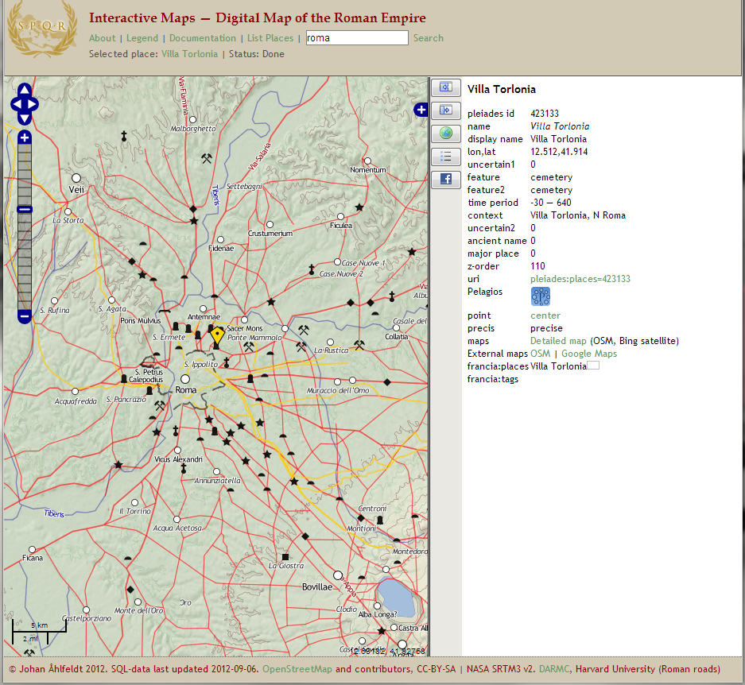

The title of this post comes from an oft-quoted passage of my [previous one](/blog/orbis-the-next-step-in-digital-humanities/) describing [ORBIS](http://orbis.stanford.edu/), a scholarly argument cleverly disguised as a web tool. Of ORBIS I wrote

> *…given any two cities in the ancient world, it returns the fastest, cheapest, or shortest route between them, given the month, the mode of transportation, and various other options. It’s Google Maps for the ancient world, complete with the “Avoid Highways” feature.*

In writing that review, I neglected to mention the many fantastic resources out there that already map the ancient world, including the [Digital Atlas of Roman and Medieval Civilization](http://darmc.harvard.edu/) and [PLEIADES](http://pleiades.stoa.org/), a gazetteer and graph of ancient places. The most impressive full-featured online GIS application I’ve seen is called [Antiquity À-la-carte](http://bioapps.its.unc.edu/projects/awmc/alacarte/carte.html), shown below. The classicists have once again proven themselves to be at the bleeding edge of technology. When they keep developing cool toys like these, I sometimes regret being an early modernist. Sometimes.

<!-- page 1 -->

Antiquity À-la-carte, a GIS application for the ancient western world.

The cool toy I speak of now is of course no toy, but a serious scholarly endeavor which will doubtless set the bar for future online historical maps. In many ways, the [Digital Map of the Roman Empire](http://francia.ahlfeldt.se/imperium.php) offers *less* than the sites I listed above. It doesn’t allow you to turn on or off particular layers, and it certainly doesn’t include all of the information the others have. In this case, however, less is more. It’s a *really easy to use* map of the ancient world, online. That’s it. It doesn’t tell you how to get from point A to point B, it doesn’t allow you to see the location of shipwrecks or the borders of countries at different time periods; it’s just a base map, depicting the Greek and Roman world in its entirety, asking the world to do with it what it will.

Johan Ahlfeldt [wrote about his creation](http://pelagios-project.blogspot.com/2012/09/a-digital-map-of-roman-empire.html):

> The aim of my work with Pelagios has been to create a static (non-layered) map of the ancient places in the Pleiades dataset with the capacity to serve as a background layer to online mapping applications of the Ancient World. Because it is based on ancient settlements and uses ancient placenames, our map presents a visualisation more tailored to archaeological and historical research, for which modern mapping interfaces, such as Google Maps, are hardly appropriate; it even includes non-settlement data such as the Roman roads network, some aqueducts and defence walls (*limes*, city walls). Thus, for example, the tiles can be used as a background layer to display the occurrence of find-spots, archaeological sites, etc., thereby creating new opportunities to put data of these kinds in their historical context.

<!-- page 2 -->

The ancient base map.

As [I wrote last year](/blog/contextualizing-networks-with-maps/), accurate base maps are extremely important for contextualizing research. With this underneath, for example, [ORBIS](http://orbis.stanford.edu/) could provide a much richer experience of the ancient world. What’s more, the PELAGIOS group has opened up the map with a CC-BY license, allowing anyone to build on it so long as they include proper scholarly attribution. It can be used with Openlayers, Google, and Bing maps, so anybody who already has these systems in place can easily swap out the map tiles with these historical ones. [Johan’s post](http://pelagios-project.blogspot.com/2012/09/a-digital-map-of-roman-empire.html) includes examples of all of these implemented.

<!-- page 3 -->

My posts are usually long and rambling, but I’ll keep this one short and to the point, much like the tool I’m reviewing. This is the first easily mashable base map of the ancient world, and for that it is awesome. Go explore!

<!-- page 4 -->
