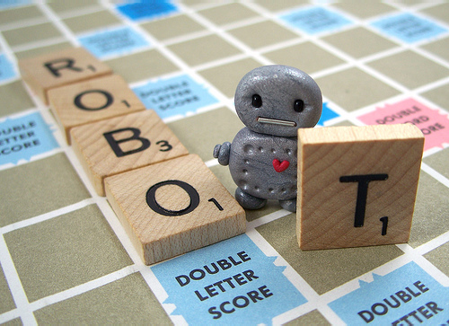
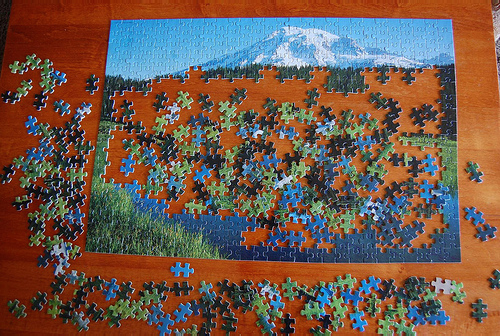

Occasionally, in computer science, the term “halting condition” is thrown around as the point at which the program should stop running.

Say I’ve got a robot that watches my roommate and I play scrabble, and I want it to count how many scrabble pieces we use, and tell us who won and what the highest scoring word was. Unfortunately, let’s say, I’m also Superman, so our scrabble games frequently end early when I hear cries for help and run off to the nearest phone booth. Our robot has to decide what conditions mean the game is over so it can give us the winner report; in this case, it is either when one player runs out of pieces, or when nobody plays a piece for a significant amount of time, because games often end early. Those are our halting conditions.

*Scrabble Robot from http://www.flickr.com/photos/ittybittiesforyou/3350135154/*

When it comes to data collection, humanists have no halting conditions. We don’t even have decent halting [*heuristics*](http://en.wikipedia.org/wiki/Heuristic). Lisa Rhody just blogged a [fantastically important piece](http://lisa.therhodys.net/2012/03/chasing-the-great-data-whale/) about the difficulties of data collection in the humanities, and her points are worth stressing. “You need to know,” Rhody writes, “when it’s time to cut the rope and release what *might* be done.” She points out that humanists need to be discerning in what data we *do* collect, and we need to be comfortable with analyzing and releasing imperfect data. “The decision *not* to be perfect is the right choice, but it isn’t an easy one.”

## Research Design

<!-- page 1 -->

Many (but not all!) of the natural sciences have it easy. You design an experiment, you get the data you planned to get, then you analyze and release it. The halting conditions, when to stop collecting and cleaning data, are usually fairly easily pre-determined and stuck to. Psychology and the social sciences are usually similar; they often either use data that already exists, or else collect it themselves under pre-specified conditions.

The humanities, well… we’re used to a tradition that involves very deep and particular reading. The tiniest stones of our studied objects do not go unturned. The idea that a first pass, *an incomplete pass*, can lead to anything at all, let alone analysis and release, is almost anathema to the traditional humanistic mindset.

Herein lies the problem of humanities big data. We’re trying to measure the length of a coastline by sitting on the beach with a ruler, rather flying over with a helicopter and a camera. And humanists know that, like the sandy coastline shifting with the tides, our data are constantly changing with each new context or interpretation. Cartographers are aware of this problem, too, but they’re still able to make fairly accurate maps.

*Measuring the Coast*

While I won’t suggest that humanists should take a more natural-scientific approach to research, beginning with a specific hypothesis and pre-specified data that could either confirm or deny it, we *should* look to them for inspiration on how to plan research. Thinking about what sort of specific analyses you’d like to perform with the data at the end can reasonably constrain what you try to collect from the beginning. Think about what bits of data are redundant, or would yield diminishing returns on your time and money investment of data collection.

<!-- page 2 -->

## Being Comfortable With Imperfection

In her blog post, Lisa wrote about her experience at [MITH](http://mith.umd.edu/). She had a four month fellowship to research 4,500 poems; she could easily have spent the whole time collecting increasingly minute data about each poem. In the end, she settled on only collecting the gender of the poet and whether the poem pertained to a work of art, opting not to include information like when each poem was published, what work of art it referred to, etc. She would then go in later and use other large-scale analytic tools (like text analysis), augmenting those results with the tags she entered about each poem.

A lot of valuable, rich information was lost in this data collection, but the important thing is that Lisa was still able to go in with a specific question, and collect only that which she needed most to explore it. The data may not have been perfect, and they may not have described everything, but they were sufficient and useful.

Her story reminded me a  lot of my undergraduate years. I spent *all of them* collecting data on early modern letters for my old advisor. Letters, of course, generally have various locations and dates attached to them, and this presented us with no end of problems. Sometimes the places mentioned were cities, or houses, or states; granularities differed. Over the course of two hundred years, cities would change names, move, or wink out of or into existence entirely. Sometimes they would subsumed into new or different empires. Computers, unfortunately, need fairly regularized data to perform comparative analyses, so we had to make a lot of editorial decisions when entering locations that would make answering our questions easier, but would lose some of the nuance otherwise available.

Similarly, my colleague [Jeana Jorgensen](http://jeanajorgensen.com/wordpress/) recently spent several months painstakingly hand-collecting data about the usage of body parts in fairy tales for her dissertation. Of particular interest in her case was the overtly interpretive layer she added to the collection; for example, did a reference somehow embody the “grotesque?” By allowing herself the freedom to use interpretive frameworks, she embraced the subjective nature of data collection, and was able to analyze her data accordingly.

Of course, by allowing this sort of humanistic nuance, the amount of data one could collect for any single sentence is effectively infinite, and so Jeana had to constrain herself to only collecting for that which she could eventually use. It nevertheless took her months of daily collection, but if she tried to make her data perfect or complete, it would have taken her over a lifetime. She still managed to produce really interesting and thoughtful results for her dissertation.

*Perfect or complete data is impossible in the humanities*. The best we can do is not as much as we can, but as much as we need. There is a point of diminishing return for data collection; that point at which you can’t measure the coastline fast enough before the tides change it. We as humanists have to become comfortable with incompleteness and imperfection, and trust that in aggregate those data can still tell us *something*, even if they can’t reveal *everything*.

<!-- page 3 -->

*We can still see the landscape, even though not every piece is in place. http://www.flickr.com/photos/carmyarmyofme/4657547742/*

The trick and art is knowing the right halting conditions. How much is too much? What data will actually be useful? These are not easy questions, and their answers differ for every project. The important thing to remember is to ***just do it***. Too many projects get hung up because they just haven’t quite collected enough yet, or if they just spend a few more months cleaning their data will be so much better. There will never be a point when your data are perfect. Do your analysis now, release it, and be comfortable with the fact that you’ve fairly accurately mapped the coastline, even if you haven’t quite worked out the jitters of the tides.

<!-- page 4 -->
