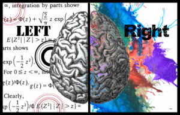
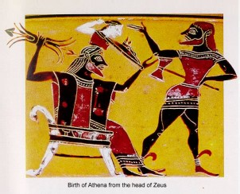
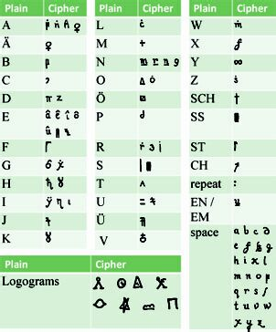

*Being a very round-about review of the new work of fiction by Robin Sloan,* [*Mr. Penumbra’s 24-Hour Bookstore*](http://www.amazon.com/Mr-Penumbras-24-Hour-Bookstore-Novel/dp/0374214913)*.*

## Ship’s Logs and Collaborative DH

Ben Schmidt has stolen the limelight of the recent digital humanities [blogosphere](http://xkcd.com/181/), writing a phenomenal series of not [one](http://sappingattention.blogspot.com/2012/10/logbooks-and-long-history-of.html), not [two](http://sappingattention.blogspot.com/2012/10/melville-plots.html), not [three](http://sappingattention.blogspot.com/2012/10/data-narratives-and-structural.html), not [four](http://sappingattention.blogspot.com/2012/11/machine-learning-on-high-seas.html), not [five](http://sappingattention.blogspot.com/2012/11/when-you-have-mallet-everything-looks.html), not [six](http://sappingattention.blogspot.com/2012/11/where-are-individuals-in-data-driven.html), but [seven](http://sappingattention.blogspot.com/2012/11/reading-digital-sources-case-study-in.html) posts about ship logs and digital history. They’re a whale of a read, and whale worth it too (okay, okay, I’m sorry, I *had* to), but the point for the purpose of this post is his conclusion:

> *The central conclusion is this: To do humanistic readings of digital data, we cannot rely on either traditional humanistic competency or technical expertise from the sciences. This presents a challenge for the execution of research projects on digital sources: research-center driven models for digital humanistic resource, which are not uncommon, presume that traditional humanists can bring their interpretive skills to bear on sources presented by others.*
>
> *– Ben Schmidt*

He goes on to add “A historian whose access is mediated by an archivist tends to know how best to interpret her sources; one plugging at databases through dimly-understood methods has lost his claim to expertise.”  Ben makes many great points, and he himself, with this series of posts, exemplifies the power of humanistic competency and technical expertise combined in one [wrinkled protein sponge](https://twitter.com/Ted_Underwood/status/264810430311067648). It’s a powerful mix, and one just beginning to open a whole new world of inquiry.

<!-- page 1 -->

Yes, I know this is not how brains work. It’s still explanatory. [via](http://www.savetheartist.net/right-and-left-brain-photographers/).

This conclusion inspired a [twitter discussion](http://storify.com/scott_bot/dividing-labor-in-dh) where Ben and Ted Underwood questioned whether there was a limit to the division-of-labor/collaboration model in the digital humanities.  Which of course I disagreed with. Ben suggested that humanists “prize source familiarity more. You can’t teach Hitler studies without speaking German.” The humanist needs to actually speak German; they can’t just sit there with a team of translators and expect to do good humanistic work.

This opens up an interesting question: how do we classify all this past work involving collaboration between humanists and computer scientists, quals and quants, *epistêmê* and *technê*?  Is it not actually digital humanities? Will it eventually be judged *bad* digital humanities, that noisy pre-paradigmatic stuff that came before the grand unification of training and pervasive dual-competencies? My guess is that, if there are limits to collaboration, they are limits which can be overcome with careful coordination and literacy.

I’m not suggesting collaboration is king, nor that it will always produce faster or better results. We can’t throw nine women and nine men in a room and hope to produce a baby in a month’s time, with the extra help. However, I imagine that there are very few, if any, situations where some conclusion can’t be reached by two people with complementary competencies that can be produced by one person with both. Scholarship works on trust. Academics are producing knowledge every day that relies on their trusting the competencies of the secondary sources they cite, so that they do not need methodological or content expertise in the entire hypothetical lattice extending from their conclusions down to the most basic elements of their arguments.

<!-- page 2 -->

And I predict that as computationally-driven humanities matures and utilizes increasingly-complex datasets and algorithms, our reliance on these networks of trust (and our need to methodologically formalize them) will only grow. This shift occurred many years ago in the natural sciences, as scientists learned to rely on physical tools and mathematical systems that they did not fully understand, as they began working in ever-growing teams where no one person could reconstruct the whole. Our historical narratives also began to shift, moving away from the idea that the most important ideas in history sprung forth fully developed from the foreheads of “Great Men,” as we realized that an entire infrastructure was required to support them.

How we used to think science worked. [via](http://hughgrahamcreative.com/2007/08/13/design-authenticity-innovation/).

What we need in the digital humanities is not combined expertise (although that would probably make things go faster, at the outset), but multiple literacies and an infrastructure to support collaboration; a system in place we can trust to validate methodologies and software and content and concepts. By multiple literacies, I mean the ability for scholars to speak the language of the experts they collaborate with. Computer scientists who can speak literary studies, humanists who can speak math, dedicated translators who can bridge whatever gaps might exist, and enough trust between all the collaborators that each doesn’t need to reinvent the wheel for themselves. Ben rightly points out that humanists value source expertise, that you can’t teach Hitler without speaking German; true, but the subject, scope, and methodologies of traditional humanists have constrained them from needing to directly rely on collaborators to do their research. This will not last.

<!-- page 3 -->

The Large Hadron Collider is arguably the most complex experiment the world has ever seen. Not one person understands all, most, or even a large chunk of it. Physics and chemistry could have stuck with experiments and theories that could reside completely and comfortably in one mind, for there was certainly a time when this was the case, but in order to grow (to scale), a translational trust infrastructure needed to be put in place. If you take it for granted that humanities research (that is, research involving humans and their interactions with each other and the world, taking into account the situated nature of the researcher) can scale, then in order for it to do so, we as individuals must embrace a reliance on things we do not completely understand. The key will be figuring out how to balance blind trust with educated choice, and that key lies in literacies, translations, and trust-granting systems in the academy or social structure, as well as solidified standard practices. These exist in other social systems and scholarly worlds (like the natural sciences), and I think they can exist for us as well, and to some extent already do.

## Timely Code Cracking

Coincidentally enough, the same day Ben tweeted about needing to know German to study Hitler in the humanities, [Wired posted an article](http://www.wired.com/dangerroom/2012/11/ff-the-manuscript/all/) reviewing some recent(-ish) research involving a collaboration between a linguist, a computer scientist, and a historian to solve a [250-year-old cipher](http://stp.lingfil.uu.se/~bea/copiale/). The team decoded a German text describing an 18th century secret society, and it all started when one linguist (Christiane Schaefer) was given photocopies of this manuscript about 15 years ago. She toyed with the encoded text for some time, but never was able to make anything substantive of it.

<!-- page 4 -->

After hearing a talk by machine translation expert and computer scientist Kevin Knight, who treats translations as ciphers, Schaefer was inspired to bring the code to Knight. At the time, neither knew what language the original was written in, nor really anything else about it. In short order, Knight utilized algorithmic analysis and some educated guesswork to recognize textual patterns suggesting the text to be German. “Knight didn’t speak a word of German, but he didn’t need to. As long as he could learn some basic rules about the language—which letters appeared in what frequency—the machine would do the rest.”

Copiale cipher. [via](http://stp.lingfil.uu.se/~bea/copiale/).

Within weeks, Knight’s analysis combined with a series of exchanges between him and Schaefer and a colleague of hers led to the deciphering of the text, revealing its original purpose. “Schaefer stared at the screen. She had spent a dozen years with the cipher. Knight had broken the whole thing open in just a few weeks.” They soon enlisted the help of a historian of secret societies to help further understand and contextualize the results they’d discovered, connecting the text to a group called the Oculists and connecting them with the Freemasons.

<!-- page 5 -->

If this isn’t a daring example of digital humanities at its finest, I don’t know what is. Sure, if one researcher had the competencies of all four, the text wouldn’t have sat dormant for a dozen years, and likely a few assumptions still exist in the dataset that might be wrong or improved upon. But this is certainly an example of a fruitful collaboration. Ben’s point still stands – a humanist bungling her way through a database without a firm grasp of the process of data creation or algorithmic manipulation has lost her claim to expertise – but there are ways around these issues; indeed, there must be, if we want to start asking more complex questions of more complex data.

## Mr. Penumbra’s 24-Hour Bookstore

You might have forgotten, but this post is actually a review of a new piece of fiction by Robin Sloan. The book, [*Mr. Penumbra’s 24-Hour Bookstore*](http://www.amazon.com/Mr-Penumbras-24-Hour-Bookstore-Novel/dp/0374214913), is a love letter. That’s not to say the book *includes* love (which I suppose it does, to some degree), but that the thing itself is a love letter, directed at the digital humanities. Possibly without the author’s intent.

This is a book about collaboration. It’s about data visualization, and secret societies, and the history of the book. It’s about copyright law and typefaces and book scanning. It’s about the strain between old and new ways of knowing and learning. In short, this book is about the digital humanities. Why is this book review connected with a defense of collaboration in the digital humanities? I’ll attempt to explain the connection without spoiling too much of the book, which everyone interested enough to read this far should absolutely read.

<!-- page 6 -->

The book begins just before the main character, an out-of-work graphic designer named Clay, gets hired at a mysterious and cavernous used bookstore run by the equally mysterious Mr. Penumbra. Strange things happen there. Crazy people with no business being up during Clay’s night shift run into the store, intent on retrieving one particular book, leaving with it only to return some time later seeking another one. The books are illegible. The author doesn’t say as much, but the reader suspects some sort of code is involved.

Intent on discovering what’s going on, Clay enlists the help of a Google employee, a programming wiz, to visualize the goings on in the bookstore. Kat, the Googler, is “the kind of girl you can impress with a prototype,” and the chemistry between them as they try to solve the puzzle fantastic in the nerdiest of ways. Without getting into too many details, they and a group of friends wind up solving a puzzle using data analysis in mere weeks that most people take years to discover in their own analog ways. Some of those people who did spend years trying to solve the aforementioned puzzle are quite excited by this new technique; some, predictably, are not. For their part, the rag-tag group of friends who digitally solved it don’t quite understand what it is they’d solved, not in the way the others have. If this sounds familiar, you’ve probably heard of culturomics.

Mr. Penumbra’s 24-Hour Bookstore. [via](http://www.robinsloan.com/penumbra/).

<!-- page 7 -->

A group of interdisciplinary people, working with Google, who figure out in weeks what should have taken years (and generally does). A few of the old school researchers taking their side, going along with them against the herd, an establishment that finds their work Wrong in so many ways. Essentially, if you read this book, you’ll have read a metaphorical, fictional argument that aligns quite closely with what I’ve argued in the blog post above.

So go out and buy the book. The physical book, mind you, not the digital version, and make sure to purchase the hardcover. It was clearly published with great care and forethought; the materiality of the book, its physical attributes and features, were designed cleverly to augment the book itself in ways that are not revealed until you have finished it. While the historical details in the novel are fictional, the historical among you will recognize many connections to actual people and events, and those digitally well-versed will find similarly striking connections. Also, I want you to buy the book so I have other people to talk to about it with, because I think the author was wrong about his main premise. We can start a book-club. I’d like to thank [Paige Morgan](http://www.paigemorgan.net/) for letting me know Sloan had turned his wonderful short story into a novel. And re-read this post after you’ve finished reading the book – it’ll make a lot more sense.

## Collaboration

Each of these three sections were toward one point: collaboration in the digital humanities is possible and, for certain projects as we go forward, will become essential. That last section won’t make much sense in support of this argument until you actually read the novel, so [go out and do that](http://www.amazon.com/Mr-Penumbras-24-Hour-Bookstore-Novel/dp/0374214913). It’s okay, I’ll wait.

To Ben and Ted’s credit, they weren’t saying collaboration was futile. They were arguing for increasingly well-rounded competencies, which I think we can all get behind. But I also think we need to start establishing some standard practices and to create a medium wherein we can develop methodologies that can be peer-reviewed and approved, so that individual scholars can have an easier time doing serious and theoretically compelling computational work without having to relearn the entire infrastructure supporting it. Supporting more complex ways of knowing in the field of humanities will require us as individuals becoming more comfortable with not knowing everything.

<!-- page 8 -->

---

## Reader Comments

> [**tedunderwood**](http://tedunderwood.wordpress.com/), November 17, 2012
>
> Arguing against collaboration is a lot like arguing against kittens. There’s no upside to it.
>
> And in fact I’ve got nothing against collaboration. I agree with what you say. Collaborative teams will often be necessary in DH. They’re certainly necessary for polished, public-facing software with a GUI. More broadly, sure, it’s socially healthy for humanists to imagine models of research other than the prevailing “lone author” model. All of that I happily concede.
>
> My objection is to a certain kind of rhetoric that makes collaboration sound mandatory. I don’t mean that you’ve said that; you haven’t. But I do frequently hear it said. “Collaboration is the heart and soul of DH.” Our rhetoric on the topic tends to wax evangelical.
>
> That can have negative consequences. It gives people the notion that they need to find a CS collaborator and/or funding to get any research done. That’s often not true. It may also give administrators and funding agencies the impression that bigger is better. E.g., at my institution a lot of funding for digital projects is structured on the assumption that you need a CS collaborator. It was remarkably difficult to find funding for the smaller kinds of things I needed more urgently — like access to a local cluster.
>
> So, to boil this down to a point: I’m not arguing for the necessity of “well-rounded competencies.” I won’t speak for Ben, but I wouldn’t want to say anything that general or that prescriptive. I’m just pleading for DHers to adopt a more flexible, and less evangelical, tone on the topic of collaboration. Some problems will need large teams. Other problems can be solved if you’ve got access to hardware and a bit of time to read scholarship in an unfamiliar field. Whatever works. We don’t need to prescribe a dominant model.

<!-- page 9 -->

> [**bmschmidt**](http://bmschmidt.wordpress.com/), November 17, 2012
>
> Of course all you say is right here—collaboration opens up all sorts of interesting possibilities. I think that what bothers me most, though, is what Ted says: that we treat collaboration as if it’s an unalloyed good, rather than a compromise that has to be balanced against autonomy.
>
> I said a while ago that one of the problems of collaborationist\* rhetoric is that it’s not just ‘evangelical,’ but [eschatological](http://sappingattention.blogspot.com/2011/02/going-it-alone.html): all the Stanley Fishes out there have reason to be discomfited that DHers revel so much in doing away with not only the printed monograph, traditional peer review, and close reading, but also the very institution of autonomous, individual scholarship. Erasmus could have read the biblical translations out there or hired a translator, but he went out and learned Greek.
>
> It’s particularly weird because autonomy is a much more celebrated value in the humanities. You can see this even inside DH: one of the major celebrations of the non-algorithmic sort of work is that it reinforces autonomy, by allowing instant publishing, wide audiences, and open conversation without the role of traditional gatekeepers.
>
> So in the strong form, it’s worth figuring out how DH can celebrate the possibilities for autonomy that digitization/algorithmic approaches offers, in order to be more humanistic. (Although it’s bad for grant funding).
>
> Or more weakly, this could be a purely strategic point: particularly if DH sees its future inside current humanities departments rather than in grant-funded mega-centers, it needs to speak the language of humanistic autonomy effectively to bring traditional humanists on board.
>
> \*One way to solve the kitten problem, I just realized, is to use the word ‘collaborationist’ a lot.

<!-- page 10 -->

> [**tedunderwood**](http://tedunderwood.wordpress.com/), November 17, 2012
>
> I like Ben’s coinage of “collaborationist.” Vive la Résistance!
>
> It’s also worth noting that there’s a third path here, which we might call “distributed” or “object-oriented” collaboration.
>
> For instance, MALLET seems to be a huge success. But I think it was created by a fairly small team (Andrew McCallum and David Mimno, unless I’m overlooking other contributors). It didn’t first require the creation of “collaborative cyberinfrastructure”; nor did it require a long discussion about standards and best practices. They just wrote some Java and distributed it. It’s being widely used because it \*turns out to be\* a best practice.
>
> In a sense, every DHer who uses MALLET for topic modeling is now “collaborating” with David Mimno. But they’re collaborating in a clever way that doesn’t eat up David’s meeting time or travel money.
>
> I think that’s a good model for the future: relatively small teams and a principle of modularity, plus the “collaborative infrastructure” called the Internet. Some people will build collections, others will enrich metadata, others will demonstrate new algorithms, others will build public-facing tools. We’ll discuss standards and interoperability — but we can do that on Twitter, as we go along, without spending money on plane tickets to a Best Practices Symposium. Things that work will get widely adopted and will turn into best practices. That would be my personal utopia, anyway.

<!-- page 11 -->

> **Scott Weingart**, November 17, 2012
>
> Thanks for the comments, both.
>
> I agree with what Ben wrote in his linked post: “But it’s equally hard for me to imagine that the digital humanities will have actually succeeded until there’s a lot of good work coming out that doesn’t need the collaborative model,” and I think we all agree that collaboration for its own sake is at best silly and at worst often harmful. On the flip side, however, I think autonomy for its own sake is equally harmful.
>
> Ben, in your post on “data narratives and structural history,” you wrote “the insistence, both conservative and liberal, that history should be rooted in the archival experiences of individuals makes it much harder for us to explain some of the most important consequences of human actions in the world,” suggesting that data allows us to talk about human actions in aggregate. I think, flipping that on its head, that the insistence that history should be rooted in the autonomous experience of the lone historian is equally deleterious to the task at hand; that is, saying stuff about history. The fact that the humanities particularly celebrates autonomy, I think, is more due to the fact that it was traditionally feasible than that it was a better way of humanistically ‘knowing.’ That being said, I’ve little doubt that autonomous work has by far been the most efficient way of knowing, given traditional forms of scholarship. Also, I agree completely with your strategic point regarding adoption.
>
> As for Ted’s comments, yes, we need a more diverse funding base and a better way of distributing resources commensurate to the needs of whatever project is at hand. And I also agree that we don’t need big top-down machines to create best practices or tools or such; they’ll crop up organically, as they already are to some extent. I don’t think it’s reaching to say, though, that for the most part, we’re all still stumbling in the dark with only the occasional solidified best practices floating around out there. Authorship attribution has a few of them; topic modeling is getting there, kind of. Until those best practices have solidified, and the more mathy people like us actually agree with each other on methods that take us from X to Y, we can’t expect other humanists without that mathy training to start using those methods. But I think we’ll get there, eventually, and it’s at that point that a) larger teams will become possible and b) non-mathy humanists can safely use these methods for their own purposes.

<!-- page 12 -->

<!-- page 13 -->
