<!-- page 1 -->

The below is the transcript from my October 29 keynote presented to the [Creativity and The City 1600-2000](http://www.create.humanities.uva.nl/events-2/cfp-achi-create-conference-2016/conference-program/) conference in Amsterdam, titled “Punched-Card Humanities”. I survey historical approaches to quantitative history, how they relate to the [nomothetic/idiographic divide](https://en.wikipedia.org/wiki/Nomothetic_and_idiographic), and discuss some lessons we can learn from past successes and failures. For ≈200 relevant references, see this [Zotero folder](https://www.zotero.org/scottbot/items/collectionKey/C8IH93HS).

<!-- page 2 -->

*Title Slide*

I’m here to talk about Digital History, and what we can learn from its quantitative antecedents. If yesterday’s keynote was framing our mutual interest in the creative city, I hope mine will help frame our discussions around the bottom half of the poster; the eHumanities perspective.

Specifically, I’ve been delighted to see at this conference, we have a rich interplay between familiar historiographic and cultural approaches, and digital or eHumanities methods, all being brought to bear on the creative city. I want to take a moment to talk about where these two approaches meet.

<!-- page 3 -->

Yesterday’s wonderful keynote brought up the complicated goal of using new digital methods to explore the creative city, without reducing the city to reductive indices. Are we living up to that goal? I hope a historical take on this question might help us move in this direction, that by learning from those historiographic moments when formal methods failed, we can do better this time.

*Creativity Conference Theme*

Digital History is **different**, we’re told. “**New**”. Many of us know historians who used computers in the 1960s, for things like demography or cliometrics, but what we do today is a different beast.

<!-- page 4 -->

Commenting on these early punched-card historians, in 1999, Ed Ayers wrote, quote, “the first computer revolution largely failed.” The failure, Ayers, claimed, was in part due to their statistical machinery not being up to the task of representing the nuances of human experience.

We see this rhetoric of newness or novelty crop up all the time. It cropped up a lot in pioneering digital history essays by Roy Rosenzweig and Dan Cohen in the 90s and 2000s, and we even see a touch of it, though tempered, in this conference’s theme.

In yesterday’s final discussion on uncertainty, Dorit Raines reminded us the difference between quantitative history in the 70s and today’s Digital History is that today’s approaches broaden our sources, whereas early approaches narrowed them.

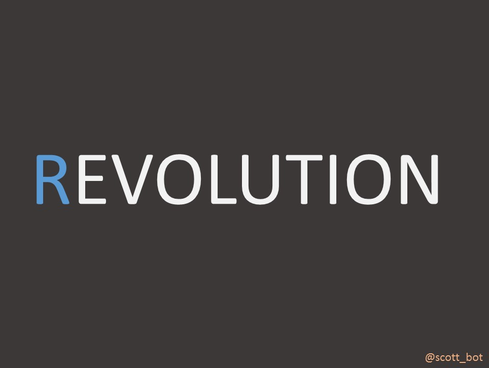

*Slide (r)evolution*

<!-- page 5 -->

To say “we’re at a unique historical moment” is something common to pretty much everyone, everywhere, forever. And it’s always *a little bit* true, right?

It’s true that every historical moment is unique. Unprecedented. Digital History, with its unique combination of public humanities, media-rich interests, sophisticated machinery, and quantitative approaches, is pretty novel.

But as the saying goes, history never repeats itself, but it rhymes. Each thread making up Digital History has a long past, and a lot of the arguments for or against it have been made many times before. Novelty is a convenient illusion that helps us get funding.

Not coincidentally, it’s this tension I’ll highlight today: between revolution and evolution, between breaks and continuities, and between the historians who care more about what makes a moment unique, and those who care more about what connects humanity together.

To be clear, I’m operating on two levels here: the narrative and the metanarrative. The narrative is that the history of digital history is one of continuities and fractures; the metanarrative is that this very tension between uniqueness and self-similarity is what swings the pendulum between quantitative and qualitative historians.

<!-- page 6 -->

Now, my claim that debates over continuity and discontinuity are a primary driver of the quantitative/qualitative divide comes a bit out of left field — I know — so let me back up a few hundred years and explain.

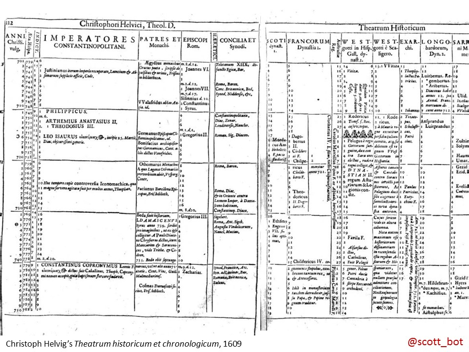

*Chronology*

Francis Bacon wrote that knowledge would be better understood if it were collected into orderly tables. His plea extended, of course, to historical knowledge, and inspired renewed interest in a genre already over a thousand years old: tabular chronology.

These chronologies were world histories, aligning the pasts of several regions which each reconned the passage of time differently.

<!-- page 7 -->

Isaac Newton inherited this tradition, and dabbled throughout his life in establishing a more accurate universal chronology, aligning Biblical history with Greek legends and Egyptian pharoahs.

Newton brought to history the same mind he brought to everything else: one of stars and calculations. Like his peers, Newton relied on historical accounts of astronomical observations to align simultaneous events across thousands of miles. Kepler and Scaliger, among others, also partook in this “scientific history”.

Where Newton departed from his contemporaries, however, was in his use of statistics for sorting out history. In the late 1500s, the *average* or *arithmetic mean* was popularized by astronomers as a way of smoothing out noisy measurements. Newton co-opted this method to help him estimate the length of royal reigns, and thus the ages of various dynasties and kingdoms.

On average, Newton figured, a king’s reign lasted 18-20 years. If the history books record 5 kings, that means the dynasty lasted between 90 and 100 years.

Newton was among the first to apply *averages* to fill in chronologies, though not the first to apply them to human activities. By the late 1600s, demographic statistics of contemporary life — of births, burials and the like — were becoming common. They were ways of revealing *divinely ordered* regularities.

<!-- page 8 -->

Incidentally, this is an early example of our illustrious tradition of uncritically appropriating methods from the natural sciences. See? We’ve all done it, even Newton!

Joking aside, this is an important point: statistical averages represented divine regularities. Human statistics began as a means to uncover universal truths, and they continue to be employed in that manner. More on that later, though.

*Musgrave Quote*

<!-- page 9 -->

Newton’s method didn’t quite pass muster, and skepticism grew rapidly on the whole prospect of mathematical history.

Criticizing Newton in 1782, for example, Samuel Musgrave argued, in part, that there are no discernible universal laws of history operating in parallel to the universal laws of nature. Nature can be mathematized; people cannot.

Not everyone agreed. Francesco Algarotti passionately argued that Newton’s calculation of average reigns, the application of math to history, was one of his greatest achievements. Even Voltaire tried Newton’s method, aligning a Chinese chronology with Western dates using average length of reigns.

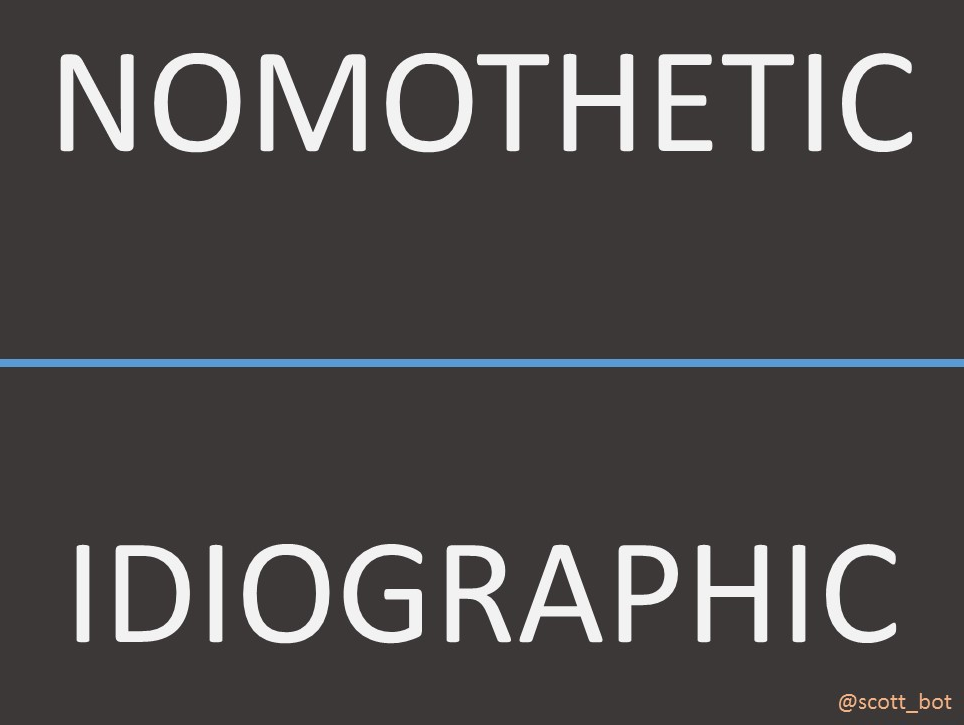

*Nomothetic / Idiographic*

<!-- page 10 -->

Which brings us to the earlier continuity/discontinuity point: quantitative history stirs debate in part because it draws together two activities Immanuel Kant sets in opposition: the tendency to generalize, and the tendency to specify.

The tendency to generalize, later dubbed *Nomothetic*, often describes the sciences: extrapolating general laws from individual observations. Examples include the laws of gravity, the theory of evolution by natural selection, and so forth.

The tendency to specify, later dubbed *Idiographic*, describes, mostly, the humanities: understanding specific, contingent events in their own context and with awareness of subjective experiences. This could manifest as a microhistory of one parish in the French Revolution, a critical reading of *Frankenstein* focused on gender dynamics, and so forth.

These two approaches aren’t mutually exclusive, and they frequently come in contact around scholarship of the past. Paleontologists, for example, apply general laws of biology and geology to tell the *specific* story of prehistoric life on Earth. Astronomers, similarly, combine natural laws and specific observations to trace to origins of our universe.

Historians have, with cyclically recurring intensity, engaged in similar efforts. One recent nomothetic example is that of cliodynamics: the practitioners use data and simulations to discern generalities such as why nations fail or what causes war. Recent idiographic historians associate more with the cultural and theoretical turns in historiography, often focusing on microhistories or the subjective experiences of historical actors.

<!-- page 11 -->

Both tend to meet around quantitative history, but the conversation began well before the urge to quantify. They often fruitfully align and improve one another when working in concert; for example when the historian cites a common historical pattern in order to highlight and contextualize an event which deviates from it.

But more often, nomothetic and idiographic historians find themselves at odds. Newton extrapolated “laws” for the length of kings, and was criticized for thinking mathematics had any place in the domain of the uniquely human. Newton’s contemporaries used human statistics to argue for divine regularities, and this was eventually criticized as encroaching on human agency, free will, and the uniqueness of subjective experience.

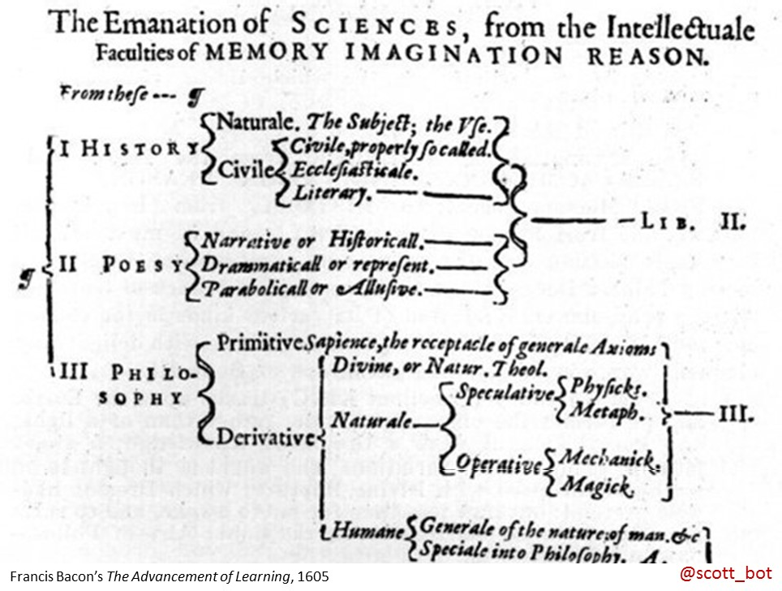

*Bacon Taxonomy*

<!-- page 12 -->

I’ll highlight some moments in this debate, focusing on English-speaking historians, and will conclude with what we today might learn from foibles of the quantitative historians who came before.

Let me reiterate, though, that quantitative is not nomothetic history, but they invite each other, so I shouldn’t be ahistorical by dividing them.

Take Henry Buckle, who in 1857 tried to bridge the two-culture divide posed by C.P. Snow a century later. He wanted to use statistics to find general laws of human progress, and apply those generalizations to the histories of specific nations.

Buckle was well-aware of historiography’s place between nomothetic and idiographic cultures, writing: “it is the business of the historian to mediate between these two parties, and reconcile their hostile pretensions by showing the point at which their respective studies ought to coalesce.”

In direct response, James Froud wrote that there can be no science of history. The whole idea of Science and History being related was nonsensical, like talking about the colour of sound. They simply do not connect.

<!-- page 13 -->

This was a small exchange in a much larger Victorian debate pitting narrative history against a growing interest in scientific history. The latter rose on the coattails of growing popular interest in science, much like our debates today align with broader discussions around data science, computation, and the visible economic successes of startup culture.

This is, by the way, contemporaneous with something yesterday’s keynote highlighted: the 19th century drive to establish ‘urban laws’.

By now, we begin seeing historians leveraging public trust in scientific methods as a means for political control and pushing agendas. This happens in concert with the rise of punched cards and, eventually, computational history. Perhaps the best example of this historical moment comes from the American Census in the late 19th century.

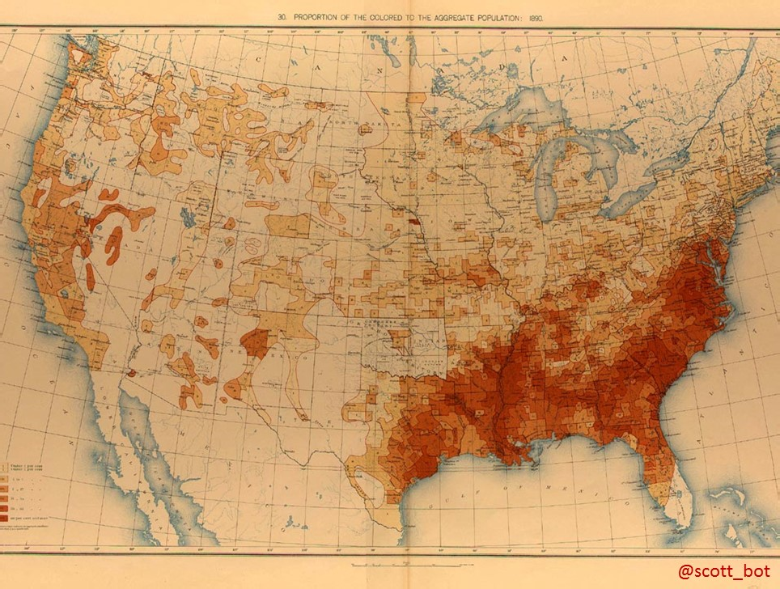

*19C Map*

<!-- page 14 -->

Briefly, a group of 19th century American historians, journalists, and census chiefs used statistics, historical atlases, and the machinery of the census bureau to publicly argue for the disintegration of the U.S. Western Frontier in the late 19th century.

These moves were, in part, made to consolidate power in the American West and wrestle control from the native populations who still lived there. They accomplished this, in part, by publishing popular atlases showing that the western frontier was so fractured that it was difficult to maintain and defend.[^1]

The argument, it turns out, was pretty compelling.

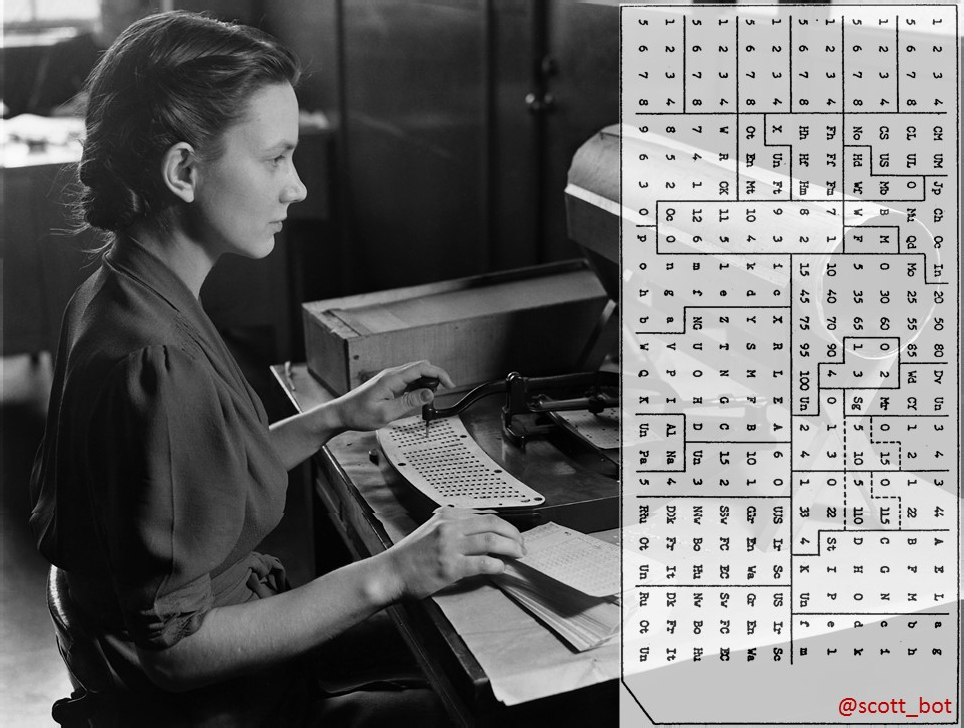

*Hollerith Cards*

<!-- page 15 -->

Part of what drove the statistical power and scientific legitimacy of these arguments was the new method, in 1890, of entering census data on punched cards and processing them in tabulating machines. The mechanism itself was wildly successful, and the inventor’s company wound up merging with a few others to become IBM. As was true of punched-card humanities projects through the time of Father Roberto Busa, this work was largely driven by women.

It’s worth pausing to remember that the history of punch card computing is also a history of the consolidation of government power. Seeing like a computer was, for decades, seeing like a state. And how we see influences what we see, what we care about, how we think.

Recall the Ed Ayers quote I mentioned at the beginning of his talk. He said the statistical machinery of early quantitative historians could not represent the nuance of historical experience. That doesn’t *just* mean the math they used; it means the actual machinery involved.

See, one of the truly groundbreaking punch card technologies at the turn of the century was the card sorter. Each card could represent a person, or household, or whatever else, which is sort of legible one-at-a-time, but unmanageable in giant stacks.

<!-- page 16 -->

Now, this is still well before “computers”, but machines were being developed which could sort these cards into one of twelve pockets based on which holes were punched. So, for example, if you had cards punched for people’s age, you could sort the stacks into 10 different pockets to break them up by age groups: 0-9, 10-19, 20-29, and so forth.

This turned out to be amazing for eyeball estimates. If your 20-29 pocket was twice as full as your 10-19 pocket after all the cards were sorted, you had a pretty good idea of the age distribution.

Over the next 50 years, this convenience would shape the social sciences. Consider demographics or marketing. Both developed in the shadow of punch cards, and both relied heavily on what’s called “segmentation”, the breaking of society into discrete categories based on easily punched attributes. Age ranges, racial background, etc. These would be used to, among other things, determine who was interested in what products.

They’d eventually use statistics on these segments to inform marketing strategies.

But, if you look at the statistical tests that already existed at the time, these segmentations weren’t always the best way to break up the data. For example, age flows smoothly between 0 and 100; you could easily contrive a statistical test to show that, as a person ages, she’s more likely to buy one product over another, over a set of smooth functions.

<!-- page 17 -->

That’s not how it worked though. Age was, and often still is, chunked up into ten or so distinct ranges, and those segments were each analyzed individually, as though they were as distinct from one another as dogs and cats. That is, 0-9 is as related to 10-19 as it is to 80-89.

What we see here is the deep influence of technological affordances on scholarly practice, and it’s an issue we still face today, though in different form.

As historians began using punch cards and social statistics, they inherited, or appropriated, a structure developed for bureaucratic government processing, and were rightly soon criticized for its dehumanizing qualities.

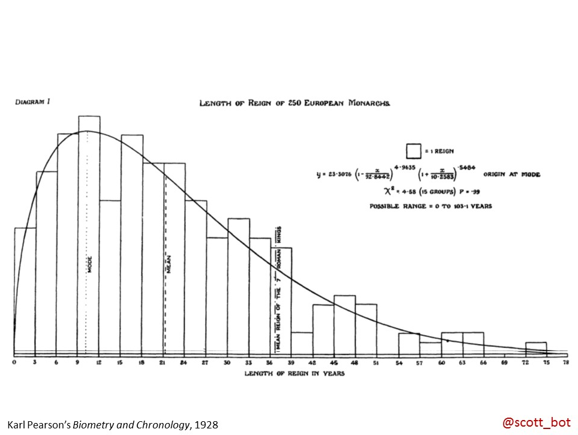

*Pearson Stats*

<!-- page 18 -->

Unsurprisingly, given this backdrop, historians in the first few decades of the 20th century often shied away from or rejected quantification.

The next wave of quantitative historians, who reached their height in the 1930s, approached the problem with more subtlety than the previous generations in the 1890s and 1860s.

Charles Beard’s famous *Economic Interpretation of the Constitution of the United States* used economic and demographic stats to argue that the US Constitution was economically motivated. Beard, however, did grasp the fundamental idiographic critique of quantitative history, claiming that history was, quote:

“beyond the reach of mathematics — which cannot assign meaningful values to the imponderables, immeasurables, and contingencies of history.”

The other frequent critique of quantitative history, still heard, is that it uncritically appropriates methods from stats and the sciences.

This also wasn’t entirely true. The slide behind me shows famed statistician Karl Pearson’s attempt to replicate the math of Isaac Newton that we saw earlier using more sophisticated techniques.

<!-- page 19 -->

By the 1940s, Americans with graduate training in statistics like Ernest Rubin were actively engaging historians in their own journals, discussing how to carefully apply statistics to historical research.

On the other side of the channel, the French *Annales* historians were advocating *longue durée* history; a move away from biographies to prosopographies, from events to structures. In its own way, this was another historiography teetering on the edge between the nomothetic and idiographic, an approach that sought to uncover the rhymes of history.

Interest in quantitative approaches surged again in the late 1950s, led by a new wave of *Annales* historians like Fernand Braudel and American quantitative manifestos like those by Benson, Conrad, and Meyer.

William Aydolette went so far as to point out that *all* historians implicitly quantify, when they use words like “many”, “average”, “representative”, or “growing” – and the question wasn’t *can* there be quantitative history, but *when* should formal quantitative methods be utilized?

By 1968, George Murphy, seeing the swell of interest, asked a very familiar question: **why now**? He asked why the 1960s were different from the 1860s or 1930s, why were they, in that historical moment, able to finally do it right? His answer was that it wasn’t just the new technologies, the huge datasets, the innovative methods: it was the *zeitgeist*. The 1960s was the right era for computational history, because it was the era of computation.

<!-- page 20 -->

By the early 70s, there was a historian using a computer in every major history department. Quantitative history had finally grown into itself.

*Popper Historicism*

Of course, in retrospect, Murphy was wrong. Once the pendulum swung too far towards scientific history, theoretical objections began pushing it the other way.

<!-- page 21 -->

In *Poverty of Historicism*, Popper rejected scientific history, but mostly as a means to reject historicism outright. Popper’s arguments represent an attack from outside the historiographic tradition, but one that eventually had significant purchase even among historians, as an indication of the failure of nomothetic approaches to culture. It is, to an extent, a return to Musgrave’s critique of Isaac Newton.

At the same time, we see growing criticism from historians themselves. Arthur Schlesinger famously wrote that “important questions are important precisely because they are *not* susceptible to quantitative answers.”

There was a converging consensus among English-speaking historians, as in the early 20th century, that quantification erased the essence of the humanities, that it smoothed over the very inequalities and historical contingencies we needed to highlight.

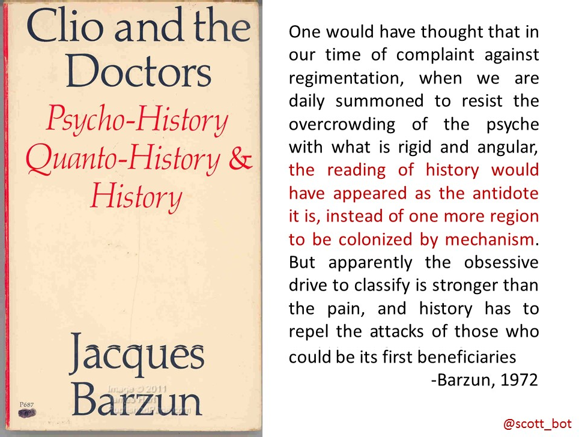

*Barzun’s Clio*

<!-- page 22 -->

Jacques Barzun summed it up well, if scathingly, saying history ought to free us from the bonds of the machine, not feed us into it.

The skeptics prevailed, and the pendulum swung the other way. The post-structural, cultural, and literary-critical turns in historiography pivoted away from quantification and computation. The final nail was probably Fogel and Engerman’s 1974 *Time on the Cross*, which reduced the Atlantic  slave-trade to economic figures, and didn’t exactly treat the subject with nuance and care.

The cliometricians, demographers, and quantitative historians didn’t disappear after the cultural turn, but their numbers shrunk, and they tended to find themselves in social science departments, or fled here to Europe, where social and economic historians were faring better.

Which brings us, 40 years on, to the middle of a new wave of quantitative or “formal method” history. Ed Ayers, like George Murphy before him, wrote, essentially, *this time it’s different*.

And he’s right, to a point. Many here today draw their roots not to the cliometricians, but to the very cultural historians who rejected quantification in the first place. Ours is a digital history steeped in the the values of the cultural turn, that respects social justice and seeks to use our approaches to shine a light on the underrepresented and the historically contingent.

<!-- page 23 -->

But that doesn’t stop a new wave of critiques that, if not repeating old arguments, certainly rhymes. Take Johanna Drucker’s recent call to rebrand *data* as *capta*, because when we treat observations objectively as if it were the same as the phenomena observed, we collapse the critical distance between the world and our interpretation of it. And interpretation, Drucker contends, is the foundation on which humanistic knowledge is based.

Which is all to say, every swing of the pendulum between idiographic and nomothetic history was situated in its own historical moment. It’s not a clock’s pendulum, but Foucault’s pendulum, with each swing’s apex ending up slightly off from the last. The issues of chronology and astronomy are different from those of eugenics and manifest destiny, which are themselves different from the capitalist and dehumanizing tendencies of 1950s mainframes.

But they all rhyme. Quantitative history has failed many times, for many reasons, but there are a few threads that bind them which we can learn from — or, at least, a few recurring mistakes we can recognize in ourselves and try to avoid going forward.

We won’t, I suspect, stop the pendulum’s inevitable about-face, but at least we can continue our work with caution, respect, and care.

<!-- page 24 -->

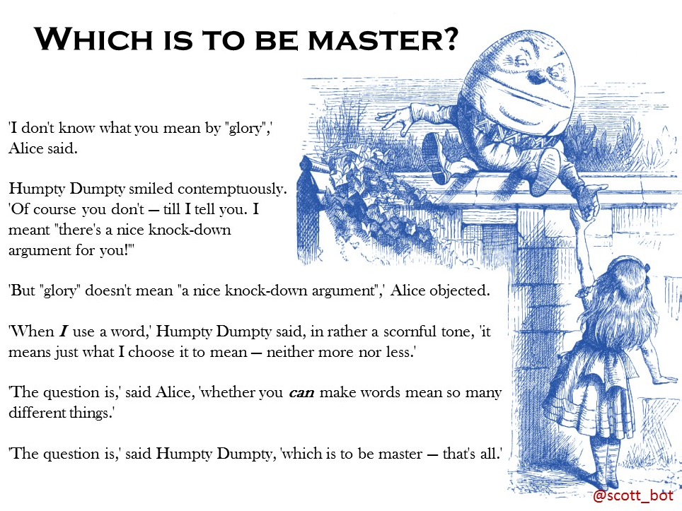

*Which is to be Master?*

The lesson I’d like to highlight may be summed up in one question, asked by Humpty Dumpty to Alice: which is to be master?

Over several hundred years of quantitative history, the advice of proponents and critics alike tends to align with this question. Indeed in 1956, R.G. Collingwood wrote specifically “statistical research is for the historian a good servant but a bad master,” referring to the fact that statistical historical patterns mean nothing without historical context.

<!-- page 25 -->

Schlesinger, the guy who I mentioned earlier who said historical questions are interesting precisely *because* they can’t be quantified, later acknowledged that while quantitative methods can be useful, they’ll lead historians astray. Instead of tackling good questions, he said, historians will tackle easily quantifiable ones — and Schlesinger was uncomfortable by the tail wagging the dog.

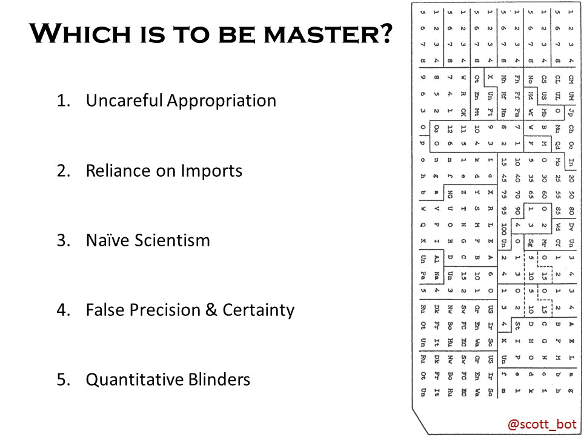

*Which is to be master – questions*

I’ve found many ways in which historians have accidentally given over agency to their methods and machines over the years, but these five, I think, are the most relevant to our current moment.

<!-- page 26 -->

Unfortunately since we running out of time, you’ll just have to trust me that these are historically recurring.

Number 1 is the uncareful appropriation of statistical methods for historical uses. It controls us precisely because it offers us a black box whose output we don’t truly understand.

A common example I see these days is in network visualizations. People visualize nodes and edges using what are called *force-directed layouts* in Gephi, but they don’t exactly understand what those layouts mean. As these layouts were designed, physical proximity of nodes *are not meant to represent relatedness*, yet I’ve seen historians interpret two neighboring nodes as being related *because of their visual adjacency*.

This is bad. It’s false. But because we don’t quite understand what’s happening, we get lured by the black box into nonsensical interpretations.

The second way methods drive *us* is in our reliance on methodological imports. That is, we take the time to open the black box, but we only use methods that we learn from statisticians or scientists. Even when we fully understand the methods we import, if we’re bound to other people’s analytic machinery, we’re bound to their questions and biases.

Take the example I mentioned earlier, with demographic segmentation, punch card sorters, and its influence on social scientific statistics. The very mechanical affordances of early computers influence the sort of questions people asked for decades: how do discrete groups of people react to the world in different ways, and how do they compare with one another?

<!-- page 27 -->

The next thing to watch out for is naive scientism. Even if you know the assumptions of your methods, and you develop your own techniques for the problem at hand, you still can fall into the positivist trap that Johanna Drucker warns us about — collapsing the distance between what we observe and some underlying “truth”.

This is especially difficult when we’re dealing with “big data”. Once you’re working with so much material you couldn’t hope to read it all, it’s easy to be lured into forgetting the distance between operationalizations and what you actually intend to measure.

For instance, if I’m finding friendships in Early Modern Europe by looking for particular words being written in correspondences, I will completely miss the existence of friends who were neighbors, and thus had no reason to write letters for us to eventually read.

A fourth way we can be mislead by quantitative methods is the ease with which they lend an air of false precision or false certainty.

This is the problem Matthew Lincoln and the other panelists brought up yesterday, where missing or uncertain data, once quantified, falsely appears precise enough to make comparisons.

<!-- page 28 -->

I see this mistake crop up in early and recent quantitative histories alike; we measure, say, the changing rate of transnational shipments over time, and notice a positive trend. The problem is the positive difference is quite small, easily attributable to error, but because numbers are always precise, it still *feels* like we’re being more precise than doing a qualitative assessment. Even when it’s unwarranted.

The last thing to watch out for, and maybe the most worrisome, is the blinders quantitative analysis places on historians who don’t engage in other historiographic methods. This has been the downfall of many waves of quantitative history in the past; the inability to care about or even see that which can’t be counted.

This was, in part, was what led *Time on the Cross* to become the excuse to drive historians from cliometrics. The indicators of slavery *that were measurable* were sufficient to show it to have some semblance of economic success for black populations; but it was precisely those aspects of slavery they could not measure that were the most historically important.

So how do we regain mastery in light of these obstacles?

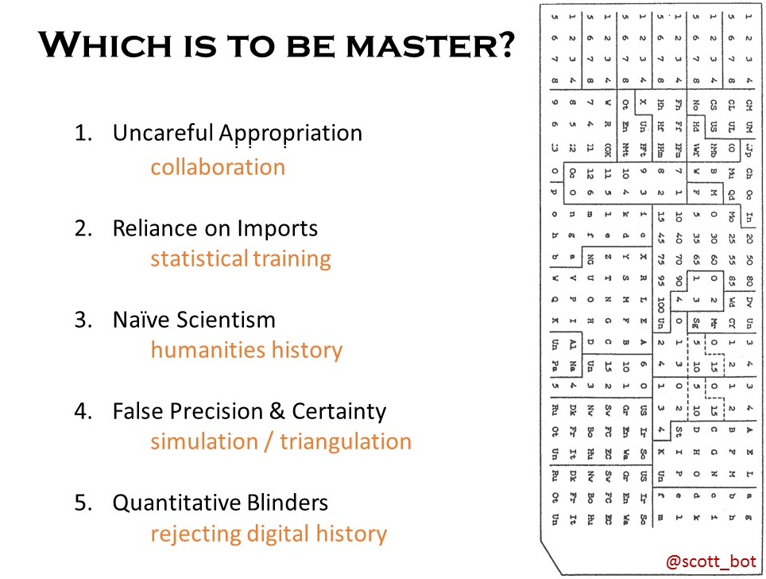

*Which is to be master – answers*

<!-- page 29 -->

**1. Uncareful Appropriation – Collaboration**

Regarding the uncareful appropriation of methods, we can easily sidestep the issue of accidentally misusing a method *by collaborating with someone who knows how the method works*. This may require a translator; statisticians can as easily misunderstand historical problems as historians can misunderstand statistics.

Historians and statisticians can fruitfully collaborate, though, if they have someone in the middle trained to some extent in both — even if they’re not themselves experts. For what it’s worth, Dutch institutions seem to be ahead of the game in this respect, which is something that should be fostered.

**2. Reliance on Imports – Statistical Training**

<!-- page 30 -->

Getting away from reliance on disciplinary imports may take some more work, because we ourselves must learn the approaches well enough to augment them, or create our own. Right now in DH this is often handled by summer institutes and workshop series, but I’d argue those are not sufficient here. We need to make room in our curricula for actual methods courses, or even degrees focused on methodology, in the same fashion as social scientists, if we want to start a robust practice of developing appropriate tools for our own research.

**3. Naive Scientism – Humanities History**

The spectre of naive scientism, I think, is one we need to be careful of, but we are also already well-equipped to deal with it. If we want to combat the uncareful use of proxies in digital history, we need only to teach the history of the humanities; why the cultural turn happened, what’s gone wrong with positivistic approaches to history in the past, etc.

Incidentally, I think this is something digital historians already guard well against, but it’s still worth keeping in mind and making sure we teach it. Particularly, digital historians need to remain aware of parallel approaches from the past, rather than tracing their background only to the textual work of people like Roberto Busa in Italy.

**4. False Precision & Certainty – Simulation & Triangulation**

<!-- page 31 -->

False precision and false certainty have some shallow fixes, and some deep ones. In the short term, we need to be better about understanding things like confidence intervals and error bars, and use methods like what Matthew Lincoln highlighted yesterday.

In the long term, though, digital history would do well to adopt triangulation strategies to help mitigate against these issues. That means trying to reach the same conclusion using multiple different methods in parallel, and seeing if they all agree. If they do, you can be more certain your results are something you can trust, and not just an accident of the method you happened to use.

**5. Quantitative Blinders – Rejecting Digital History**

Avoiding quantitative blinders – that is, the tendency to only care about what’s easily countable – is an easy fix, but I’m afraid to say it, because it might put me out of a job. We can’t call what we do digital history, or quantitative history, or cliometrics, or whatever else. We are, simply, historians.

Some of us use more quantitative methods, and some don’t, but if we’re not ultimately contributing to the same body of work, both sides will do themselves a disservice by not bringing every approach to bear in the wide range of interests historians ought to pursue.

Qualitative and idiographic historians will be stuck unable to deal with the deluge of material that can paint us a broader picture of history, and quantitative or nomothetic historians will lose sight of the very human irregularities that make history worth studying in the first place. We must work together.

<!-- page 32 -->

If we don’t come together, we’re destined to remain punched-card humanists – that is, we will always be constrained and led by our methods, not by history.

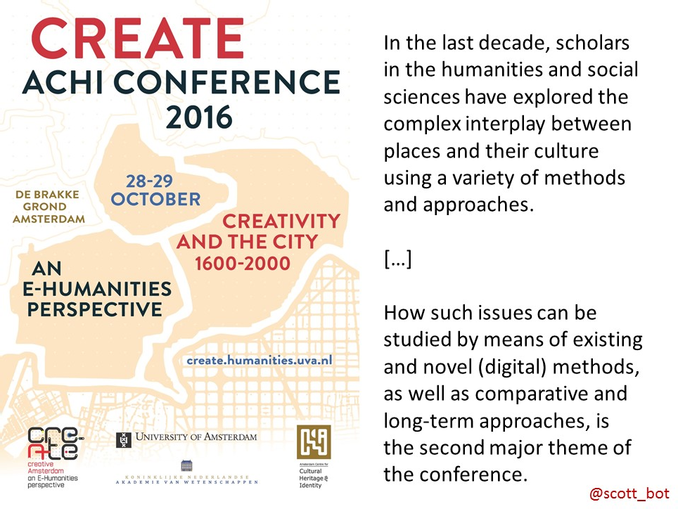

*Creativity Theme Again*

Of course, this divide is a false one. There are no purely quantitative or purely qualitative studies; close-reading historians will continue to say things like “representative” or “increasing”, and digital historians won’t start publishing graphs with no interpretation.

<!-- page 33 -->

Still, silos exist, and some of us have trouble leaving the comfort of our digital humanities conferences or our “traditional” history conferences.

That’s why this conference, I think, is so refreshing. It offers a great mix of both worlds, and I’m privileged and thankful to have been able to attend. While there are a lot of lessons we can still learn from those before us, from my vantage point, I think we’re on the right track, and I look forward to seeing more of those fruitful combinations over the course of today.

Thank you.

Notes:

[^1]: This account is influenced from some talks by Ben Schmidt. Any mistakes are from my own faulty memory, and not from his careful arguments.
