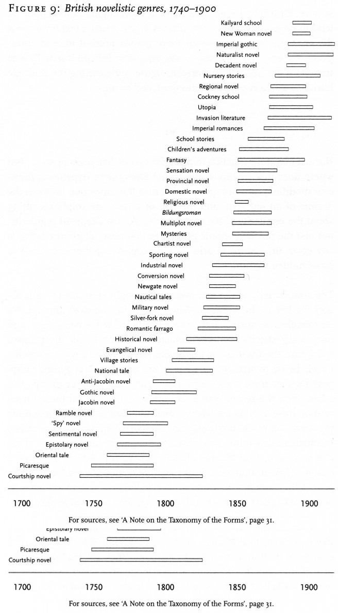
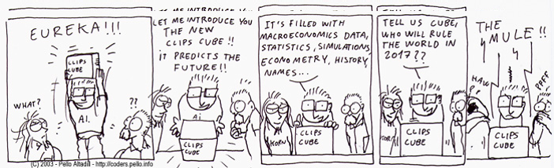

I just got Matthew L. Jocker’s *Macroanalysis* in the mail, and I’m excited enough about it to liveblog my review. Here’s my review of part I (Foundation), all chapters. Read [Part 2](/blog/liveblogged-review-of-macroanalysis-by-matthew-l-jockers-part-2/), Part 3, …

*Macroanalysis: Digital Methods & Literary History* is a book whose time has come. “Individual creativity,” Matthew L. Jockers writes, “is highly constrained, even determined, by factors outside of what we consider to be a writer’s conscious control.” Although Jockers’ book is a work of impressive creativity, it also fits squarely within a larger set of trends. The scents of ‘Digital Humanities’ (DH) and ‘Big Data’ are in the air, the funding-rich smells attracting predators from all corners, and Jockers’ book floats somewhere in the center of it all. As with many DH projects, *Macroanalysis* attempts the double goal of explaining a new method and exemplifying the type of insights that can be achieved via this method. Unlike many projects, Jockers succeeds masterfully at both. *Macroanalysis* introduces its readers to large scale quantitative methods for studying literary history, and through those methods explores the nature of creativity and influence in general and the place of Irish literature within its larger context in particular.

I’ve apparently gained a bit of a reputation for being overly critical, and it’s worth pointing out at the beginning of this review that this trend will continue for *Macroanalysis*. That said, I am most critical of the things I love the most, and readers who focus on any nits I might pick without reading the book themselves should keep in mind that the overall work is staggering in its quality, and if it does fall short in some small areas, it is offset by the many areas it pushes impressively forward.

<!-- page 2 -->

*Macroanalysis* arrives on bookshelves eight years after Franco Moretti’s *Graphs, Maps, and Trees* (2005), and thirteen years after Moretti’s “Conjectures on World Literature” went to press in early 2000, where he coined the phrase “distant reading.” Moretti’s distant reading is a way of seeing literature en masse, of looking at text at the widest angle and reporting what structures and forms only become visible at this scale. Moretti’s early work paved the way, but as might be expected with monograph published the same year as the initial release of Google Books, lack of available data made it stronger in theory than in computational power.

<!-- page 3 -->

From Moretti’s Graphs, Maps, and Trees

In 2010, Moretti and Jockers, the author of *Macroanalysis*, co-founded the [Stanford Lit Lab](http://litlab.stanford.edu/) for the quantitative and digital research of literature. The two have collaborated extensively,  and Jockers acknowledge’s Moretti’s influence on his monograph. That said, in his book, Jockers distances himself slightly from Moretti’s notion of distant reading, and it is [not the first time he has done so](http://www.matthewjockers.net/2011/07/01/on-distant-reading-and-macroanalysis/#footnote). His choice of “analysis” over “reading” is an attempt to show that what his algorithms are doing at this large scale is very different from our normal interpretive process of reading; it is simply gathering and aggregating data, the output of which can eventually be read and interpreted instead of or in addition to the texts themselves. The term macroanalysis was inspired by the difference between macro- and microeconomics, and Jockers does a good job justifying the comparison. Given that Jockers came up with the comparison in 2005, one does wonder if he would have decided on different terminology after our recent financial meltdown and the ensuing large-scale distrust of macroeconomic methods. The quantitative study of history, cliometrics, also had its origins in economics and suffered its own fall from grace decades ago; quantitative history still hasn’t recovered.

## Part I: Foundation

I don’t know whether the allusion was intended, but lovers of science fiction and quantitative cultural studies will enjoy the title of Part I: “Foundation.” It shares a name with a series of books by Isaac Asimov, centering around [the ability to combine statistics and human-centric research to understand and predict people’s behaviors](http://en.wikipedia.org/wiki/Psychohistory_(fictional)). Punny titles aside, the section provides the structural base of the monograph.

<!-- page 4 -->

The story of Foundation in a nutshell. Via [c0ders](http://www.pello.info/coders/).

Much of the introductory chapters are provocative statements about the newness of the study at hand, and they are not unwarranted. Still, I can imagine that the regular detractors of technological optimism might argue their usual arguments in response to Jockers’ pronouncements of a ‘revolution.’ The second chapter, on Evidence, raises some particularly important (and timely) points that are sure to raise some hackles. “Close reading is not only impractical as a means of evidence gathering in the digital library, but big data render it totally inappropriate as a method of studying literary history.” Jockers hammers home this point again and again, that now that anecdotal evidence based on ‘representative’ texts is no longer the best means of understanding literature, there’s no reason it should still be considered the gold standard of evidentiary support.

Not coming from a background of literary history or criticism, I do wonder a bit about these notions of representativeness (a point also often brought up by [Ted Underwood](http://tedunderwood.com/2013/04/01/distant-reading-and-representativeness/), [Ben Schmidt](http://sappingattention.blogspot.com/2013/03/patchwork-libraries.html), and Jockers himself). This is probably something lit-researchers worked out in the 70s, but it strikes me that the questions being asked of a few ‘exemplary, representative texts’ are very different than the ones that ought to be asked of whole corpora of texts. Further, ‘representative’ of what? As this book appears to be aimed not only at traditional literary scholars, it would have been beneficial for Jockers to untangle these myriad difficulties.

One point worth noting is that, although Jockers calls his book *Macroanalysis*, his approach calls for a mixed method, the combination of the macro/micro, distant/close. The book is very careful and precise in its claims that macroanalysis augments and opens new questions, rather than replaces. It is a combination of both approaches, one informing the other, that leads to new insights. “Today’s student of literature must be adept at reading and gathering evidence from individual texts and equally adept at accessing and mining digital-text repositories.” The balance struck here is impressive: to ignore macroanalysis as a superior source of evidence for many types of large questions would be criminal, but its adoption alone does not make for good research (further, either without the other would be poorly done). For example, macroanalysis can augment close reading approaches by contextualizing a text within its broad historical and cultural moment, showing a researcher precisely where their object of research fits in the larger picture.

<!-- page 5 -->

Historians would do well to heed this advice, though they are not the target audience. Indeed, historians play a perplexing role in Jockers’ narrative; not because his description is untrue, but because it *ought* not be true. In describing the digital humanities, Jockers calls it an “ambiguous and amorphous amalgamation of literary formalists, new media theorists, tool builders, coders, and linguists.” What place historians? Jockers places their role earlier, tracing the wide-angle view to the *Annales* historians and their focus on *longue durée* history. If historian’s influence ends there, we are surely in a sad state; that light, along with those of cliometrics and quantitative history, shone brightest in the 1970s before a rapid decline. Unsworth recently attributed the decline to the fallout following *Time on the cross* (Fogel & Engerman, 1974), putting quantitative methods in history “[out of business for decades](https://twitter.com/travisbrown/status/322345080910397440).” The ghost of cliometrics still haunts historians to such an extent that the best research in that area, *to this day*, comes more from information scientists and applied mathematicians than from historians. Digital humanities may yet exorcise that ghost, but it has not happened yet, as evidenced in part by the glaring void in Jockers’ introductory remarks.

It is with this framing in mind that Jockers embarks on his largely computational and empirical study of influence and landscape in British and American literature.

<!-- page 6 -->
