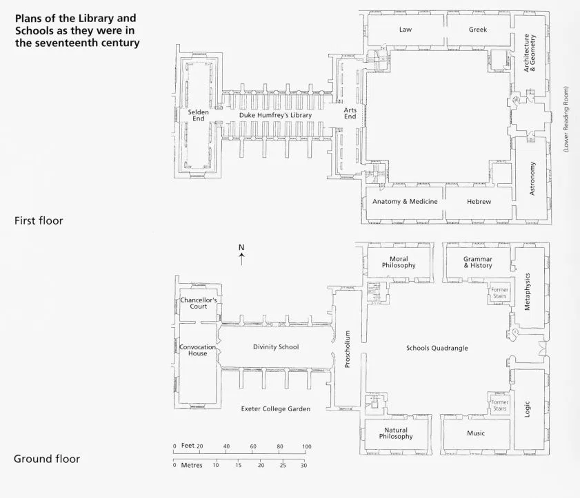
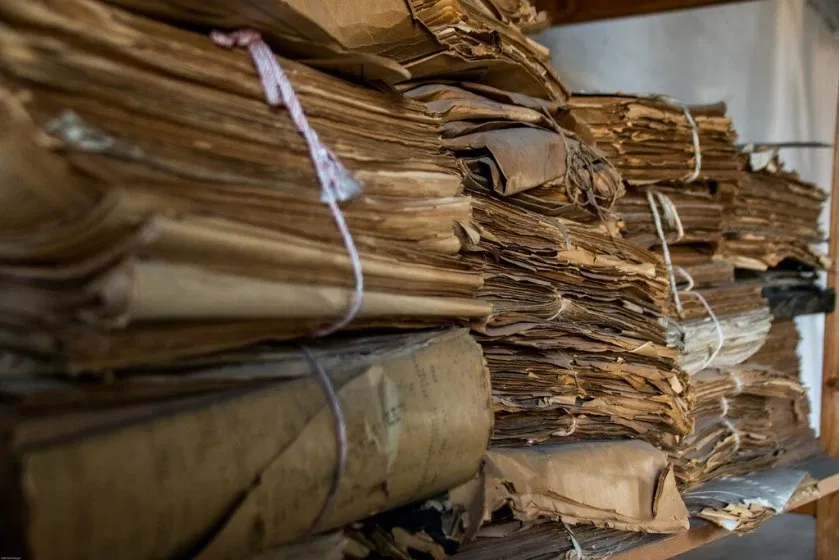

### Caveats

I love books, and libraries. In graduate school, most of my friends were studying to be librarians. A university library now partially pays my salary. Still, I don’t know much about them, being first and foremost a historian who uses computers. A lot of smart people have written a lot of smart things about libraries that I wish I’ve read, or even know about, but I’m still working on that one.

This is all to preface a blog post about a past and future of libraries, from my perspective, that has undoubtedly been articulated better elsewhere. Please read this post as it is intended: as a first public articulation of my thoughts that I hope my friends will read, so they can perhaps guide me to the interesting stuff already written on the subject, or explain to me why this is wrong-minded. This is *not* an expert opinion, and on that account I urge anyone taking it seriously as such to, erm, stop.

### Context

We are closer in time to Jesus Christ than he was to the first documents written on paper-like materials. Our species has, collectively, had a lot of time to figure them <!-- page 2 --> out. After four thousand years, papery materials and the apparatuses around them have co-evolved into something akin to a natural ecosystem. Ink, page, index, spine, shelf, catalog, library building all fit together for the health of the collective.

This efficient system is the most consequential prosthesis for memory and discovery that humankind ever created. After paper and its cousins (papyrus, vellum, etc.) became external vessels for knowledge, their influence on religion, law, and science—on control and freedom—cannot be overestimated.

The system’s success has as much to do with the materials themselves as the socio-technical-architectural apparatuses around them. They allowed the written word to become portable, reproducible, findable, preservable, and accessible.

Chief among these apparatuses, of course, is the library. *Librarie* (n.): a collection of books. *Liber* (n.): the inner bark of a tree.

A library’s shelves are perfectly sized to fit the standard dimensions of books (and vice-versa). Climate control keeps the words shelf-stable. Neatly ordered rows and catalog systems help us find the right words, and a combination of personnel and inventory technologies allow us to borrow them for as long as we need, and then return them for someone else’s use. Libraries physically centralize books, allowing us access to great swaths of memory without needing to leave a single building. This centralization makes everything more efficient, especially when it comes to expert knowledge in the form of librarians. A few of these professionals can keep the whole system running smoothly, and ensure anyone who walks in the door will find exactly what they need.

<!-- page 3 -->

*Plan of the Bodleian Library, Oxford (from Geoffrey Tyack, Bodleian Library, University of Oxford: A History [Oxford: Oxford University Press, 2000], 28. Bodleian Library, University of Oxford, R. Ref. 357/3).*

It’s no accident the beating heart of the university has always been its library. It has, traditionally, been one of the largest draws of an institution: join our faculty, and you’ll have easy access to all the knowledge that’s ever been written down. Through libraries, scholars found their gateway to entire academic world, and could join a conversation that spanned geography and time. It’s not *everything* a researcher needs, for sure—chemists need glassblowers and fume hoods and reagents—but without it, a university traditionally cannot function.

This is changing, because our reliance on paper is changing. Money, science, and news are going digital. We’re not getting rid of paper—people still read books, use toilet paper, and ship things in boxes—but its direct role in knowledge production and circulation has shrunk dramatically over the last several decades. Everything from lab notes to journals are moving online, a trend as true in the humanities as <!-- page 4 --> it is in the sciences. Humanists still use printed books en masse, but increasingly the physical page is the object of study more than the means of conversation, indicating a subtle but important shift in how the library is being used.

### Crisis

Our shifting relationship to paper has led to a crisis in the university library, an institution that evolved over thousands of years around the written word. As researchers increasingly turn to Google for pretty much everything, books are dropping in circulation, and the stacks are emptying out of people. Libraries, once the beating heart of the university, are scrambling to remain so.

As I see it, the university library has two options:

1. Become something else to retain its centrality, or
2. Continue doing the papery tasks it evolved to do very well, as that task’s relevance slowly diminishes (but will, I hope and suspect, never disappear).

My lay impression, as an outsider until recently, is that most well-respected libraries are trying to do both, while institutional pressures are pushing to favor option #1. This pressure, in part, is because universities’ successes were tied to the success of libraries, so universities need libraries to evolve if they hope the institutions to maintain the same relationship.

And option #1 is doing pretty well, it seems. The same architectural features that allowed us to centralize books (namely big, climate-controlled buildings) are also good for other things: meeting rooms, cafes, makerspaces, and the like. Libraries that clear out books for this get a lot of new feet through their doors, though the institutions are perhaps straying a bit from why they were so important in the first place.

<!-- page 5 -->

*James B. Hunt Jr. Library,* [*https://commons.wikimedia.org/wiki/File:Hunt_Library_Commons_Area.JPG*](https://commons.wikimedia.org/wiki/File:Hunt_Library_Commons_Area.JPG)

Libraries are also making changes that hew spiritually closer to the papery tasks of yore, by becoming virtual information hubs. Through online catalogs/search, VPN-enabled digital subscriptions, data repositories, and the like, libraries are offering the same *sorts* of services they used to, connecting researchers to the larger scholarly world, without the need of a physical building. With the exception of negotiated subscriptions to digital journals, these efforts appear slightly less successful.[^1] In large part this is because libraries are often playing catch-up to tech giants with massive budgets.

To bridge the gap between the physical and the digital, libraries wind up paying large subscription fees to tech vendors which provide them search interfaces, hosting services, and other digital information solutions. Libraries do this largely because they were honed for thousands of years around written media, and are ill-equipped to handle most digital tasks themselves.[^2]

Now libraries are paying outside vendors remarkable sums of money every year so they can play the same informational role they’ve always played, as the ground shifts beneath them. And even when this effort succeeds, as it occasionally does, <!-- page 6 --> it’s not clear that this informational role is as centrally valued in the university as it used to be. When new faculty choose where to work, I rarely hear them considering a library’s digital services in their decision, as important as they might be. The one exception is journal subscriptions, and with the Open Access movement and sci-hub, even access to articles seem decreasingly on a researcher’s mind.

### Choice

Don’t get me wrong. I believe we desperately need an apparatus that does for digital information what libraries do for the written word. Whereas we have thousands of years of experience dealing with geographically situated collections of knowledge, with the preservation, organization, and access of written words, we have little such experience with respect to digitally-embedded knowledge. It’s still difficult to find, and nearly impossible to preserve. We don’t have robust systems for allocating or evaluating trust, and the economic and legal apparatuses around digital knowledge are murky, disputed, and often deeply immoral.

Whatever institution evolves to deal with digital knowledge won’t just be the beating heart of the university, it will be an organizing body for the world. Specifically because everything is so interconnected and geographically diffuse, its eventual home will not be a university (unless universities, too, lose their tethers to geography). And because of this reach and the power it implies, such an institution will be incredibly difficult to form, both politically and technologically. It may take another few thousand years to get it right, if we have that long.

But perhaps we can start at home, with universities or university consortia. That’s [how we got the internet to begin with](https://en.wikipedia.org/wiki/ARPANET), after all, though as it grew it privatized away from universities. Today, the web is mostly hosted by big tech companies like Amazon (originally a bookseller, no surprise there), discovered and reached by other big tech companies like Google, and accessed through infrastructure provided by *other* other big tech companies, like AT&T. When libraries plug into <!-- page 7 --> this world, they do so through external tech vendors, which plug directly into for-profit publishing houses like Elsevier. Those publishing houses, too, squeeze universities out of quite a lot of money.

The economies and politics of this system are grossly exploitative. They often undermine privacy, intellectual property, individual agency, and financial independence at every angle. The infrastructure upon which scholars works and across which they communicate are constant points of friction against the ideals of academia.

Publishing science, for example, is ostensibly about making science public, in order to coordinate a global conversation. In an era of inexpensive communication, however, many scientific publishers spend considerable resources *blocking* the availability of scientific publications in order to secure their business’s financial viability. This makes sense for publishers, but doesn’t quite make sense for science.[^3]

Perhaps universities could band together to construct institutions to short circuit this chain, from Amazon to Google to AT&T to Elsevier to Ex Libris. Perhaps we can construct an infrastructure for research that doesn’t barter on privacy, whose mission is the same as the mission of universities themselves. Universities are one of the few types of institutions that can afford to focus on long-term goals rather than short-term needs.[^4] If there were a federated, academic alternative to our quagmire of an information economy, perhaps that would be the university’s “killer app”, the reason scholars decide to spend their time at one university over another, or in academia rather than a corporate research unit. We figured out eduroam and interlibrary loans, maybe we can figure out this too.

Perhaps the answer to “what institution can be the necessary beating heart of centers of knowledge for the next 2,000 years?” is the same as the answer to “how can we organize information in a digital world?”. Or maybe it isn’t.[^5] The second question is important enough that it’s worth a shot regardless, and universities as well as everyone else should be trying to figure it out.

<!-- page 8 -->

But this post is about libraries, with tree pulp ground into their etymology. Libraries are *so very good* at solving paper problems, and if they cease to function in that capacity, we’ll have a lot of paper problems on our hands. Paper isn’t disappearing anytime soon, but institutional pressures to keep libraries as the heart of the university are the same pressures pushing them away from paper. So now, libraries are trying to solve problems they’re not terribly well-equipped to solve, which is why they rely so heavily on vendors, while the problems they *are* good at solving move further away from their core. This worries me.

*via* [*https://www.flickr.com/photos/ralf-steinberger/32929137350*](https://www.flickr.com/photos/ralf-steinberger/32929137350)

I’m certainly not implying here librarians aren’t good at computers, or digital information. As of recently, I am a librarian who happens to be a digital information professional, and I think I’m reasonably good at it. If I am good at it, it’s because I’ve learned from the small army of expert information professionals now employed in libraries.

The issues I’m raising aren’t ones of personnel, but of institutional function. I’m not convinced that (1) *libraries being the best versions of themselves*, (2) *libraries being diffuse information hubs*, and (3) *libraries continuing to function as the <!-- page 9 --> infrastructure that makes a university successful* are compatible goals. Or, even if they are compatible goals, that a single institution is the best choice for pursuing all three at once. And it certainly seems that our vendor-heavy way of going about things might be a necessary outcome of this tripartite split, which heavily benefits the short-term at the expense of the long-term.

I’m at somewhat of a personal impasse. I find wordhouses *and* information hubs *and* academic infrastructure to be important, and I’d like to contribute to all three. As a librarian in a modern university library, I can do that. I seem to have evolved to fit well inside a university library, just as university libraries evolved to fit well around books. There are a lot of librarians who are perfectly shaped for the institutions in which we find ourselves. But I continue to wonder, are our institutions the right shape for the future we need to build, or are we trying to model space ships from ocean liners?

### Caveats #2

One critique to this post came early, in the form of a tweet. I’m sharing it here to ensure readers take the most skeptical possible eye to my post:

<!-- page 10 -->

*Tweet critique, well-placed.*

The name is redacted because I don’t want folks who disagree with it to project any negativity on the original poster. Their point is well-taken, and I hope everyone reading this blog post will take it with the grain of salt it deserves.

[^1]: Slightly less successful doesn’t mean not successful! A lot of these projects do quote well.
[^2]: This is also due to a serious [lack of funding](https://twitter.com/_dmh/status/1173612813711020032)
[^3]: I’m a historian of science, and I’ll say the story is a good deal more complicated than this, but for the purposes of this post let’s keep it at that.
[^4]: One [astute reply](https://twitter.com/RColesworthy/status/1173607961828220934) suggests this isn’t how universities actually function. I’d agree with that. I don’t believe universities *do* function like this, but that they *ought* to be able to do, of any institution out there. Part of the reason we’re in this mess to begin with is because of rampant academic short-termism.
[^5]: This possibility is one it seems more people need to seriously reckon with.
