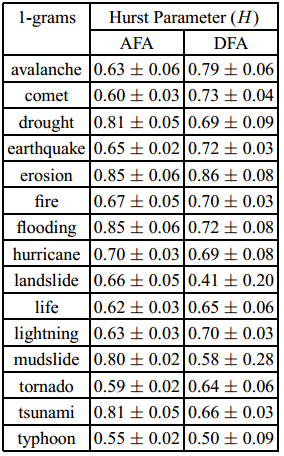
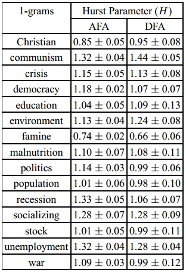

A few days ago, Gao, Hu, Mao, and Perc [posted a preprint](http://arxiv.org/abs/1202.5299) of their forthcoming [article comparing social and natural phenomena](http://rsif.royalsocietypublishing.org/content/early/2012/02/13/rsif.2011.0846.short). The authors, apparently all engineers and physicists, use the [google ngrams data](http://books.google.com/ngrams) to come to the conclusion that “social and natural phenomena are governed by fundamentally different processes.” The take-home message is that words describing natural phenomena increase in frequency at regular, predictable rates, whereas the use of certain socially-oriented words change in unpredictable ways. Unfortunately, the paper doesn’t necessarily differentiate between words and what they describe.

Specifically, the authors invoke random fractal theory (sort of a descendant of chaos theory) to find regular patterns in 1-grams. A 1-gram is just a single word, and this study looks at how the frequency of certain words grow or shrink over time. A “[hurst parameter](http://en.wikipedia.org/wiki/Hurst_exponent)” is found for 24 words, a dozen pertaining to nature (earthquake, fire, etc.), and another dozen “social” words (war, unemployment, etc.). The hurst parameter (*H*) is a number which, essentially, reveals whether or not a time series of data is correlated with itself. That is, given a set of observations over the last hundred years, autocorrelated data means the observation for this year will very likely follow a predictable trend from the past.

If *H* is between 0.5 and 1, that means the dataset has “long-term positive correlation,” which is roughly equivalent to saying that data quite some time in the past will still positively and noticeably effect data today. If *H* is under 0.5, data are negatively correlated with their past, suggesting that a high value in the past implies a low value in the future, and if *H* = 0.5, the data likely describe Brownian motion (they are random). *H* can exceed 1 as well, a point which I’ll get to momentarily.

The authors first looked at the frequency of 12 words describing natural phenomena between 1770 and 2007. In each case, *H* was between 0.5 and 1, suggesting a long-term positive trend in the use of the terms. That is, the use of the term “earthquake” does not fluctuate terribly wildly from year to year; looking at how frequently it was used in the past can reasonably predict how frequently it will be used in the future. The data have a long “memory.”

<!-- page 1 -->

Natural 1-grams from Gao et al. (2012)

The paper then analyzed 12 words describing social phenomena, with very different results. According to the authors, ”social phenomena, apart from rare exceptions, cannot be classified solely as processes with persistent-long range correlations.” For example, the use of the word “war” bursts around World War I and World War II; these are *unpredictable* moments in the discussion of social phenomena. The way “war” was used in the past was not a good predictor of how “war” would be used around 1915 and 1940, for obvious reasons.

<!-- page 2 -->

Social 1-grams from Gao et al. (2012)

You may notice that, for many of the social terms, *H* is actually greater than 1, “which indicates that social phenomena are most likely to be either nonstationary, on-off intermittent, or Levy walk-like process.” Basically, the *H* parameter alone is not sufficient to describe what’s going on with the data. Nonstationary processes are, essentially, unpredictable. A stationary process can be random, but at least certain statistical properties of that randomness remain persistent. Nonstationary processes don’t have those persistent statistical properties. The authors point out that not all social phenomena will have H &gt;1, citing famine, because it might relate to natural phenomena. They also point out that “the more the social phenomena can be considered recent (unemployment, recession, democracy), the higher their Hurst parameter is likely to be.”

In sum, they found that “**The prevalence of long-term memory in natural phenomena [compels them] to conjecture that the long-range correlations in the usage frequency of the corresponding terms is predominantly driven by occurrences in nature of those phenomena**,” whereas “**it is clear that all these processes [describing social phenomena] are fundamentally different from those describing natural phenomena**.” That the social phenomena follow different laws is not unexpected, they say, because they themselves are more complex; they rely on political, economic, and social forces, as well as natural phenomena.

While this paper is exceptionally interesting, and shows a very clever use of fairly basic data (24 one-dimensional variables, just looking at word use per year), it lacks the same sort of nuance also lacking in the [original culturomics paper](http://www.sciencemag.org/content/331/6014/176.short). Namely, in this case, it lacks the awareness that social and natural phenomena are not directly coupled with the words used to describe them, nor the frequency with which those words are used. The paper suggests that natural and social phenomena are governed by different scaling laws when, realistically, it is *the way they are discussed, and how those discussions are published* which are governed by the varying scaling laws. Further, although they used words exemplifying the difference between “nature” and “society,” the two are not always so easily disentangled, either in language or the underlying phenomena.

<!-- page 3 -->

Perhaps the sort of words used to describe social events change differently than the sort used to describe natural events. Perhaps, because natural phenomena are often immediately felt across vast distances, whereas news of social phenomena can take some time to diffuse, how rapidly some words are discussed may take very different forms. Discussions and word-usage are always embedded in a larger network. Also needing to be taken into account is *who* is discussing social vs. natural phenomena, and which is more likely to get published and preserved to eventually be scanned by Google Books.

Without a doubt the authors have noticed a very interesting trend, but rather than matching the phenomena directly to word, as they did, we should be using this sort of study to look at how language changes, how people change, and ultimately what relationship people have with the things they discuss and publish. At this point, the engineers and physicists still have a greater comfort with the statistical tools needed to fully utilize the google books corpus, but there are some humanists out there already doing [absolutely fantastic quantitative work](http://tedunderwood.wordpress.com/) with [similar data](http://sappingattention.blogspot.com/).

This paper, while impressive, is further proof that the quantitative study of culture should not be left to those with (apparently) little background in the subject. While it is not unlikely that different factors do, in fact, determine the course of natural disasters versus that of human interaction, this paper does not convincingly tease those apart. It may very well be that the language use is indicative of differences in underlying factors in the phenomena described, however no study is cited suggesting this to be the case. Claims like “social and natural phenomena are governed by fundamentally different processes,” given the above *language* data, could easily have been avoided, I think, with a short discussion between the authors and a humanist.

<!-- page 4 -->
