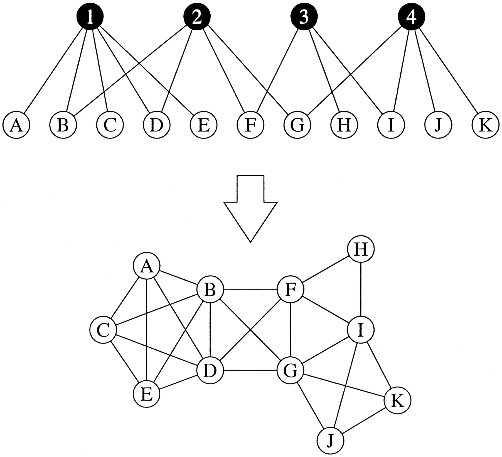
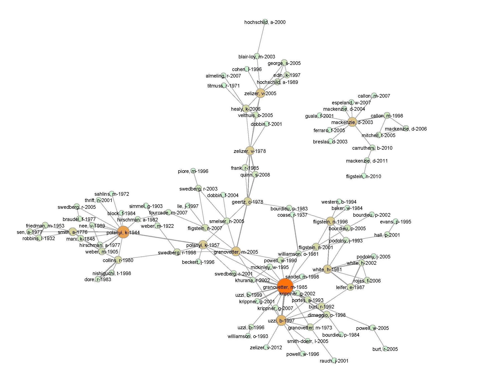
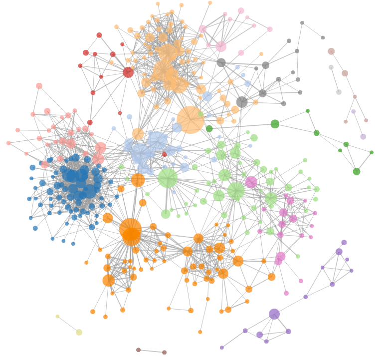
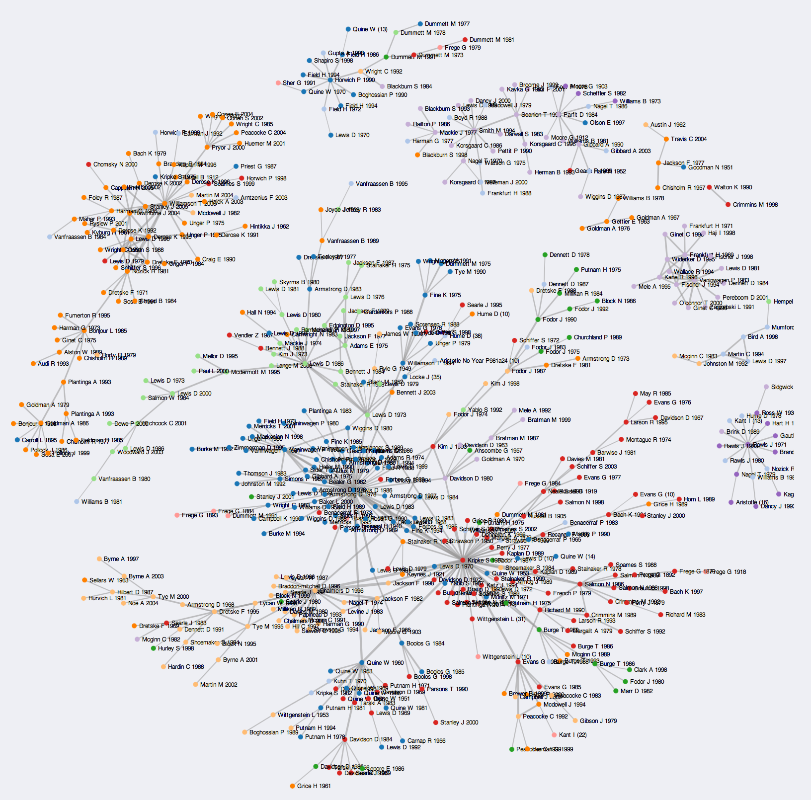
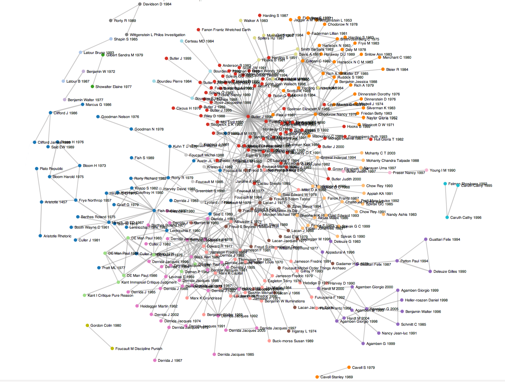
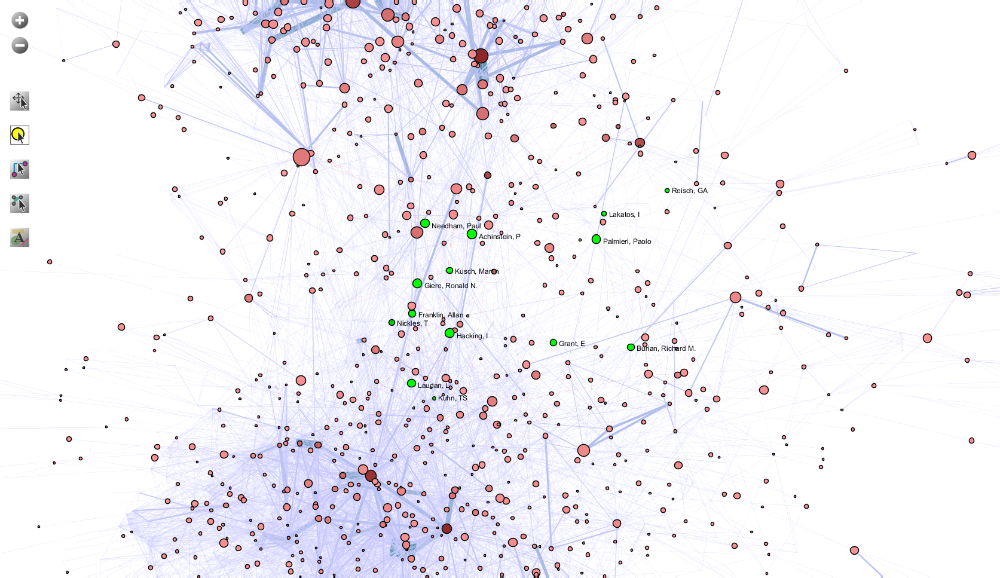

Figure 6: Author co-citation network of 15 history & philosophy of science journals. Two authors are connected if they are cited together in some article, and connected more strongly if they are cited together frequently. Click to enlarge. [via me!]

This installment of Networks Demystified is the first one that’s actually applied. A few days ago, a discussion arose over twitter involving citation networks, and this post fills the dual purpose of continuing that discussion, and teaching a bit about basic citation analysis. If you’re looking for the very basics of networks, see [part 1](/blog/demystifying-networks/) and [part 2](/blog/networks-demystified-2-degree/). [Part 3](/blog/networks-demystified-3-the-power-law-rant/) is a warning for anyone who feels the urge to say “power law.” To recap: nodes are the dots/points in the network, edges are the lines/arrows/connections.

## Understanding Sociology, Philosophy, and Literary Theory using One Easy Method™!

The growing availability of humanities and social science (HSS) citation data in databases like ISI’s [Web of Science](http://www.webofknowledge.com/?DestApp=WOS) (warning: GIANT paywall. Good luck getting access if your university doesn’t subscribe.) has led to a groundswell of recent blog activity in the area, mostly by the humanists and social scientists themselves. Which is a good thing, because citation analyses of HSS will happen whether we’re involving in doing them or not, so if humanists start becoming familiar with the methods, at least we can begin getting humanistically informed citation analyses of our own data.

<!-- page 2 -->

The size of ISI’s Web of Science paywall. You shall not pass. [[via](http://gameofthrones.wikia.com/wiki/The_Wall)]

This is a sort of weird post. It’s about history and philosophy of science, by way of social history, by way of literary theory, by way of philosophy, by way of sociology. About this time last year, Dan Wang asked the question [Is There a Canon in Economic Sociology](http://www2.asanet.org/sectionecon/accounts12sp.pdf) (pdf)? Wang was searching for a set of core texts for economic sociology, using a set of 52 syllabi regarding the subject. It’s a reasonable first pass at the question, counting how often each article appears in the syllabi (plus some more complex measurements) as well as how often individual authors appear. Those numbers are used to support the hypothesis that there is a strongly present canon, both of authors and individual articles, in economic sociology. This is an example of an extremely simple [bimodal network](http://en.wikipedia.org/wiki/Bipartite_graph) analysis where there are two varieties of node: syllabi or articles. Each syllabi cites multiple articles, and several of those articles are cited by multiple syllabi. The top part of Figure 1 is what this would look like in a basic network representation.

<!-- page 3 -->

Figure 1: basic bimodal network (top) and the resulting co-citation network (bottom). [[via Mark Newman](http://www.pnas.org/content/99/suppl.1/2566.full)]

Wang was also curious how instructors felt these articles fit together, so he used a common method called [co-citation analysis](http://en.wikipedia.org/wiki/Co-citation) to answer the question. The idea is that if two articles are cited in the same syllabus, they are probably related, so they get an edge drawn between them. He further restricted his analysis so that articles had to appear together in the same class session, rather than the the same syllabus, to be considered related to each other. What results is a new network (Figure 1, below) of article similarity based on how frequently they appear together (how frequently they are cited by the same source). In Figure 1, you can see that because article H and article F are both cited in syllabus class session 3, they get an edge drawn between them.

<!-- page 4 -->

A further restriction was then placed on the network, what’s called a threshold. Two articles would only get an edge drawn between them if they were cited by *at least 2 different* class sessions (threshold = 2). The resulting economic sociology syllabus co-citation network looked like Figure 2, pulled from the original article. From this picture, one can begin to develop a clear sense of the demarcations of subjects and areas within economic sociology, thus splitting the canon into its constituent parts.

Figure 2: Co-citation network in economic sociology. Edge thickness represents how often articles appear together in syllabi, and node size is based on a measure of centrality. [[via](http://www2.asanet.org/sectionecon/accounts12sp.pdf)]

In short order, Kieran Healy [blogged a reply](http://orgtheory.wordpress.com/2012/05/16/the-fragile-network-of-econ-soc-readings/) to this study, providing his own interpretations of the graph and what the various clusters represented. Remember Healy’s name, as it’s important later in the story. Two days after Healy’s blog post, Neal Caren took inspiration and [created a co-citation analysis of sociology more broadly](http://nealcaren.web.unc.edu/a-sociology-citation-network/)–not just economic sociology–using data he downloaded from ISI’s Web of Science (remember the giant paywall from before?). Instead of using syllabi, Caren looked at articles found in *American Journal of Sociology*, *American Sociological Review*, *Social Forces* and *Social Problems* since 2008. Web of Science gave him a list of every citation from every article in those journals, and he performed the same sort of co-citation analysis as Dan Wang did with syllabi, but at a much larger scale.

<!-- page 5 -->

Because the dataset Caren used was so much larger, he had to enforce much stricter thresholds to keep the visualization manageable. Whereas Wang’s graph showed all articles, and connected them if they appeared together in more than 2 class sessions, Caren’s graph only connected articles which were cited together more than 4 times (threshold = 4). Further, a cited article wouldn’t even appear on the network visualization unless the article itself had been cited 8 or more times, thus reducing the amount of articles appearing on the visualization overall. The final network had 397 nodes (articles) and 1,597 edges (connections between articles). He also used a popular community detection algorithm to color the different article nodes based on which other articles they were most related to. Figure 3 shows the resulting network, and clicking on it will lead to an interactive version.

<!-- page 6 -->

Figure 3: Neal Caren’s sociology co-citation analysis. Click the picture to see the interactive version. [[via](http://nealcaren.web.unc.edu/a-sociology-citation-network/)]

Caren adds a bit of contextual description in his blog post, explaining what the various clusters represent and why this visualization is a valid and useful one for the field of sociology. Notably, at the end of the post, he shares his raw data, a python script for analyzing it, and all the code for visualizing the network and making it interactive and pretty.

Jump forward a year. Kieran Healy, the one who wrote the original post inspiring Neal Caren’s, decides to try his own hand at a citation analysis using some of the code and methods that Neal Caren had posted about. Healy’s blog post, created just a few days ago, [looks at the field of philosophy through the now familiar co-citation analysis](http://kieranhealy.org/blog/archives/2013/06/18/a-co-citation-network-for-philosophy/). Healy’s analysis covers 20 years of four major philosophy journals, consisting of 2,200 articles. These articles together make over 34,000 citations, although many of the cited articles are duplicates of articles that had already been cited. Healy writes:

> The more often any single paper is cited, the more important it’s likely to be. But the more often any two papers are cited *together*, the more likely they are to be part of some research question or ongoing problem or conversation topic within the discipline.

With a dataset this large, the resulting co-citation network wound up having over a million edges, or connections between co-cited articles. Healy decides to only focus on the 500 most highly-cited items in the journals (not the *best* practice for a co-citation analysis, but I’ll address that in a later post), resulting in only articles that had been cited more than 10 times within the four journal dataset to be present in the network. Figure 4 shows the resulting network, which like Figure 3, can be clicked on to reach the interactive version.

<!-- page 7 -->

Figure 4: Kieran Healy’s co-citation analysis of four philosophy journals. Click for interactivity. [[via](http://kieranhealy.org/blog/archives/2013/06/18/a-co-citation-network-for-philosophy/)]

The post goes on to provide a fairly thorough and interesting analysis of the various communities formed by article clusters, thus giving a description of the general philosophy landscape as it currently stands. The next day, Healy [posted a follow-up delving further into citations of philosopher David Lewis, and citation frequencies by gender](http://kieranhealy.org/blog/archives/2013/06/19/lewis-and-the-women/). Going through the most highly cited 500 or so philosophy articles by hand, Healy finds that 3.6% of the articles are written by women; 6.3% are written by David Lewis; the overwhelming majority are written by white men. It’s not lost on me that the overwhelming majority of people doing these citation analyses are also white men – someone please help change that? Healy posted a [second follow-up](http://kieranhealy.org/blog/archives/2013/06/24/citation-networks-in-philosophy-some-followup/) a few days later, worth reading, on his reasoning behind which journals he used and why he looked at citations in general. He concludes “The 1990s were not the 1950s. And yet essentially *none* of the women from this cohort are cited in the conversation with anything close to the same frequency, despite working in comparable areas, publishing in comparable venues, and even in many cases having jobs at comparable departments.”

<!-- page 8 -->

Merely short days after Healy’s articles, Jonathan Goodwin became inspired, using the same code Healy and Caren used to perform a [co-citation analysis of Literary Theory Journals](http://www.jgoodwin.net/?p=1223). He began by concluding that these cocitation analysis were much more useful (better) than his previous attempts at direct citation analysis. About four decades of [bibliometric research](http://en.wikipedia.org/wiki/Bibliometrics) backs up Goodwin’s claim. Figure 5 shows Goodwin’s Literary Theory co-citation network, drawn from five journals and clickable for the interactive version, where he adds a bit of code so that the user can determine herself what threshold she wants to cut off co-citation weights. Goodwin [describes the code to create the effect on his github account](http://joncgoodwin.github.io/blog/2013/06/23/creating-a-threshold-slider/). In a follow-up post, directly inspired by Healy’s, Goodwin [looks at citations to women in literary theory](http://www.jgoodwin.net/?p=1235). His results? When a feminist theory journal is included, 8 of the top 30 authors are women (27%); when that journal is not included, only 2 of the top 30 authors are women (7%).

<!-- page 9 -->

Figure 5: Goodwin’s literary theory co-citation network. [[via](http://www.jgoodwin.net/?p=1223)]

## At the Speed of Blog

Just after these blog posts were published, a quick twitter exchange between Jonathan Goodwin, John Theibault, and myself (part of it [readable here](https://twitter.com/scott_bot/status/349606786862559236)) spurred Goodwin, in the space of 20 minutes, to download, prepare, and [visualize the co-citation data of four social history journals over 40 years](http://jgoodwin.net/social-history/cites-slider.html). He used ISI Web of Science data, Neal Caren’s code, a bit of his own, and a few other bits of open script which he generously cites and links to. All of this is to highlight not only the phenomenal speed of research when unencumbered by the traditional research process, but also the ease with which these sorts of analysis can be accomplished. Most of this is done using some (fairly simple) programming, but there are just as easy solutions if you don’t know how to or don’t care to code–one specifically which I’ll mention later, the [Sci2 Tool](https://sci2.cns.iu.edu/user/index.php). From data to visualization can take a matter of minutes; a first pass at interpretation won’t take much longer. These are fast analyses, pretty useful for getting a general overview of some discipline, and can provide quite a bit of material for deeper analysis.

The social history dataset is now sitting on Goodwin’s blog just waiting to be interpreted by the right expert. If you or anyone you know is familiar with social history, take a stab at figuring out what the analysis reveals, and then let us all know in a blog post of your own. I’ll be posting a little more about it as well soon, though I’m no expert of the discipline. Also, if you’re interested in citation analysis in the humanities, and you’ll be at DH2013 in Nebraska, I’ll be chairing a session all about citations in the humanities featuring an impressive lineup of scholars. [Come join us](http://dh2013.unl.edu/schedule-and-events/program/) and bring questions, July 17th at 10:30am.

<!-- page 10 -->

## Discovering History and Philosophy of Science

Before I wrap up, it’s worth mentioning that in one of Kieran Healy’s blog posts, he thanks Brad Wray for pointing out some corrections in the dataset. Brad Wray is one of the few people to have published a recent philosophy citation analysis in a philosophy journal. Wray is a top-notch philosopher, but his citation analysis (Philosophy of Science: What are the Key Journals in the Field?, *Erkenntnis*, May 2010 72:3, paywalled) falls a bit short of the mark, and as this is an instructional piece on co-citation analysis, it’s worth taking some time here to explore why.

Wray’s article’s thesis is that “there is little evidence that there is such a field as the history and philosophy of science (HPS). Rather, philosophy of science is most properly conceived of as a sub-field of philosophy.” He arrives at this conclusion via a citation analysis of three well-respected monographs, *A Companion to the Philosophy of Science*, *The Routledge Companion to Philosophy of Science*, and *The Philosophy of Science* edited by David Papineau, in total comprising 149 articles. Wray then counts how many times major journals are cited within each article, and shows that in most cases, the most frequently cited journals across the board are strict philosophy of science journals.

The data used to support Wray’s thesis–that there is no such field as history & philosophy of science (HPS)–is this coarse-level journal citation data. No history of science journal is listed in the top 10-15 journals cited by the three monographs, and HPS journals appear, but very infrequently. Of the evidence, Wray writes “if there were such a field as history and philosophy of science, one would expect scholars in that field to be citing publications in the leading history of science journal. But, it appears that philosophy of science is largely independent of the history of science.”

<!-- page 11 -->

It is curious that Wray would suggest that total citations from strict philosophy of science companions can be used as evidence of whether a related but distinct field, HPS, actually exists. Low citations from philosophy of science to history of science is that evidence. Instead, a more nuanced approach to this problem would be similar to the approach above: co-citation analysis. Perhaps HPS can be found by analyzing citations from journals which are ostensibly HPS, rather than analyzing three focused philosophy of science monographs. If a cluster of articles should appear in a co-citation analysis, this would be strong evidence that such a discipline currently exists among citing articles. If such a cluster does not appear, this would not be evidence of the non-existence of HPS (absence of evidence ≠ evidence of absence), but that the dataset or the analysis type is not suited to finding whatever HPS might be. A more thorough analysis would be required to actually disprove the existence of HPS, although one imagines it would be difficult explaining that disproof to the people who think that’s what they are.

With this in mind, I decided to perform the same sort of co-citation analysis as Dan Wang, Kieran Healy, Neal Caren, and Jonathan Goodwin, and see what could be found. I drew from 15 journals classified in ISI’s Web of Science as “History & Philosophy of Science” (*British Journal for the Philosophy of Science, Journal of Philosophy, Synthese, Philosophy of Science, Studies in History and Philosophy of Science, Annals of Science, Archive for History of Exact Sciences, British Journal for the History of Science, Historical Studies in the Natural Sciences, History and Philosophy of the Life Sciences, History of Science, Isis, Journal for the History of Astronomoy, Osiris, Social Studies of Science, Studies in History and Philosophy of Modern Physics,* and *Technology and Culture*). In all I collected 12,510 articles dating from 1956, with over 300,000 citations between them. For the purpose of not wanting to overheat my laptop, I decided to restrict my analysis to looking only at those articles within the dataset; that is, if any article from any of the 15 journals cited any other article from one of the 15 journals, it was included in the analysis.

<!-- page 12 -->

I also changed my unit of analysis from the article to the author. I didn’t want to see how often two articles were cited by some third article–I wanted to see how often two authors were cited together within some article. The resulting co-citation analysis gives author-author pairs rather than articlearticle pairs, like the examples above. In all, there were 7,449 authors in the dataset, and 10,775 connections between author pairs; I did not threshold edges, so the some authors in the network were cited together only once, and some as many as 60 times. To perform the analysis I used the [Science of Science (Sci2) Tool](https://sci2.cns.iu.edu/user/index.php), no programming required, (full advertisement disclosure: I’m on the development team), and some co-authors and I have written up [how to do a similar analysis in the documentation tutorials](http://wiki.cns.iu.edu/pages/viewpage.action?pageId=2200066).

The resulting author co-citation network, in Figure 6, reveals two fairly distinct clusters of authors. You can click the image to enlarge, but I’ve zoomed in on the two communities, one primarily history of science, the other primarily philosophy of science. At first glance, Wray’s hypothesis appears to be corroborated by the visualization; there’s not much in the way of a central cluster between the two. That said, a closer look at the middle, Figure 7, highlights a group of people whom either have considered themselves within HPS, or others have considered HPS.

[Figure 6: Author co-citation network of 15 history & philosophy of science journals. Two authors are connected if they are cited together in some article, and connected more strongly if they are cited together frequently. Click to enlarge. [via me!]](http://www.scottbot.net/HIAL/wp-content/uploads/2013/06/FullPageMapOfHPS.png)

<!-- page 13 -->

Figure 6: Author co-citation network of 15 history & philosophy of science journals. Two authors are connected if they are cited together in some article, and connected more strongly if they are cited together frequently. Click to enlarge. [via me!]

<!-- page 14 -->

Figure 7: Author co-citation analysis of history and philosophy of science journals, zoomed in on the area between history and philosophy, with authors highlighted who might be considered HPS. Click to enlarge.

Figures 6 & 7 don’t prove anything, but they do suggest that within citation patterns, history of science and philosophy of science are clearly more cohesive than some combined HPS might be. Figure 7 suggests there might be more to the story, and what is needed in the next step to try to pin down HPS–if indeed it exists as some sort of cohesive unit–is to find articles that specifically self-identify as HPS, and through their citation and language patterns, try to see what they have in common with and what separates them from the larger community. A more thorough set of analytics, visualizations, and tables, which I’ll explain further at some point, can be found [here](http://www.scottbot.net/HIAL/wp-content/uploads/2013/06/ScottWeingartIntegratedHPSAppendix1.pdf) (apologies for the pdf, this was originally made in preparation for another project).

The reason I bring up this example is not to disparage Wray, whose work did a good job of finding the key journals in philosophy of science, but to argue that we as humanists need to make sure the methods we borrow match the questions we ask. Co-citation analysis happens to be a pretty good method for exploring the question Wray asked in his thesis, but there are many more situations where it wouldn’t be particularly useful. The recent influx of blog posts on the subject, and the upcoming DH2013 session, is exciting, because it means humanists are beginning to take citation analysis seriously and are exploring the various situations in which its methods are appropriate. I look forward to seeing what comes out of the Social History data analysis, as well as future directions this research will take.

---

## Reader Comments

<!-- page 15 -->

> **Brad**, July 3, 2013
>
> Scott,\
> I think your analysis certainly contributes to our understanding the relationship between the history of science and the philosophy of science. The methods you use are a great obvious next step. But, unlike you, I see Figures 6 and 7 as supporting my claim, that there is no field HPS. Look how thinly populated the space is in Figure 6 between the core clump of philosophers and the core clump of historians. Nonetheless, I think you should aim to publish your data.

>> **Scott Weingart**, July 4, 2013
>>
>> Thank you for the reply, Brad. You make a good point about the void between history and philosophy of science, although from this method, all that tells us is that the fields as a whole do not have a set of shared H&P articles – I’ll do some more digging to see if any more relevant communities pop up!

> **Scott Weingart**, July 4, 2013
>
> Bonus! I’ve created new, more browsable versions of the author co-citation graph: [http://scottbot.net/uploads/cocite.html](http://scottbot.net/uploads/cocite.html)

<!-- page 16 -->

> **greg dl**, July 6, 2013
>
> Thanks, Scott. This is an interesting article – i remember fiddling about with Bibexcel a couple years ago. This sort of research & visualization I think is, at the least, a good way for researchers to understand the layout of an academic domain or research topic.
>
> I know nothing about HPS, and only slightly more about networks fyi.
>
> Is density of citations a good indicator of the existence or not of a ‘field’? The group of citations that appear ‘sparse’ seem to be acting as bridges between the two dense clusters, out of which a ‘new’ field arises (similar to Burt’s Structural Holes). Mark Pachuki & Ron Breiger (2010) wrote an article in Ann. Rev. Soc called ‘Cultural Holes’ that may speak to this.
>
> I’m not sure if citation network analysis (CNA) on its own is necessarily a good way to answer a question about whether a field ‘exists’ or not since a cursory google search would suggest that there are multiple individuals and organizations that categorize themselves as in an HPS field. Isn’t the question really about the processes that led to the creation, differentiation, etc of such a field?
>
> CNA might help w/ identifying boundaries of the field (either in production via publication or in how participants themselves identify the boundaries of the field via their citations). There’s interesting work in various areas of sociology (culture, orgs) that looks at things like genre, classifications, professions, and fields that might help w/ understanding processes underlying field formation, change, etc.

>> **Scott Weingart**, July 6, 2013
>>
>> Greg, I agree with you completely regarding the use of citation analysis as a tool for determining the structure of something, rather than its nature or its very existence. I myself am connected to an HPS department, and asking around would definitely get you plenty of people who consider themselves HPS. I was thinking about structural holes when seeing that bridge, but I hadn’t seen the cultural holes article – thanks for pointing it out. And thanks, as well, for the thoughtful comment.

<!-- page 17 -->
