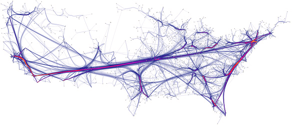
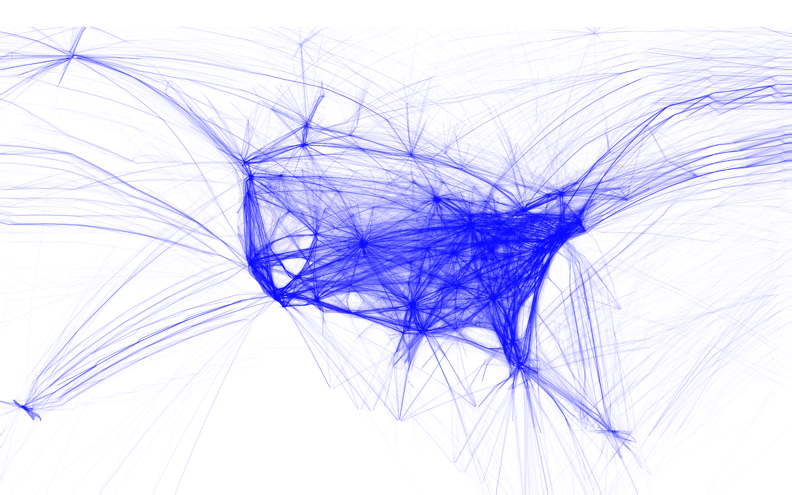
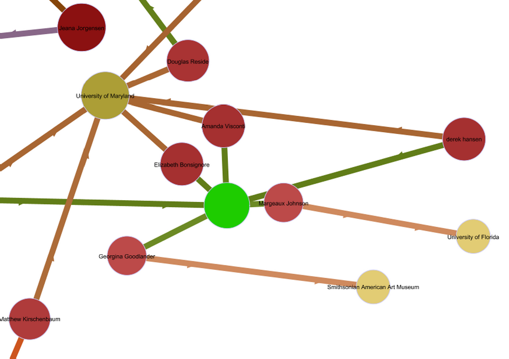

A few hundred years ago, I promised to talk about when not to use networks, or when networks are used improperly. With [The Historian’s Macroscope](http://themacroscope.org/) in the works, I’ve decided to finally start answering that question, and this Networks Demystified is my first attempt at doing so. If you’re new here, this is part of an annoyingly long series ([1](/blog/demystifying-networks/) network basics, [2](/blog/networks-demystified-2-degree/) degree, [3](/blog/networks-demystified-3-the-power-law-rant/) power laws, [4](/blog/networks-demystified-4-co-citation-analysis/) co-citation analysis, [5](/blog/networks-demystified-5-communities-pagerank-and-sampling-caveats/) communities and PageRank, 6 this space left intentionally blank, [7](/blog/networks-demystified-7-doing-co-citation-analyses/) co-citation analysis II). I’ve issued a lot of vague words of caution without doing a great job of explaining them, so here is the first substantive part of that explanation.

Networks are great. They allow you to do things like understand the role of postal routes in the circulation of knowledge in early modern Europe, or of the spread of the black death in the middle ages, or the diminishing importance of family ties in later Chinese governments. They’re versatile, useful, and pretty easy in today’s software environment. And they’re sexy, to boot. I mean, have you seen this visualization of curved lines connecting U.S. cities? I don’t even know what it’s supposed to represent, but it sure looks pretty enough to fund!

<!-- page 2 -->

A really pretty network visualization. \[[via](http://www.win.tue.nl/~dholten/)\]

So what could possibly dissuade you from using a specific network, or the concept of networks in general? A lot of things, it turns out, and even a big subset of things that belong only to historians. I won’t cover all of them here, but I will mention a few big ones.

## An Issue of Memory Loss

Okay, I lied about not knowing what the above network visualization represents. It turns out it’s a network of U.S. air travel pathways; if a plane goes from one city to another, an edge connects the two cities together. Pretty straightforward. And pretty useful, too, if you want to model something like the spread of an epidemic. You can easily see how someone with the newest designer virus flying into Texas might infect half-a-dozen people at the airport, who would in turn travel to other airports, and quickly infect most parts of the country with major airports. Transportation networks like this are often used by the CDC for just such a purpose, to determine what areas might need assistance/quarantine/etc.

The problem is that, although such a network might be useful for epidemiology, it’s not terribly useful for other seemingly intuitive questions. Take migration patterns: you want to know how people travel. I’ll give you another flight map that’s a bit easier to read.

<!-- page 3 -->

Flight patterns over U.S. \[[via](http://www.aaronkoblin.com/work/flightpatterns/)\]

The first thing people tend to do when getting their hands on a new juicy network dataset is to throw it into their favorite software suite (say, Gephi) and run a bunch of analyses on it. Of those, people really like things like PageRank or Betweenness Centrality, which can give the researcher a sense of important nodes in the network based on how central they are; in this case, how many flights have to go through a particular city in order to get where they eventually intend to go.

Let’s look at Las Vegas. By anyone’s estimation it’s pretty important; well-connected to cities both near and far, and pretty central in the southwest. If I want to go from Denver to Los Angeles and a direct flight isn’t possible, Las Vegas seems to be the way to go. If we also had road networks, train networks, cell-phone networks, email networks, and so forth all overlaid on top of this one, looking at how cities interact with each other, we might be able to begin to extrapolate other information like how rumors spread, or where important trade hubs are.

Here’s the problem: network structures are deceitful. They come with a few basic assumptions that are very helpful in certain areas, but extremely dangerous in others, and they are the reason why you shouldn’t analyze a network without thinking through what you’re implying by fitting your data to the standard network model. In this case, the assumption to watch out for is what’s known as a lack of memory.

The basic networks you learn about, with nodes and edges and maybe some attributes, embed no information on how those networks are generally traversed. They have no memories. For the purposes of disease tracking, this is just fine: all epidemiologists generally need to know is whether two people might accidentally happen to find <!-- page 4 -->themselves in the same place at the same time, and where they individually go from there. The structure of the network is enough to track the spread of a disease.

For tracking how people move, or how information spreads, or where goods travel, structure alone is rarely enough. It turns out that Las Vegas is basically a sink, not a hub, in the world of airline travel. People who travel there tend to stay for a few days before traveling back home. The fact that it happens to sit between Colorado and California is meaningless, because people tend not to go through Vegas to get from one to another, even though individually, people from both states travel there with some frequency.

If the network had a memory to it, if it somehow knew not just that a lot of flights tended to go between Colorado and Vegas and between LA and Vegas, but also that the people who went to Vegas returned to where they came from, then you’d be able to see that Vegas isn’t the same sort of hub that, say, Atlanta is. Travel involving Vegas tends to be to or from, rather than through. In truth, all cities have their own unique profiles, and some may be extremely central to the network without necessarily being centrally important in questions about that network (like human travel patterns).

The same might be true of letter-writing networks in early modern Europe, my research of choice. We often find people cropping up as extremely central, connecting very important figures whom we did not previously realize were connected, only to find out that later that, well, it’s not exactly what we thought. This new central figure, we’ll call him John Smith, happened to be the cousin of an important statesman, the neighbor of a famous philosopher, and the once-business-partner of some lawyer. None of the three ever communicated with John about any of the others, and though he was structurally central on the network, he was no-one of any historical note. A lack of memory in the network that information didn’t flow through John, only to or from him, means my centrality measurements can often be far from the mark.

It turns out that in letter-writing networks, people have separate spheres: they tend to write about family with family members, their governmental posts with other officials, and their philosophies with other philosophers. The overarching structure we see obscures partitions between communities that seem otherwise closely-knit. When researching with networks, especially going from the visualization to the analysis phase, it’s important to keep in mind what the algorithms you use do, and what assumptions they and your network structure embed in the evidence they provide.

Sometimes, the only network you have might be the wrong network for <!-- page 5 -->the job. I have a lot of peers (me included) who try to understand the intellectual landscape of early modern Europe using correspondence networks, but this is a poor proxy indeed for what we are trying to understand. Because of the spurious structural connections, like that of our illustrious John Smith, early modern networks give us a sense of unity that might not have been present at the time.

And because we’re only looking on one axis (letters), we get an inflated sense of the importance of spatial distance in early modern intellectual networks. Best friends never wrote to each other; they lived in the same city and drank in the same pubs; they could just meet on a sunny afternoon if they had anything important to say. Distant letters were important, but our networks obscure the equally important local scholarly communities.

If there’s a moral to the story, it’s that there are many networks that can connect the same group of nodes, and many questions that can be asked of any given network, but before trying to use networks to study history, you should be careful to make sure the questions match the network.

## Multimodality

As humanists asking humanistic questions, our networks tend to be more complex than the sort originally explored in network science. We don’t just have people connected to people or websites to websites, we’ve got people connected to institutions to authored works to ideas to whatever else, and we want to know how they all fit together. Cue the multimodal network, or a network that includes several types of nodes (people, books, places, etc.).

I’m going to pick on Elijah Meeks’ [map of of the DH2011 conference](http://dh2011network.stanford.edu/), because I know he didn’t actually use it to commit the sins I’m going to discuss. His network connected participants in the conference with their institutional affiliations and the submissions they worked on together.

<!-- page 6 -->

Part of Elijah Meeks’ map of DH2011. \[[via](http://dh2011network.stanford.edu/)\]

From a humanistic perspective, and especially from a Latourian one, these multimodal networks make a lot of sense. There are obviously complex relationships between many varieties of entities, and the promise of networks is to help us understand these relationships. The issue here, however, is that many of the most common metrics you’ll find in tools like Gephi were not created for multimodal networks, and many of the basic assumptions of network research need to be realigned in light of this type of use.

Let’s take the local clustering coefficient as an example. It’s a measurement often used to see if a particular node spans several communities, and it’s calculated by seeing how many of a node’s connections are connected to each other. More concretely, if all of my friends were friends with one another, I would have a high local clustering coefficient; if, however, my friends tended not to be friends with one another, and I was the only person in common between them, my local clustering coefficient would be quite low. I’d be the bridge holding the disparate communities together.

If you study the DH2011 network, the problem should become clear: local clustering coefficient is meaningless in multimodal networks. If people are connected to institutions and conference submissions, but not to one another, then everyone must have the same local clustering coefficient: zero. Nobody’s immediate connections are connected to each other, by definition in this type of network.

Local clustering coefficient is an extreme example, but many of the common metrics break down or mean something different when multiple node-types are introduced to the network. People are coming <!-- page 7 -->up with ways to handle these networks, but the methods haven’t yet made their way into popular software. Yet another reason that a researcher should have a sense of how the algorithms work and how they might interact with their own data.

## No Network Zone

The previous examples pointed out when networks might be used inappropriately, but there are also times when there is no appropriate use for a network. This isn’t so much based on data (most data can become a network if you torture them enough), but on research questions. Networks seem to occupy a similar place in the humanities as power laws do in computational social sciences: they tend to crop up everywhere regardless of whether they actually add anything informative. I’m not in the business of calling out poor uses of networks, but a good rule of thumb on whether you should include a network in your poster or paper is to ask yourself whether its inclusion adds anything that your narrative doesn’t.

Alternatively, it’s also not uncommon to see over-explanations of networks, especially network visualizations. A narrative description isn’t always the best tool for conveying information to an audience; just as you wouldn’t want to see a table of temperatures over time when a simple line chart would do, you don’t want a two-page description of communities in a network when a simple visualization would do.

This post is a bit less concise and purposeful than the others in this series, but stay-tuned for a revamped (and hopefully better) version to show up in [The Historian’s Macroscope](http://themacroscope.org/). In the meantime, as always, comments are welcome and loved and will confer good luck on all those who write them.

---

## Reader Comments

> [**Martin Grandjean**](http://www.martingrandjean.ch/), November 6, 2013 at 8:45 am
>
> <!-- page 8 -->+1000 (sorry, this is not a very constructive comment, but this article summarizes what I am trying to make people understand)

> [**Riccardo Scalco**](http://eidogram.com/), November 7, 2013 at 5:34 pm
>
> Fully agree. An important thing to remember, when working with networks, is that networks are directed graphs, i.e. a mathematical object defined by a set of nodes and a set of edges. A network is not a 2D or 3D plot, the plot is the result of an algorithm that takes as argument the mathematical object. The best way to answer at questions concerning a network system is to focus on the mathematical properties of the graph (the mathematical object), then, once answered, draw the network in way that stands out the interesting properties.

<!-- page 9 -->

<!-- page 9 -->
