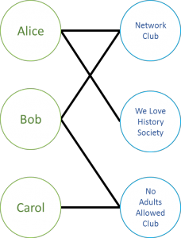
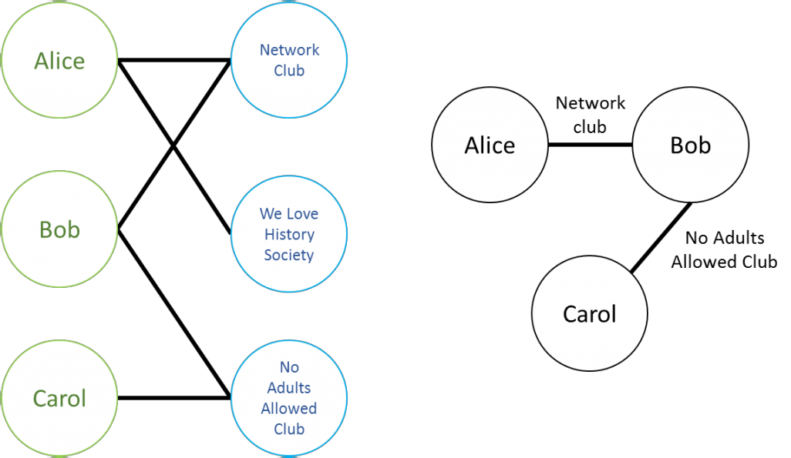
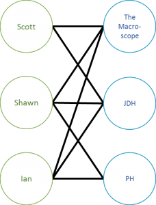
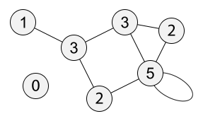
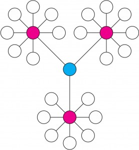
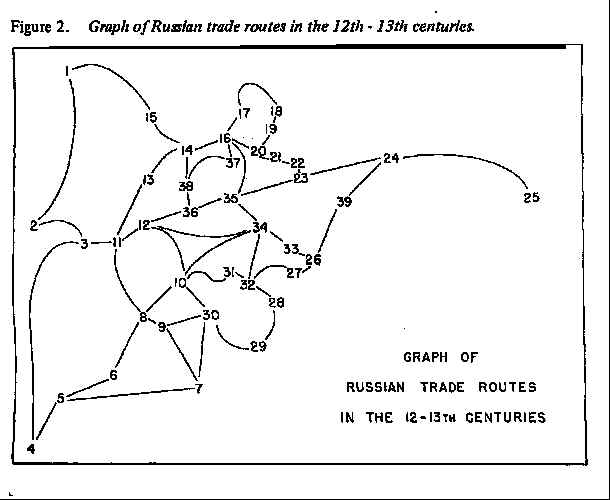
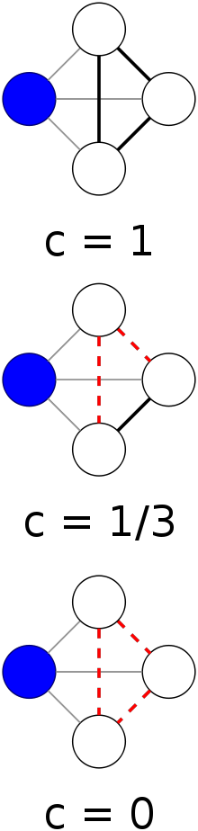

<!-- page 1 -->

What do you think, is a year long enough to wait between Networks Demystified posts? I don’t think so, which is why it’s been a year and a month. Welcome back! A recent [twitter back-and-forth](https://twitter.com/electricarchaeo/status/557557096779378688) culminated in a request for a discussion of “bimodal networks”, and my [Networks Demystified series](http://www.scottbot.net/HIAL/?tag=networks-demystified) seemed like a perfect place for just such a discussion.

> *[@scott\_bot](https://twitter.com/scott_bot) what I need, I think, is a discussion of network metrics from a bimodal perspective.*
>
> *— Shawn Graham (@electricarchaeo) [January 20, 2015](https://twitter.com/electricarchaeo/status/557565662017499137)*

What’s a bimodal network, you ask? (Go on, ask aloud at your desk. Nobody will look at you funny, this is the age of Siri!) A **bimodal network** is one which connects two varieties of things. It’s also called a **bipartite**, **2-partite**, or **2-mode network**. A network of authors connected to the papers they write is bimodal, as are networks of books to topics, and people to organizations they are affiliated with.

<!-- page 2 -->

*A bimodal network.*

This is a bimodal network which connects people and the clubs they belong to. Alice is a member of the Network Club and the We Love History Society, Bob‘s in the Network Club and the No Adults Allowed Club, and Carol‘s in the No Adults Allowed Club.

If this makes no sense, read [my earlier Networks Demystified posts](http://www.scottbot.net/HIAL/?tag=networks-demystified) (the first two posts), or the our [Historian’s Macroscope chapter](http://www.themacroscope.org/?page_id=337), for a primer on networks. If it does make sense, excellent! The rest of this post will hopefully take you out of your comfort zone, but remain understandable to someone who doesn’t speak math.

## *k*-partite Networks & Projections

Bimodal networks are part of a larger class of [*k*-partite](http://en.wikipedia.org/wiki/Multipartite_graph) networks. Unipartite/unimodal networks have only one type of node (remember, nodes are the stuff being connected by the edges), bipartite/bimodal networks have two types of nodes, tripartite/trimodal networks have three types of node, and so on to infinity.

The most common networks you’ll see being researched are unipartite. Who follows whom on Twitter? Who’s writing to whom in early modern Europe? What articles cite which other articles? All are examples of unipartite networks. It’s important to realize this isn’t necessarily determined by the dataset, but by the researcher doing the studying. For example, you can use the same organization affiliation dataset to create a unipartite network of who is in a club with whom, or a bipartite network of which person is affiliated with each organization.

<!-- page 3 -->

*The same dataset used to create a unipartite (left) and a bipartite (right) network.*

The above illustration shows the same dataset used to create a unimodal and a bimodal network. The process of turning a pre-existing bimodal network into a unimodal network is called a [bimodal projection](http://en.wikipedia.org/wiki/Bipartite_network_projection). This process collapses one set of nodes into edges connecting the other set. In this case, because Alice and Bob are both members of the Network Club, the Network Club collapses into becoming an edge between those two people. The No Adults Allowed Club collapses into an edge between Bob and Carol. Because only Alice is a member of the We Love History Society, it does not collapse into an edge connecting any people.

You can also collapse the network in the opposite direction, connecting organizations who share people. No Adults Allowed and Network Club would share an edge (Bob), as would Network Club and We Love History Society (Alice).

<!-- page 4 -->

## *Why* Bimodal Networks?

If the same dataset can be described with unimodal networks, which are less complex, why go to bi-, tri-, or multimodal? The answer to that is in your research question: different network representations suit different questions better.

Collaboration is a hot topic in bibliometrics. Who collaborates with whom? Why? Do your collaborators affect your future collaborations? Co-authorship networks are well-suited to some of these questions, since they directly connect collaborators who author a piece together. This is a unimodal network: I wrote *The Historian’s Macroscope* with Shawn Graham and Ian Milligan, so we draw an edge connecting each of us together.

Some of the more focused questions of collaboration, however, require a more nuanced view of the data. Let’s say you want to know how individual instances of collaboration affect individual research patterns going forward. In this case, you want to know more than the fact that I’ve co-authored two pieces with Shawn and Ian, and they’ve co-authored three pieces together.

For this added nuance, we can draw an edge from each of us to *The Historian’s Macroscope* (rather than each-other), then another set edges to the piece we co-authored in *The Programming Historian*, and a last set of edges going from Shawn and Ian to the piece they wrote in the *Journal of Digital Humanities.* That’s three people nodes and three publication nodes.

<!-- page 5 -->

*Scott, Ian, and Shawn’s co-authorship network*

## Why *Not* Bimodal Networks?

Humanities data are often a rich array of node types: people, places, things, ideas, all connected to each other via a complex network. **The trade-off is, the more complex and multimodal your dataset, the less you can reasonably do with it**. This is one of the fundamental tensions between computational and traditional humanities. More categories lead to a richer understanding of the diversity of human experience, but are incredibly unhelpful when you want to count things.

Consider two pie-charts showing the religious makeup of the United States. The first chart groups together religions that fall under a similar umbrella, and the second does not. That is, the first chart groups religions like Calvinists and Lutherans together into the same pie slice (Protestants), and the second splits them into separate slices. The second, more complex chart obviously presents a richer picture of religious diversity in the United States, but it’s also significantly more difficult to read. It might trick you into thinking there are more Catholics than Protestants in the country, due to how the pie is split.

The same is true in network analysis. **By creating a dataset with a hundred varieties of nodes, you lose your ability to see a bigger picture through meaningful aggregations**.

[Surely](https://www.youtube.com/watch?v=0A5t5_O8hdA), you’re thinking, bimodal networks, with only two categories, should be fine! Wellllll, yes and no. You don’t bump into the same aggregation problem you do with very multimodal networks; instead, you bump into technical and mathematical issues. These issues are why I [often](/blog/networks-demystified-2-degree/) warn nontechnical researchers [away](/blog/networks-demystified-8-when-networks-are-inappropriate/) from bimodal networks in research. They’re not theoretically unsound, they’re just difficult to work with properly unless you know what changes when you’re working with these complex networks.

<!-- page 6 -->

The following section will discuss a few network metrics you may be familiar with, and what they mean for bimodal networks.

## Network Metrics and Bimodality

The easiest thing to measure in a network is a node’s **degree centrality**. You’ll recall this is a measurement of how many edges are attached to a node, which gives a rough proxy for this concept we’ve come to call network “[centrality](http://en.wikipedia.org/wiki/Centrality)“. It means different things depending on your data and your question: the most important or well-connected person in your social network; the point in the U.S. electrical grid which is most vulnerable to attack; the book that shares the most concepts with other books (the encyclopedia?); the city that the most traders pass through to get to their destination. These are all highly “central” in the networks they occupy.

*A network with each node labeled with its degree centrality, via Wikipedia.*

Degree centrality is the easiest such proxy to compute: how many connections does a node have? The idea is that nodes that are more highly connected are more central. The assumption only goes so far, and it’s easy to come up with nodes that are central that do not have a  high degree, as with the network below.

<!-- page 7 -->

*The blue node is highly central, but only has a degree centrality of 3. \[[via](http://www.biomedcentral.com/1471-2105/7/219/figure/F1?highres=y)\]*

That’s the thing with these metrics: if you know how they work, you know which networks they apply well to, and which they do not. If what you mean by “centrality” is “has more friends”, and we’re talking about a Facebook network, then degree centrality is a perfect metric for the job.

If what you mean is “an important stop for river trade”, and we’re talking about 12th century Russia, then degree centrality sucks. The below is an illustration of such a network by [Pitts (1978)](http://www.analytictech.com/networks/pitts.htm):

<!-- page 8 -->

*Russian river trade routes. Numbers/nodes are cities, and edges are rivers between them.*

Moscow is number 35, and pretty clearly the most central according to the above criteria (you’ll likely pass through it to reach other destinations). But it only has a degree centrality of four! Node 9 also has a degree centrality of four, but clearly doesn’t play as important a structural role as Moscow in this network.

We already see that depending on your question, your definitions, and your dataset, specific metrics will either be useful or not. Metrics may change meanings entirely from one network to the next – for example, looking at bimodal rather than unimodal networks.

Consider what degree centrality means for the Alice, Bob, and Carol’s bimodal affiliation network above, where each is associated with a different set of clubs. Calculate the degree centralities in your head (hint: if you can’t, you haven’t learned what degree centrality means yet. Try again.).

Alice and Bob have a degree of 2, and Carol has a degree of 1. Is this saying anything about how central each is to the network? *Not at all*. Compare this to the unimodal projection, and you’ll see Bob is clearly the only structurally central actor in the network. **In a bimodal network, degree centrality is nothing more than a count of affiliations with the other half of the network.** It is much less likely to tell you something structurally useful than if you were looking at a unimodal network.

Consider another common measurement: **clustering coefficient**. You’ll recall that a node’s [local clustering coefficient](http://en.wikipedia.org/wiki/Clustering_coefficient#Local_clustering_coefficient) is the extent to which its neighbors are neighbors to one another. If all my Facebook friends know each other, I have a high clustering coefficient; if none of them know each other, I have a low clustering coefficient. If all of a power plant’s neighbors directly connect to one another, it has a high clustering coefficient, and if they don’t, it has a low clustering coefficient.

<!-- page 9 -->

<!-- page 10 -->

*Clustering coefficient, from largest to smallest. \[[via](http://en.wikipedia.org/wiki/Clustering_coefficient)\]*

This measurement winds up being important for all sorts of reasons, but one way to interpret its meaning is as a proxy for the extent to which a node bridges diverse communities, the extent to which it is an important broker. In the 17th century, Henry Oldenburg was an important broker between disparate scholarly communities, in that he corresponded with people all across Europe, many of whom would never meet one another. The fact that they’d never meet is represented by the local clustering coefficient. It’s low, so we know his neighbors were unlikely to be neighbors of one another.

You can get creative (and network scientists often are) with what this metric means in the context of your own dataset. As long as you know how the algorithm works (taking the fraction of neighbors who are neighbors to one another), and the structural assumptions underlying your dataset, you can argue why clustering coefficient is a useful proxy for answering whatever question you’re asking.

Your argument may be pretty good, like if you say clustering coefficient is a decent (but not the best) proxy for revealing nodes that broker between disparate sections of a unimodal social network. Or your argument may be bad, like if you say clustering coefficient is a good proxy for organizational cohesion on the bimodal Alice, Bob, and Carol affiliation network above.

A thorough glance at the network, and a realization of our earlier definition of clustering coefficient (taking the fraction of neighbors who are neighbors to one another), should reveal why this is a bad justification. Alice’s clustering coefficient is zero. As is Bob’s. As is the Network Club’s. Every node has a clustering coefficient of zero, because no node’s neighbors connect to each other. That’s just the nature of bimodal networks: they connect across, rather than between, modes. Alice can never connect directly with Bob, and the Network Club can never connect directly with the We Love History Society.

<!-- page 11 -->

Bob’s neighbors (the organizations) can never be neighbors with each other. There will never be a clustering coefficient as we defined it.

In short, **the simplest definition of clustering coefficient doesn’t work on bimodal networks**. It’s obvious if you know how your network works, and how clustering coefficient is calculated, but if you don’t think about it before you press the easy “clustering coefficient” button in Gephi, you’ll be lead astray.

Gephi doesn’t know if your network is bimodal or unimodal or ∞modal. Gephi doesn’t care. Gephi just does what you tell it to. You want Gephi to tell you the degree centralities in a bimodal network? Here ya go! You want it to give you the local clustering coefficients of nodes in a bimodal network? Voila! Everything still works as though these metrics would produce meaningful, sensible results.

But they won’t be meaningful on your network. **You need to be your own network’s sanity check, and not rely on software to tell you something’s a bad idea**. Think about your network, think about your algorithm, and try to work through what an algorithm means in the context of your data.

## Using Bimodal Networks

This doesn’t mean you should stop using bimodal networks. Most of the easy network software out there comes with algorithms made for unimodal networks, but other algorithms exist and are available for more complex networks. Very occasionally, but by no means always, you can project your bimodal network to a unimodal network, as described above, and run your unimodal algorithms on that new network projection.

<!-- page 12 -->

There are a number of times when this doesn’t work well. At 2,300 words, this tutorial is already too long, so I’ll leave thinking through why as an exercise for the reader. It’s less complicated than you’d expect, if you have a pen and paper and know how fractions work.

The better solution, usually, is to use an algorithm meant for bi- or multimodal networks. [Tore Opsahl has put together a good primer on the subject](http://toreopsahl.com/tnet/two-mode-networks/clustering/) with regard to clustering coefficient (slightly mathy, but you can get through it with ample use of Wikipedia). He argues that projection isn’t an optimal solution, but gives a simple algorithm for a finding bimodal clustering coefficients, and directions to do so in R. Essentially the algorithm extends the visibility of the clustering coefficient, asking whether a node’s neighbors 2 hops away can reach the others via 2 hops as well. Put another way, I don’t want to know what clubs Bob belongs to, but rather whether Alice and Carol can also connect to one another through a club.

It’s a bit difficult to write without the use of formulae, but looking at the bimodal network and thinking about what clustering coefficient ought to mean should get you on the right track.

Bimodal networks aren’t an unsolved problem. If you [search Google Scholar for bimodal, bipartite, and 2-mode networks](http://scholar.google.com/scholar?hl=en&q=bimodal%7Cbipartite%7C2-mode+network&btnG=&as_sdt=1%2C31&as_sdtp=), you’ll discover all sorts of clever methods for analyzing bimodal networks, including some great introductory texts by Borgatti and Everett.

The issue is there aren’t easy solutions through platforms like Gephi, and that’s probably on us as Digital Humanists.  I’ve found that DHers are much more likely to have bi- or multimodal datasets than most network researchers. If we want to be able to analyze them easily, we need to start developing our own plugins to Gephi, or our own tools, to do so. Push-button solutions are great *if you know what’s happening when you push the button*.

<!-- page 13 -->

So let this be an addendum to my previous warnings against using bimodal networks: by all means, use them, but make sure you really think about the algorithms and your data, and what any given metric might imply when run on your network specifically. There are all sorts of free resources online you can find by googling your favorite algorithm. Use them.

For more information, read up on specific algorithms, methods, interpretations, etc. for two-mode networks from [Tore Opsahl](http://toreopsahl.com/tnet/two-mode-networks/).
