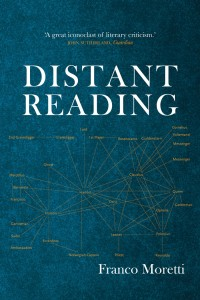
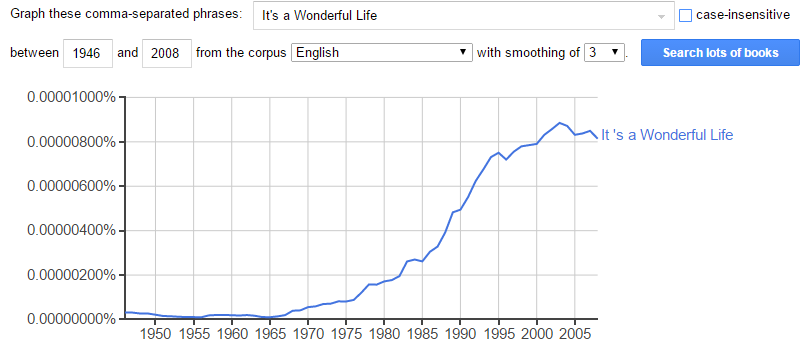
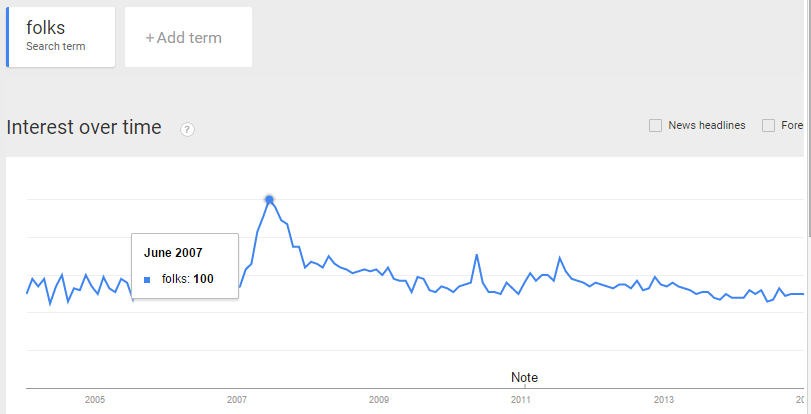

<!-- page 1 -->

> *Right now DH is all texts, but not enough perspectives. -[Andrew Piper](http://txtlab.org/?p=470)*

**Summary**: Digital Humanities suffers from a lack of perspectives in two ways: we need to focus more on the perspectives of those who interact with the cultural objects we study, and we need more outside academic perspectives. In *Part 1*, I cover Russian Formalism, questions of validity, and what perspective we bring to our studies. In *Part 2*,[^1] I call for pulling inspiration from even more disciplines, and for the adoption and exploration of three new-to-DH concepts: Appreciability, Agreement, and Appropriateness. These three terms will help tease apart competing notions of validity.

<!-- page 2 -->

## Syuzhet

Let’s begin with the century-old [Russian Formalism](http://en.wikipedia.org/wiki/Russian_formalism), because why not?[^2] Syuzhet, in that context, is juxtaposed against fabula. Syuzhet is a story’s order, structure, or narrative framework, whereas fabula is the underlying fictional reality of the world. Fabula is the story the author wants to get across, and syuzhet is the way she decides to tell it.

It turns out elements of Russian Formalism are resurfacing across the digital humanities, enough so that there’s an upcoming Stanford workshop on [DH & Russian Formalism](https://digitalhumanities.stanford.edu/russian-formalism-digital-humanities), and even [I co-authored a piece](http://llc.oxfordjournals.org/content/28/3/404) that draws on work of Russian formalists. Syuzhet itself has a new meaning in the context of digital humanities: it’s [a piece of code](https://github.com/mjockers/syuzhet) that chews books and spits out plot structures.

You may have noticed a fascinating discussion developing recently on statistical analysis of plot arcs in novels using sentiment analysis. A lot of buzz especially has revolved around [Matt Jockers](http://www.matthewjockers.net/2015/02/02/syuzhet/) and [Annie Swafford](https://annieswafford.wordpress.com/2015/03/02/syuzhet/), and the discussion has bled into [larger academia](http://www.theparisreview.org/blog/2015/03/19/man-in-hole-ii-man-in-deeper-hole/) and inspired 246 (and counting) [comments on reddit](http://www.reddit.com/r/books/comments/2zpkba/professor_uses_algorithm_to_assign_every_word_in/?limit=500). Eileen Clancy has written a two-part broad link summary ([I](https://storify.com/clancynewyork/contretemps-a-syuzhet) & [II](https://storify.com/clancynewyork/a-fabula-of-syuzhet-ii/)).

<!-- page 3 -->

*From [Jockers’ first post](http://www.matthewjockers.net/2014/06/05/a-novel-method-for-detecting-plot/) describing his method of deriving plot structure from running sentiment analysis on novels.*

The idea of deriving plot arcs from sentiment analysis has proven controversial on a number of fronts, and I encourage those interested to read through the links to learn more. The discussion I’ll point to here centers around “[validity](http://en.wikipedia.org/wiki/Validity_(statistics))“, a word being used differently by different voices in the conversation. These include:

- Do sentiment analysis algorithms agree with one another enough to be considered valid?
- Do sentiment analysis results agree with humans performing the same task enough to be considered valid?
- Is Jockers’ instantiation of aggregate sentiment analysis validly measuring anything besides random fluctuations?
- Is aggregate sentiment analysis, by human or machine, a valid method for revealing plot arcs?
- If aggregate sentiment analysis finds common but distinct patterns and they don’t seem to map onto plot arcs, can they still be valid measurements of *anything at all*?
- Can a subjective concept, whether measured by people or machines, actually be considered invalid or valid?

The list goes on. I [contributed to a Twitter discussion](https://twitter.com/matthewharrison/status/574584960784424960) on the topic a few weeks back. Most recently, [Andrew Piper wrote a blog post around validity](http://txtlab.org/?p=470) in this discussion.

<!-- page 4 -->

*Hermeneutics of DH, from [Piper’s blog](http://txtlab.org/?p=470).*

In this particular iteration of the discussion, validity implies a connection between the algorithm’s results and some interpretive consensus among experts. Piper points out that consensus doesn’t yet exist, because:

> *We have the novel data, but not the reader data. Right now DH is all texts, but not enough perspectives.*

And he’s right. So far, DH seems to focus its scaling up efforts on the written word, rather than the read word.

This doesn’t mean we’ve ignored studying large-scale reception. In fact, I’m about to argue that reception is built into our large corpora text analyses, even though it wasn’t by design. To do so, I’ll discuss the tension between studying what gets written and what gets read through distant reading.

<!-- page 5 -->

## The Great Unread

The Great Unread is a phrase popularized by Franco Moretti[^3] to indicate the lost literary canon. In [his own words](https://muse.jhu.edu/journals/modern_language_quarterly/v061/61.1moretti.html):

> *\[…\] the “lost best-sellers” of Victorian Britain: idiosyncratic works, whose staggering short-term success (and long-term failure) requires an explanation in their own terms.*

The phrase has since become synonymous with large text databases like Google Books or HathiTrust, and is used in concert with distant reading to set digital literary history apart from its analog counterpart. Distant reading The Great Unread, it’s argued,

> *significantly increase\[s\] the researcher’s ability to discuss aspects of influence and the development of intellectual movements across a broader swath of the literary landscape. -[Tangherlini & Leonard](http://www.sciencedirect.com/science/article/pii/S0304422X13000648)*

Which is awesome. As I understand it, literary history, like history in general, suffers from an exemplar problem. Researchers take a few famous (canonical) books, assume they’re a decent (albeit shining) example of their literary place and period, and then make claims about culture, art, and so forth based on those novels which are available.

Matthew Lincoln raised this point [the other day](https://twitter.com/matthewdlincoln/status/580023926060879872), as did Matthew Wilkins in his [recent article on DH in the study of literature and culture](http://complit.dukejournals.org/content/67/1/11). Essentially, both distant- and close-readers make part-to-whole generalized inferences, but the process of distant reading forces those generalizations to become formal and explicit. And hopefully, by looking at The Great Unread (the tens of thousands of books that never made it into the canon), claims about culture can better represent the nuanced literary world of the past.

<!-- page 6 -->

*Franco Moretti’s *Distant Reading*.*

But this is weird. Without exemplars, what the heck are we studying? This isn’t a representation of what’s stood the test of time—that’s the canon we know and love. It’s also not a representation of what was popular back then (well, it sort of was, but more on that shortly), because we don’t know anything about circulation numbers. Most of these Google-scanned books surely never caught the public eye, and many of the now-canonical pieces of literature may not have been popular at the time.

It turns out we kinda suck at figuring out readership statistics, or even at figuring out what was popular at any given time, unless we know what we’re looking for. A folklorist friend of mine has called this the Sophus Bauditz problem. An expert in 19th century Danish culture, my friend one day stumbled across a set of nicely-bound books written by Sophus Bauditz. They were in his era of expertise, but he’d never heard of these books. “Must have been some small print run”, he thought to himself, before doing some research and discovering copies of these books he’d never heard of were *everywhere* in private collections. They were popular books for the emerging middle class, and sold an order of magnitude more copies than most books of the era; they’d just never made it into the canon. In another century, *50 Shades of Grey* will likely suffer the same fate.

## Tsundoku

<!-- page 7 -->

In this light, I find The Great Unread to be a weird term.  The Forgotten Read, maybe, to refer to those books which people actually did read but were never canonized, and The Great Tsundoku[^4] for those books which were published, lasted to the present, and became digitized, but for which we have no idea whether anyone bothered to read them. The former would likely be more useful in understanding [reception](http://en.wikipedia.org/wiki/Reception_theory), cultural zeitgeist, etc.; the latter might find better use in understanding writing culture and perhaps authorial influence (by seeing whose styles the most other authors copy).

*Tsundoku is Japanese for the ever-increasing pile of unread books that have been purchased and added to the queue. Illustrated by [Reddit user Wemedge’s 12-year-old daughter](http://www.reddit.com/r/books/comments/1efnug/asked_my_12year_old_daughter_to_illustrate/).*

In the present data-rich world we live in, we can still only grasp at circulation and readership numbers. Library circulation provides some clues, as does the number, size, and sales of print editions. It’s not perfect, of course, though it might be useful in separating zeitgeist from actual readership numbers.

<!-- page 8 -->

Mathematician Jordan Ellenberg recently coined the tongue-in-cheek Hawking Index, because Stephen Hawking’s books are frequently purchased but rarely read, to measure just that. In his [Wall Street Journal article](http://www.wsj.com/articles/the-summers-most-unread-book-is-1404417569), Ellenberg looked at popular books sold on Amazon Kindle to see where people tended to socially highlight their favorite passages. Highlights from Kahneman’s “Thinking Fast and Slow”, Hawking’s “A Brief History of Time”, and Picketty’s “Capital in the Twenty-First Century” all tended to cluster in the first few pages of the books, suggesting people simply stopped reading once they got a few chapters in.

Kindle and other ebooks certainly complicate matters. It’s [been claimed](http://www.nytimes.com/2012/03/10/business/media/an-erotic-novel-50-shades-of-grey-goes-viral-with-women.html?pagewanted=all&_r=1) that one reason behind *50 Shades of Grey*‘s success was the fact that people could purchase and read it discreetly, digitally, without worry about embarrassment. Digital sales outnumbered print sales for some time into its popularity. As Dan Cohen and Jennifer Howard [pointed out](http://www.dancohen.org/2015/03/24/whats-the-matter-with-ebooks/), it’s remarkably difficult to understand the ebook market, and the market is quite different among different constituencies. Ebook sales [accounted for 23% of the book market](http://publishingperspectives.com/2014/10/print-continues-outsell-digital-first-half-2014/) this year, yet [50% of romance books are sold digitally](https://twitter.com/dancohen/status/580714662355943424).

And let’s not even get into readership statistics for novels that are out copyright, or sold used, or illegally attained: they’re pretty much impossible to count. Consider [*It’s a Wonderful Life*](http://en.wikipedia.org/wiki/It's_a_Wonderful_Life) (yes, the 1946 Christmas movie). A [clerical accident](http://www.slate.com/articles/news_and_politics/explainer/1999/12/why_wonderful_life_comes_but_once_a_year.html) pushed the movie into the public domain (sort of) in 1974. It had never really been popular before then, but once TV stations could play it without paying royalties, and VHS companies could legally produce and sell copies for free, the movie shot to popularity. Importantly, it shot to popularity in a way that was impossible to see on official license reports, but which [Google ngrams](https://books.google.com/ngrams/graph?content=It%27s+a+Wonderful+Life&year_start=1946&year_end=2008&corpus=15&smoothing=3&share=&direct_url=t1%3B%2CIt%20%27s%20a%20Wonderful%20Life%3B%2Cc0) reveals quite clearly.

<!-- page 9 -->

*Google ngram count of *It’s a Wonderful Life*, showing its rise to popularity after the 1974 copyright lapse.*

This ngram visualization does reveal one good use for The Great Tsundoku, and that’s to use what authors are writing about as finger on the pulse of what people *care* to write about. This can also be used to track things like linguistic influence. It’s likely no coincidence, for example, that [American searches for the word “folks” doubled](https://www.google.com/trends/explore#q=folks&geo=US) during the first month’s of President Obama’s bid for the White House in 2007.[^5]

*American searches for the word “folks” during Obama’s first presidential bid.*

Matthew Jockers has picked up on this capability of The Great Tsundoku for literary history in his analyses of 19th century literature. He compares books by various similar features, and uses that in a discussion of literary influence. Obviously the causal chain is a bit muddled in these cases, culture being ouroboric as it is, and containing a great deal more influencing factors than published books, but it’s a good set of first steps.

<!-- page 10 -->

But this brings us back to the question of The Great Tsundoku vs. The Forgotten Read, or, *what are we learning about when we distant read giant messy corpora like Google Books*? This is by no means a novel question. Ted Underwood, Matt Jockers, Ben Schmidt, and I had an [ongoing discussion on corpus representativeness a few years back](http://tedunderwood.com/2013/04/01/distant-reading-and-representativeness/), and it’s been continuously pointed to by corpus linguists[^6] and literary historians for some time.

Surely there’s some appreciable difference when analyzing what’s often read versus what’s written?

Surprise! It’s not so simple. Ted Underwood points out:

> *we could certainly measure “what was printed,” by including one record for every volume in a consortium of libraries like HathiTrust. If we do that, a frequently-reprinted work like Robinson Crusoe will carry about a hundred times more weight than a novel printed only once.*

He continues

> *if we’re troubled by the difference between “what was written” and “what was read,” we can simply create two different collections — one limited to first editions, the other including reprints and duplicate copies. Neither collection is going to be a perfect mirror of print culture. Counting the volumes of a novel preserved in libraries is not the same thing as counting the number of its readers. But comparing these collections should nevertheless tell us whether the issue of popularity makes much difference for a given research question.*

While his claim skirts the sorts of issues raised by Ellenberg’s Hawking Index, it does present a very reasonable natural experiment: if you ask the same question of three databases (1. The entire messy, reprint-ridden corpus; 2. Single editions of The Forgotten Read, those books which were popular whether canonized or not; 3. The entire Great Tsundoku, everything that was printed at least once, regardless of whether it was read), what will you find?

<!-- page 11 -->

Underwood performed 2/3rds of this experiment, comparing The Forgotten Read against the entire HathiTrust corpus on an analysis of [the emergence of literary diction](http://journalofdigitalhumanities.org/1-2/the-emergence-of-literary-diction-by-ted-underwood-and-jordan-sellers/). He found that the trend results across both were remarkably similar.

*Underwood’s analysis of all HathiTrust prose (47,549 volumes, left), vs. The Forgotten Read (773 volumes, right).*

Clearly they’re not precisely the same, but the fact that their trends are so similar is suggestive that the HathiTrust corpus at least shares some traits with The Forgotten Read. The jury is out on the extent of those shared traits, or whether it shares as much with The Great Tsundoku.

The cause of the similarities between historically popular books and books that made it into HathiTrust should be apparent:[^7] historically popular books were more frequently reprinted and thus, eventually, more editions made it into the HathiTrust corpus. Also, as [Allen Riddell showed](https://ariddell.org/where-are-the-novels.html), it’s likely that fewer than 60% of published prose from that period have been scanned, and novels with multiple editions are more likely to appear in the HathiTrust corpus.

This wasn’t actually what I was expecting. I figured the HathiTrust corpus would track more closely to what’s written than to what’s read—and we need more experiments to confirm that’s not the case. But as it stands now, we may actually expect these corpora to reflect The Forgotten Read, a continuously evolving measurement of readership and popularity.[^8]

<!-- page 12 -->

Lastly, we can’t assume that greater popularity results in larger print runs in every case, or that those larger print runs would be preserved. Ephemera such as zines and comics, digital works produced in the 1980s, and brittle books printed on acidic paper in the 19th century all have their own increased likelihoods of vanishing. So too does work written by minorities, by the subjected, by the conquered.

## The Great Unreads

There are, then, quite a few Great Unreads. The Great Tsundoku was coined with tongue planted firmly in-cheek, but we do need a way of talking about the many varieties of Great Unreads, which include but aren’t limited to:

- Everything ever written or published, along with size of print run, number of editions, etc. (Presumably Moretti’s *The* Great Unread.)
- The set of writings which by historical accident ended up digitized.
- The set of writings which by historical accident ended up digitized, cleaned up with duplicates removed, multiple editions connected and encoded, etc. (The Great Tsundoku.)
- The set of writings which by historical accident ended up digitized, adjusted for disparities in literacy, class, document preservation, etc. (What we might see if history hadn’t stifled so many voices.)
- The set of things read proportional to what everyone *actually* read. (The Forgotten Read.)
- The set of things read proportional to what everyone actually read, adjusted for disparities in literacy, class, etc.
- The set of writings adjusted proportionally by their influence, such that highly influential writings are over-represented, no matter how often they’re actually read. (This will look different over time; in today’s context this would be closest to The Canon. Historically it might track closer to a Zeitgeist.)

<!-- page 13 -->

- The set of writings which attained mass popularity but little readership and, perhaps, little influence. (Ellenberg’s Hawking-Index.)

And these are all confounded by hazy definitions of publication; slowly changing publication culture; geographic, cultural, or other differences which influence what is being written and read; and so forth.

The important point is that reading at scale is not clear-cut. This isn’t a neglected topic, but nor have we laid much groundwork for formal, shared notions of “corpus”, “collection”, “sample”, and so forth in the realm of large-scale cultural analysis. We need to, if we want to get into serious discussions of validity. **Valid with respect to what?**

This concludes *Part 1*. *Part 2* will get into the finer questions of validity, surrounding syuzhet and similar projects, and will introduce three new terms (Appreciability, Agreement, and Appropriateness) to approach validity in a more humanities-centric fashion.

[^1]: Coming in a few weeks because we just received our proofs for [The Historian’s Macroscope](http://themacroscope.org/) and I need to divert attention there before finishing this.

[^2]: And anyway I don’t need to explain myself to you, okay? This post begins where it begins. Syuzhet.

[^3]: The phrase was [originally coined by Margaret Cohen](https://books.google.com/books?id=tOgLRyVa4DYC&pg=PA23&lpg=PA23&dq=margaret+cohen+great+unread&source=bl&ots=a2-5H1qmdj&sig=yOG_0XfHldW960iJ_GE_9n1_2yU&hl=en&sa=X&ei=kfASVdqgJrLIsQSp-ICABg&ved=0CB4Q6AEwAA#v=onepage&q=margaret%20cohen%20great%20unread&f=false).

[^4]: (see illustration below)

[^5]: COCA and other corpus tools show the same trend.

[^6]: [Heather Froelich](https://twitter.com/heatherfro) always has good commentary on this matter.

[^7]: Although I may be reading this as a just-so story, as [Matthew Lincoln pointed out](http://matthewlincoln.net/2015/03/21/confabulation-in-the-humanities.html).

<!-- page 14 -->

[^8]: This is a huge oversimplification. I’m avoiding getting into regional, class, racial, etc. differences, because popularity obviously isn’t universal. We can also argue endlessly about representativeness, e.g. whether the fact that men published more frequently than women should result in a corpus that includes more male-authored works than female-authored, or whether we ought to balance those scales.

---

## Reader Comments

> [**tedunderwood**](http://tedunderwood.wordpress.com/), March 29, 2015
>
> Thanks, Scott. This is great stuff. I enjoyed your analysis of the different *kinds* of validity syuzhet could have; your implicit history-of-science perspective is really helpful for thinking through these dilemmas.
>
> I also agree that the question of “representativeness” remains a big unsolved puzzle for distant reading. The Scale and Value conference I’m organizing with Jim English (and MLQ and the Simpson Center for the Humanities), this May, will partly be about grappling with that.
>
> I’ll have more to say in about a month, but I think one key issue is that literary scholars are often still thinking about digital collections as if they were just scaled-up canons. I.e., conversation is often framed as if we had to come to agreement on a single “representative” list. That was true about canons (at least if we wanted to teach from anthologies), but it’s really not true about digital research; it’s relatively easy, and often useful, to work with multiple samples that aim at representing different things. It’s an approach that seems to me consonant with your interest in distinguishing *different* “unreads.”

> [**heatherfroehlich**](http://heatherfroehlich.wordpress.com/), March 29, 2015
>
> Scott, this is a really good roundup of concepts and approaches which have been established as methods and critique in DH. But it also highlights that these methods and critiques clearly have not yet been established as working models for digital scholarship in the humanties.
>
> If you want to talk about The Great Unread, or even the multiple kinds of Great Unreads – which is a great concept, by the way – the real question being raised here seems not necessarily to be about validity and reproducibility but discovering why these texts are unread, or otherwise unknown to a canon-driven scholarly world. We know how to reproduce results using someone else’s GitHub repo and we have taught ourselves how to read them based on what information is included in the code itself.
>
> I’m going to stand by my usual position of if you want to address many culturally important objects using computers and questions of data management you would be foolish to ignore foundational work in linguistics, which grappled with many of these issues and reached general agreements *at least* a full decade prior to DH’s mid-2000s rise in the cultural consciousness. Most relevant here is corpus linguistics and corpus stylistics approaches for textual objects; corpus stylistics also relies very heavily on Russian Formalism as a theoretical model. I’ll add a caveat this time around, though: what is culturally important to us as readers and scholars in the 21st century is almost certainly not the same as what was culturally important to the historical timeframe we study, and it’s very much worth asking what else we can find. (I may be pre-empting Part 2 here).
>
> Digital methods applied to massive datasets of printed texts have a huge potential to show all kinds of things we thought we knew, such as plot structures and the ability to disprove iterative humanities criticism which constantly changes methodological framework and scholarly interest. These are, to borrow a phrase, still “low-hanging fruit” in the world of computer-assisted research (and indeed, many of the things found with so-called DH methods up to this very second are fairly unimpressive by other discipline’s measuring sticks, which is always worth considering.) That’s not to say DH is a failure so far but rather a warning to consider what else this information can tell us before leaping forward to generalize “all” of a particular literary historical record. Ted Underwood writes about this compellingly in his discussion of the “broad strokes of literary history”. What happens after the myth of completeness is fully realized? Texts that have been physically lost are going to probably remain perpetually lost in the data deluge.
>
> I’ve watched the Syuzhet debate with interest, but so far there’s been no new findings as far as I can tell: literary texts have plot and there is probably more than one model of plot structure, both of which we already knew as broad facts. What strikes me as most compelling about digital methods is the ability to uncover culturally important objects we’ve never heard of or encountered before, and reassess our position to a historical period based on this kind of found data. Canonicity is one way to speak of literary representativeness, but what are the literary objects we wouldn’t have discussed without seeing them reinterpolated in this way?

> **Ioannis Lagamtzis**, March 31, 2015
>
> Readers’ perspective is valuable to the publishing industry too: [http://scholarlykitchen.sspnet.org/2015/03/12/what-we-got-wrong-about-books/](http://scholarlykitchen.sspnet.org/2015/03/12/what-we-got-wrong-about-books/)
