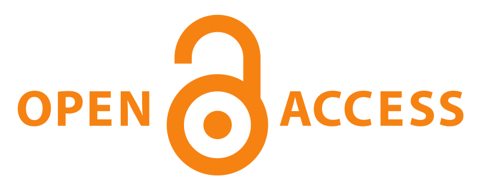

A few months back, I posted a [series of pledges](http://www.scottbot.net/HIAL/?page_id=3086) about being a good scholarly citizen. Among other things, I pledged to keep my data and code open whenever possible, and to fight to retain the right to distribute materials pending and following their publication. I also signed the [Open Access Pledge](http://www.openaccesspledge.com/). Since then, a [petition boycotting Elsevier](http://thecostofknowledge.com/) cropped up with [very similar goals](http://gowers.files.wordpress.com/2012/02/elsevierstatementfinal.pdf), and as of this writing has nearly 7,000 signatures.

As a young scholar with as-yet no single authored publications (although one is pending in the forward-thinking [Journal of Digital Humanities](http://digitalhumanitiesnow.org/the-journal-of-digital-humanities/), which you should all go and peer review), I had to think very carefully in making these pledges. It’s a dangerous world out there for people who aren’t free to publish in whatever journal they like; reducing my publication options is not likely to win me anything but good karma.

With that in mind, I actually was careful never to pledge *explicitly* that I would not publish in closed access venues; rather, I pledged to “Freely distribute all published material for which I have the right, and to fight to retain those rights in situations where that is not the case.” The pressure of the eventual job market prevented me from saying anything stronger.

Today, my resolve was tested. A [recent CFP](http://www.zetabooks.com/cfp-jems-2012-fall-issue-shaping-the-republic-of-letters.html) solicited papers about “Shaping the Republic of Letters: Communication, Correspondence and Networks in Early Modern Europe.” This is, essentially, the exact topic that I’ve been studying and analyzing for the past several years, and I recently finished a draft of a paper on this topic precisely. The paper utilizes methodologies not-yet prevalent in the humanities, and I’d like the opportunity to spread the technique as quickly and widely as possible, in the hopes that some might find it useful or at least interesting. I also feel strongly that the early and open dissemination of scholarly production is paramount to a healthy research community.

I e-mailed the editor asking about access rights, and he sent a very kind reply, saying that, unfortunately, any article in the journal must be unpublished (even on the internet), and cannot be republished for two years following its publication. The journal itself is part of a small press, and as such is probably trying to get itself established and sold to libraries, so their reticence is (perhaps) understandable. However, I was faced with a dilemma: submit my article to them, going against the spirit – though not the letter – of my pledge, or risk losing a golden opportunity to submit my first single-authored article to a journal where it would actually fit.

In the end, it was actually the object of my study itself – the Republic of Letters – that convinced me to make a stand and not submit my article. The Republic, a self-titled community of 17th <!-- page 2 --> century scholars communicating widely by post, was embodied by the ideal of universal citizenship and the free flow of knowledge. While they did not live up to this ideal, in large part because of the technologies of the time, we now are closer to being able to do so. I need to do my part in bringing about this ideal by taking a stand on the issues of open access and dissemination.

The below was my e-mail to the editor:

> Many thanks for your fast reply.

> Unfortunately, I cannot submit my article unless those conditions are changed. I fear they represent a policy at odds with the past ideals and present realities of scholarly dissemination. The ideals of the Republic of Letters, regarding the free flow of information and universal citizenship, are finally becoming attainable (at least in some parts of the world) with nigh-ubiquitous web access. In a world as rapidly changing as our own, immediate access to the materials of scholarly production is becoming an essential element not just of *science*, in the English sense of the word, but *wissenschaft* at large. [Numerous](http://www.plosone.org/article/info%3Adoi%2F10.1371%2Fjournal.pone.0013636) [studies](http://www.istl.org/10-winter/article2.html) [have](http://opcit.eprints.org/oacitation-biblio.html) [shown](http://onlinelibrary.wiley.com/doi/10.1002/asi.20898/full) that the open availability of electronic prints for an article increases readership and citations (both to the author and to the journal), reduces the time to the adoption of new ideas, and facilitates a more rapidly innovating and evolving literature in the scholarly world. While I empathize that you represent a fairly small press and may be worried that the availability of pre-prints would affect [^1] sales, I have seen no studies showing this to be the case, although I would of course be open to reading such research if you know of some. In either case, it has been shown that pre-prints at worst do not affect scholarly use and dissemination in the least, and at best increase readership, citation, and impact by up to 250%.

> Good luck with your journal, and I look forward to reading the upcoming issue when it becomes available.

It’s a frightening world out there. I considered not posting about this interaction, for fear of the possibility of angering or being blacklisted by the editorial or advisory board of the press, some of whom are respected names in my intended field of study. However, fear is the enemy of change, and the support of [Bethany Nowviskie](http://nowviskie.org/) and a [host of tweeters](https://twitter.com/#!/scott_bot/status/171595262287020032) convinced me that this was the right thing to do.

With that in mind, I herewith post a draft of my article analyzing the Republic of Letters, currently titled [The Networked Structure of Scientific Growth](http://scottbot.net/uploads/weingartNetworks.pdf). Please feel free to share it for non-commercial use, citing it if you use it (but making sure to cite the published version if it eventually becomes so), and I’d love your comments if you have any. I’ll dedicate a separate post to this release later, but I figured you all deserved this after reading the whole post.

Notes:

[^1]: Big thanks to Andrew Simpson for pointing out the error of my ways!
