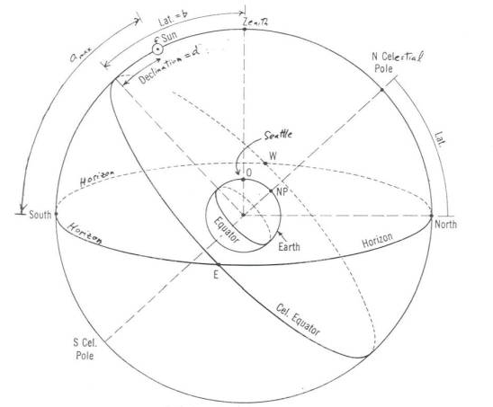
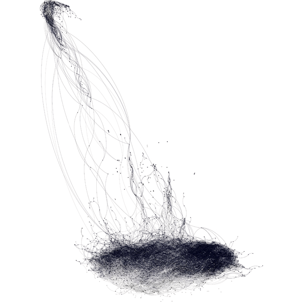
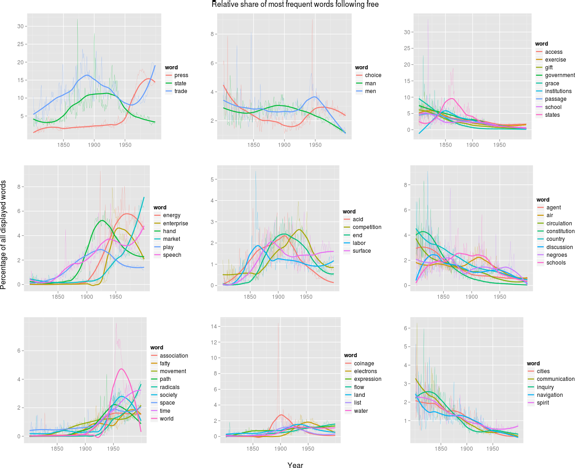

> *You can build complex arguments on a very simple foundation*
>
> –[*Ted Underwood*](http://tedunderwood.wordpress.com/2012/08/14/where-to-start-with-text-mining/)

## Celestial Navigation

The world is full of very complex algorithms honed to solve even more complex problems. When you use your phone as a GPS, it’s not a simple matter of triangulating signals from towers or satellites. Because your GPS receiver has to know the precise time (in nanoseconds) at the satellites it’s receiving signals from, and because the satellites are moving at various speeds and orbiting at an altitude where the force of gravity is significantly different, calculating times gets quite complicated due to the effects of relativity. The algorithms that allow the GPS to work have to take relativity into account, often on the fly, and without those complex algorithms the GPS would not be nearly so precise.

Precision and complexity go hand-in-hand, and often the relationship between the two is non-linear. That is, a little more precision often requires *a lot* more complexity. Ever-higher levels of precision get exponentially more difficult to achieve. The traditional humanities is a great example of this; a Wikipedia article can sum up most of what one needs to know regarding, say, World War I, but it takes many scholars many lifetimes to learn *everything*. And the more that’s already been figured out, the more work we need to do to find the smallest next piece to understand.

<!-- page 2 -->

This level of precision is often important, insightful, and necessary to make strides in a field. Whereas before an earth-centered view of the universe was *good enough* to aid in navigation and predict the zodiac and the seasons, a heliocentric model was required for more precise predictions of the movements of the planets and stars. However, these complex models are not always the best ones for a given situation, and sometimes simplicity and a bit of cleverness can go much further than whatever convoluted equation yields the most precise possible results.

Sticking with the example of astronomy, many marine navigation schools still teach the geocentric model; not because they don’t realize the earth moves, but because navigation is simply easier when you pretend the earth is fixed and everything moves around it. They don’t need to tell you exactly when the next eclipse will be, they just need to figure out where they are. Similarly, your phone can usually pinpoint you within a few blocks by triangulating itself between cellphone towers, without ever worrying about satellites or Einstein.

<!-- page 3 -->

Geocentric celestial navigation chart from a [class assignment](http://www.astro.washington.edu/courses/labs/clearinghouse/labs/Skywatch/CelestialNavigation1.htm).

Whether you need to spend the extra time figuring out relativistic physics or heliocentric astronomical models depends largely on your purpose. If you’re just trying to find your way from Miami to New York City, and for some absurd reason you can only rely on technology you’ve created yourself for navigation, the simpler solution is probably the best way to go.

## Simplicity and Macroanalysis

If I’ve written over-long on navigation, it’s because I believe it to be a particularly useful metaphor for large-scale computational humanities. Franco Moretti calls it [distant reading](http://www.amazon.com/Graphs-Maps-Trees-Abstract-Literary/dp/1844670260), Matthew Jockers calls it [macroanalysis](http://www.matthewjockers.net/2011/07/01/on-distant-reading-and-macroanalysis/), and historians call it… well, I don’t think we’ve come up with a name for it yet. I’d like to think we large-scale computational historians share a lot in spirit with [big history](http://en.wikipedia.org/wiki/Big_History), though I rarely see that connection touched on. [My advisor](http://ella.slis.indiana.edu/~katy/) likes shifting the focus from what we’re looking at to what we’re looking through, calling tools that help us see the whole of something [macroscopes](http://cacm.acm.org/magazines/2011/3/105316-plug-and-play-macroscopes/fulltext), as opposed to the microscopes which help us reach ever-greater precision.

Whatever you choose to call it, the important point is the shifting focus from precision to contextualization. Rather than exploring a particular subject with ever-increasing detail and care, it’s important to sometimes take a step back and look at how everything fits together. It’s a tough job because ‘everything’ is really quite a lot of things, and it’s easy to get mired in the details. It’s easy to say “well, we shouldn’t look at the data this way because it’s an oversimplification, and doesn’t capture the nuance of the text,” but capturing the nuance of the text isn’t the point. I have to admit, I sent an email to that effect to Matthew Jockers regarding his recent [DH2012 presentation](http://www.dh2012.uni-hamburg.de/conference/programme/abstracts/computing-and-visualizing-the-19th-century-literary-genome/), suggesting that time and similarity were a poor proxy for influence. But that’s not the point, and I was wrong in doing so, because the data still support his argument of authors clustering stylistically and thematically by gender, regardless of whether he calls the edges ‘influence’ or ‘similarity.’

<!-- page 4 -->

I wrote a post a few months back on [halting conditions](http://www.scottbot.net/HIAL/?p=12736), figuring out that point when adding more and more detailed data stops actually adding to the insight and instead just contributes to the complexity of the problem. I wrote

> *Herein lies the problem of humanities big data. We’re trying to measure the length of a coastline by sitting on the beach with a ruler, rather flying over with a helicopter and a camera. And humanists know that, like the sandy coastline shifting with the tides, our data are constantly changing with each new context or interpretation. Cartographers are aware of this problem, too, but they’re still able to make fairly accurate maps.*

And this is the crux of the matter. If we’re trying to contextualize our data, if we’re trying to open our arms to collect everything that’s available, we need to keep it simple. We need a map, a simple way to navigate the deluge that is human history and creativity. This map will not be hand-drawn with rulers and yard-sticks, it will be taken via satellite, where only the broadest of strokes are clear. Academia, and especially the humanities, fetishizes the particular at the expense of the general. General knowledge is overview knowledge, is elementary knowledge. Generalist is a dirty word lobbed at popular authors who wouldn’t know a primary source if it fell on their head from the top shelf, covering them in dust and the smell of old paper.

Generality is not a vice. Simplicity can, at times, be a virtue. Sometimes *you just want to know where the hell you are*.

For these maps, a reasonable approximation is often good enough for most situations. Simple triangulation is good enough to get you from Florida to New York, and simply counting the number of dissertations published at ProQuest in a given year for a particular discipline is good enough to approximate the size of one discipline compared to another. Both lack nuance and are sure to run you into some trouble at the small scale, but often that scale is not necessary for the task at hand.

<!-- page 5 -->

Two situations clearly shout for reasonable approximations; general views and contextualization. In the image below Matthew Jockers showed that formal properties of novels tend to split around the genders of their authors; that is, men wrote differently and about different things than women.

[Network graph of 19th century novels](http://www.dh2012.uni-hamburg.de/conference/programme/abstracts/computing-and-visualizing-the-19th-century-literary-genome/), with nodes (novels) colored according to the gender of their authors.

Of course this macroanalysis lacks a lot of nuance, and one can argue for years which set of measurements might yield the best proxy for novel similarity, but as a base approximation the split is so striking that there is little doubt the apparent split is indicative of something interesting actually going <!-- page 6 --> on. Jockers has successfully separated signal from noise. This is a great example of how a simple approximation is *good enough* to provide a general overview, a map offering one useful view of the literary landscape.

Beyond general overviews and contextualizations, simple models and quantifications can lead to surprisingly concrete and particular results. Take Strato, a clever observer who died around 2,300 years ago. There’s a lot going on after a rainstorm. The sun glistens off the moist grass, little insects crawl their way out of the ground, water pours from the corners of the roof. Each one of these events are themselves incredibly complex and can be described in a multitude of ways; with water pouring from a roof, for example, you can describe the thickness of the stream, or the impression the splash makes on the ground below, or the various murky colors it might take depending on where it’s dripping from. By isolating one property of the pouring rainwater, the fact that it tends to separate into droplets as it gets closer to the ground, Strato figured out that the water moved faster the further it had fallen. That is, **falling bodies accelerate**. Exactly measuring that acceleration, and quite how it worked, would elude humankind for over a thousand years, but a very simple observation that tended to hold true in many situations was *good enough* to discover a profound property of physics.

A great example of using simple observations to look at specific historical developments is Ben Schmidt’s [Poor man’s sentiment analysis](http://sappingattention.blogspot.com/2012/02/poor-mans-sentiment-analysis.html#more). By looking at words that occur frequently after the word ‘free’ in millions of books, Ben is able to show the decreasing centrality of ‘freedom of movement’ after its initial importance in the 1840s, or the drop in the use of ‘free men’ after the fall of slavery. Interesting changes are also apparent in the language of markets and labor which both fit well with our understanding of the history of the concepts, and offer new pathways to study, especially around inflection points.

<!-- page 7 -->

[Ben Schmidt](http://sappingattention.blogspot.com/2012/02/poor-mans-sentiment-analysis.html#more) looks at the words that appear most frequently following the word ‘free’ in the [google ngrams corpus](http://books.google.com/ngrams).

## Toward Simplicity

Complex algorithms and representations are alluring. Ben Fry says of network graphs

> *Even though a graph of a few hundred nodes quickly becomes unreadable, it is often satisfying for the creator because the resulting figure is elegant and complex and may be subjectively beautiful, and the notion that the creator’s data is “complex” fits just fine with the creator’s own interpretation of it.*

And the same is often true of algorithms; the more complex the algorithm, the more we feel it somehow ‘fits’ the data, because we know our data are so complex to begin with. Oftentimes, however, the simplest solution is good enough (and often *really good*) for the broadest number of applications.

<!-- page 8 -->

If there is any take-home message of this post, as a follow-up to my previous one on Halting Conditions, it’s that diminishing returns doesn’t just apply to the amount of data you’ve collected, it also applies to the analysis you plan on running them through. More data aren’t always better, and newer, more precise, more complex algorithms aren’t always better.

Spend your time coming up with clever, simpler solutions so you have more time to interpret your results soundly.

---

## Reader Comments

> **[Trevor](http://trevorowens.org/)**, September 13, 2012
>
> Great post. I think your last sentence there is just spot on.
>
> This reminds me of David Freedman’s fantastic paper “Statistical Models and Shoe Leather” from 1991 [http://www.jstor.org/stable/270939](http://www.jstor.org/stable/270939)
>
> In his case he is particularly focused on regression models (but I think it applies more generally). He argues that frequently regression models “make it all too easy to substitute technique for work.”

<!-- page 9 -->

>> **Scott Weingart**, September 13, 2012
>>
>> This is a brilliant paper, thank you!
