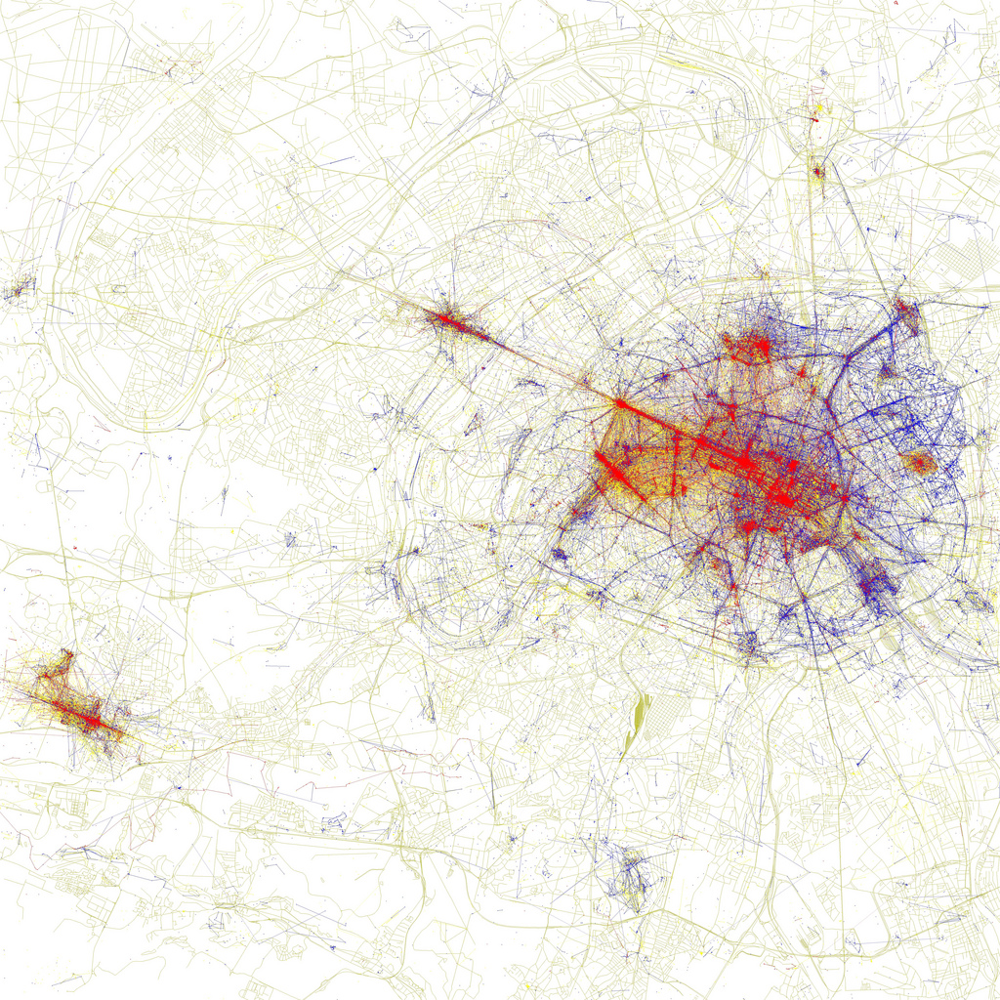

I have a dirty admission to make: I think yesterday happened. Actually. Objectively. Stuff happened. I hear that’s still a controversial statement in some corners of the humanities, but I can’t say for sure; I generally avoid those corners. And I think descriptions of the historical evidence can vary in degrees of accuracy, separating logically coherent but historically implausible conspiracy theories from more likely narratives.

At the same time, what we all think of as the past is a construct. A bunch of people – historians, cosmologists, evolutionary biologists, your grandmother who loves to tell stories, you – have all worked together to construct and reconstruct the past. Lots of pasts, actually, because no two people can ever wholly agree; everybody sees the evidence through the lens of their own historical baggage.

I’d like to preface this post with the cautious claim that I am an outsider explaining something I know less about than I should. The hats I wear are information/data scientist and historian of science, and through some accident of the past, historians and historians of science have followed largely separate cultural paths. Which is to say, neither the historian of science in me nor the information scientist has a legitimate claim to the narrative of general history and the general historical process, but I’m attempting to write one anyway. I welcome any corrections or admonishments.

## The Narrativist Individual

I use in this post (and in life in general) the vocabulary definitions of Aviezer Tucker, who is doing groundbreaking work on simple stuff like defining “history” and asking questions about what we can know about the past.[^1] “History,” Tucker defines, is simply stuff that happened: the past itself. “Historians” are anybody who inquires about the past, from cosmologists to historical linguists. A “historiography” is a knowledge of the past, or more concretely, something a historian has written about the past. “Historiographic research” is what we historians do when we try to find out about the past, and a “historiographic narrative” is generally the result of a lot of that research strung together.[^2]

Narratives are important. In the 1970s, a bunch of historians began realizing that historians create narratives when they collect their historiographic research[^3]; that is, people tell stories about the past, using the same sorts of literary and rhetorical devices used in many other places. History itself is a giant jumble of events and causal connections, and representing it *as it actually happened* would be completely unintelligible and philosophically impossible, without recreating the universe from scratch. Historians look at evidence of the past and then impose an order, a pattern, in reconstructing the events to create their own unique historiographic narratives.

The narratives historians write are inescapably linked to their own historical baggage. Historians are biased and imperfect, and they all read history through the filter of themselves. Historiographic reconstructions, then, are as much windows into the historians themselves as they are windows into the past. The narrativist turn in historiography did a lot to situate the historian herself as a primary figure in her narrative, and it became widely accepted that instead of getting closer to some ground truth of history, historians were in the business of building consistent and legible narratives, their own readings of the past, so long as they were also consistent with the evidence. Those narratives became king, both epistemologically and in practice; historical knowledge is narrative knowledge.

Because narrative knowledge is a knowledge derived from lived experience – the historian sees the past in his own unique light – this emphasized the importance of the individual in historiographic research. Because historians neither could (nor by and large were) attempting to reach an objective ground-truth about the past, any claim to knowledge rested in the lone historian and how *he* read the past and how *he* presented his narrative. What resulted was a (fairly justified, given their conceptualization of historiographic knowledge) fetishization of the individual, the autonomous historian.

When multiple authors write a historiographic narrative, something almost ineffable is lost: the individual perspective which drives the narrative argument, part of the essential claim-to-knowledge. In a recent discussion with Ben Schmidt about autonomous humanities work vs. collaboration ([the original post](http://sappingattention.blogspot.com/2012/11/reading-digital-sources-case-study-in.html); [my post](/blog/in-defense-of-collaboration/); [Ben’s reply](http://t.co/S3h3RnzY)), Ben pointed out “**all the Stanley Fishes out there have reason to be discomfited that DHers revel so much in doing away with** not only the printed monograph, traditional peer review, and close reading, but also <!-- page 2 --> **the very institution of autonomous, individual scholarship**. Erasmus could have read the biblical translations out there or hired a translator, but he went out and learned Greek [**emphasis** added].” I think a large part of that drive for autonomy (beyond the same institutional that’s-how-we’ve-always-done-it inertia that lone natural scientists felt at the turn of the last century) is the situatedness-as-a-way-of-knowing that imbues historiographic research, and humanistic research in general.

I’m inclined to believe that historians need to move away from an almost purely narrative epistemology; keeping in sight that all historiographic knowledge is individually constructed, remaining aware that our overarching cultural knowledge of the past is socio-technically constructed, but not letting that cripple our efforts at coordinating research, at reaching for some larger [consilience](http://en.wikipedia.org/wiki/Consilience) with the other historical research programs out there, like paleontology and cosmology and geology. Computational methodologies will pave the way for collaborative research both because they allow it, and because they require it.

## Collaboratively Constructing Paris

This is a map of Paris.

<!-- page 3 -->

Map of Paris with dots representing photos taken and posted on Flickr. Red dots are pictures taken by tourists, blue are by locals, and yellow are unknown. [via Eric Fischer](http://www.flickr.com/photos/walkingsf/4671584999/in/set-72157624209158632).

On top of this map of Paris are red, blue, and yellow dots. The red dots are the locations of pictures taken and posted to Flickr by tourists to Paris; blue dots are where locals took pictures; yellow dots are unknown. The resulting image maps and differentiates touristic and local space by popularity, at least among Flickr users. It is a representation that would have been staggeringly difficult for an outsider to create without this sort of data-analytic approach, and yet someone intimately familiar with the city could look at this map and not be surprised. Perhaps they could even recreate it themselves.

What is this knowledge of Paris? It’s surely not a subjective representation of the city, not unless we stretch the limits of the word beyond the internally experienced and toward the collective. Neither is it an objective map[^4] of the city, external to the whims of the people milling about within. The map represents an aggregate of individual experiences, a kind of hazy middle ground within the usual boundaries we draw between subjective and objective truth. This is an epistemological and ontological problem I’ve been wondering about for some time, without being <!-- page 4 --> able to come up with a good word for it until a conversation with a colleague last year.

“This is my problem,” I told Charles van den Heuvel, explaining my difficulties in placing these maps and other similar projects on the -jectivity scale. “They’re not quite intersubjective, not in the way the word is usually used,” I said, and Charles just looked at me like I was missing something excruciatingly obvious. “What is it when a group of people believe or do or think common things in aggregate?”—Charles asked—”isn’t that just called culture?” I initially disagreed, but mostly because it was so obvious that I couldn’t believe I’d just passed it over entirely.

In 1976, the infamous Stanley Milgram and co-author Denise Jodelet[^5] responded to Durkheim’s emphasis on “the objectivity of social facts” by suggesting “that we understand things from the actor’s point of view.” To drive this point home, Milgram decides to map Paris. People “have a map of the city [they live in] in their minds,” Milgram suggests, and their individual memories and attitudes flavor those internal representations.

This is a good example to use, for Milgram, because cities themselves are socially constructed entities; what is a city without its people who live in and build it? Milgram goes on to suggest that people’s internal representations of cities are similarly socially constructed, that “such representations are themselves the products of social interaction with the physical environment.” In the ensuing study, Milgram asks 218 subjects to draw a non-tourist map of Paris as it seems to them, including whatever features they feel relevant. “Through selection, emphasis and distortion, the maps became projections of life styles.”

Milgram then compares all the maps together, seeking what unifies them: first and foremost, the city limits and the Seine. The river is distorted in a very particular way in nearly all maps, bypassing two districts entirely and suggesting they are of little importance to those who drew the maps. The center of the city, Notre Dame and the Île de la Cité, also remains constant. Milgram opposes this to a city like New York, the subject of a later similar study, whose center shifts slowly northward as the years roll by. Many who drew maps of either New York or Paris included elements they were not intimately familiar with, but they knew were socially popular, or were frequent spots of those in their social circles. Milgram concludes “the social representations of the city are more than disembodied maps; they are mechanisms whereby the bricks, streets, and physical geography of a place are endowed with social meaning.”

It’s worth posting a large chunk of Milgram’s earlier article on the matter:

> A city is a social fact. We would all agree to that. But we need to add an important corollary: the perception of a city is also a social fact, and as such needs to be studied in its collective as well as its individual aspect. It is not only what *exists* but what is *highlighted* by the community that acquires salience in the mind of the person. A city is as much a collective representation as it is an assemblage of streets, squares, and buildings. We discern the major ingredients of that representation by studying not only the mental map in a specific individual, but by seeing what is shared among individuals.

## Collaboratively Constructing History

Which brings us back to the past.[^6] Can collaborating historians create legitimate narratives if they are not well-founded in personal experience? What sort of historical knowledge is collective historical knowledge? To this question, I turn to blogger Alice Bell, who wrote a delightfully short post discussing the [social construction of science](http://alicerosebell.wordpress.com/2012/09/24/social-construction-of-science/).  She writes about scientific knowledge, simply, “Saying science is a social construction does not amount to saying science is make believe.” Alice compares knowledge not to a city, like Paris, but to a building like St. Paul’s Cathedral or a scientific compound like CERN; socially constructed, but physically there. Real. Scientific ideas are part of a similar complex.

The social construction of historiographic narratives is painfully clear even without co-authorships, in our endless circles of acknowledgements and references. Still, there seems to be a good deal of push-back against explicit collaboration, where the entire academic edifice no longer lies solely in the mind of one historian (if indeed it ever had). In some cases, this push-back is against the epistemological infrastructure that requires the *person* in personal narrative. In others, it is because without full knowledge of each of the moving parts in a work of scholarship, that work is more prone to failure due to theories or methodologies not adequately aligning.

I fear this is a dangerous viewpoint, one that will likely harm both our historiographic research and our cultural relevancy, as other areas of academia become more comfortable with large-scale collaboration. Single authorship for its own sake is as dangerous as collaboration for its own sake, but it has the advantage of being a tradition. We must become comfortable with the hazy middle ground between an unattainable absolute objectivity and an unscalable personal subjectivity, willing to learn how to construct our knowledge as Parisians construct <!-- page 5 --> their city. The individual experiences of Parisians are without a doubt interesting and poignant, but it is the combined experiences of the locals and the tourists that makes the city what it is. Moving beyond the small and individual isn’t just getting past the rut of microhistories that historiography is still trying to escape—it is also getting past the rut of individually driven narratives and toward unified collective historiographies. We have to work together.

Notes:

Notes:

[^1]: Tucker, Aviezer. 2004. *Our Knowledge of the Past: A Philosophy of Historiography*. Cambridge University Press.
[^2]: Tucker, Aviezer, ed. 2009. *A Companion to the Philosophy of History and Historiography*. [http://www.wiley.com/WileyCDA/WileyTitle/productCd-1405149086.html](http://www.wiley.com/WileyCDA/WileyTitle/productCd-1405149086.html).
[^3]: Kuukkanen, Jouni-Matti. 2012. “The Missing Narrativist Turn in the Histiography of Science.” *History and Theory* 51 (3): 340–363. doi:10.1111/j.1468-2303.2012.00632.x.
[^4]: of anything besides the geolocations of Flickr pictures, in and of itself not particularly interesting
[^5]: Milgram, Stanley. 1976. “Pyschological Maps of Paris.” In *Environmental Psychology: People and Their Physical Settings*, ed. Proshansky, Ittelson, and Rivlin, 104–124. New York. Milgram, Stanley. 1982. “Cities as Social Representations.” In *Social Representations*, ed. R. Farr and S. Moscovici, 289–309.
[^6]: As opposed to bringing us Back to the Future, which would probably be more fun.
