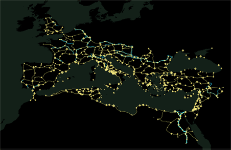
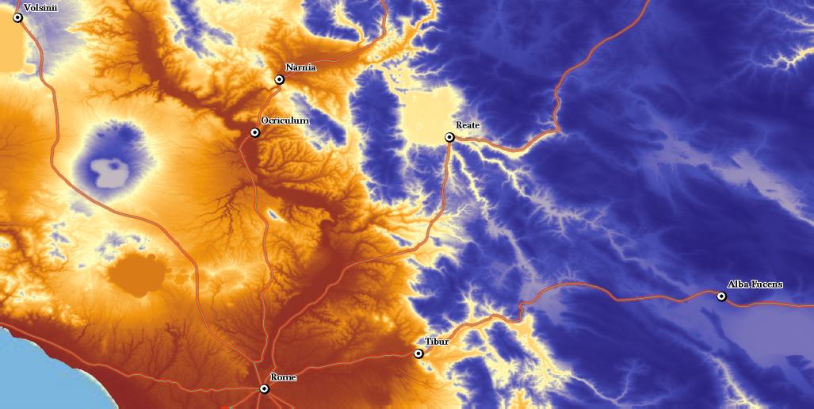
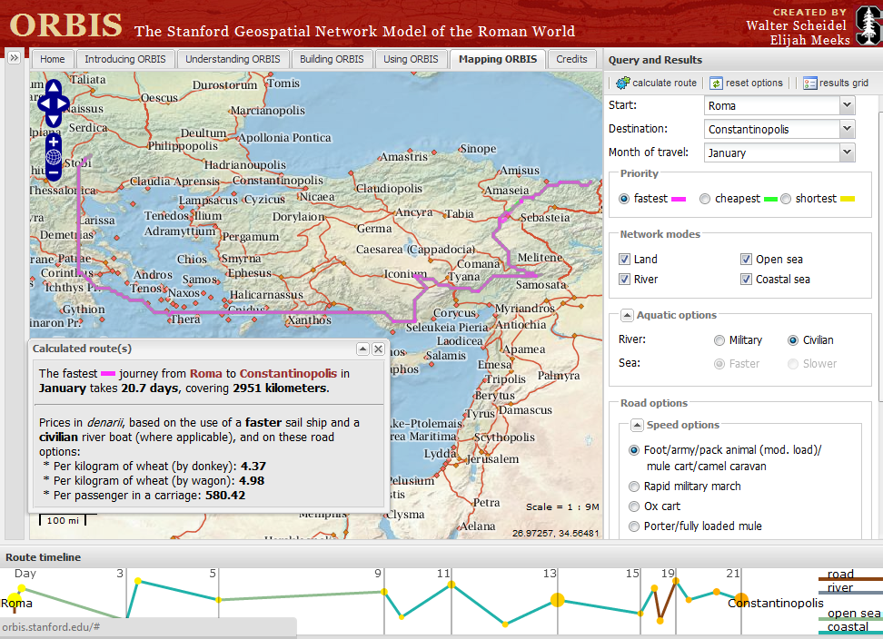
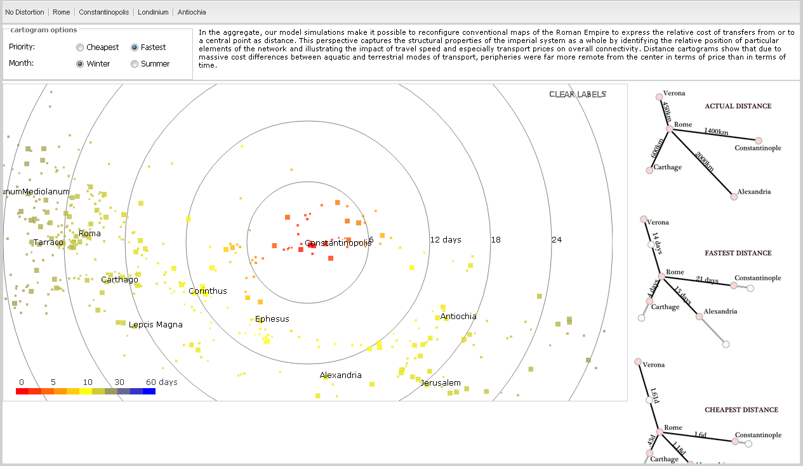

Every once in a while, a new project comes around bearing a message loud and clear: this is a sign of things to come. [ORBIS, the Stanford Geospatial Network Model of the Roman World](http://orbis.stanford.edu/), is one such project.

ORBIS was created by Walter Scheidel, Elijah Meeks, and a host of others. At the very beginning, I should point out *I am not a classicist*. The below review is of the nature rather than the content of ORBIS as a scholarly product.

Roman Travel Network

ORBIS is many things but, most simply, it is an interface allowing researchers to experience the geography of the Roman world from an ancient perspective. The executive summary: given any two cities in the ancient world, it returns the fastest, cheapest, or shortest route between them, given the month, the mode of transportation, and various other options. It’s Google Maps for the ancient world, complete with the “Avoid Highways” feature.

I was among the lucky few to see an early version of the tool, and after sending back an informal review, Elijah Meeks invited me to review the site publicly via my blog. The first section explains what I feel is the most important contribution of ORBIS to the Digital Humanities; it is a reflexive tool that allows the humanist to engage with the process as well as the product. I then highlight some of the cool features, and finally list some rough edges and desiderata for future iterations or similar projects.

## Tool As Argument

Beyond being an exceptionally well-made and useful tool, it is not the tool itself which makes ORBIS stand out. Walter Scheidel and Elijah Meeks could have posted the automated map portion of the site by itself, and it would have garnered deserving praise, but they went well beyond that goal; they made a *reflexive* tool.

ORBIS is among the first digital scholarly tools for the humanities (that I have encountered) that really lives up to the name “digital scholarly tool for the humanities.” Beyond being a simple tool, ORBIS is an explicit and transparent argument, a way of presenting research that also happens to allow, by its very existence, further research to be done. **It is a map that allows the user to engage in the process of map-making**, and a presentation of a process that allows the user to make and explore in ways the initial creators could not have foreseen. Of course, as with any project there are a few rough edges and desired features, which I’ll get into further down below.

<!-- page 2 -->

Elevation data to help model the difficulty in getting from one place to another.

Along with the map, the Makers of this project (by which I mean authors, developers, data gatherers, …) present a fairly interactive documentary of the map-making process, including historical accounts, data sources, algorithmic explanations, visual aids, downloadable data, and a forthcoming API. They built an explicit model of the ancient world, taking into account roads and rivers, oceans and coastlines, weather and geographic features, various modes of transportation for civilian and military purposes, and put it all together so any researcher can sit down and figure out how long it would have taken, or how expensive it would have been, to travel between 751 locations in the ancient Roman world. Rather than asking us to trust that their data are accurate, the makers revealed their model – their underlying argument – for critique and extension.

## Exploring the Ancient World

The ORBIS model includes 751 sites covering about 4 million square miles of ancient space, including over 50,000 miles of road or desert tracks, nearly 20,000 miles of navigable rivers and canals, and almost 1,000 sea routes between sea ports. As I mentioned earlier, the model works like Google Maps; given two locations, it tells you the cheapest, shortest, or fastest route between them. These calculations take into account the time-of-year and usual weather, elevation changes between sites, fourteen modes of travel (ox cart, foot, army on march, camel caravan, etc.), river travel (including extra difficulty moving upstream), etc.

<!-- page 3 -->

The ORBIS Interface

Another exciting feature on ORBIS is the distance cartogram. This visualization reveals the impact of travel speed and transport prices on overall connectivity; it allows the researcher to see how far other cities were with respect to a certain core city (for instance Constantinople) from the perspective of cost and travel time rather than mere geographical distance. This feature brings the researcher closer to the actual ancient Roman experience. A larger insight is revealed when taking a “distant reading” approach to the cartogram: “Distance cartograms show that due to massive cost differences between aquatic and terrestrial modes of transport, peripheries were far more remote from the center in terms of price than in terms of time.”

<!-- page 4 -->

Constantinople Cartogram

## Desiderata

ORBIS is a big step forward in designing digital scholarly objects for the digital humanities. It is a tool that is both useful and reflexive, offering engagement with both process and product. It also exemplifies an increasingly popular mode of scholarly communication: the published online object. Because the mode is still (even after decades of online DH projects) not quite solidified, ORBIS lacks a few of the basic features of common scholarly communication, and by straddling both the new and the old, ORBIS doesn’t *quite* live up to the best qualities of either digital or analog publication.

First of all, although their team sent a preliminary version of the site out to many people, it never went through any formal review process. Readers of this blog will know that I am <!-- page 5 --> no advocate of traditional publication systems or the antiquated marriage of publication and peer-review, but at this point it is worth noting that ORBIS (to my knowledge) has only been reviewed informally, by sympathetic reviewers like myself. Perhaps this means that adoption of the tool should be approached with greater caution until it is more formally reviewed by a post-publication periodical like the [Journal of Digital Humanities](http://journalofdigitalhumanities.org/).

That being said, the site does try remain true to humanistic and traditional publication roots. A paper version is in the works, and it is written such that we researchers can engage in the process of the tool. Unfortunately, it perhaps stays a bit *too* true to the paper model. The site is designed to read top-to-bottom, left-to-right, and none of the internal references to other sections include links to aid in navigation. Further, if the intent is to simultaneously allow exploration of the tool and its creation, the design does not realize this goal. The map appears at “the end” of the site, all the way on the right, and because of the layout, it is impossible to view it alongside the text describing it without opening a new window. There is quite a bit of white space to the right of the text on my wide-screen monitor – perhaps a smaller version of the tool can be embedded in that space.

One of the strengths of the project is the explicit nature of its creation. Data can be downloaded, and the sources, provenance, algorithms, and technologies are clearly stated. The model as an argument is, in short, visible and comprehensible even to those with little prior knowledge on these technologies. What this does is bridge the gap between code and humanistic inquiry, adding levels of model explication and tool-use between them. ORBIS is by far not the first project to make the creation of a tool explicit, but usually that explication is simply a public posting of the code and some limited comments or descriptions of how that code works. Unfortunately, although ORBIS does include a better bridge to explicate its argument, *it does not offer the code*. It’s a bit like David Copperfield explaining how he made the Statue of Liberty disappear; the explanation would certainly be helpful, but if he really wanted other people to be able to create similar illusions, he’d offer up the materials as well. (Alright, the metaphor doesn’t completely work, but stick with it.) The digital humanities seems finally to be getting into code sharing, and this is a *good thing*. The cost for sharing code is essentially free (although there’s a much greater price for sharing good code – all the extra time spent marking it up and making it pretty), and the benefits should go without saying: More things like ORBIS, much faster. Better tools built collectively and suiting all our individual needs.

The last, most important, and most difficult of my desires deals with uncertainty. There’s been a lot of talk about data uncertainty in the humanities lately, not least of which stemming from Stanford, the home university of ORBIS. It’s a difficult problem to solve, but presented as it is, the ORBIS project lends itself to the varieties of critiques common in the work of Johanna Drucker and others. How do you know that these were the shortest routes? What about missing information? What about the fact that every bit of travel was its own experience, with different human and environmental factors playing in, perhaps delays for sick relatives or mutineering seamen? These questions are swept under the table when ORBIS presents one route and one set of numbers per query: here, *this* is the fastest route, *these* are the cities, *this* is how much it would cost. The visualization and end-products create an illusion of certainty in the data, although in the text, the makers are quick to point out that a researcher should not take it as certain. One solution, and this extends to *all* data-driven DH projects, is to model uncertainty in the data from the ground up. How much more certain is one route than another? How certain are you of the weather in one location compared to the weather elsewhere? This sort of information flows naturally into [models of Bayesian data analysis](/blog/doing-bayesian-data-analysis/), and would allow ORBIS to deliver a list of *credible* routes, revealing which parts of those routes are more or less certain, and including other information like the probability of a ship being lost at sea on a particular route. Of course, data uncertainty is only part of the problem, and this would only be a partial solution.

This isn’t the place to detail exactly how uncertainty should be modeled in the data, and exactly what ought to be done with it, but the fact is there is *already* rich knowledge in the model and in the data available dealing with the uncertainty of travel, but that information disappears as soon as it is presented in the map interface. If ORBIS represents the next step in humanities tool production, it doesn’t quite (yet) live up to the promise of humanities data analysis, impressive as their analysis is. There is still not yet a clear enough representation of uncertainty and interpretation to reach that goal. To be fair, I’ve yet to see a single project living up to that promise at anything close to large-scale; the tools just haven’t been developed yet. Perhaps that promise is impossible at large scale, although I certainly hope that is not the case.

## The View From Here

Despite my long list of rough edges and desiderata, I still stand by my statement that this tool is an exemplar of a shift in digital humanities projects. The tool itself is profoundly impressive and will prove useful for a variety of research, but what stands out from the humanities standpoint is the explicit nature of the ORBIS underbelly. It blurs the line between tool and argument. There are other profoundly impressive and useful tools out there (topic modeling comes to mind). However, with topic modeling, the assumptions are still obscure to the unfamiliar, despite [my own best efforts](/blog/topic-modeling-and-network-analysis/) and the [even better efforts of others](http://tedunderwood.wordpress.com/2012/04/07/topic-modeling-made-just-simple-enough/). This is because the software topic modeling is packaged with, the software we use to run the analyses, does not simultaneously engage in the process of its own creation in the way that ORBIS does. Going forward, I predict the most used (or at least the most useful) digital tools for humanists will include that engagement, rather than existing as black boxes out of which results spring forth, fully armed and ready to battle as Athena from Zeus’s forehead. ORBIS is by no means the first to attempt such a feat but, I think, it is as-yet the most successful.
