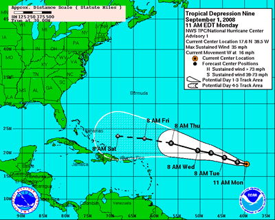

This post is about computer models and how they relate to historical research, even though it might not seem like it at first. Or at second. Or third. But I encourage anyone who likes history and models to stick with it, because it gets to a distinction of model use that isn’t made frequently enough.

## Music in a vacuum

Imagine yourself uninfluenced by the tastes of others: your friends, their friends, and everyone else. It’s an effort in absurdity, but try it, if only to pin down how their interests affect yours. Start with something simple, like music. If you want to find music you liked, you might devise a program that downloads random songs from the internet and plays them back without revealing their genre or other relevant metadata, so you can select from that group to get an unbiased sample of songs you like. It’s a good first step, given that you generally find music by word-of-mouth, seeing your friends’ last.fm playlists, listening to what your local radio host thinks is good, and so forth. The music that hits your radar is determined by your social and technological environment, so the best way to break free from this stifling musical determinism is complete randomization.

So you listen to the songs for a while and rank them as best you can by quality, the best songs (Stairway to Heaven, Shine On You Crazy Diamond, [I Need A Dollar](http://www.youtube.com/watch?v=_Zx-QNIGZ8Y)) at the very top and the worst (Ice Ice Baby, Can’t Touch This, that Korean song that’s been all over the internet recently) down at the bottom of the list. You realize that your list may not be a necessarily *objective* measurement of quality, but it definitely represents a hierarchy of quality to you, which is real enough, and you’re sure if your best friends from primary school tried the same exercise they’d come up with a fairly comparable order.

Friends don’t let friends share music. [via](http://www.flickr.com/photos/renedepaula/317079853/in/photostream/).

Of course, the fact that your best friends would come up with a similar list (but school buddies today or a hundred years ago wouldn’t) reveals another social aspect of musical tastes; there is no <!-- page 2 --> ground truth of objectively good or bad music. Musical tastes are (largely) socially constructed[^1], which isn’t to say that there isn’t any *real* difference between good and bad music, it’s just that the evaluative criteria (what aspects of the music are important and definitions of ‘good’ and ‘bad’) are continuously being defined and redefined by your social environment. Alice Bell wrote the [best short explanation I’ve read in a while on how something can be both real and socially constructed](http://alicerosebell.wordpress.com/2012/09/24/social-construction-of-science/).

There you have it: other people influence what songs we listen to out of the set of good music that’s been recorded, and other people influence our criteria for defining good and bad music to begin with. This little thought experiment goes a surprisingly long way in explaining why computational models are pretty bad at predicting Nobel laureates, best-selling authors, box office winners, pop stars, and so forth. Each category is ostensibly a mark of quality, but is really more like a game of musical chairs masquerading as a meritocracy.[^2]

Sure, you (usually) need to pass a certain threshold of quality to enter the game, but once you’re there, whether or not you win is anybody’s guess. Winning is a game of chance with your generally equally-qualified peers competing for the same limited resource: membership in the elite. Merton ([1968](http://www.garfield.library.upenn.edu/merton/matthew1.pdf)) compared this phenomenon to the French Academy’s “Forty-First Chair,” because while the Academy was limited to only forty members (‘chairs’), there were many more who were also worthy of a seat but didn’t get one when the music stopped: Descartes, Diderot, Pascal, Proust, and others. It was almost literally a game of musical chairs between great thinkers, much in the same way it is today in so many other elite groups.

Musical Chair. [via](http://www.mathewaudio.com/musical_chair.php).

Merton’s [same 1968 paper](http://www.garfield.library.upenn.edu/merton/matthew1.pdf) described the mechanism that tends to pick the winners and losers, which he called the ‘Matthew Effect,’ but is also known as ‘Preferential Attachment,’ ‘Rich-Get-Richer,’ and all sorts of other names besides. The idea is that you need money to make money, and the more you’ve got the more you’ll get. In the music world, this manifests when a garage band gets a lucky break on some local radio station, which leads to their being heard by a big record label company who releases the band nationally, where they’re heard by even *more* people who tell their friends, who in turn tell *their* friends, and so on and so on until the record company gets rich, the band hits the top 40 charts, and the musicians find themselves desperate for a fix and asking for only blue skittles in their show riders. Okay, maybe they don’t *all* turn out that way, but if it sounds like a slippery slope it’s because it *is* one. In complex systems science, this is an example of a positive feedback loop, where what happens in the future is reliant upon and tends to compound <!-- page 3 --> what happens just before it. If you get a little fame, you’re more likely to get more, and with that you’re more likely to get *even more*, and so on until Lady Gaga and Mick Jagger.

Rishidev Chaudhuri does a great job [explaining this with bunnies](http://www.3quarksdaily.com/3quarksdaily/2012/10/dynamical-systems-part-i.html?utm_source=feedburner&utm_medium=feed&utm_campaign=Feed%3A+3quarksdaily+%283quarksdaily%29), showing that if 10% of rabbits reproduce a year, starting with a hundred, in a year there’d be 110, in two there’d be 121, in twenty-five there’d be a thousand, and in a hundred years there’d be over a million rabbits. Feedback systems (so-named because the past results feed back on themselves to the future) multiply rather than add, with effects increasing exponentially quickly. When books or articles are read, each new citation increases its chances of being read and cited again, until a few scholarly publications end up with thousands or hundreds of thousands of citations when most have only a handful.

This effect holds true in Nobel prize-winning science, box office hits, music stars, and many other areas where it is hard to discern between popularity and quality, and the former tends to compound while exponentially increasing the perception of the latter. It’s why a group of musicians who are every bit as skilled as Pink Floyd wind up never selling outside their own city if they don’t get a lucky break, and why two equally impressive books might have such disproportionate citations. Add to that the limited quantity of ‘elite seats’ (Merton’s 40 chairs) and you get a situation where only a fraction of the deserving get the rewards, and sometimes the most deserving go unnoticed entirely.

## Different musical worlds

But I promised to talk  about computational models, contingency, and sensitivity to initial conditions, and I’ve covered none of that so far. And before I get to it, I’d like to talk about music a bit more, this time somewhat more empirically. Salganik, Dodds, and Watts ([2006; 10.1126/ science.1121066](http://www.sciencemag.org/content/311/5762/854.short)) recently performed a study on about 15,000 individuals that mapped pretty closely to the social aspects of musical taste I described above. They bring up some literature suggesting popularity doesn’t directly and deterministically map on to musical proficiency; instead, while quality does play a role, much of the deciding force behind who gets fame is a stochastic (random) process driven by social interactivity. Unfortunately, because history only happened once, there’s no reliable way to replay time to see if the same musicians would reach fame the second time around.

Remember Napster? [via](http://www.flickr.com/photos/krazykory/429019967/).

Luckily Salganik, Dodds, and Watts are pretty clever, so they figured out how to make history happen a few times. They designed a music streaming site for teens which, unbeknownst to the teens but knownst to us, was not actually the same website for everyone who visited. The site asked users to listen to previously unknown songs and rate them, and then gave them an option to download the music.  Some users who went to the site were *only* given these options, and the music <!-- page 4 --> was presented to them in no particular order; this was the control group. Other users, however, were presented with a different view. Besides the control group, there were eight other versions of the site that were each identical at the outset, but could change depending on the actions of its members. Users were randomly assigned to reside in one of these eight ‘worlds,’ which they would come back to every time they logged in, and each of these worlds presented a list of most downloaded songs within that world. That is, Betty listened to a song in world 3, rated it five stars, and downloaded it. Everyone in world 3 would now see that the song had been downloaded once, and if other users downloaded it within that world, the download count would iterate up as expected.

The ratings assigned to each song in the control world, where download counts were not visible, were taken to be the independent measure of quality of each song. As expected, in the eight social influence worlds the most popular songs were downloaded *a lot* more than the most popular songs in the control world, because of the positive feedback effect of people seeing highly downloaded songs and then listening to and downloading them as well, which in turn increased their popularity even more. It should also come as no surprise that the ‘best’ songs, according to their rating in the independent world, rarely did badly in their download/rating counts in the social worlds, and the ‘worst’ songs under the same criteria rarely did well in the social worlds, but the top songs differed from one social world to the next, with the hugely popular hits with orders of magnitude more downloads being completely different in each social world. Their study concludes

> We conjecture, therefore, that experts fail to predict success not because they are incompetent judges or misinformed about the preferences of others, but because when individual decisions are subject to social influence, markets do not simply aggregate pre-existing individual preferences. In such a world, there are inherent limits on the predictability of outcomes, irrespective of how much skill or information one has.

## Contingency and sensitivity to initial conditions

In the complex systems terminology, the above is an example of a system that is highly sensitive to initial conditions and contingent (chance) events. It’s similar to that popular chaos theory claim that a butterfly flapping its wings in China can cause a hurricane years later over Florida. It’s not that one inevitably leads to the other; rather, positive feedback loops make it so that very small changes can quickly become huge causal factors in the system as their effects exponentially increase. The nearly-arbitrary decision for a famous author to cite one paper on computational linguistics over another equally qualified might be the impetus the first paper needs to shoot into its own stardom. The first songs randomly picked and downloaded in each social world of the above music sharing site greatly influenced the eventual winners of the popularity contest disguised as a quality rank.

Some systems are fairly inevitable in their outcomes. If you drop a two-ton stone from five hundred feet, it’s pretty easy to predict where it’ll fall, regardless of butterflies flapping their wings in China or birds or branches or really anything else that might get in the way. The weight and density of the stone are overriding causal forces that pretty much cancel out the little jitters that push it one direction or another. Not so with a leaf; dropped from the same height, we can probably predict it won’t float into space, or fall somewhere a few thousand miles away, but barring that prediction is *really hard* because the system is so sensitive to contingent events and initial conditions.

There does exist, however, a set of systems right at the sweet spot between those two extremes; stochastic enough that predicting exactly how it will turn out is impossible, but ordered enough that useful predictions and explanations can still be made. Thankfully for us, a lot of human activity falls in this class.

<!-- page 5 -->

Tracking Hurricane Ike with models. Notice how short-term predictions are pretty accurate. (Click image watch this model animated). [via](http://www.education.noaa.gov/images/hurricanes_collection.gif).

Nate Silver, the expert behind the political prediction blog [fivethirtyeight](http://www.scottbot.net/HIAL/fivethirtyeight.blogs.nytimes.com), published a book a few weeks ago called [The Signal and the Noise: why so many predictions fail – but some don’t](http://www.amazon.com/gp/product/159420411X/ref=as_li_ss_tl?ie=UTF8&camp=1789&creative=390957&creativeASIN=159420411X&linkCode=as2&tag=thescotirre-20). Silver has an excellent track record of accurately predicting what large groups of people will do, although I bring him up here to discuss what his new book has to say about the weather. Weather predictions, according to Silver, are “highly vulnerable to inaccuracies in our data.” We understand physics and meteorology well enough that, if we had a powerful enough computer and precise data on environmental conditions all over the world, we could predict the weather with astounding precision. And indeed we do; the National Hurricane Center has become 350% more accurate in the last 25 years alone, giving people two or three day warnings for fairly exact locations with regard to storms. However, our data aren’t perfect, and slightly inaccurate or imprecise measurements abound. These small imprecisions can have huge repercussions in weather prediction models, with a few false measurements sometimes being enough to predict a storm tens or hundreds of miles off course.

To account for this, meteorologists introduce stochasticity into the models themselves. They run the same models tens, hundreds, or thousands of times, but each time they change the data slightly, accounting for where their measurements might be wrong. Run the model once pretending the wind was measured at one particular speed in one particular direction; run the model again with the wind at a slightly different speed and direction. Do this enough times, and you wind up with a multitude of predictions guessing the storm will go in different directions. “These small changes, introduced intentionally in order to represent the inherent uncertainty in the quality of the observational data, turn the deterministic forecast into a probabilistic one.” The most extreme predictions show the furthest a hurricane is likely to travel, but if most runs of the model have the hurricane staying within some small path, it’s a good bet that this is the path the storm will travel.

Silver uses a similar technique when predicting American elections. Various polls show different results from different places, so his models take this into account by [running many times and then revealing the spread of possible outcomes](http://fivethirtyeight.blogs.nytimes.com/2012/10/01/new-polls-raise-chance-of-electoral-college-tie/); those outcomes which reveal themselves most often might be considered the most likely, but Silver also is careful to use the rest of the outcomes to show the uncertainty in his models and the spread of other plausible occurrences.

Going back to the music sharing site, while the sensitivity of the system would prevent us from <!-- page 6 --> exactly predicting the most-popular hits, the musical evaluations of the control world still give us a powerful predictive capacity. We can use those rankings to predict the set of most likely candidates to become hits in each of the worlds, and if we’re careful, all or most of the most-downloaded songs will have appeared in our list of possible candidates.

## The payoff: simulating history

Simulating the plague in 19th century Canada. [via](http://simulatinghistory.com/game-design/simulation/plague-the-game/).

So what do hurricanes, elections, and musical hits have to do with computer models and the humanities, specifically history? The fact of the matter is that a lot of models are abject failures when it comes to their intended use: predicting winners and losers. The best we can do in moderately sensitive systems that have difficult-to-predict positive feedback loops and limited winner space (the French Academy, Nobel laureates, etc.) is to find a large set of *possible* winners. We might be able to reduce that set so it has fairly accurate recall and moderate precision (out of a thousand candidates to win 10 awards, we can pick 50, and 9 out of the 10 actual winners was in our list of 50). This might not be great betting odds, but it opens the door for a type of history research that’s generally been consigned to the distant and somewhat distasteful realm of speculation. It is closely related to the (too-often scorned) realm of counterfactual history (What if the Battle of Gettysburg had been won by the other side? What if Hitler had never been born?), and is in fact driven by the ability to ask counterfactual questions.

The type of historiography of which I speak is the question of evolution vs. revolution; is history driven by individual, world-changing events and Great People, or is the steady flow of history predetermined, marching inevitably in some direction with the players just replaceable cogs in the machine? The dichotomy is certainly a false one, but it’s one that has bubbled underneath a great many historiographic debates for some time now. The beauty of historical stochastic models[^3] is exactly their propensity to yield likely and unlikely paths, like the examples above. A well-modeled historical simulation[^4] can be run many times; if only one or a few runs of the model reveal what we take as the historical past, then it’s likely that set of events was more akin to the ‘revolutionary’ take on historical changes. If the simulation takes the same course every time, regardless of the little jitters in preconditions, contingent occurrences, and exogenous events, then that bit of historical narrative is likely much closer to what we take as ‘inevitable.’

Models have many uses, and though many human systems might not be terribly amenable to predictive modeling, it doesn’t mean there aren’t many other useful questions a model can help us answer. The balance between inevitability and contingency, evolution and revolution, is just one facet of history that computational models might help us explore.

<!-- page 7 -->

Notes:

Notes:

[^1]: Music has a biological aspect as well. Most cultures with music tend towards discrete pitches, discernible (discrete) rhythm, ‘octave’-type systems with relatively few notes looping back around, and so forth. This suggests we’re hard-wired to appreciate music within a certain set of constraints, much in the same way we’re hard-wired to see only certain wavelengths of light or to like the taste of certain foods over others ([Peretz 2006; doi:10.1016/j.cognition.2005.11.004](http://www.sciencedirect.com/science/article/pii/S0010027705002209)). These tendencies can certainly be overcome, but to suggest the pre-defined structure of our wet thought-machine plays no role in our musical preferences is about as far-fetched as suggesting it plays the *only* role.
[^2]: I must thank Miriam Posner for [this wonderful turn of phrase](http://figureground.ca/interviews/miriam-posner/).
[^3]: presuming the historical data and model specifications are even accurate, which is a whole different can of worms to be opened in a later post
[^4]: Seriously, see the last note, this is really hard to do. Maybe impossible. But this argument is just assuming it isn’t, for now.
