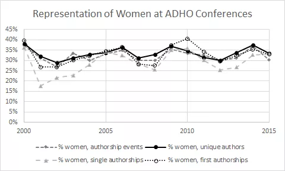

*Nickoal Eichmann (corresponding author), Jeana Jorgensen, Scott B. Weingart*[^1]

NOTE: This is a pre-peer reviewed draft submitted for publication in *Feminist Debates in Digital* *Humanities*, eds. Jacque Wernimont and Elizabeth Losh, University of Minnesota Press (2017). Comments are welcome, and a downloadable dataset / more figures are forthcoming. This chapter will be released alongside another on the history of DH conferences, co-authored by Weingart & Eichmann (forthcoming), which will go into further detail on technical aspects of this study, including the data collection & statistics. Many of the materials first appeared [on this blog](http://scottbot.net/tag/dhconf/). To cite this preprint, use the figshare DOI:  [https://dx.doi.org/10.6084/m9.figshare.3120610.v1](https://dx.doi.org/10.6084/m9.figshare.3120610.v1)

## Abstract

Digital Humanities (DH) is said to have a [light side](https://twitter.com/dh_enthusiast) and a [dark side](https://twitter.com/dhdarksider). Niceness, globality, openness, and inclusivity sit at one side of this binary caricature; commodification, neoliberalism, techno-utopianism, and white male privilege sit at the other. At times, the plurality of DH embodies both descriptions.

We hope a diverse and critical DH is a goal shared by all. While DH, [like the humanities](http://dhdebates.gc.cuny.edu/debates/text/34) writ large, is [not a monolith](http://nowviskie.org/2014/asking-for-it/), steps may be taken to improve its public face and shared values through positively influencing its communities. The Alliance of Digital Humanities Organizations’ ([ADHO](http://adho.org/)’s) annual conference hosts perhaps the largest such community. As an umbrella organization of six international digital humanities constituent organizations, as well as [200 DH centers](http://www.dhcenternet.org/) in a few dozen countries, ADHO and its conference ought to represent the geographic, disciplinary, and demographic diversity of those who identify as digital humanists.

The annual conference offers insight into how the world sees DH. While it may not represent the plurality of views held by self-described digital humanists, the conference likely influences the values of its constituents. If the conference glorifies Open Access, that value will be taken up by its regular attendees; if the conference fails to prioritize diversity, this too will be reinforced.

<!-- page 2 -->

This chapter explores fifteen years of DH conferences, presenting a quantified look at the values implicitly embedded in the event. Women are consistently underrepresented, in spite of the fact that the most prominent figures at the conference are as likely women as men. The geographic representation of authors has become more diverse over time—though authors with non-English names are still significantly less likely to pass peer review. The topical landscape is heavily gendered, suggesting a masculine bias may be built into the value system of the conference itself. Without data on skin color or ethnicity, we are unable to address racial or related diversity and bias here.

There have been some improvements over time and, especially recently, a growing awareness of diversity- related issues. While many of the conference’s negative traits are simply reflections of larger entrenched academic biases, this is no comfort when self-reinforcing biases foster a culture of microaggression and white male privilege. Rather than using this study as an excuse to write off DH as just another biased community, we offer statistics, critiques, and suggestions as a vehicle to improve ADHO’s conference, and through it the rest of self-identified Digital Humanities.

## Introduction

Digital humanities (DH), we are told, exists under a “big tent”, with porous borders, little gatekeeping, and, heck, everyone’s just plain “nice”. Indeed, the term itself is not used definitionally, but merely as a “tactical convenience” to get stuff done without worrying so much about traditional disciplinary barriers. DH is “global”, “public”, and diversely populated. It will “save the humanities” from its crippling self-reflection (cf. this essay), while simultaneously saving the computational social sciences from their uncritical approaches to data. DH contains its own mirror: it is both humanities done digitally, and the digital as scrutinized humanistically. As opposed to the staid, backwards-looking humanities we are used to, the digital humanities “experiments”, “plays”, and even “embraces failure” on ideological grounds. In short, we are the hero Gotham needs.

Digital Humanities, we are told, is a narrowly-defined excuse to push a “neoliberal agenda”, a group of “bullies” more interested in forcing humanists to code than in speaking truth to power. It is devoid of cultural criticism, and because of the way DHers uncritically adopt tools and methods from the tech industry, they in fact often reinforce pre-existing power structures. DH is nothing less than an unintentionally rightist vehicle for techno-utopianism, drawing from the same font as MOOCs and complicit in their devaluing of education, diversity, and academic labor. It is equally complicit in furthering both the surveillance state and the surveillance economy, exemplified in its stunning lack of response to the Snowden leaks. As a progeny of the computer sciences, digital humanities has inherited the same lack of gender and racial diversity, and any attempt to remedy the situation is met with incredible resistance.

The truth, as it so often does, lies somewhere in the middle of these extreme caricatures. It’s easy to ascribe attributes to Digital Humanities synecdochically, painting the whole with the same brush as one of its constituent parts. One would be forgiven, for example, for coming away from the annual international ADHO Digital Humanities conference assuming DH were a parade of white men quantifying literary text. An attendee of HASTAC, on the other hand, might leave seeing DH as a diverse community focused on pedagogy, but lacking in primary research. Similar straw-snapshots may be drawn from specific journals, subcommunities, regions, or organizations.

But these synecdoches have power. Our public face sets the course of DH, via who it entices to engage with us, how it informs policy agendas and funding allocations, and who gets inspired to be the next generation of digital humanists. Especially important is the constituency and presentation of the annual Digital Humanities conference. Every year, several hundred students, librarians, staff, faculty, industry professionals, administrators and researchers converge for the conference, organized by the Alliance of Digital Humanities Organizations (ADHO). As an umbrella organization of six international digital humanities constituent organizations, as well as 200 DH centers in a few dozen countries, ADHO and its conference ought to represent the geographic, disciplinary, and demographic diversity of those who identify as digital humanists. And as DH is a community that prides itself on its activism and its social/public goals, if the annual DH conference does not celebrate this diversity, the DH community may suffer a crisis of identity (…okay, a *bigger* crisis of identity).

<!-- page 3 -->

So what does the DH conference look like, to an outsider? Is it diverse? What topics are covered? Where is it held? Who is participating, who is attending, and where are they coming from? This essay offers incomplete answers to these questions for fifteen years of DH conferences (2000-2015), focusing particularly on DH2013 (Nebraska, USA), DH2014 (Lausanne, Switzerland), and DH2015 (Sydney, Australia).[^2] We do so with a double-agenda: (1) to call out the biases and lack of diversity at ADHO conferences in the earnest hope it will help improve future years’ conferences, and (2) to show that simplistic, reductive quantitative methods can be applied critically, and need not feed into techno-utopic fantasies or an unwavering acceptance of proxies as a direct line to Truth. By “distant reading” DH and turning our “macroscopes” on ourselves, we offer a critique of our culture, and hopefully inspire fruitful discomfort in DH practitioners who apply often- dehumanizing tools to their subjects, but have not themselves fallen under the same distant gaze.

Among other findings, we observe a large gender gap for authorship that is not mirrored among those who simply *attend* the conference. We also show a heavily gendered topical landscape, which likely contributes to topical biases during peer review. Geographic diversity has improved over fifteen years, suggesting ADHO’s strategy to expand beyond the customary North American / European rotation was a success. That said, there continues to be a visible bias against non-English names in the peer review process. We could not get data on ethnicity, race, or skin color, but given our regional and name data, as well as personal experience, we suspect in this area, diversity remains quite low.

We do notice some improvement over time and, especially in the last few years, a growing awareness of our own diversity problems. The #whatifDH2016[^3] hashtag, for example, was a reaction to an all-male series of speakers introducing DH2015 in Sydney. The hashtag caught on and made it to ADHO’s committee on conferences, who will use it in planning future events. Our remarks here are in the spirit of #whatifDH2016; rather than using this study as an excuse to defame digital humanities, we hope it becomes a vehicle to improve ADHO’s conference, and through it the rest of our community.

## Social Justice and Equality in the Digital Humanities

## Diversity in the Academy

In order to contextualize gender and ethnicity in the DH community, we must take into account developments throughout higher education. This is especially important since much of DH work is done in university and other Ivory Tower settings. Clear progress has been made from the times when all-male, all-white colleges were the norm, but there are still concerns about the marginalization of scholars who are not white, male, able-bodied, heterosexual, or native English-speakers. Many campuses now have diversity offices and have set diversity-related goals at both the faculty and student levels (for example, see [the Ohio State University’s diversity objectives and strategies 2007-12](https://www.osu.edu/diversityplan/index.php)). On the digital front, blogs such as [Conditionally Accepted](https://www.insidehighered.com/users/conditionally-accepted), [Fight the Tower](http://fighttower.com/), [University of Venus](https://www.insidehighered.com/blogs/university-venus), and more all work to expose the normative biases in academia through activist dialogue.

<!-- page 4 -->

From both a historical and contemporary lens, there is data supporting the clustering of women and other minority scholars in certain realms of academia, from specific fields and subjects to contingent positions. When it comes to gender, the phrase “feminization” has been applied both to academia in general and to specific fields. It contains two important connotations: that of an area in which women are in the majority, and the sense of a change over time, such that numbers of women participants are increasing in relation to men (Leathwood and Read 2008, 10). It can also signal a less quantitative shift in values, “whereby ‘feminine’ values, concerns, and practices are seen to be changing the culture of an organization, a field of practice or society as a whole” (ibid).

In terms of specific disciplines, the feminization of academia has taken a particular shape. [Historian Lynn Hunt suggests the following propositions](https://www.historians.org/publications-and-directories/perspectives-on-history/may-1998/has-the-battle-been-won-the-feminization-of-history) about feminization in the humanities and history specifically: the feminization of history parallels what is happening in the social sciences and humanities more generally; the feminization of the social sciences and humanities is likely accompanied by a decline in status and resources; and other identity categories, such as ethnic minority status and age/generation, also interact with feminization in ways that are still becoming coherent.

Feminization has clear consequences for the perception and assignation of value of a given field. Hunt writes: “There is a clear correlation between relative pay and the proportion of women in a field; those academic fields that have attracted a relatively high proportion of women pay less on average than those that have not attracted women in the same numbers.” Thus, as we examine the topics that tend to be clustered by gender in DH conference submissions, we must keep in mind the potential correlations of feminization and value, though it is beyond the scope of this paper to engage in chicken-or-egg debates about the causal relationship between misogyny and the devaluing of women’s labor and women’s topics.

There is no obvious ethnicity-based parallel to the concept of the feminization of academia; it wouldn’t be culturally intelligible to talk about the “people-of-colorization of academia”, or the “non-white-ization of academia.” At any rate, [according to a U.S. Department of Education survey](https://nces.ed.gov/fastfacts/display.asp?id=61), in 2013 79% of all full-time faculty in degree-granting postsecondary institutions were white. The increase of non-white faculty from 2009 ([19.2% of the whole](https://nces.ed.gov/programs/digest/d14/tables/dt14_315.20.asp?current=yes)) to 2013 (21.5%) is very small indeed.

Why does this matter? As [Jeffrey Milem, Mitchell Chang, and Anthony Lising Antonio write](https://www.aacu.org/sites/default/files/files/mei/milem_et_al.pdf) in regard to faculty of color, “Having a diverse faculty ensures that students see people of color in roles of authority and as role models or mentors. Faculty of color are also more likely than other faculty to include content related to diversity in their curricula and to utilize active learning and student-centered teaching techniques…a coherent and sustained faculty diversity initiative must exist if there is to be any progress in diversifying the faculty” (25). By centering marginalized voices, scholarly institutions have the ability to send messages about who is worthy of inclusion.

## Recent Criticisms of Diversity in DH

In terms of DH specifically, diversity within the community and conferences has been on the radar for several years, and has recently gained special attention, as digital humanists and other academics alike have called for critical and feminist engagement in diversity and a move away from what seems to be an exclusionary culture. In January 2011, [THATCamp SoCal](http://socal2011.thatcamp.org/) included a section called “Diversity in DH,” in which participants explored the lack of openness in DH and, in the end, produced a document, “[Toward an Open Digital Humanities](https://docs.google.com/document/d/1uPtB0xr793V27vHBmBZr87LY6Pe1BLxN-_DuJzqG-wU/edit#heading=h.z1yea0vuq550)” that summarized their discussions. The “Overview” in this document mirrors the same conversation we have had for the last several years:

We recognize that a wide diversity of people is necessary to make digital humanities function. As such, digital humanities must take active strides to include all the areas of study that comprise the humanities and must strive to include participants of diverse age, generation, sex, skill, race, ethnicity, sexuality, gender, ability, nationality, culture, discipline, areas of interest. Without open participation and broad outreach, the digital humanities movement limits its capacity for critical engagement. (ibid)

<!-- page 5 -->

This proclamation represents the critiques of the DH landscape in 2011, in which DH practitioners and participants were assumed to be privileged and white, that they excluded student-learners, and that they held myopic views of what constitutes DH. Most importantly for this chapter, THATCamp SoCal’s “Diversity in DH” section participants called for critical approaches and social justice of DH scholarship and participation, including “principles for feminist/non-exclusionary groundrules in each session (e.g., ‘step up/step back’) so that the loudest/most entitled people don’t fill all the quiet moments.” They also advocated defending the least-heard voices “so that the largest number of people can benefit…”

These voices certainly didn’t fall flat. However, since THATCamps are often comprised of geographically local DH microcommunities, they benefit from an inclusive environment but suffer as isolated events. As result, it seems that the larger, discipline-specific venues which have greater attendance and attraction continue to amplify privileged voices. Even so, 2011 continued to represent a year that called for critical engagement in diversity in DH, with an explicit “Big Tent” theme for DH2011 held in Stanford, California. Embracing the concept the “Big Tent” deliberately opened the doors and widened the spectrum of DH, at least in terms of methods and approaches. However, as Melissa Terras pointed out, DH was “still a very rich, very western academic field” (Terras, [2011](http://melissaterras.blogspot.com/2011/07/peering-inside-big-tent-digital.html)), even with a few DH2011 presentations engaging specifically with topics of diversity in DH.[^4]

A focus on diversity-related issues has only grown in the interim. We’ve recently seen greater attention and criticism of DH exclusionary culture, for instance, at the 2015 Modern Language Association (MLA) annual convention, which included the roundtable discussion “Disrupting Digital Humanities.” It confronted the “gatekeeping impulse” in DH, and echoing THATCamp SoCal 2011, these panelists aimed to shut down hierarchical dialogues in DH, encourage non-traditional scholarship, amplify “marginalized voices,” advocate for DH novices, and generously support the work of peers.[^5] The theme for DH2015 in Sydney, Australia was “Global Digital Humanities,” and between its successes and collective action arising from frustrations at its failures, the community seems poised to pay even greater attention to diversity. Other recent initiatives in this vein worth mention include [#dhpoco](http://dhpoco.org/), [GO::DH](http://www.globaloutlookdh.org/), and Jacqueline Wernimont’s “[Build a Better Panel](https://jwernimont.wordpress.com/2015/09/19/build-a-better-panel-women-in-dh/),”[^6] whose activist goals are helping diversify the community and raise awareness of areas where the community can improve.

While it would be fruitful to conduct a longitudinal historiographical analysis of diversity in DH, more recent criticisms illustrate a history of perceived exclusionary culture, which is why we hope to provide a data- driven approach to continue the conversation and call for feminist and critical engagement and intervention.

## Data

While DH as a whole has been critiqued for its lack of diversity and inclusion, how does the annual ADHO DH conference measure up? To explore this in a data-driven fashion, we have gathered publicly available annual ADHO conference programs and schedules from 2000-2015. From those conference materials, we have entered presentation and author information into a spreadsheet to analyze various trends over time, such as gender and geography as indicators of diversity. Particular information that we have collected includes: presentation title, keywords (if available), abstract and full-text (if available), presentation type, author name, author institutional affiliation and academic department (if available), and corresponding country of that affiliation at the time of the presentation(s). We normalized and hand-cleaned names, institutions, and departments, so that, to the best of our knowledge, each author entry represented a unique person and, accordingly, was assigned a unique ID. Next, we added gender information (m/f/other/unknown) to authors by a combination of hand-entry and automated inference. While this is problematic for many reasons,[^7] since it does not allow for diversity in gender options and tracing gender changes over time, it does give us a useful preliminary lense to view gender diversity at DH conferences.

<!-- page 6 -->

For 2013’s conference, ADHO instituted a [series of changes](http://nowviskie.org/2012/cats-and-ships/) aimed at improving inclusivity, diversity, and quality. This drive was steered by that year’s program committee chair, Bethany Nowviskie, alongside 2014’s chair, Melissa Terras. Their reformative goals matched our current goals in this essay, and speak to a long history of experimentation and improvement efforts on behalf of ADHO. Their changes included making the conference more welcome to outsiders through ending policies that only insiders knew about; making the CFP less complex and easier to translate into multiple languages; taking reviewer language competencies into account systematically; and streamlining the submission and review process.

The biggest noticeable change to DH2013, however, was the institution of a reviewer bidding process and a phase of semi-open peer review. Peer reviewers were invited to read through and rank every submitted abstract according to how qualified they felt to review the abstract. Following this, the conference committee would match submissions to qualified peer reviewers, taking into account conflicts of interest. Submitting authors were invited to respond to reviews, and the committee would make a final decision based on the various reviews and rebuttals.This continues to be the process through DH2016. Changes continue to be made, most recently in 2016 with the addition of “Diversity” and “Multilinguality” as new keywords authors can append to their submissions.

While the list of submitted abstracts was private, accessible only to reviewers, as reviewers ourselves we had access to the submissions during the bidding phase. We used this access to create a dataset of conference submissions for DH2013, DH2014, and DH2015, which includes author names, affiliations, submission titles, author-selected topics, author-chosen keywords, and submission types (long paper, short paper, poster, panel).

We augmented this dataset by looking at the final conference programs in ‘13, ‘14, and ‘15, noting which submissions eventually made it onto the final conference program, and how they changed from the submission to the final product. This allows us to roughly estimate the acceptance rate of submissions, by comparing the submitted abstract lists to the final programs. It is not perfect, however, given that we don’t actually know whether submissions that didn’t make it to the final program were rejected, or if they were accepted and withdrawn. We also do not know who reviewed what, nor do we know the reviewers’ scores or any associated editorial decisions.

The original dataset, then, included fields for title, authors, author affiliations, original submission type, final accepted type, topics, keywords, and a boolean field for whether a submission made it to the final conference program. We cleaned the data up by merging duplicate people, ensuring e.g., if “Melissa Terras” was an author on two different submissions, she counted as the same person. For affiliations, we semi-automatically merged duplicate institutions, found the countries they reside in, and assigned those countries to broad UN regions. We also added data to the set, first automatically guessing a gender for each author, and then correcting the guesses by hand.

Given that abstracts were submitted to conferences with an expectation of privacy, we have not released the full submission dataset; we have, however, released the full dataset of final conference programs.[^8]

We would like to acknowledge the gross and problematic simplifications involved in this process of gendering authors without their consent or input. As Miriam Posner has pointed out, with regards to Getty’s Union List of Author Names, “no self-respecting humanities scholar would ever get away with such a crude representation of gender in traditional work”. And yet, we represent authors in just this crude fashion, labeling authors as male, female, or unknown/other. We did not encode changes of author gender over time, even though we know of at least a few authors in the dataset for whom this applies. We do not use the affordances of digital data to represent the fluidity of gender. This is problematic for a number of reasons, not least of which because, when we take a cookie cutter to the world, everything in the world will wind up looking like cookies.

<!-- page 7 -->

We made this decision because, in the end, all data quality is contingent to the task at hand. It is possible to acknowledge an ontology’s shortcomings while still occasionally using that ontology to a positive effect. This is not always the case: often [poor proxies get in the way a research agenda](/blog/the-myth-of-text-analytics-and-unobtrusive-measurement/) (e.g., citations as indicators of “impact” in digital humanities), rather than align with it. In the humanities, poor proxies are much more likely to get in the way of research than help it along, and afford the ability to make insensitive or reductivist decisions in the name of “scale”.

For example, in looking for ethnic diversity of a discipline, one might analyze last names as a proxy for country of origin, or analyze the color of recognized faces in pictures from recent conferences as a proxy for ethnic genealogy. Among other reasons, this approach falls short because ethnicity, race, and skin color are often not aligned, and last names (especially in the U.S.) are rarely indicative of anything at all. But they’re easy solutions, so people use them. These are moments when a bad proxy (and for human categories, proxies are almost universally bad) does not fruitfully contribute to a research agenda. As George E.P. Box [put it](https://en.wikipedia.org/wiki/All_models_are_wrong), “all models are wrong, but some are useful.”

Some models are useful. Sometimes, the stars align and the easy solution is the best one for the question. If someone were researching immediate reactions of racial bias in the West, analyzing skin tone may get us something useful. In this case, the research focus is not someone’s racial identity, but someone’s race as immediately perceived by others, which would likely align with skin tone. Simply: if a person looks black, they’re more likely to be treated as such by the (white) world at large.[^9]

We believe our proxies, though grossly inaccurate, are useful for the questions of gender and geographic diversity and bias. The first step to improving DH conference diversity is noticing a problem; our data show that problem through staggeringly imbalanced regional and gender ratios. With regards to gender bias, showing whether reviewers are less likely to accept papers from authors who appear to be women can reveal entrenched biases, whether or not the author actually identifies as a woman. With that said, we invite future researchers to identify and expand on our admitted categorical errors, allowing everyone to see the contours of our community with even greater nuance.

## Analysis

The annual ADHO conference has grown significantly in the last fifteen years, as described in our companion piece[^10], within which can be found a great discussion of our methods. This piece, rather than covering overall conference trends, focuses specifically on issues of diversity and acceptance rates. We cover geographic and gender diversity from 2000-2015, with additional discussions of topicality and peer review bias beginning in 2013.

## Gender

Women comprise 36.1% of the 3,239 authors to DH conference presentations over the last fifteen years, counting every unique author only once. Melissa Terras’ names appears on 29 presentations between 200-2015, and Scott B. Weingart’s name appears on 4 presentations, but for the purpose of this metric each name counts only once. Female authorship representation fluctuates between 29%-38% depending on the year.

<!-- page 8 -->

Weighting every authorship event individually (i.e., Weingart’s name counts 4 times, Terras’ 29 times), women’s representation drops to 32.7%. This reveals that women are less likely to author multiple pieces compared to their male counterparts. More than a third of the DH authorship pool are women, but fewer than a third of every name that appears on a presentation is a woman’s. Even fewer single-authored pieces are by a woman; only 29.8% of the 984 single-authored works between 2000-2015 female-authored. About a third (33.4%) of first authors on presentations are women. See Fig. 1 for a breakdown of these numbers over time. Note the lack of periodicity, suggesting gender representation is not affected by whether the conference is held in Europe or North America (until 2015, the conference alternated locations every year). The overall ratio wavers, but is neither improving nor worsening over time.

Figure 1. Representation of Women at ADHO Conferences, 2000-2015.

The gender disparity sparked controversy at DH2015 in Sydney. It was, however, at odds with a common anecdotal awareness that many of the most respected role-models and leaders in the community are women. To explore this disconnect, we experimented with using centrality in co-authorship networks as a proxy for fame, respectability, and general presence within the DH consciousness. We assume that individuals who author many presentations, co-author with many people, and play a central role in connecting DH’s disparate communities of authorship are the ones who are most likely to garner the respect (or at least awareness) of conference attendees.

We created a network of authors connected to their co-authors from presentations between 2000-2015, with ties strengthening the more frequently two authors collaborate. Of the 3,239 authors in our dataset, 61% (1,750 individuals) are reachable by one another via their co-authorship ties. For example, Beth Plale is reachable by Alan Liu because she co-authored with J. Stephen Downie, who co-authored with Geoffrey Rockwell, who co-authored with Alan Liu. Thus, 61% of the network is connected in one large component, and there are 299 smaller components, islands of co-authorship disconnected from the larger community.

The average woman co-authors with 5 other authors, and the average man co-authors with 5.3 other authors. The median number of co-authors for both men and women is 4. The average and median of several centrality measurements (closeness, betweenness, pagerank, and eigenvector) for both men and women are nearly equivalent; that is, any given woman is just as likely to be near the co-authorship core as any given man. Naturally, this does not imply that half of the most central authors are women, since only a third of the entire authorship pool are women. It means instead that gender does not influence one’s network centrality. Or at least it should.

The statistics show a curious trend for the most central figures in the network. Of the top 10 authors who co- author with the most others, 60% are women. Of the top 20, 45% are women. Of the top 50, 38% are women. Of the top 100, 32% are women. That is, the over half the DH co-authorship stars are women, but the further towards the periphery you look, the more men occupy the middle-tier positions (i.e., not stars, but still fairly active co-authors). The same holds true for the various centrality measurements: betweenness (60% women in top 10; 40% in top 20; 32% in top 50; 34% in top 100), pagerank (50% women in top 10; 40% in top 20; 32% in top 50; 28% in top 100), and eigenvector (60% women in top 10; 40% in top 20; 40% in top 50; 34% in top 100).

<!-- page 9 -->

In short, half or more of the DH conference stars are women, but as you creep closer to the network periphery, you are increasingly likely to notice the prevailing gender disparity. This supports the mismatch between an anecdotal sense that women play a huge role in DH, and the data showing they are poorly represented at conferences. The results also match with the fact that women are disproportionately more likely to write about management and leadership, discussed at greater length below.

The heavily-male gender skew at DH conferences may lead one to suspect a bias in the peer review process. Recent data, however, show that if such a bias exists, it is not direct. Over the past three conferences, 71% of women and 73% of men who submitted presentations passed the peer review process. The difference is not great enough to rule out random chance (*p*=0.16 using χ²). The skew at conferences is more a result of fewer women submitting articles than of women’s articles not getting accepted. The one caveat, explained more below, is that certain topics women are more likely to write about are also less likely to be accepted through peer-review.

This does not imply a lack of bias in the DH community. For example, although only 33.5% of authors at DH2015 in Sydney were women, 46% of conference attendees were women. If women were simply uninterested in DH, the split in attendance vs. authorship would not be so high.

In regard to discussions of women in different roles in the DH community – less the publishing powerhouses and more the community leaders and organizers – the concept of the “glass cliff” can be useful. Research on the feminization of academia in Sweden uses the term “glass cliff” as a “metaphor used to describe a phenomenon when women are appointed to precarious leadership roles associated with an increased risk of negative consequences when a company is performing poorly and for example is experiencing profit falls, declining stock performance, and job cuts” (Peterson 2014, 4). The female academics (who also occupied senior managerial positions) interviewed in Helen Peterson’s study expressed concerns about increasing workloads, the precarity of their positions, and the potential for interpersonal conflict.

Institutional politics may also play a role in the gendered data here. Sarah Winslow says of institutional context that “female faculty are less likely to be located at research institutions or institutions that value research over teaching, both of which are associated with greater preference for research” (779). The research, teaching, and service divide in academia remains a thorny issue, especially given the prevalence of what has been called [the pink collar workforce in academia](http://www.thenation.com/article/academias-pink-collar-workforce/), or the disproportionate amount of women working in low-paying teaching-oriented areas. This divide likely also contributed to differing gender ratios between attendees and authors at DH2015.

While the gendered implications of time allocation in universities are beyond the scope of this paper, it might be useful to note that there might be long-term consequences for how people spend their time interacting with scholarly tasks that extend beyond one specific institution. Winslow writes: “Since women bear a disproportionate responsibility for labor that is institution-specific (e.g., institutional housekeeping, mentoring individual students), their investments are less likely to be portable across institutions. This stands in stark contrast to men, whose investments in research make them more highly desirable candidates should they choose to leave their own institutions” (790). How this plays out specifically in the DH community remains to be seen, but the interdisciplinarity of DH along with its projects that span multiple working groups and institutions may unsettle some of the traditional bias that women in academia face.

<!-- page 10 -->

## Locale

Until 2015, [the DH conference alternated every year between North America and Europe](http://adho.org/conference). As expected, until recently, the institutions represented at the conference have hailed mostly from these areas, with the primary locus falling in North America. In fact, since 2000, North American authors were the largest authorial constituency at eleven of the fifteen conferences, even though North America only hosted the conference seven times in that period.

With that said, as opposed to gender representation, national and institutional diversity is improving over time. Using an Index of Qualitative Variation (IQV), institutional variation begins around 0.992 in 2000 and ends around 0.996 in 2015, with steady increases over time. National IQV begins around 0.79 in 2010 and ends around 0.83 in 2015, also with steady increases over time. The most recent conference was the first that included over 30% of authors *and* attendees arriving from outside Europe or North America. Now that ADHO has implemented a three-year cycle, with every third year marked by a movement outside its usual territory, that diversity is likely to increase further still.

The most well-represented institutions are not as dominating as some may expect, given the common view of DH as a community centered around particular powerhouse departments or universities. The university with the most authors contributing to DH conferences (2.4% of the total authors) is King’s College London, followed by the Universities of Illinois (1.85%), Alberta (1.83%), and Virginia (1.75%). The most prominent university outside of North America or Europe is Ritsumeikan University, contributing 1.07% of all DH conference authors. In all, over a thousand institutions have contributed authors to the conference, and that number increases every year.

While these numbers represent institutional origins, the data available does not allow any further diving into birth countries, native language, ethnic identities, etc. The 2013-2015 dataset, including peer review information, does yield some insight into geography-influenced biases that may map to language or identity. While the peer review data do not show any clear bias by institutional country, there is a very clear bias against names which do not appear frequently in the U.S. Census or Social Security Index. We discovered this when attempting to statistically infer the gender of authors using these U.S.-based indices.[^11] From 2013-2015, presentations written by those with names appearing frequently in these indices were significantly more likely to be accepted than those written by authors with non-English names (*p* &lt; 0.0001). Whereas approximately 72% of authors with common U.S. names passed peer review, only 61% of authors with uncommon names passed. Without more data, we have no idea whether this tremendous disparity is due to a bias against popular topics from non-English-speaking countries, a higher likelihood of peer reviewers rejecting text written by non-native writers, an implicit bias by peer reviewers when they see “foreign” names, or something else entirely.

## Topic

When submitting a presentation, authors are given the opportunity to provide keywords for their submission. Some keywords can be chosen freely, while others must be chosen from a controlled list of about 100 potential topics. These controlled keywords are used to help in the process of conference organization and peer reviewer selection, and they stay roughly constant every year. New keywords are occasionally added to the list, as in 2016, where authors can now select three topics which were not previously available: “Digital Humanities – Diversity”, “Digital Humanities – Multilinguality”, and “3D Printing”. The 2000-2015 conference dataset does not include keywords for every article, so this analysis will only cover the more detailed dataset, 2013-2015, with additional data on submissions for DH2016.

From 2013-2016, presentations were tagged with an average of six controlled keywords per submission. The most-used keywords are unsurprising: “Text Analysis” (tagged on 22% of submissions), “Data Mining / Text Mining” (20%), “Literary Studies” (20%), “Archives, Repositories, Sustainability And Preservation” (19%), and “Historical Studies” (18%). The most frequently-used keyword potentially pertaining directly to issues of diversity, “Cultural Studies”, appears on on 14% of submissions from 2013-2016. Only 2% of submissions are tagged with “Gender Studies”. The two diversity-related keywords introduced this year are already being used surprisingly frequently, with 9% of submissions in 2016 tagged “Digital Humanities – Diversity” and 6% of submissions tagged “Digital Humanities – Multilinguality”. With over 650 conference submissions for 2016, this translates to a reasonably large community of DH authors presenting on topics related to diversity.

<!-- page 11 -->

Joining the topic and gender data for 2013-2015 reveals the extent to which certain subject matters are gendered at DH conferences.[^12] Women are twice as likely to use the “Gender Studies” tag as male authors, whereas men are twice as likely to use the “Asian Studies” tag as female authors. Subjects related to pedagogy, creative / performing arts, art history, cultural studies, GLAM (galleries, libraries, archives, museums), DH institutional support, and project design/organization/management are more likely to be presented by women. Men, on the other hand, are more likely to write about standards & interoperability, the history of DH, programming, scholarly editing, stylistics, linguistics, network analysis, and natural language processing / text analysis. It seems DH topics have inherited the usual gender skews associated with the disciplines in which those topics originate.

We showed earlier that there was no direct gender bias in the peer review process. While true, there appears to be indirect bias with respect to how certain gendered topics are considered acceptable by the DH conference peer reviewers. A woman has just as much chance of getting a paper through peer review as a man if they both submit a presentation on the same topic (e.g., both women and men have a 72% chance of passing peer review if they write about network analysis, or a 65% chance of passing peer review if they write about knowledge representation), but topics that are heavily gendered towards women are less likely to get accepted. Cultural studies has a 57% acceptance rate, gender studies 60%, pedagogy 51%. Male-skewed topics have higher acceptance rates, like text analysis (83%), programming (80%), or Asian studies (79%). The female-gendering of DH institutional support and project organization also supports our earlier claim that, while women are well-represented among the DH leadership, they are more poorly represented in those topics that the majority of authors are discussing (programming, text analysis, etc.).

Regarding the clustering – and devaluing – of topics that women tend to present on at DH conferences, the widespread acknowledgement of the devaluing of women’s labor may help to explain this. We discussed the feminization of academia above, and indeed, this is a trend seen in practically all facets of society. The addition of emotional labor or caretaking tasks complicates this. [Economist Teresa Ghilarducchi explains](http://portside.org/2016-01-18/why-women-over-50-can%E2%80%99t-find-jobs): “a lot of what women do in their lives is punctuated by time outside of the labor market — taking care of family, taking care of children — and women’s labor has always been devalued…\[people\] assume that she had some time out of the labor market and that she was doing something that was basically worthless, because she wasn’t being paid for it.” In academia specifically, the labyrinthine relationship of pay to tasks/labor further obscures value: we are rarely paid per task (per paper published or presented) on the research front; service work is almost entirely invisible; and teaching factors in with course loads, often with more up-front transparency for contingent laborers such as adjuncts and part-timers.

Our results seem to point to less of an obvious bias against women scholars than a subtler bias against topics that women tend to gravitate toward, or are seen as gravitating toward. This is in line with the concept of postfeminism, or the notion that feminism has met its main goals (e.g. getting women the right to vote and the right to an education), and thus is irrelevant to contemporary social needs and discourse. Thoroughly enmeshed in neoliberal discourse, postfeminism makes discussing misogyny seem obsolete and obscures the subtler ways in which sexism operates in daily life (Pomerantz, Raby, and Stefanik 2013). While individuals may or may not choose to identify as postfeminist, the overarching beliefs associated with postfeminism have permeated North American culture at a number of levels, leading us to posit the acceptance of the ideals of postfeminism as one explanation for the devaluing of topics that seem associated with women.

<!-- page 12 -->

## Discussion and Future Research

The analysis reveals an annual DH conference with a growing awareness of diversity-related issues, with moderate improvements in regional diversity, stagnation in gender diversity, and unknown (but anecdotally poor) diversity with regards to language, ethnicity, and skin color. Knowledge at the DH conference is heavily gendered, though women are not directly biased against during peer review, and while several prominent women occupy the community’s core, women occupy less space in the much larger periphery. No single or small set of institutions dominate the conference attendance, and though North America’s influence on ADHO cannot be understated, recent ADHO efforts are significantly improving the geographic spread of its constituency.

The DH conference, and by extension ADHO, is not the digital humanities. It is, however, the largest annual gathering of self-identified digital humanists,[^13] and as such its makeup holds influence over the community at large. Its priorities, successes, and failures reflect on DH, both within the community and to the outside world, and those priorities get reinforced in future generations. If the DH conference remains as it is— devaluing knowledge associated with femininity, comprising only 36% women, and rejecting presentations by authors with non-English names—it will have significant difficulty attracting a more diverse crowd without explicit interventions. Given the shortcomings revealed in the data above, we present some possible interventions that can be made by ADHO or its members to foster a more diverse community, inspired by #WhatIfDH2016:

• As [pointed out by Yvonne Perkins](https://stumblingpast.wordpress.com/2015/07/21/intnl_researchers_value_oz_libraries_archives/), Ask presenters to include a brief “Collections Used” section, when appropriate. Such a practice would highlight and credit the important work being done by those who aren’t necessarily engaging in publishable research, and help legitimize that work to conference attendees.

• As [pointed out by Vika Zafrin](https://twitter.com/veek/status/616041712163680256), create guidelines for reviewers explicitly addressing diversity, and provide guidance on noticing and reducing peer review bias.

• As [pointed out by Vika Zafrin](https://twitter.com/veek/statuses/616041931949363200), community members can make an effort to solicit presentation submissions from women and people of color.

• As [pointed out by Vika Zafrin](https://twitter.com/veek/statuses/616043562799636481), collect and analyze data on who is peer reviewing, to see whether or the extent to which biases creep in at that stage.

• As [pointed out by Aimée Morrison](https://twitter.com/digiwonk/status/616042963093835776), ensure that the conference stage is at least as diverse as the conference audience. This can be accomplished in a number of ways, from conference organizers making sure their keynote speakers draw from a broad pool, to organizing last-minute lightning lectures specifically for those who are registered but not presenting.

• As [pointed out by Tonya Howe](https://twitter.com/howet/statuses/616045260570030080), encourage presentations or attendance from more process-oriented liberal arts delegates.

• As [pointed out by Christina Boyles](https://twitter.com/clboyles/statuses/616080151365861376), encourage the submission of research focused around the intersection of race, gender, and sexuality studies. This may be partially accomplished by including more topical categories for conference submissions, a step which ADHO has already taken for 2016.

• As pointed out by many, take explicit steps in ensuring conference access to those with disabilities. We suggest this become an explicit part of the application package submitted by potential host institutions.

<!-- page 13 -->

• As pointed out by many, ensure the ease of participation-at-a-distance (both as audience and as speaker) for those without the resources to travel.

• As [requested by Karina van Dalen-Oskam, chair of ADHO’s Steering Committee](http://www.adho.org/announcements/2015/adho-announces-new-steering-committee-chair), send her an email on how to navigate the difficult cultural issues facing an international organization.

• Give marginalized communities greater representation in the DH Conference peer reviewer pool. This can be done grassroots, with each of us reaching out to colleagues to volunteer as reviewers, and organizationally, perhaps by ADHO creating a volunteer group to seek out and encourage more diverse reviewers.

• Consider the difference between diversifying (verb) vs. talking about diversity (noun), and consider whether other modes of disrupting hegemony, such as decolonization and queering, might be useful in these processes.

• Contribute to the #whatifDH2016 and #whatifDH2017 discussions on twitter with other ideas for improvements.

Many options are available to improve representation at DH conferences, and some encouraging steps are already being taken by ADHO and its members. We hope to hear more concrete steps that may be taken, especially learned from experiences in other communities or outside of academia, in order to foster a healthier and more welcoming conference going forward.

In the interest of furthering these goals and improving the organizational memory of ADHO, the public portion of the data (final conference programs with full text and unique author IDs) is available alongside this publication \[will link in final draft\]. With this, others may test, correct, or improve our work. We will continue work by extending the dataset back to 1990, continuing to collect for future conferences, and creating an infrastructure that will allow the database to connect to others with similar collections. This will include the ability to encode more nuanced and fluid gender representations, and for authors to correct their own entries. Further work will also include exploring topical co-occurrence, institutional bias in peer review, how institutions affect centrality in the co-authorship network, and how authors who move between institutions affect all these dynamics.

The Digital Humanities will never be perfect. It embodies the worst of its criticisms and the best of its ideals, sometimes simultaneously. We believe a more diverse community will help tip those scales in the right direction, and present this chapter in service of that belief.

## Works Cited

\#whatifdh2015 “TAGS Searchable Twitter Archive,” n.d. [http://hawksey.info/tagsexplorer/arc.html?key=10C2c1phG1QywDmy4lG4mro6VBiv0UuZlLL\_uZ8HFfkc&gid=400689247](http://hawksey.info/tagsexplorer/arc.html?key=10C2c1phG1QywDmy4lG4mro6VBiv0UuZlLL_uZ8HFfkc&gid=400689247)

ADHO. “Our Mission,” n.d. [http://adho.org/](http://adho.org/)

“ADHO Announces New Steering Committee Chair.” *ADHO*, n.d. [http://www.adho.org/announcements/2015/adho-announces-new-steering-committee-chair](http://www.adho.org/announcements/2015/adho-announces-new-steering-committee-chair)

“All Models Are Wrong.” *Wikipedia*, September 20, 2015. [https://en.wikipedia.org/w/index.php?title=All\_models\_are\_wrong&oldid=681908687](https://en.wikipedia.org/w/index.php?title=All_models_are_wrong&oldid=681908687)

Blevins, Cameron, and Lincoln Mullen. “Jane, John … Leslie? A Historical Method for Algorithmic Gender Prediction.” *Digital Humanities Quarterly* 9, no. 3 (2015). [http://www.digitalhumanities.org/dhq/vol/9/3/000223/000223.html](http://www.digitalhumanities.org/dhq/vol/9/3/000223/000223.html)

<!-- page 14 -->

Boyles, Christina. “#WhatIfDH2016 Made Space for Scholars Who Are Interested in the Intersection(s) between DH and Race, Gender, and Sexuality Studies?” *@clboyles*, July 1, 2015. [https://twitter.com/clboyles/statuses/616080151365861376](https://twitter.com/clboyles/statuses/616080151365861376)

Burton, John W. *Culture and the Human Body: An Anthropological Perspective*. Prospect Heights, Ill.: Waveland Press, 2001.

“centerNet,” n.d. [http://www.dhcenternet.org/](http://www.dhcenternet.org/)

Cohen, Dan. “Catching the Good.” *Dan Cohen*, March 30, 2012. [http://www.dancohen.org/2012/03/30/catching-the-good/](http://www.dancohen.org/2012/03/30/catching-the-good/)

“Conditionally Accepted.” *Inside Higher Education*, n.d. [https://www.insidehighered.com/users/conditionally-accepted](https://www.insidehighered.com/users/conditionally-accepted)

“Conference.” *ADHO*, n.d. [http://adho.org/conference](http://adho.org/conference)

“Congrats, You Have an All Male Panel!” n.d. [http://allmalepanels.tumblr.com/](http://allmalepanels.tumblr.com/)

“DH Dark Sider (@DHDarkSider) | Twitter,” n.d. [https://twitter.com/dhdarksider](https://twitter.com/dhdarksider)

“DH Enthusiast (@DH\_Enthusiast) | Twitter,” n.d. [https://twitter.com/DH\_Enthusiast](https://twitter.com/DH_Enthusiast)

“Disrupting the Digital Humanities.” *Disrupting the Digital Humanities*, n.d. [http://www.disruptingdh.com/](http://www.disruptingdh.com/)

Diversity in DH @ THATCamp. “Toward an Open Digital Humanities,” January 11, 2011. [https://docs.google.com/document/d/1uPtB0xr793V27vHBmBZr87LY6Pe1BLxN-\_DuJzqG-wU/edit?usp=sharing](https://docs.google.com/document/d/1uPtB0xr793V27vHBmBZr87LY6Pe1BLxN-_DuJzqG-wU/edit?usp=sharing)

Drucker, Johanna. “Humanistic Theory and Digital Scholarship.” In *Debates in the Digital Humanities*. University of Minnesota Press, 2012. [http://dhdebates.gc.cuny.edu/debates/text/34](http://dhdebates.gc.cuny.edu/debates/text/34)

“Fight The Tower : Women of Color in Academia,” n.d. [http://fighttower.com/](http://fighttower.com/)

Ghilarducci, Teresa. “Why Women Over 50 Can’t Find Jobs.” *Portside*, n.d. [http://portside.org/2016-01-18/why-women-over-50-can’t-find-jobs](http://portside.org/2016-01-18/why-women-over-50-can%E2%80%99t-find-jobs)

“Global Outlook::Digital Humanities | Promoting Collaboration among Digital Humanities Researchers World-Wide,” n.d. [http://www.globaloutlookdh.org/](http://www.globaloutlookdh.org/)

Golumbia, David. “Right Reaction and the Digital Humanities.” *Uncomputing*, July 3, 2015. [http://www.uncomputing.org/?p=1666](http://www.uncomputing.org/?p=1666)

Howe, Tonya. “#whatifDH2016 Advocated for More Process-Oriented Liberal Arts Delegates?” Microblog. *Twitter.com/howet*, June 30, 2015. [https://twitter.com/howet/statuses/616045260570030080](https://twitter.com/howet/statuses/616045260570030080)

Hunt, Lynn. “Has the Battle Been Won? The Feminization of History.” *Perspectives on History*, May 1998. [https://www.historians.org/publications-and-directories/perspectives-on-history/may-1998/has-the-battle-been-won-the-feminization-of-history](https://www.historians.org/publications-and-directories/perspectives-on-history/may-1998/has-the-battle-been-won-the-feminization-of-history)

Lothian, Alexis. “THATCamp and Diversity in Digital Humanities.” *Queer Geek Theory*, n.d. [http://www.queergeektheory.org/2011/01/thatcamp-and-diversity-in-digital-humanities/](http://www.queergeektheory.org/2011/01/thatcamp-and-diversity-in-digital-humanities/)

<!-- page 15 -->

Milen, Jeffrey F., Mitchell J. Chang, and Anthony Lising Antonio. “Making Diversity Work on Campus: A Research-Based Perspective.” Association American Colleges and Universities, 2005. [http://citeseerx.ist.psu.edu/viewdoc/download?doi=10.1.1.129.2597&rep=rep1&type=pdf](http://citeseerx.ist.psu.edu/viewdoc/download?doi=10.1.1.129.2597&rep=rep1&type=pdf)

Morrison, Aimée. “#WhatIfDH2016 Had as Many Women on the Stage as in the Audience? [http://www.scottbot.net/HIAL/?p=41355](/blog/acceptances-to-digital-humanities-2015-part-3/) #dh2015.” Microblog. *@digiwonk*, June 30, 2015. [https://twitter.com/digiwonk/status/616042963093835776](https://twitter.com/digiwonk/status/616042963093835776)

Mullen, Lincoln. *Ropensci/gender: Predict Gender from Names Using Historical Data*, n.d. [https://github.com/ropensci/gender](https://github.com/ropensci/gender)

Nowviskie, Bethany. “Asking for It.” *Bethany Nowviskie*, February 8, 2014. [http://nowviskie.org/2014/asking-for-it/](http://nowviskie.org/2014/asking-for-it/)

———. “Cats and Ships.” *Bethany Nowviskie*, November 2, 2012. [http://nowviskie.org/2012/cats-and-ships/](http://nowviskie.org/2012/cats-and-ships/)

Ohio State University. “Diversity Action Plan,” n.d. [https://www.osu.edu/diversityplan/index.php](https://www.osu.edu/diversityplan/index.php)

Perkins, Yvonne. “International Researchers Value Work of Australian Libraries and Archives.” *Stumbling* *Through the Past*, July 20, 2015. [https://stumblingpast.wordpress.com/2015/07/21/intnl\_researchers\_value\_oz\_libraries\_archives/](https://stumblingpast.wordpress.com/2015/07/21/intnl_researchers_value_oz_libraries_archives/)

Peterson, Helen. “An Academic ‘Glass Cliff’? Exploring the Increase of Women in Swedish Higher Education Management.” *Athens Journal of Education* 1, no. 1 (February 2014): 32–44.

Pomerantz, Shauna, Rebecca Raby, and Andrea Stefanik. “Girls Run the World? Caught between Sexism and Postfeminism in the School.” \*Gender & Society \*27, no. 2 (April 1, 2013): 185-207. doi:10.1177/0891243212473199

Posner, Miriam. “What’s Next: The Radical, Unrealized Potential of Digital Humanities.” *Miriam Posner’s* *Blog*, July 27, 2015. [http://miriamposner.com/blog/whats-next-the-radical-unrealized-potential-of-digital-humanities/](http://miriamposner.com/blog/whats-next-the-radical-unrealized-potential-of-digital-humanities/)

“Postcolonial Digital Humanities | Global Explorations of Race, Class, Gender, Sexuality and Disability within Cultures of Technology,” n.d. [http://dhpoco.org/](http://dhpoco.org/)

Steiger, Kay. “The Pink Collar Workforce of Academia: Low-Paid Adjunct Faculty, Who Are Mostly Female, Have Started Unionizing for Better Pay—and Winning.” *The Nation*, July 11, 2013. [http://www.thenation.com/article/academias-pink-collar-workforce/](http://www.thenation.com/article/academias-pink-collar-workforce/)

Terras, Melissa. “Disciplined: Using Educational Studies to Analyse ‘Humanities Computing.’” *Literary and* *Linguistic Computing* 21, no. 2 (June 1, 2006): 229–46. doi:10.1093/llc/fql022

———. “Peering Inside the Big Tent: Digital Humanities and the Crisis of Inclusion.” *Melissa Terras’ Blog*, July 26, 2011. [http://melissaterras.blogspot.com/2011/07/peering-inside-big-tent-digital.html](http://melissaterras.blogspot.com/2011/07/peering-inside-big-tent-digital.html)

“THATCamp Southern California 2011 | The Humanities and Technology Camp,” n.d. [http://socal2011.thatcamp.org/](http://socal2011.thatcamp.org/)

“University of Venus.” *Inside Higher Education*, n.d. [https://www.insidehighered.com/blogs/university-venus](https://www.insidehighered.com/blogs/university-venus)

U.S. Department of Education, National Center for Education Statistics. “Race/ethnicity of College Faculty,” 2015. [https://nces.ed.gov/fastfacts/display.asp?id=61](https://nces.ed.gov/fastfacts/display.asp?id=61)

<!-- page 16 -->

Weingart, Scott. “Acceptances to Digital Humanities 2015 (part 4).” *The Scottbot Irregular*, June 28, 2015. [http://www.scottbot.net/HIAL/?p=41375](/blog/acceptances-to-digital-humanities-2015-part-4/)

———. “The Myth of Text Analytics and Unobtrusive Measurement.” *The Scottbot Irregular*, May 6, 2012. [http://www.scottbot.net/HIAL/?p=16713](/blog/the-myth-of-text-analytics-and-unobtrusive-measurement/)

Wernimont, Jacqueline. “Build a Better Panel: Women in DH.” *Jacqueline Wernimont*. Accessed January 14, 2016. [https://jwernimont.wordpress.com/2015/09/19/build-a-better-panel-women-in-dh/](https://jwernimont.wordpress.com/2015/09/19/build-a-better-panel-women-in-dh/)

———. “No More Excuses.” *Jacqueline Wernimont*, September 19, 2015. [https://jwernimont.wordpress.com/2015/09/19/no-more-excuses/](https://jwernimont.wordpress.com/2015/09/19/no-more-excuses/)

Winslow, Sarah. “Gender Inequality and Time Allocations Among Academic Faculty.” *Gender & Society* 24, no. 6 (December 1, 2010): 769–93. doi:10.1177/0891243210386728.

Zafrin, Vika. “#WhatIfDH2016 Created Guidelines for Reviewers Explicitly Addressing Diversity & Providing Guidance on Reducing One’s Bias?” Microblog. *@veek*, June 30, 2015. [https://twitter.com/veek/status/616041712163680256](https://twitter.com/veek/status/616041712163680256)

———. “#WhatIfDH2016 Encouraged ALL Community Members to Reach out to Women & POC and Solicit Paper Submissions?” Microblog. *@veek*, June 30, 2015. [https://twitter.com/veek/statuses/616041931949363200](https://twitter.com/veek/statuses/616041931949363200)

———. “#WhatIfDH2016 Expanded ConfTool Pro to Record Reviewer Biases along Gender, Race, Country-of-Origin GDP Lines?” Microblog. *@veek*, June 30, 2015. [https://twitter.com/veek/statuses/616043562799636481](https://twitter.com/veek/statuses/616043562799636481)

Notes:

<!-- page 17 -->

[^1]: Each author contributed equally to the final piece; please disregard authorship order.

[^2]: See Melissa Terras, “Disciplined: Using Educational Studies to Analyse ‘Humanities Computing.’” Literary and Linguistic Computing 21, no. 2 (June 1, 2006): 229–46. doi:10.1093/llc/fql022. Terras takes a similar approach, analyzing Humanities Computing “through its community, research, curriculum, teaching programmes, and the message they deliver, either consciously or unconsciously, about the scope of the discipline.”

[^3]: The authors have created a browsable archive of #whatifDH2016 tweets.

[^4]: Of the 146 presentations at DH2011, two standout in relation to diversity in DH: “Is There Anybody out There? Discovering New DH Practitioners in other Countries” and “A Trip Around the World: Balancing Geographical Diversity in Academic Research Teams.”

[^5]: See “Disrupting DH,” http://www.disruptingdh.com/

[^6]: See Wernimont’s blog post, “No More Excuses” (September 2015) for more, as well as the Tumblr blog, “Congrats, you have an all male panel!”

[^7]: Miriam Posner offers a longer and more eloquent discussion of this in, “What’s Next: The Radical, Unrealized Potential of Digital Humanities.” Miriam Posner’s Blog. July 27, 2015. http://miriamposner.com/blog/whats-next-the-radical-unrealized-potential-of-digital-humanities/

[^8]: \[Link to the full public dataset, forthcoming and will be made available by time of publication\])

[^9]: We would like to acknowledge that race and ethnicity are frequently used interchangeably, though both are cultural constructs with their roots in Darwinian thought, colonialism, and imperialism. We retain these terms because they express cultural realities and lived experiences of oppression and bias, not because there is any scientific validity to their existence. For more on this tension, see John W.Burton, (2001), Culture and the Human Body: An Anthropological Perspective. Prospect Heights, Illinois: Waveland Press, 51-54.

[^10]: Weingart, S.B. & Eichmann, N. (2016). “What’s Under the Big Tent?: A Study of ADHO Conference Abstracts.” Manuscript submitted for publication.

[^11]: We used the process and script described in: Lincoln Mullen (2015). gender: Predict Gender from Names Using Historical Data. R package version 0.5.0.9000 (https://github.com/ropensci/gender) and Cameron Blevins and Lincoln Mullen, “Jane, John … Leslie? A Historical Method for Algorithmic Gender Prediction,” Digital Humanities Quarterly 9.3 (2015).

[^12]: For a breakdown of specific numbers of gender representation across all 96 topics from 2013-2015, see Weingart’s “Acceptances to Digital Humanities 2015 (part 4)”.

[^13]: While ADHO’s annual conference is usually the largest annual gathering of digital humanists, that place is constantly being vied for by the Digital Humanities Summer Institute in Victoria, Canada, which in 2013 boasted more attendees than DH2013 in Lincoln, Nebraska.
