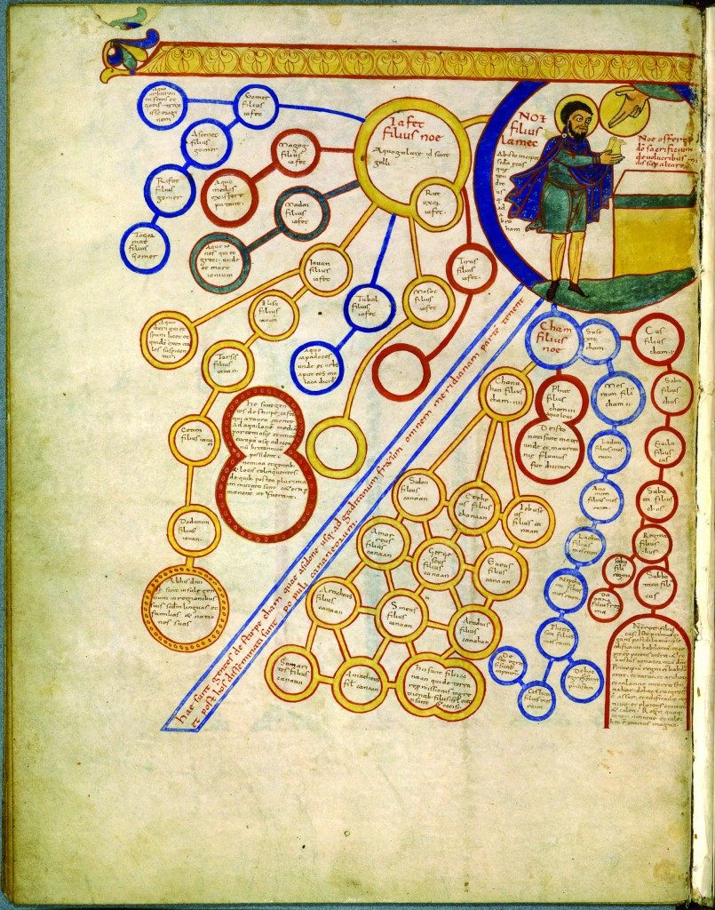
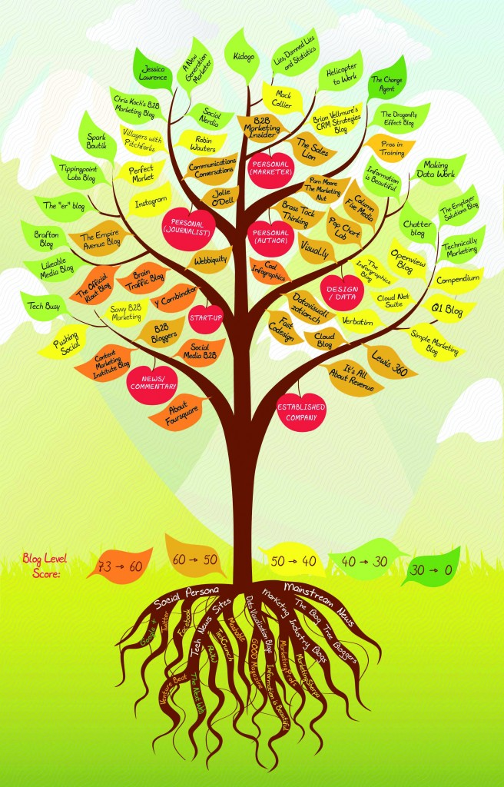

<!-- page 1 -->

<!-- page 2 -->

The first line on the first page of *The Book of Trees* is “This is the book I wish had been available when I was researching my previous book, *Visual Complexity: Mapping Patterns of Information*.” It’s funny, because this is also the book I wish had been available when I was researching my own project, [*Knowledge Uprooted.*](http://scottbot.net/uploads/Knowledge%20Uprooted%20v4%20%28illustrations%29.pdf) It took Alberto Cairo, reading over a draft of my article, to point out that Manuel Lima was working on a book-length version of a very similar project. If the book had come out a year ago, my own research might look very different. Lima’s book is beautifully designed, well-researched, and a delightful resource for anyone interested in visualizations of knowledge.

<!-- page 3 -->

*Tree of Consanguinity, ca. 1450-1510. Page 52.*

Lima’s book is a history of hierarchical visualizations, most frequently as trees, and often representing branches of knowledge. He roots his narrative in trees themselves, describing how their symbolism has touched religions and cultures for millennia. The narrative weaves through Ancient Greece and Medieval Europe, makes a few stops outside of the West and winds its way to the present day. Subsequent chapters are divided into types of tree visualizations: figurative, vertical, horizontal, multidirectional, radial, hyperbolic, rectangular, voronoi, circular, sunbursts, and icicles. Each chapter presents a chronological set of beautiful examples embodying that type.

<!-- page 4 -->

*Biblical Genealogy, ca. 1060. Page 112.*

Of course, any project with such a wide scope is bound to gloss over or inaccurately portray some of its historical content. I’d quibble, for example, with Lima’s suggestion that the use of these visual diagrams could be understood in the context of *ars memorativa*, a method for improving memory and understanding in the Middle Ages. Instead, I’d argue that the tradition stemmed from a more innate Aristotelian connection between thinking and seeing. Lima also argues that the *scala naturae*, depictions of entities on a natural order rising to God, is an obvious reflection on contemporary feudal stratification. The story is a bit more complex than that, with feudal stratification itself being concomitant to the medieval worldview of a natural order. In discussing Ramon Llull, Lima oddly writes “the notion of a unified trunk of science has remained to this day,” a claim which Lima himself shows isn’t exactly true in his earlier book, *Visual Complexity*. But this isn’t a book written by or for historians, and that’s okay—it’s accurate enough to get a good sense of the progression of trees.

<!-- page 5 -->

*The Blog Tree, 2012. Page 77.*

<!-- page 6 -->

Where the book shines is in its clear, well-cited, contextualized illustrations, which comprise the majority of its contents. Over a hundred illustrations pack the book, each with at least a paragraph of description and, in many cases, translation. This is a book for people passionate about visualizations, and interested in their history. There is not yet a book-length treatment for historians interested in this subject, though Murdoch’s *Album of Science* (1984) comes close. For those who want to delve even deeper into this history, I’ve compiled a 100+ reference bibliography that is [freely available here](https://www.zotero.org/scottbot/items/collectionKey/UBPU4KQW).

<!-- page 7 -->

---

## Reader Comments

> **[Seth Long (@SethLargo)](http://twitter.com/SethLargo)**, June 30, 2014
>
> Out of curiosity, why are you skeptical that this tradition of visual diagramming (particularly the Lullian ‘trees of knowledge’) are related to the art of memory? After reading Yates and Rossi, I’m convinced that much of this tradition was directly influenced by classical mnemotechnics. But I’m very interested to hear why you think otherwise, to see if I should update my own thinking about the subject. (My dissertation is a quant.-driven analysis of rhetoric’s fourth canon, so all of this is relevant to my interests.)

>> **Scott Weingart**, June 30, 2014
>>
>> Re-reading my review, I I worded it both poorly and too strongly. Mnemotechnics and Llullian diagrams are related to one another intimately, by design, but I think the salient feature in this instance particularly, on which both traditions draw, is the epistemological connection in thinking-as-a-form-of-seeing. In this concepts are related both mnemonically and actually; the proper aid to memory is the Accurate representation of connections.

<!-- page 8 -->
