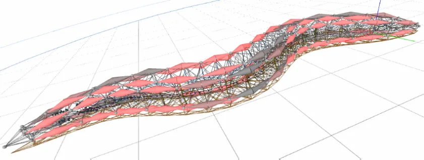

Yesterday, OpenAI announced the results of a new experiment.[^1] AIs evolved to use tools to play hide-and-seek. More interestingly, they learned to exploit errors from the in-game physics engine to “cheat”, breaking physics to find their opponents.

> *Unexpected and surprising behaviors included box surfing, where seekers learn to bring a box to a locked ramp in order to jump on top of the box and then “surf” it to the hider’s shelter.* [*pic.twitter.com/v0kGfCYZna*](https://t.co/v0kGfCYZna)
>
> *— OpenAI (@OpenAI)* [*September 17, 2019*](https://twitter.com/OpenAI/status/1174038989768028160?ref_src=twsrc%5Etfw)

Algorithms learning to exploit glitches to succeed at games are not uncommon. OpenAI also recently showed a video of an algorithm using a glitch in Sonic the Hedgehog save Sonic from certain death. Victoria Krakovna has collected [50 or so similar examples](https://docs.google.com/spreadsheets/u/1/d/e/2PACX-1vRPiprOaC3HsCf5Tuum8bRfzYUiKLRqJmbOoC-32JorNdfyTiRRsR7Ea5eWtvsWzuxo8bjOxCG84dAg/pubhtml), going back to 1998, explained in her [blog post](https://vkrakovna.wordpress.com/2018/04/02/specification-gaming-examples-in-ai/).

<!-- page 2 -->

But what happens when algorithms learn to exploit *actual physics*? A quarter of a century ago, Adrian Thompson provided evidence of just that.

In [An evolved circuit, intrinsic in silicon, entwined with physics](http://citeseerx.ist.psu.edu/viewdoc/download;jsessionid=6691182CC83AE8577D7C44EB9D847DA1?doi=10.1.1.50.9691&rep=rep1&type=pdf) (ICES 1996), Thompson used a [genetic algorithm](https://en.wikipedia.org/wiki/Genetic_algorithm), quite similar to the ones used to find glitches in games, to teach a bunch of computer chips to discern the difference between sounds at two different pitches: 1 kHz (low-pitch) and 10 kHz (high-pitch).

Genetic algorithms work by evolution. You give them a task, and they keep trying different approaches that either work or don’t work. The ones that work well replicate themselves with slight variations, and this goes on for many generations until the algorithm learns an efficient solution.

Genetic algorithms are easier to understand in practice than in theory, so to understand a bit better, watch the below video by Johan Eliasson:

<!-- page 3 -->

Thompson’s genetic algorithm worked the same way, but on a physical substrate. He trained a bunch of circuit boards over 5,000 generations to essentially reconfigure themselves into pitch-discerning machines. He got a bunch that worked really well, and *really* quickly. But when he tried to figure out how the efficient ones worked, he came back flummoxed.

Evolution inevitably leads to a lot of redundancies, mistakes, and other stupid design choices. It’s why we have vestigial organs like appendices, why flightless birds still have wings, and why we seem to have wide swaths of “junk” DNA. It’s not that these things are *useless*, per se, but in the randomness of natural selection, some things tend to stray.

<!-- page 4 -->

So Thompson tried to excise the vestigial bits of circuitry that were no longer necessary, but happened to stick around after 5,000 algorithmic generations. He found the circuits that were disconnected from the circuitry that was actually solving the problem, and removed them.

After he removed the vestigial, disconnected circuitry, the most efficient algorithm slowed down considerably. Let me repeat that: the algorithms slowed down *after Thompson removed vestigial parts of the circuit that had no actual effect on the algorithm.* What was going on?

<!-- page 5 -->

Thompson tried an experiment. He moved the efficient pitch-detecting algorithm to another identical circuit board. Same algorithm, identical circuit board.

The efficiency dropped by 7%.

<!-- page 6 -->

What was happening, it turns out, is that the genetic algorithms actually learned to [exploit the magnetic fields created when electrons flow through circuitry](https://www.damninteresting.com/on-the-origin-of-circuits/). The vestigial circuitry apparently boosted the performance of the algorithm just by existing next to the functional circuitry and emitting the appropriate physical signals.

When Thompson moved the algorithm to an identical board, the efficiency dropped *because the boards weren’t actually identical,* even though they were manufactured to be the same. Subtle physical differences in the circuitry actually contributed to the performance of the algorithm. Indeed, the algorithm evolved to exploit those differences.

Some scientists actually considered this a bit of a bummer. Oh no, they said, physics ruins our ability to get consistent results. But a bunch of others got quite excited.

For a while, I imagined the most exciting implications were for cognitive neuroscience.

*From ”* [*Towards a virtual C. Elegans: A framework for simulation and visualization of the neuromuscular* *system in a 3D physical environment*](https://www.researchgate.net/publication/235326413_Towards_a_virtual_C_Elegans_A_framework_for_simulation_and_visualization_of_the_neuromuscular_system_in_a_3D_physical_environment)*“*

One theory of how thinking works is that the brain is a vast network of neurons sending signals to each other, a bit like circuits. A branch of science called [connectomics](https://en.wikipedia.org/wiki/Connectomics) is founded on abstract models of these networks.

<!-- page 7 -->

Thompson’s research is fascinating because, if the physical embodiment of electronic circuits winds up making such a big difference, imagine the importance of the physical embodiment of neurons in a brain. Evolution spent a long time building brains, and there’s a good chance their materiality, and the adjacency of one neuron to the next, is functionally meaningful. Indeed, this has been an active area of research for some time, alongside theories of [embodied cognition](https://en.wikipedia.org/wiki/Embodied_cognition).

We learn from Thompson’s work not to treat brains like abstract circuits, because we can’t even treat circuits like abstract circuits.

But now, I think there’s potentially an even more interesting implication of Thompson’s results, drawing a line from it to AIs learning to exploit physics for hide-and-seek. These experiments may pave the way for a new era of physics.

### A New Physics

In the history of physics, practice occasionally outpaces theory. We build experiments expecting one result, but we see another instead. Physicists spend a while wondering what the hell is going on, and then sometimes invent new kinds of physics to deal with the anomalies. We have a theory of how the world works, and then we see things that don’t align with that theory, so we replace it.[^2]

For example, in the 1870s, scientists began experimenting with what would become known as a [Crookes tube](https://en.wikipedia.org/wiki/Crookes_tube), which emits a mysterious light under certain conditions. Trying to figure out *why* led to the discovery of X-rays and other phenomena.

<!-- page 8 -->

*Crooks tube, via D-Kuru,* [*https://en.wikipedia.org/wiki/Crookes_tube#/media/File:Crookes_tube_two_views.jpg*](https://en.wikipedia.org/wiki/Crookes_tube#/media/File:Crookes_tube_two_views.jpg)

Genetic algorithms and their siblings are becoming terrifyingly powerful. And we’ve already seen they often reach their goals by exploiting peculiarities in physics and simulated physical environments. What happens when these algorithms are given more generous leave to control their physical substrate at very basic levels?

Let’s say we ask a set of embodied algorithms to race, to get from Point A to Point B in their little robot skeletons. Let’s also say we don’t just allow them control over levers and wheels and things, but the ability to reconfigure their own bodies and print new parts of any sort, down to the nano scale.[^3]

<!-- page 9 -->

I suspect, after enough generations, these racing machines will start acting quite strangely. Maybe they’ll exploit quantum tunneling, superposition, or other weird subatomic principles. Maybe they’ll latch on to macroscopic complex particle interaction effects that scientists haven’t yet noticed. I have no idea.

Nobody has any idea. We’re poised to enter a brave new world of embodied algorithms ruthlessly, indiscriminately optimizing their way into strange physics.

In short, I wonder if physical AI bots will learn to exploit what we’d perceive to be glitches in physics. If that happens, and we start trying to figure out what the heck they’re doing to get from A to B so quickly, we may have to invent entirely new areas of physics to explain them.

Although this would be an *interesting* future, I’m not sure it would be a good one. It may, like the [gray goo hypothesis](https://en.wikipedia.org/wiki/Gray_goo) people worried about with nano-engineering, have the potential of producing apocalyptic results. What if a thoughtless algorithm, experimenting with propulsion to optimize its speed, winds up accidentally setting off an uncontrollable nuclear reaction?

I don’t suspect that will happen, but I do seriously worry what happens once the current class of learning algorithms [everts](https://en.wikipedia.org/wiki/Spook_Country#Eversion_of_cyberspace) into the physical world. Confined to the digital realm, we already see them wreaking havoc in unexpected ways. Recall, for example, the [Amazon seller algorithms that artificially boost book prices to the point of absurdity](http://www.michaeleisen.org/blog/?p=358), or the [high-frequency stock trading algorithms that caused a financial panic](https://en.wikipedia.org/wiki/2010_Flash_Crash). To say nothing of ML models that are currently in use that disadvantage particular races, genders, and other classes.

<!-- page 10 -->

[*https://en.wikipedia.org/wiki/2010_Flash_Crash#/media/File:Flashcrash-2010.png*](https://en.wikipedia.org/wiki/2010_Flash_Crash#/media/File:Flashcrash-2010.png)

If allowed to proceed, and given the appropriate technological capacities, embodied algorithms would undoubtedly cause unintentional physical harm in their “value-free” hunt for optimization. They will cause harm *in spite* of any safety systems we put in place, for the same reason they may stumble on unexplored domains of physics: genetic algorithms are so very good at exploiting glitches or loopholes in systems.

I don’t know what the future holds. It’s entirely possible this is all off-base, and since I’m neither a physicist nor an algorithmic roboticist, I wouldn’t recommend putting any money behind this prediction.

All I know is that, in 1894, Albert Michelson famously said “it seems probable that most of the grand underlying principles have been firmly established and that further advances are to be sought chiefly in the rigorous application of these principles to all the phenomena which come under our notice.” And we all saw how that turned out.

With the recent results of the LHC and [LIGO](https://arstechnica.com/science/2019/09/physicists-hear-the-ringing-of-a-baby-black-hole-for-the-very-first-time/) pretty much confirming what physicists already expected, at great expense, I’m betting the new frontier will come out of left field. I wouldn’t be so surprised if AI/ML opened the next set of floodgates.

[^1]: You remember OpenAI. They’re the ones who [recently trained a really good language model called GPT2 and then didn’t release it on account of ethical concerns](https://openai.com/blog/better-language-models/).
[^2]: The story is usually much more complicated than this, but that’s the best I can do in a paragraph.
[^3]: As far as I know this is currently implausible, but I bet it will feel more plausible in the not-too-distant future.
