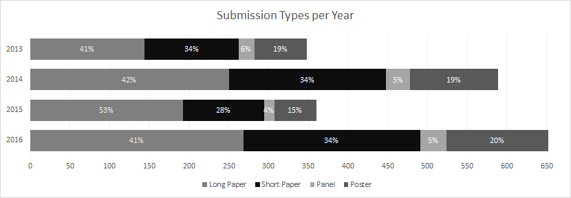
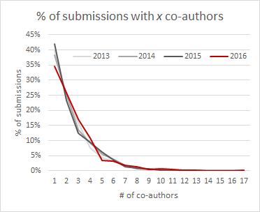
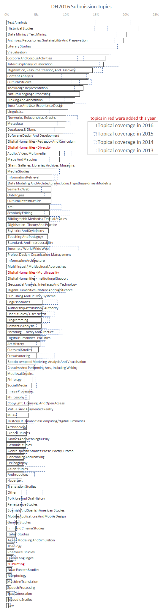

<!-- page 1 -->

tl;dr Basic numbers on DH2016 submissions.

Twice a year I indulge my meta-disciplinary sweet tooth: once to look at who’s submitting what to [ADHO’s annual digital humanities conference](http://adho.org/conference), and once to look at which pieces get accepted (see [the rest of the series](http://www.scottbot.net/HIAL/?tag=dhconf)). This post presents my first look at DH2016 conference submissions, the data for which I scraped from [ConfTool](https://www.conftool.pro/dh2016/) during the open peer review bidding phase. Open peer review bidding began in 2013, so I have 4 years of data. I opt not to publish this data, as most authors submit pieces under an expectation of privacy, and might violently throw things at my face if people find out which submissions weren’t accepted. Also ethics.

## Submission Numbers & Types

The basic numbers: 652 submissions (268 long papers, 223 short papers, 33 panels / multiple paper sessions, 128 posters). For those playing along at home, that’s:

- 2013 Nebraska: 348 (144/118/20/66)
- 2014 Lausanne: 589 (250/198/30/111)
- 2015 Sydney: 360 (192/102/13/53)
- 2016 Kraków: 652 (268/223/33/128)

<!-- page 2 -->

*Comparisons of submission types to DH2013-DH2016*

DH2016 submissions are on par to continue the [consistent-ish trend of growth every year since 1999](/blog/acceptances-to-digital-humanities-2015-part-1/), the large dip in 2015 unsurprising given its very different author pool, and the fact that it was the first time the conference visited the southern hemisphere or Asia-Pacific. The different author pool in 2015 also likely explains why it was the only conference to deviate from the normal submission-type ratios.

## Co-Authorship

Regarding co-authorship, the number has shifted this year, though not enough to pass any significance tests.

<!-- page 3 -->

*Co-authorship in DH2013-DH2016 submissions.*

DH2016 has proportionally slightly fewer single authored papers than previous years, and slightly more 2-, 3-, and 4-authored papers. One submission has 17 authors (not quite the [5,154-author record of high energy physics](http://journals.aps.org/prl/abstract/10.1103/PhysRevLett.114.191803), but we’re getting there, eh?), but mostly it’s par for the course here.

## Topics

Topically, DH2016 submissions continue many trends seen previously.

Authors must tag their submissions into multiple categories, or topics, using a controlled vocabulary. The figure presents a list of topics tagged to submissions, ordered top-to-bottom by the largest proportion of submissions with a certain tag for 2016. Nearly 25% of DH2016 submissions, for example, were tagged with “Text Analysis”. The dashed lines represent previous years’ tag proportions, with the darkest representing 2015, getting lighter towards 2013. New topics, those which just entered the controlled vocabulary this year, are listed in red. They are 3D Printing, DH Multilinguality, and DH Diversity.

Scroll past the long figure below to read my analysis:

<!-- page 5 -->

In a reveal that will shock all species in the known universe, text analysis dominates DH2016 submissions—the proportion even grew from previous years. Text & data mining, archives, and data visualization aren’t far behind, each growing from previous years.

What did actually (pleasantly) surprise me was that, for the first time since I began counting in 2013, history submissions outnumber literary ones. Compare this to 2013, [when literary studies were twice as well represented as historical](/blog/analyzing-submissions-to-dh-2013/). Other top-level categories experiencing growth include: corpus studies, content analysis, knowledge representation, NLP, and linguistics.

<!-- page 6 -->

Two areas which I’ve pointed out previously as needing better representation, geography and pedagogy, both grew compared to previous years. I’ve also pointed out a lack of discussion of diversity, but part of that lack was that authors had no “diversity” category to label their research with—that is, the issue I pointed out may have been as much a problem with the topic taxonomy as with the research itself. ADHO added “Diversity” and “Multilinguality” as potential topic labels this year, which were tagged to 9.4% and 6.5% of submissions, respectively. One-in-ten submissions dealing specifically with issues of diversity is encouraging to see.

Unsurprisingly, since Sydney, submissions tagged “Asian Studies” have dropped. Other consistent drops over the last few years include software design, A/V & multimedia (sadface), information retrieval, XML & text encoding,  internet & social media-related topics, crowdsourcing, and anthropology. The conference is also getting less self-referential, with a consistent drop in DH histories and meta-analyses (like this one!). Mysteriously, submissions tagged with the category “Other” have dropped rapidly each year, suggesting… dunno, aliens?

I have the suspicion that some numbers are artificially growing because there are more topics tagged per article this year than previous years, which I’ll check and report on in the next post.

It may be while before I upload the next section due to other commitments. In the meantime, you can fill your copious free-time reading [earlier posts on this subject](http://www.scottbot.net/HIAL/?tag=dhconf) or my recent book with Shawn Graham & Ian Milligan, [The Historian’s Macroscope](http://www.themacroscope.org/2.0/). Maybe you can [buy it](http://www.worldscientific.com/worldscibooks/10.1142/p981) for your toddler this holiday season. It fits perfectly in any stocking (assuming your stockings are infinitely deep, like Mary Poppins’ purse, which as a Jew watching Christmas from afar I just always assume is the case).

---

## Reader Comments

> **Stephen Robertson**, December 7, 2015
>
> Are submissions tagged ‘historical studies’ really all history submissions? I’ve never been able to get the proportions in the meta view to jibe with the digital history papers that I can actually find in the program. I wonder, for example, if literary or linguistics papers are tagged ‘historical studies’ if they use historical data?

>> **Scott Weingart**, December 7, 2015
>>
>> Good point, thanks, it’s definitely a poor proxy. I wouldn’t be surprised if, systematically, “historical studies” is less likely to refer to work done by people in history departments than “literary studies” is likely to point to work done by literary scholars. History can be historical linguistics, literary history, etc.
>>
>> That said, unless tagging practices have changed or authors are allowed to use more tags per submission this year than previous years, it’s still worth noting that the “historical studies” tag has grown tremendously. It may be that all the growth statistically depends upon the growth another tag (e.g. linguistics or literature), which I’ll make a point of checking for in the next post now that you bring it up, but I suspect we’ll find that “traditional” history is increasing with the rest of the tag, even if the tag doesn’t always represent it.

>>> [**acrymble**](http://genderedacademia.wordpress.com/), December 8, 2015
>>>
>>> These are submissions, so I’ll be interested to see if this historical turn makes it through the peer review.

>>>> **Scott Weingart**, December 8, 2015
>>>>
>>>> In 2013, 2014, and 2015, “historical studies” have an acceptance rate slightly below average, and literary studies have acceptance rates slightly above average. This is consistent across years. I’d be surprised if that changed this year, even with the larger historical studies tag, but even if it doesn’t, the difference in acceptance rates is small enough that I imagine the historical turn will remain present in the final conference. (see [http://www.scottbot.net/HIAL/wp-content/uploads/2014/04/acceptance-topic-sortbyaccrate.png](http://www.scottbot.net/HIAL/wp-content/uploads/2014/04/acceptance-topic-sortbyaccrate.png) & [http://www.scottbot.net/HIAL/wp-content/uploads/2015/06/AccRateByRate.png](http://www.scottbot.net/HIAL/wp-content/uploads/2015/06/AccRateByRate.png) )
