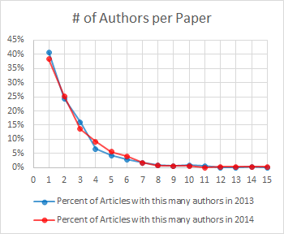
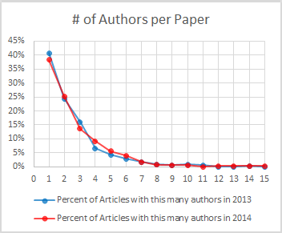
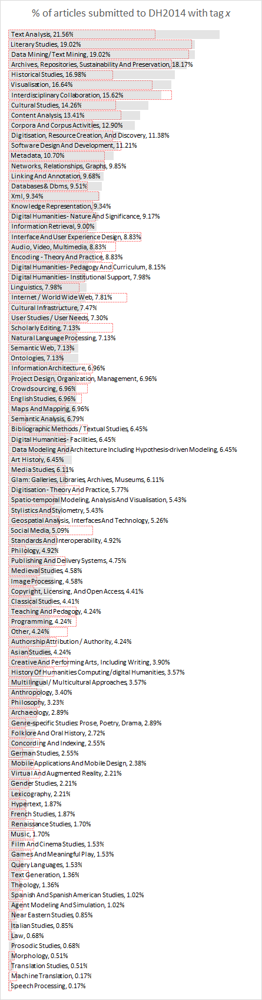
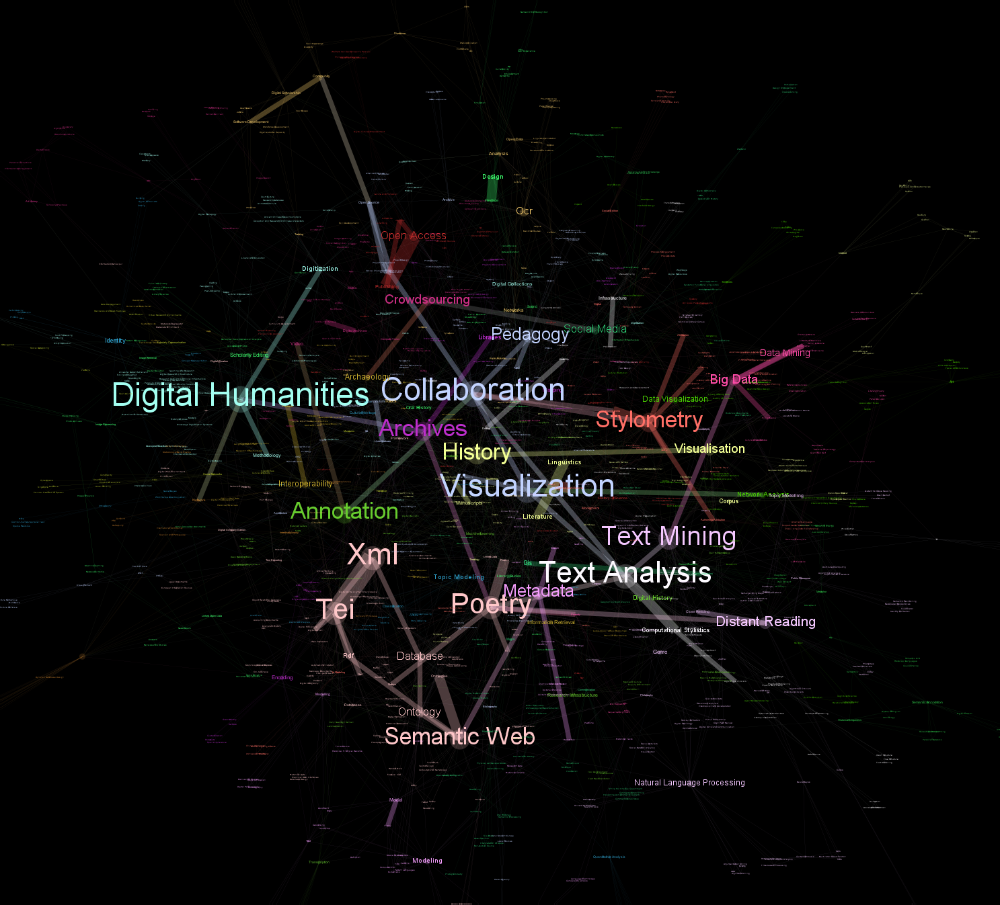
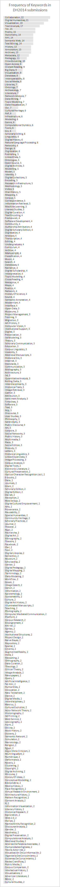

Submissions for [the 2014 Digital Humanities conference](http://dh2014.org/) just closed. It’ll be in Switzerland this time around, which unfortunately means I won’t be able make it, but I’ll be eagerly following along from afar. Like last year, reviewers are allowed to preview the submitted abstracts. Also like last year, I’m <!-- page 2 --> going to be a reviewer, which means I’ll have the opportunity to revisit the [submissions to DH2013](/blog/analyzing-submissions-to-dh-2013/) to see how the submissions differed this time around. No doubt when the reviews are in and the accepted articles are revealed, I’ll also revisit [my analysis of DH conference acceptances](/blog/acceptances-to-digital-humanities-2013-part-1/).

To start with, the conference organizers received a record number of submissions this year: 589. Last year’s Nebraska conference only received 348 submissions. The general scope of the submissions haven’t changed much; authors were still supposed to tag their submissions using a controlled vocabulary of 95 topics, and were also allowed to submit keywords of their own making. Like last year, authors could submit long papers, short papers, panels, or posters, but unlike last year, multilingual submissions were encouraged (English, French, German, Italian, or Spanish). [**edit**: Bethany Nowviskie, patient awesome person that she is, [has noticed yet another mistake I’ve made in this series of posts](https://twitter.com/nowviskie/status/397532449334259712). Apparently last year they also welcomed multilingual submissions, and it is standard practice.]

Digital Humanities is known for its collaborative nature, and not much has changed in that respect between 2013 and 2014 (Figure 1). Submissions had, on average, between two and three authors, with 60% of submissions in both years having at least two authors. This year, a few fewer papers have single authors, and a few more have two authors, but the difference is too small to be attributable to anything but noise.

<!-- page 3 -->

Figure 1. Number of authors per paper.

The distribution of topics being written about has changed mildly, though rarely in extreme ways. Any changes visible should also be taken with a

grain of salt, because a trend over a single year is hardly statistically robust to small changes, say, in the location of the event.

The grey bars in Figure 2 show what percentage of DH2014 submissions are

tagged with a certain topic, and the red dotted outlines show what the percentages were in 2013. The upward trends to note this year are text analysis, historical studies, cultural studies, semantic analysis, and corpora and cor-

pus activities. Text analysis was tagged to 15% of submissions in 2013 and is now tagged to 20% of submissions, or one out of every five. Corpus analysis similarly bumped from 9% to 13%. Clearly this is an important pillar of modern DH.

<!-- page 4 -->

<!-- page 5 -->

Figure 2. Topics from DH2014 ordered by the percent of submissions which fall in that category. The red dotted outlines represent the percentage from DH2013.

I’ve pointed out before that History is secondary compared to Literary Studies in DH (although Ted Underwood [has convincingly argued](/blog/acceptances-to-digital-humanities-2013-part-1/#comment-5297), using Ben Schmidt’s data, that the numbers may merely be due to fewer people studying history). This year, however, historical studies nearly doubled in presence, from 10% to 17%. I haven’t yet collected enough years of DH conference data to see if this is a trend in the discipline at large, or more of a difference between European and North American DH. Semantic analysis jumped from 1% to 7% of the submissions, cultural studies went from 10% to 14%, and literary studies stayed roughly equivalent. Visualization, one of the hottest topics of DH2013, has become even hotter in 2014 (14% to 16%).

The most visible drops in coverage came in pedagogy, scholarly editions, user interfaces, and research involving social media and the web. At DH2013, submissions on pedagogy had a surprisingly low acceptance rate, which combined the drop in pedagogy submissions this year (11% to 8% in “Digital Humanities – Pedagogy and Curriculum” and 7% to 4% in “Teaching and Pedagogy”) might suggest a general decline in interest in the DH world in pedagogy. “Scholarly Editing” went from 11% to 7% of the submissions, and “Interface and User Experience Design” from 13% to 8%, which is yet more evidence for the lack of research going into the creation of scholarly editions compared to several years ago. The most surprising drops <!-- page 6 --> for me were those in “Internet / World Wide Web” (12% to 8%) and “Social Media” (8.5% to 5%), which I would have guessed would be growing rather than shrinking.

The last thing I’ll cover in this post is the author-chosen keywords. While authors needed to tag their submissions from a list of 95 controlled vocabulary words, they were also encouraged to tag their entries with keywords they could choose themselves. In all they chose nearly 1,700 keywords to describe their 589 submissions. In [last year’s analysis of these keywords](/blog/analyzing-submissions-to-dh-2013/), I showed that visualization seemed to be the glue that held the DH world together; whether discussing TEI, history, network analysis, or archiving, all the disparate communities seemed to share visualization as a primary method. The 2014 keyword map (Figure 3) reveals the same trend: visualization is squarely in the middle. In this graph, two keywords are linked if they appear together on the same submission, thus creating a network of keywords as they co-occur with one another. Words appear bigger when they span communities.

<!-- page 7 -->

Figure 3. Co-occurrence of DH2014 author-submitted keywords.

Despite the multilingual conference, the large component of the graph is still English. We can see some fairly predictable patterns: TEI is coupled quite closely with XML; collaboration is another keyword that binds the community together, as is (obviously) “Digital Humanities.” Linguistic and literature are tightly coupled, much moreso than, say, linguistic and history. It appears the distant reading of poetry is becoming popular, which I’d guess is a relatively new phenomena, although I haven’t gone back and checked.

This work has been supported by an ACH microgrant to analyze DH conferences and the trends of DH through them, so keep an eye out for more of these posts forthcoming that look through the last 15 years. Though I usually share all my data, I’ll be keeping these to myself, as the submitters to the conference did so under an expectation of privacy if their proposals were not accepted.

[**edit**: there was some interest on twitter last night for a raw frequency of keywords. Because keywords are author-chosen and I’m trying to maintain some privacy on the data, I’m only going to list those keywords used at least twice. Here you go (Figure 4)!]

<!-- page 8 -->

<!-- page 9 -->

<!-- page 10 -->

<!-- page 11 -->

<!-- page 12 -->

Figure 4. Keywords used in DH2014 submissions ordered by frequency.

---

## Reader Comments

> [**triproftri**](http://triproftri.wordpress.com/), November 5, 2013
>
> <!-- page 13 -->Interesting, but (and I just tweeted this), the numbers here don’t necessarily correlate to interest in the field. Because pedagogy doesn’t show up in the same numbers as last year doesn’t signal a lack of interest by the DH community. Indeed, interest in digital pedagogy has soared in the last 2 years. Perhaps those who focus more on teaching lack the travel budget to attend this conference. (Teaching institutions are suffering greatly from economic drawbacks; travel budgets are the first to go.)

>> **Scott Weingart**, November 5, 2013
>>
>> Thanks for the comment, Katherine. I definitely agree that anyone reading this should be careful not to extrapolate too broadly on these data. The academic world is complex, especially DH which occurs on so many levels and across so many media. That said, my guess is that the bigger institutional forces and funding bodies will probably move alongside changes at the conference and journal level, which would mean as interest wanes in those areas, so too might support. Two years and one conference is far from enough to show any sort of broad decline, but I think if enough people do analyses like these (at all levels, not just conferences), we can get some better traction on the changing tides of DH.
>>
>> Also, I’m not sure how closely DH and digital pedagogy align, and whether they may be splitting – you’d probably have a much better view into that. If indeed they are separating axes, then no amount of DH analysis is going to yield insight into digital pedagogy. Do you have any thoughts on what might be good ways to track interest outside of the conference sphere?

>>> [**kathiberens**](http://gravatar.com/kathiberens), November 5, 2013
>>>
>>> Hi Scott and Kathy,
>>>
>>> <!-- page 14 -->Thanks for this analysis, Scott. I’ve followed and learned from your persistently interesting work for a couple of years now. Tying together Kathy’s comment with your question (where “to track interest in digital pedagogy outside the conference sphere?”), one might collect data around the many hashtags where digital pedagogists gather, such as #FYCChat #digped #engchat #mtped #femtech #hybridped; I’m sure I’m missing some. As Kathy points out, lack of travel funds — and punishing 4/4 teaching loads — may account for teachers’ relative invisibility on the conference scene. Nevertheless I see on Twitter many teachers at small liberal arts colleges launching vital DH experiments in their classrooms.

>>>> **Scott Weingart**, November 5, 2013
>>>>
>>>> Twitter sounds like the way to go, but unfortunately it’s difficult to mine any data from the past. Someone with an interest in the area should set up a scraper that automatically saves tweets related to digital pedagogy, and then in a few years we can look back and try to find some patterns.

> [**tedunderwood**](http://tedunderwood.com/), November 5, 2013
>
> This is great, Scott! Fascinating work, and I’m pretty sure it’ll be primary source material for historians in a few decades.
>
> I wonder how likely it is that some of the 2013/2014 changes reflect differences in emphasis between the American and European constituencies for DH? On the hypothesis that European scholars are more likely to attend a conference in Europe, that seems possible, and a few of the results here align with my uneducated guess that DH in Europe is more humanities-computing-centered than in the US. But with fifteen years of data, this is something you’ll soon be able to answer.

<!-- page 15 -->

>> **Scott Weingart**, November 5, 2013
>>
>> Thanks Ted, that’s certainly the biggest confounding factor. A colleague and I are going back and looking at all previous DH conferences, and we’ll continue this going forward, so those fluctuations should become apparent. I’m happy for the Australians to get DH2015, but mildly annoyed that they’re going to screw up the pretty biennial pattern that’ll surely crop up in some topics.
