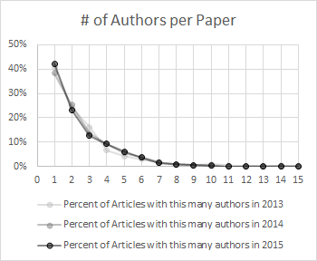
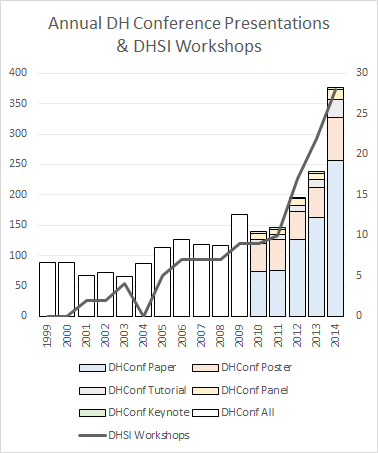
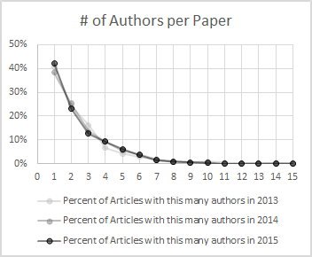
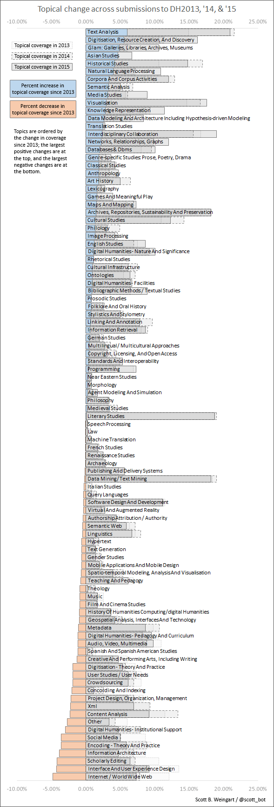
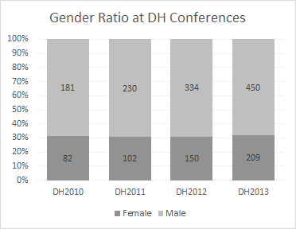

<!-- page 1 -->

Do you like the digital humanities? Me too! You better like it, because this is the 700th or so in a [series of posts](http://www.scottbot.net/HIAL/?tag=dhconf) about our annual conference, and I can’t imagine why else you’d be reading it.

<!-- page 2 -->

My [last post](/blog/submissions-to-digital-humanities-2015-pt-1/) went into some summary statistics of submissions to [DH2015](http://dh2015.org/), concluding in the end that this upcoming conference, the first outside the Northern Hemisphere, with the theme “Global Digital Humanities”, is surprisingly similar to the DH we’ve seen before. This post will compare this year to submissions to the previous two conferences, in Switzerland and the Nebraska. Part 3 will go into some more detail of geography and globalizing trends.

I can only compare the sheer volume of submissions this year to 2013 and 2014, which is as far back as I’ve got hard data. As many pieces were submitted for DH2015 as were submitted for DH2013 in Nebraska – around 360. Submissions to DH2014 shot up to 589, and it’s not yet clear whether the subsequent dip is an accident of location (Australia being quite far away from most regular conference attendees), or whether this signifies the leveling out of what’s been fairly impressive growth in the DH world.

*DH by volume, 1999-2014. This chart shows how many DHSI workshops occurred per year (right axis), alongside how many pieces were actually presented at the DH conference annually (left axis). This year is not included because we don’t yet know which submissions will be accepted.*

<!-- page 3 -->

This graph shows a pretty significant recent upward trend in DH by volume; if acceptance rates to DH2015 are comparable to recent years (60-65%), then DH2015 will represent a pretty significant drop in presentation volume. My gut intuition is this is because of the location, and not a downward trend in DH, but only time will tell.

Replying to my most recent post, [Jordan T. T-H commented on his surprise](/blog/submissions-to-digital-humanities-2015-pt-1/#comment-6861) at how many single-authored works were submitted to the conference. I suggested this was of our humanistic disciplinary roots, and that further analysis would likely reveal a trend of increasing co-authorship. My prediction was wrong: at least over the last three years, co-authorship numbers have been stagnant.

*This chart shows the that ~40% of submissions to DH conferences over the past three years have been single-authored.*

Roughly 40% of submissions to DH conferences over the past three years have been single-authored; the trend has not significantly changed any further down the line, either. [Nickoal Eichmann](http://nickoal.com/) and I are looking into data from the past few decades, but it’s not ready yet at the time of this blog post. This result honestly surprised me; just from watching and attending conferences, I had the impression we’ve become more multi-authored over the past few years.

<!-- page 4 -->

Topically, we are noticing some shifts. As a few people noted on Twitter, topics are not perfect proxies for what’s actually going on in a paper; every author makes different choices on how they they tag their submissions. Still, it’s the best we’ve got, and I’d argue it’s *good enough* to run this sort of analysis on, especially as we start getting longitudinal data. This is an empirical question, and if we wanted to test my assumption, we’d gather a bunch of DHers in a room and see to what extent they all agree on submission topics. It’s an interesting question, but beyond the scope of this casual blog post.

Below is the list of submission topics in order of how much topical coverage has changed since 2013. For example, this year 21% of submissions were tagged as involving Text Analysis. By contrast, only 15% were tagged as Text Analysis in 2013, resulting in a growth of 6% over the last two years. Similarly, this year Internet and World Wide Web studies comprised 7% of submissions, whereas that number was 12% in 2013, showing coverage shrunk by 5%. My more detailed evaluation of the results are below the figure.

<!-- page 6 -->

We see, as I previously suggested, that Text Analysis (unsurprisingly) has gained a lot of ground. Given the location, it should be unsurprising as well that Asian Studies has grown in coverage, too. Some more surprising results are the re-uptake of Digitisation, which have been pretty low recently, and the growth of GLAM (Galleries, Libraries, Archives, Museums), which I suspect if we could look even further back, we’d spot a consistent upward trend. I’d guess it’s due to the proliferation of [DH Alt-Ac](http://mediacommons.futureofthebook.org/alt-ac/) careers within the GLAM world.

Not all of the trends are consistent: Historical Studies rose significantly between 2013 and 2014, but dropped a bit in submissions this year to 15%. Still, it’s growing, and I’m happy about that. Literary Studies, on the other hand, has covered a fifth of all submissions in 2013, 2014, and 2015, remaining quite steady. And I don’t see it dropping any time soon.

Visualizations are clearly on the rise, year after year, which I’m going to count as a win. Even if we’re not branching outside of text as much as we ought, the fact that visualizations are increasingly important means DHers are willing to move beyond text as a medium for transmission, if not yet as a medium of analysis. The use of Networks is also growing pretty well.

<!-- page 7 -->

As [Jacqueline Wernimont just pointed out](https://twitter.com/profwernimont/status/530384290392342528), representation of Gender Studies is incredibly low. And, as the above chart shows, it’s even lower this year than it was in both previous years. Perhaps this isn’t so surprising, given the gender ratio of authors at DH conferences recently.

*Gender ratio of authors at DH conferences 2010-2013. Women consistently represent a bit under a third of all authors.*

Some categories involving Maps and GIS are increasing, while others are decreasing, suggesting small fluctuations in labeling practices, but probably no significant upward or downward trend in their methodological use. Unfortunately, most non-text categories dropped over the past three years: Music, Film & Cinema Studies, Creative/Performing Arts, and Audio/ Video/Multimedia all dropped. Image Studies grew, but only slightly, and its too soon to say if this represents a trend.

We see the biggest drops in XML, Encoding, Scholarly Editing, and Interface & UX Design. This won’t come as a surprise to anyone, but it does show how much the past generation’s giant (putting together, cleaning, and presenting scholarly collections) is making way for the new behemoth (analytics). Internet / World Wide Web is the other big coverage loss, but I’m not comfortable giving any causal explanation for that one.

<!-- page 8 -->

This analysis offers the same conclusion as the earlier one: with the exception of the drop in submissions, nothing is incredibly surprising. Even the drop is pretty well-expected, given how far the conference is from the usual attendees. The fact that the status is pretty quo is worthy of note, because many were hoping that a global DH would seem more diverse, or appreciably different, in some way. In Part 3, I’ll start picking apart geographic and deeper topical data, and maybe there we’ll start to see the difference.
