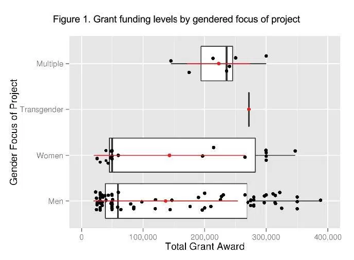

Today’s post just summarizes an article recently shared with me, as an attempt to boost the signal:

> [@scott_bot](https://twitter.com/scott_bot) [@NickoalEichmann](https://twitter.com/NickoalEichmann) [@foxyfolklorist](https://twitter.com/foxyfolklorist) We published the prelim findings here: [https://t.co/HQk59d9xMs](https://t.co/HQk59d9xMs)
>
> — John D. Martin III (@jdmar3) [April 4, 2016](https://twitter.com/jdmar3/status/717002785271713792)

Those following along at home know I’ve been exploring [how digital humanities infrastructure reinforces pre-existing cultural biases](http://scottbot.net/tag/dhconf/), most recently with [Nickoal Eichmann & Jeana Jorgensen looking at DH Conferences, 2000-2015](/blog/representation-at-digital-humanities-conferences-2000-2015/).

One limitation of our study is we know very little about the content of conference presentations or the racial identities of authors, which means we can’t assess bias in those directions. [John D. Martin III](http://johndmart.in/) & [Carolyn Runyon](http://carolynrunyon.com/) recently published preliminary results more thoroughly addressing race & gender in DH from a funding perspective, and focused on the content of grants:

> Martin, John D., III, and Carolyn Runyon. “[Digital Humanities, Digital Hegemony: Exploring Funding Practices and Unequal Access in the Digital Humanities](https://dl.acm.org/citation.cfm?id=2908219).” *SIGCAS Computers and Society.* 46, no. 1 (March 2016): 20–26. doi:10.1145/2908216.2908219.

By hand-categorizing 656 DH-oriented NEH grants from 2007-2016, totaling $225 million, Martin & Runyon found 110 projects whose focus involved gender or individuals of a certain gender, and 228 which focused on race/ethnicity or individuals identifiable with particular races/ethnicities.

<!-- page 2 -->

From the article

Major findings include:

- Twice as much money goes to studying men than to women.
- On average, individual projects about women are better-funded.
- The top three race/ethnicity categories by funding amount are White ($21 million), Asian ($7 million), and Black ($6.5 million).
- White men are discussed as individuals, and women and non-white people are focused on as groups.

Their results fit well with what I and others have found, which is that DH propagates the same cultural bias found elsewhere within and outside academia.

A next step, vital to this project, is to find equivalent metrics for other disciplines and data sources. Until we get a good baseline, we won’t actually know if our interventions are improving the situation. It’s all well and good to say “things are bad”, but until we know the compared-to-what, we won’t have a reliable way of testing what works and what doesn’t.
