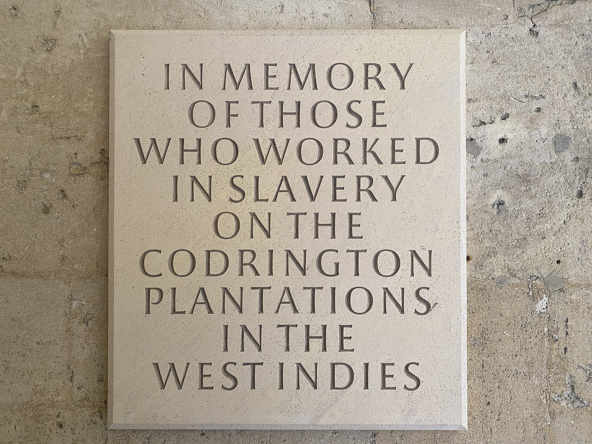

One thesis of the most entertaining popularization of moral philosophy of the 21st century, [*The Good Place*](https://en.wikipedia.org/wiki/The_Good_Place), is that the complexity of modern life essentially renders good choices impossible. You can't avoid accidentally (or with awareness but no real choice) buying products made by slave labor, eating homophobic chicken, etc. With such intertwingled and long global systems, the odds of evil creeping in at any point in (say) a supply chain before it reaches you are remarkably high.

It's easy to forget such global entanglements stretch back through history, alongside their associated moral perils. Historians try to tread carefully around yesterday's ethical quagmires, understanding a moment on its own terms without necessarily *forgiving* any associated cruelties. It can be a tightrope walk sometimes. 

Or sometimes not: Thomas Creech, for example, was not born into wealth and needed patronage all his life to sustain his scholarly pursuits. Where did money come from in late 17th century Britain? In Creech's case—as with many others—it came from coerced labor. His former sometimes-student, later-in-life patron, and sort-of-landlord Christopher Codrington owned an extremely large sugar plantation in Barbados from which he amassed great wealth on the backs of the enslaved. That money funded Creech's scholarship as well as the room he slept in before his death. 

Part of his fortune went to a vast collection of books that Creech was charged with keeping an eye on in exchange for lodging in the attic above. The books alone were worth nearly £1 million in today's money, and were eventually donated to All Souls to form its current library. Following the George Floyd protests, Oxford wisely changed the library's name from the Codrington Library to the All Souls College Library.

*The current plaque at the All Souls College Library, planned in 2017 and added in 2020, via wikimedia*

It's not hard to draw a direct link between Creech's work and the source of his patronage, and in the book I'll do just that.

But there's another moral *entanglement* that simply exists on account of the world's complexity even in the late 1600s. It is one winding enough that it does not belong in the book, but unexpected and tragic enough that I can't help but post it on the blog. As Hamlet said to the ghost of his father: "be thy intents wicked or charitable, thou comest in such a questionable shape that I will speak to thee." This tidbit comes in such a questionable shape that it must be addressed.

Among the most well-known episodes of Creech's life was his brief affair—perhaps friendly, perhaps romantic—with spy,  playwright, and libertine Aphra Behn. Two decades his elder, Behn printed two poems praising and flirting with Creech after his publication of *De rerum natura* at twenty-one years old. Creech returned the favor by writing and publishing for her a poem that one Behn biographer called "a small erotic masterpiece."

The two spent an evening together in January 1684 during the Great Frost Fair, immortalized in a poem. As happened on rare occasions, London's River Thames froze over. This winter was the coldest on record, with the river frozen two feet deep. A festival grew on the ice: circus shows, puppeteers, ice skating, bull baiting, and whatever vices a fair-goer might hope to find. By all accounts the two had a great time.

*Contemporary painting by Abraham Hondius of the Frost Fair of 1683–84, via wikimedia*

Climatologists call the period the Little Ice Age, a multi-century dip in temperature with the coldest extremes hitting around the 1650s.

Lots of theories explain the Little Ice Age, though one is particularly troubling. In a well-received study, [Koch et al.](https://doi.org/10.1016/j.quascirev.2018.12.004) attribute the coldest temperatures to the European-driven slaughter of and disease spread across indigenous Americans, leading to the loss of something like 90% of the original population of the Americas. This, they argue, resulted in large swaths of once-agricultural land quickly re-vegitating. All those new plants captured a massive amount of carbon from the atmosphere. Which made it colder. A lot colder.

So in a way, if Koch et al. are correct, indigenous genocide led directly to one of the most widely known episodes in Thomas Creech's life. It might also have [led to the remarkable quality of Stadivarius violins](https://www.sciencedirect.com/science/article/pii/S1125786504700314), incidentally. I'm not sure what to do with that knowledge.

I suppose nothing. It doesn't belong in his biography. He wouldn't have known anything about it. He didn't benefit from it in any way. It's just a tragic entanglement, one illustration of the many cruelties that connect and have always connected us.
