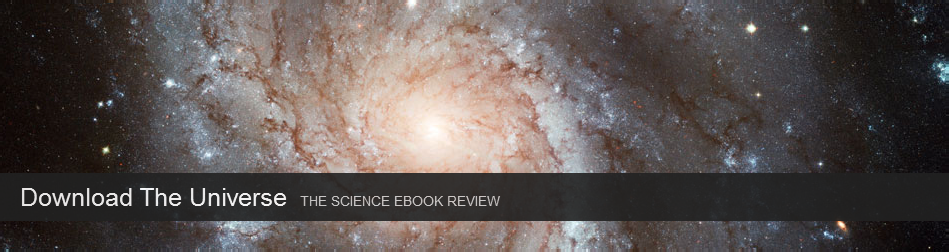

The public science blogosphere has recently been buzzing about an online edited book review called [Download The Universe](http://www.downloadtheuniverse.com/). The twist is that the editors only review *online-only* science books, and their definition of “book” is broadly construed:

> [W]e define ebooks broadly. They may be self-published pdf manuscripts. They may be Kindle Singles about science. They can even be apps that have games embedded in them. We hope that we will eventually review new kinds of ebooks that we can’t even imagine yet. And we hope that you will find Download the Universe a useful doorway into that future.

The site aims to fill the publicity gap that prevents interesting and good science ebooks from finding their way into the hands of receptive readers. Traditional reviews and blogs tend not to cover this new media, the editors say. In the spirit of the fast-paced nature of the internet, the entire project was conceived last month at [Science Online](http://scienceonline2012.com/) ([#scio12](https://twitter.com/#!/search/realtime/%23scio12)) and already features 8 posts and an editing staff of 16.

Download The Universe

My initial excitement of this project was tempered somewhat when I found that their news feed offered exceptionally tiny snippets of their ebook reviews. That’s no good! I’m subscribed to 361 feeds in Google Reader, with nearly 500 posts a day, and if I don’t have a few paragraphs to see whether an article is interesting, it is unlikely that I’d ever click through to the actual page to investigate further. (By the way, if you’re interested in the best of what I read, you can [subscribe to my favorite feed items here](http://www.google.com/reader/shared/user/18160470639609463806/state/com.google/starred), where I read through 361 blogs so you don’t have to.) Unfortunately, snippet news feeds are becoming increasingly frequent, as blogs and sites attempt to entice you to their pages where they can get usage statistics and ad-views in ways they could not through a simple RSS feed.

**Apparently, when you talk, the internet listens**. My disappointment was such that I sent an email to the coordinating editor, science writer [Carl Zimmer](http://carlzimmer.com/), explaining my problem. He immediately sent a reply telling me he would look into the feedburner settings, and within short order, the RSS became a full, no-snippet news feed. Woah! A big (and public) thank you to Carl Zimmer, and the entire crew at [Download The Universe](http://www.downloadtheuniverse.com/), for putting together a wonderful and important new site and for being so receptive to their readers. Bravo!

<!-- page 1 -->
