<!-- page 1 -->

This is the transcript from my closing keynote address at the 2014 DH Forum in Lawrence, Kansas. It’s the result of my conflicted feelings on the recent [Facebook emotional contagion](http://www.pnas.org/content/111/24/8788.full) controversy, and despite my earlier tweets, I conclude the study was important and valuable specifically *because* it was so controversial.

For the non-Digital-Humanities (DH) crowd, a quick glossary. *Distant Reading* is our new term for reading lots of books at once using computational assistance; *Close Reading* is the traditional term for reading one thing extremely minutely, exhaustively.

## Networked Society

Distant reading is a powerful thing, an important force in the digital humanities. But so is close reading. Over the next 45 minutes, I’ll argue that distant reading occludes as much as it reveals, resulting in significant ethical breaches in our digital world. Network analysis and the humanities offers us a way out, a way to bridge personal stories with the big picture, and to bring a much-needed ethical eye to the modern world.

Today, by zooming in and out, from the distant to the close, I will outline how networks shape our world and our lives, and what we in this room can do to set a path going forward.

<!-- page 2 -->

Let’s begin locally.

***1. Pale Blue Dot***

You are here. That’s a picture of Kansas, from four billion miles away.

In February 1990, after years of campaigning, Carl Sagan convinced NASA to turn the Voyager 1 spacecraft around to take a self-portrait of our home, the Earth. This is the most distant reading of humanity that has ever been produced.

I’d like to begin my keynote with Carl Sagan’s own words, his own distant reading of humanity. I’ll spare you my attempt at the accent:

> *Consider again that dot. That’s here. That’s home. That’s us. On it everyone you love, everyone you know, everyone you ever heard of, every human being who ever was, lived out their lives. The aggregate of our joy and suffering, thousands of confident religions, ideologies, and economic doctrines, every hunter and forager, every hero and coward, every creator and destroyer of civilization, every king and peasant, every young couple in love, every mother and father, hopeful child, inventor and explorer, every teacher of morals, every corrupt politician, every ‘superstar,’ every ‘supreme leader,’ every saint and sinner in the history of our species lived there – on a mote of dust suspended in a sunbeam.*

What a lonely picture Carl Sagan paints. We live and die in isolation, alone in a vast cosmic darkness.

I don’t like this picture. From too great a distance, everything looks the same. Every great work of art, every bomb, every life is reduced to a single point. And our collective human experience loses all definition. If we want to know what makes us, us, we must move a little closer.

<!-- page 3 -->

***2. Black Rock City***

[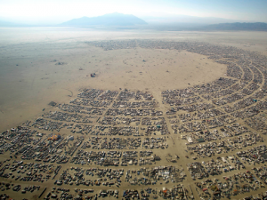](http://www.scottbot.net/HIAL/wp-content/uploads/2014/09/slide2.png)

We’ve zoomed into Black Rock City, more popularly known as Burning Man, a city of 70,000 people that exists for only a week in a Nevada desert, before disappearing back into the sand until the following year. Here life is apparent; the empty desert is juxtaposed against a network of camps and cars and avenues, forming a circle with some ritualistic structure at its center.

The success of Burning Man is contingent on collaboration and coordination; on the careful allocation of resources like water to keep its inhabitants safe; on the explicit planning of organizers to keep the city from descending into chaos year after year.

And the creation of order from chaos, the apparent reversal of entropy, is an essential feature of life. Organisms and societies function through the careful coordination and balance of their constituent parts. As these parts interact, patterns and behaviors emerge which take on a life of their own.

***3. Complex Systems***

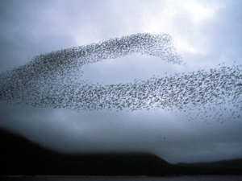

Thus cells combine to form organs, organs to form animals, and animals to form flocks.

We call these networks of interactions complex systems, and we study complex systems using network analysis. Network analysis as a methodology takes as a given that nothing can be properly understood in total isolation. Carl Sagan’s pale blue dot, though poignant and beautiful, is too lonely and too distant to reveal anything of we creatures who inhabit it.

<!-- page 4 -->

We are not alone.

***4. Connecting the Dots***

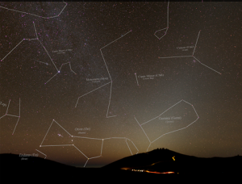

When looking outward rather than inward, we find we are surrounded on all sides by a hundred billion galaxies each with a hundred billion stars. And for as long as we can remember, when we’ve stared up into the night sky, we’ve connected the dots. We’ve drawn networks in the stars in order to make them feel more like us, more familiar, more comprehensible.

Nothing exists in isolation. We use networks to make sense of our place in the vast complex system that contains protons and trees and countries and galaxies.The beauty of network analysis is its ability to transcend differences in scale, such that there is a place for you and for me, and our pieces interact with other pieces to construct the society we occupy. Networks allow us to see the forest *and* the trees, to give definition to the microcosms and macrocosms which describe the world around us.

***5. Networked World***

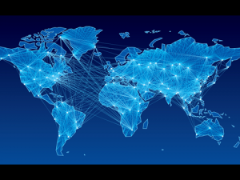

Networks open up the world. Over the past four hundred years, the reach of the West extended to the globe, overtaking trade routes created first by eastern conquerors. From these explorations, we produced new medicines and technologies. Concomitant with this expansion came unfathomable genocide and a slave trade that spanned many continents and far too many centuries.

<!-- page 5 -->

Despite the efforts of the Western World, it could only keep the effects of globalization to itself for so long. Roads can be traversed in either direction, and the network created by Western explorers, businesses, slave traders, and militaries eventually undermined or superseded the Western centers of power. In short order, the African slave trade in the Americas led to a rich exchange of knowledge of plants and medicines between Native Americans and Africans.

In Southern and Southeast Asia, trade routes set up by the Dutch East India Company unintentionally helped bolster economies and trade routes within Asia. Captains with the company, seeking extra profits, would illicitly trade goods between Asian cities. This created more tightly-knit internal cultural and economic networks than had existed before, and contributed to a global economy well beyond the reach of the Dutch East India Company.

In the 1960s, the U.S. military began funding what would later become the Internet, a global communication network which could transfer messages at unfathomable speeds. The infrastructure provided by this network would eventually become a tool for control and surveillance by governments around the world, as well as a distribution mechanism for fuel that could topple governments in the Middle East or spread state secrets in the United States. The very pervasiveness which makes the internet particularly effective in government surveillance is also what makes it especially dangerous to governments through sites like WikiLeaks.

In short, science and technology lay the groundwork for our networked world, and these networks can be great instruments of creation, or terrible conduits of destruction.

***6. Macro Scale***

<!-- page 6 -->

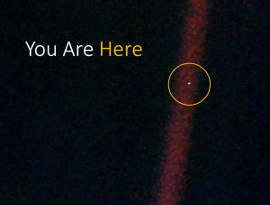

So here we are, occupying this tiny mote of dust suspended in a sunbeam. In the grand scheme of things, how does any of this really matter? When we see ourselves from so great a distance, it’s as difficult to be enthralled by the Sistine Chapel as it is to be disgusted by the havoc we wreak upon our neighbors.

***7. Meso Scale***

But networks let us zoom in, they let us keep the global system in mind while examining the parts. Here, once again, we see Kansas, quite a bit closer than before. We see how we are situated in a national and international set of interconnections. These connections come in every form, from physical transportation to electronic communication. From this scale, wars and national borders are visible. Over time, cultural migration patterns and economic exchange become apparent. This scale shows us the networks which surround and are constructed by us.

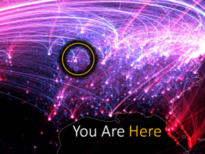

And this is the scale which is seen by the NSA and the CIA, by Facebook and Google, by social scientists and internet engineers. Close enough to provide meaningful aggregations, but far enough that individual lives remain private and difficult to discern. This scale teaches us how epidemics spread, how minorities interact, how likely some city might be a target for the next big terrorist attack.

From here, though, it’s impossible to see the hundred hundred towns whose factories have closed down, leaving many unable to feed their families. It’s difficult to see the small but endless inequalities that leave women and minorities systematically underappreciated and exploited.

<!-- page 7 -->

***8. Micro Scale***

We can zoom in further still, Lawrence Kansas at a few hundred feet, and if we watch closely we can spot traffic patterns, couples holding hands, how the seasons affect people’s activities. This scale is better at betraying the features of communities, rather than societies.

But for tech companies, governments, and media distributors, it’s all-too-easy to miss the trees for the forest. When they look at the networks of our lives, they do so in aggregate. Indeed, privacy standards dictate that the individual be suppressed in favor of the community, of the statistical average that can deliver the right sort of advertisement to the right sort of customer, without ever learning the personal details of that customer.

This strange mix of individual personalization and impersonal aggregation drives quite a bit of the modern world. Carefully micro-targeted campaigning is credited with President Barack Obama’s recent presidential victories, driven by a hundred data scientists in an office in Chicago in lieu of thousands of door-to-door canvassers. Three hundred million individually crafted advertisements without ever having to look a voter in the face.

***9. Target***

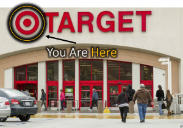

And this mix of impersonal and individual is how Target makes its way into the wombs of its shoppers. We saw this play out a few years ago when a furious father went to complain to a Target store manager. Why, he asked the manager, is my *high school daughter* getting ads for maternity products in the mail? After returning home, the father spoke to his daughter to discover she was, indeed pregnant.  How did this happen? How’d Target know?

<!-- page 8 -->

It turns out, Target uses credit cards, phone numbers, and e-mail addresses to give every customer a unique ID. Target discovered a list of about 25 products that, if purchased in a certain sequence by a single customer, is pretty indicative of a customer’s pregnancy. What’s more, the date of the purchased products can pretty accurately predict the date the baby would be delivered. Unscented lotion, magnesium, cotton balls, and washcloths are all on that list.

When Target’s systems learns one of its customers is probably pregnant, it does its best to profit from that pregnancy, sending appropriately timed coupons for diapers and bottles. This backfired, creeping out customers and invading their privacy, as with the angry father who didn’t know his daughter was pregnant. To remedy the situation, rather than ending the personalized advertising, Target began interspersing ads for unrelated products with personalized products in order to trick the customer into thinking the ads were random or general. All the while, a good portion of the coupons in the book were still targeted directly towards those customers.

One Target executive told a New York Times reporter:

> *We found out that as long as a pregnant woman thinks she hasn’t been spied on, she’ll use the coupons. She just assumes that everyone else on her block got the same mailer for diapers and cribs. As long as we don’t spook her, it works.*

The scheme did work, raising Target’s profits by billions of dollars by subtly matching their customers with coupons they were likely to use.

***10. Presidential Elections***

<!-- page 9 -->

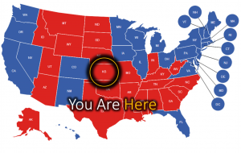

Political campaigns have also enjoyed the successes of microtargeting. President Bush’s 2004 campaign pioneered this technique, targeting socially conservative Democratic voters in key states in order to either convince them not to vote, or to push them over the line to vote Republican. This strategy is credited with increasing the pro-Bush African American vote in Ohio from 9% in 2000 to 16% in 2004, appealing to anti-gay marriage sentiments and other conservative values.

The strategy is also celebrated for President Obama’s 2008 and especially 2012 campaigns, where his staff maintained a connected and thorough database of a large portion of American voters. They knew, for instance, that people who drink Dr. Pepper, watch the Golf Channel, drive a Land Rover, and eat at Cracker Barrel are both very likely to vote, and very unlikely to vote Democratic. These insights lead to the right political ads targeted exactly at those they were most likely to sway.

So what do these examples have to do with networks? These examples utilize, after all, the same sorts of statistical tools that have always been available to us, only with a bit more data and power to target individuals thrown in the mix.

It turns out that networks are the next logical step in the process of micronudging, the mass targeting of individuals based on their personal lives in order to influence them toward some specific action.

In 2010, a Facebook study, piggy-backing on social networks, influenced about 340,000 additional people to vote in the US mid-term elections. A team of social scientists at UCSD experimented on 61 million facebook users in order to test the influence of social networks on political action.

A portion of American Facebook users who logged in on election day were given the ability to press an “I voted” button, which shared the fact that they voted with their friends. Facebook then presented users with pictures of their friends who voted, and it turned out that these messages increased voter turnout by about 0.4%. Further, those who saw that close friends had voted were more likely to go out and vote than those who had seen that distant friends voted. The study was framed as “voting contagion” – how well does the action of voting spread among close friends?

<!-- page 10 -->

This large increase in voter turnout was prompted by a single message on Facebook spread among a relatively small subset of its users. Imagine that, instead of a research question, the study was driven by a particular political campaign. Or, instead, imagine that Facebook itself had some political agenda – it’s not too absurd a notion to imagine.

***11. Blackout***

In fact, on January 18, 2012, a great portion of the social web rallied under a single political agenda. An internet blackout. In protest of two proposed U.S. congressional laws that threatened freedom of speech on the Web, SOPA and PIPA, 115,000 websites voluntarily blacked out their homepages, replacing them with pleas to petition congress to stop the a bills.

Reddit, Wikipedia, Google, Mozilla, Twitter, Flickr, and others asked their users to petition Congress, and it worked. Over 3 million people emailed their congressional representatives directly, another million sent a pre-written message to Congress from the Electronic Frontier Foundation, a Google petition reached 4.5 million signatures, and lawmakers ultimated collected the names of over 14 million people who protested the bills. Unsurprisingly, the bills were never put up to vote.

<!-- page 11 -->

These techniques are increasingly being leveraged to influence consumers and voters into acting in-line with whatever campaign is at hand. Social networks and the social web, especially, are becoming tools for advertisers and politicians.

***12a. Facebook and Social Guessing***

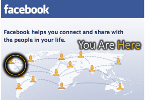

In 2010, Tim Tangherlini invited a few dozen computer scientists, social scientists, and humanists to a two-week intensive NEH-funded summer workshop on network analysis for the humanities. Math camp for nerds, we called it. The environment was electric with potential projects and collaborations, and I’d argue it was this workshop that really brought network analysis to the humanities in force.

During the course of the workshop, one speaker sticks out in my memory: a data scientist at Facebook. He reached the podium, like so many did during those two weeks, and described the amazing feats they were able to perform using basic linguistic and network analyses. We can accurately predict your gender and race, he claimed, regardless of whether you’ve told us. We can learn your political leanings, your sexuality, your favorite band.

Much like most talks from computer scientists at the event, the purpose was to show off the power of large-scale network analysis when applied to people, and didn’t focus much on its application. The speaker did note, however, that they used these measurements to effectively advertise to their users; electronics vendors could advertise to wealthy 20-somethings; politicians could target impoverished African Americans in key swing states.

It was a few throw-away lines in the presentation, but the force of the ensuing questions revolved around those specifically. How can you do this without any sort of IRB oversight? What about the ethics of all this? The Facebook scientist’s responses were telling: we’re not doing research, we’re just running a business.

<!-- page 12 -->

And of course, Facebook isn’t the only business doing this. The Twitter analytics dashboard allows you to see your male-to-female follower ratio, even though users *are never asked their gender*. Gender is guessed based on features of language and interactions, and they claim around 90% accuracy.

Google, when it targets ads towards you as a user, makes some predictions based on your search activity. Google guessed, without my telling it, that I am a 25-34 year old male who speaks English and is interested in, among other things, Air Travel, Physics, Comics, Outdoors, and Books. Pretty spoton.

***12b. Facebook and Emotional Contagion***

And, as we saw with the Facebook voting study, social web services are not merely capable of learning about you; they are capable of influencing your actions. Recently, this ethical question has pushed its way into the public eye in the form of another Facebook study, this one about “emotional contagion.”

A team of researchers and Facebook data scientists collaborated to learn the extent to which emotions spread through a social network. They selectively filtered the messages seen by about 700,000 Facebook users, making sure that some users only saw emotionally positive posts by their friends, and others only saw emotionally negative posts. After some time passed, they showed that users who were presented with positive posts tended to post positive updates, and those presented with negative posts tended to post negative updates.

The study stirred up quite the controversy, and for a number of reasons. I’ll unpack a few of them:

First of all, there were worries about the ethics of consent. How could Facebook do an emotional study of 700,000 users without getting their consent, first? The EULA that everyone clicks through when signing up for Facebook only has one line saying that data may be used for research purposes, and even that line didn’t appear until several months after the study occurred.

<!-- page 13 -->

A related issue raised was one of IRB approval: how could the editors at PNAS have approved the study given that the study took place under Facebook’s watch, without an external Institutional Review Board? Indeed, the university-affiliated researchers did not need to get approval, because the data were gathered before they ever touched the study. The counterargument was that, well, Facebook conducts these sorts of studies all the time for the purposes of testing advertisements or interface changes, as does every other company, so what’s the problem?

A third issue discussed was one of repercussions: if the study showed that Facebook could genuinely influence people’s emotions, did anyone in the study physically harm themselves as a result of being shown a primarily negative newsfeed? Should Facebook be allowed to wield this kind of influence? Should they be required to disclose such information to their users?

The controversy spread far and wide, though I believe for the wrong reasons, which I’ll explain shortly. Social commentators decried the lack of consent, arguing that PNAS shouldn’t have published the paper without proper IRB approval. On the other side, social scientists argued the Facebook backlash was antiscience and would cause more harm than good. Both sides made valid points.

One well-known social scientist noted that the Age of Exploration, when scientists finally started exploring the further reaches of the Americas and Africa, was attacked by poets and philosophers and intellectuals as being dangerous and unethical. But, he argued, did not that exploration bring us new wonders? Miracle medicines and great insights about the world and our place in it?

I call bullshit. You’d be hard-pressed to find a period more rife with slavery and genocide and other horrible breaches of human decency than that Age of Exploration. We can’t sacrifice human decency in the name of progress. On the flip-side, though, we can’t sacrifice progress for the tiniest fears of misconduct. We must proceed with due diligence to ethics without being crippled by inefficacy.

<!-- page 14 -->

But this is all a red herring. The issue here isn’t whether and to what extent these activities are ethical *science*, but to what extent they are ethical *period*, and if they aren’t, what we should do about it. We can’t have one set of ethical standards for researchers, and another for businesses, but that’s what many of the arguments in recent months have boiled down to. Essentially, it was argued, Facebook does this all the time. It’s something called A/B testing: they make changes for some users and not others, and depending on how the users react, they change the site accordingly. It’s standard practice in web development.

***13. An FDA/FTC for Data?***

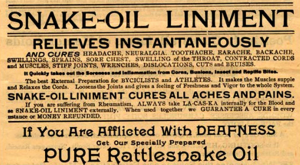

It is surprising, then, that the crux of the anger revolved around the *published research*. Not that Facebook shouldn’t do A/B testing, but that researchers shouldn’t be allowed to publish on it. This seems to be the exact opposite of what should be happening: if indeed every major web company practices these methods already, then scholarly research on how such practices can sway emotions or voting practices are *exactly* what we need. We must bring these practices to light, in ways the public can understand, and decide as a society whether they cross ethical boundaries. A similar discussion occurred during the early decades of the 20th century, when the FDA and FTC were formed, in part, to prevent false advertising of snake oils and foods and other products.

We are at the cusp of a new era. The mix of big data, social networks, media companies, content creators, government surveillance, corporate advertising, and ubiquitous computing is a perfect storm for intense influence both subtle and far-reaching. Algorithmic nudging has the power to sell products, win elections, topple governments, and oppress a people, depending on how it is wielded and by whom. We have seen this work from the bottom-up, in Occupy Wallstreet, the Revolutions in the Middle East, and the ALS Ice-Bucket Challenge, and from the top-down in recent presidential campaigns, Facebook studies, and coordinated efforts to preserve net neutrality. And these have been works of non-experts: people new to this technology, scrambling in the dark to develop the methods as they are deployed. As we begin to learn more about network-based control and influence, these examples will multiply in number and audacity.

<!-- page 15 -->

***14. Surveillance***

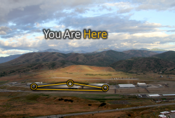

And this story leaves out one of the most major players of all: government. When Edward Snowden leaked the details of classified NSA surveillance program, the world was shocked at the government’s interest in and capacity for omniscience. Data scientists, on the other hand, were mostly surprised that people didn’t realize this was happening. If the technology is there, you can bet it will be used.

And so here, in the NSA’s $1.5 billion dollar data center in Utah, are the private phone calls, parking receipts, emails, and Google searches of millions of American citizens. It stores a few exabytes of our data, over a billion gigabytes and roughly equivalent to a hundred thousand times the size of the library of congress. More than enough space, really.

The humanities have played some role in this complex machine. During the Cold War, the U.S. government covertly supported artists and authors to create cultural works which would spread American influence abroad and improve American sentiment at home.

<!-- page 16 -->

Today the landscape looks a bit different. For the last few years DARPA, the research branch of the U.S. Department of Defense, has been funding research and hosting conferences in what they call “Narrative Networks.” Computer scientists, statisticians, linguists, folklorists, and literary scholars have come together to discuss how ideas spread and, possibly, how to inject certain sentiments within specific communities. It’s a bit like the science of memes, or of propaganda.

Beyond this initiative, DARPA funds have gone toward several humanities-supported projects to develop actionable plans for the U.S. military. One project, for example, creates as-complete-as-possible simulations of cultures overseas, which can model how groups might react to the dropping of bombs or the spread of propaganda. These models can be used to aid in the decision-making processes of officers making life-and-death decisions on behalf of troops, enemies, and foreign citizens. Unsurprisingly, these initiatives, as well as NSA surveillance at home, all rely heavily on network analysis.

In fact, when the news broke on the captures of Osama bin Laden and Saddam Hussein, and how they were discovered via network analysis, some of my family called me after reading the newspapers claiming “we finally understand what you do!” This wasn’t the reaction I was hoping for.

In short, the world is changing incredibly rapidly, in large part driven by the availability of data, network science and statistics, and the ever-increasing role of technology in our lives. Are these corporate, political, and grassroots efforts overstepping their bounds? We honestly don’t know. We are only beginning to have sustained, public discussions about the new role of technology in society, and the public rarely has enough access to information to make informed decisions. Meanwhile, media and web companies may be forgiven for overstepping ethical boundaries, as our culture hasn’t quite gotten around to drawing those boundaries yet.

***15. The Humanities’ Place***

<!-- page 17 -->

This is where the humanities come in – not because we have some monopoly on ethics (goodness knows the way we treat our adjuncts is proof we do not) – but because we are uniquely suited to the small scale. To close reading. While what often sets the digital humanities apart from its analog counterpart is the distant reading, the macroanalysis, what sets us all apart is our unwillingness to stray too far from the source. We intersperse the distant with the close, attempting to reintroduce the individual into the aggregate.

Network analysis, not coincidentally, is particularly suited to this endeavor. While recent efforts in sociophysics have stressed the importance of the grand scale, let us not forget that network theory was built on the tiniest of pieces in psychology and sociology, used as a tool to explore individuals and their personal relationships. In the intervening years, all manner of methods have been created to bridge macro and micro, from Granovetter’s theory of weak ties to Milgram’s of Small Worlds, and the way in which people navigate the networks they find themselves in. Networks work at every scale, situating the macro against the meso against the micro.

But we find ourselves in a world that does not adequately utilize this feature of networks, and is increasingly making decisions based on convenience and money and politics and power without taking the human factor into consideration. And it’s not particularly surprising: it’s easy, in the world of exabytes of data, to lose the trees for the forest.

This is not a humanities problem. It is not a network scientist problem. It is not a question of the ethics of research, but of the ethics of everyday life. Everyone is a network scientist. From Twitter users to newscasters, the boundary between people who consume and people who are aware of and influence the global social network is blurring, and we need to deal with that. We must collaborate with industries, governments, and publics to become ethical stewards of this networked world we find ourselves in.

<!-- page 18 -->

***16. Big and Small***

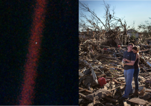

Your challenge, as researchers on the forefront of network analysis and the humanities, is to tie the very distant to the very close. To do the research and outreach that is needed to make companies, governments, and the public aware of how perturbations of the great mobile that is our society affect each individual piece.

We have a number of routes available to us, in this respect. The first is in basic research: the sort that got those Facebook study authors in such hot water. We need to learn and communicate the ways in which pervasive surveillance and algorithmic influence can affect people’s lives and steer societies.

A second path towards influencing an international discussion is in the development of new methods that highlight the place of the individual in the larger network. We seem to have a critical mass of humanists collaborating with or becoming computer scientists, and this presents a perfect opportunity to create algorithms which highlight a node’s uniqueness, rather than its similarity.

Another step to take is one of public engagement that extends beyond the academy, and takes place online, in newspapers or essays, in interviews, in the creation of tools or museum exhibits. The MIT Media Lab, for example, created a tool after the Snowden leaks that allows users to download their email metadata to reveal the networks they form. The tool was a fantastic example of a way to show the public exactly what “simply metadata” can reveal about a person, and its viral spread was a testament to its effectiveness. Mike Widner of Stanford called for exactly this sort of engagement from digital humanists a few years ago, and it is remarkable how little that call has been heeded.

<!-- page 19 -->

Pedagogy is a fourth option. While people cry that the humanities are dying, every student in the country will have taken many humanities-oriented courses by the time they graduate. These courses, ostensibly, teach them about what it means to be human in our complex world. Alongside the history, the literature, the art, let’s teach what it means to be part of a global network, constantly contributing to and being affected by its shadow.

With luck, reconnecting the big with the small will hasten a national discussion of the ethical norms of big data and network analysis. This could result in new government regulating agencies, ethical standards for media companies, or changes in ways people interact with and behave on the social web.

***17. Going Forward***

When you zoom out far enough, everything looks the same. Occupy Wall Street; Ferguson Riots; the ALS Ice Bucket Challenge; the Iranian Revolution. They’re all just grassroots contagion effects across a social network. Rhetorically, presenting everything as a massive network is the same as photographing the earth from four billion miles: <u>beautiful, soberin</u>g, and <u>homogenizin</u>g. I challenge you to compare network visualizations of Ferguson Tweets with the ALS Ice Bucket Challenge, and see if you can make out any differences. I couldn’t. We need to zoom in to make meaning.

The challenge of network analysis in the humanities is to bring our close reading perspectives to the distant view, so media companies and governments don’t see everyone as just some statistic, some statistical blip floating on this pale blue dot.

<!-- page 20 -->

I will end as I began, with a quote from Carl Sagan, reflecting on a time gone by but every bit as relevant for the moment we face today:

> *I know that science and technology are not just cornucopias pouring good deeds out into the world. Scientists not only conceived nuclear weapons; they also took political leaders by the lapels, arguing that their nation — whichever it happened to be — had to have one first. … There’s a reason people are nervous about science and technology. And so the image of the mad scientist haunts our world—from Dr. Faust to Dr. Frankenstein to Dr. Strangelove to the white-coated loonies of Saturday morning children’s television. (All this doesn’t inspire budding scientists.) But there’s no way back. We can’t just conclude that science puts too much power into the hands of morally feeble technologists or corrupt, power-crazed politicians and decide to get rid of it. Advances in medicine and agriculture have saved more lives than have been lost in all the wars in history. Advances in transportation, communication, and entertainment have transformed the world. The sword of science is double-edged. Rather, its awesome power forces on all of us, including politicians, a new responsibility — more attention to the long-term consequences of technology, a global and transgenerational perspective, an incentive to avoid easy appeals to nationalism and chauvinism. Mistakes are becoming too expensive.*

Let us take Carl Sagan’s advice to heart. Amidst cries from commentators on the irrelevance of the humanities, it seems there is a large void which we are both well-suited and morally bound to fill. This is the path forward.

Thank you.

Thanks to [Nickoal Eichmann](http://nickoal.com/) and [Elijah Meeks](https://digitalhumanities.stanford.edu/users/elijah-meeks) for editing & inspiration.

---

## Reader Comments

> [**Jan Christoph Meister**](https://plus.google.com/+JanChristophMeister), September 14, 2014
>
> Scott, an excellent and long overdue piece. And, as of now, a ‘must read’ in my intro to DH course. Well done!

> **417i**, September 15, 2014
>
> great article, thx

> **Adeline Schebesch**, September 23, 2014
>
> this is really cool. thx
