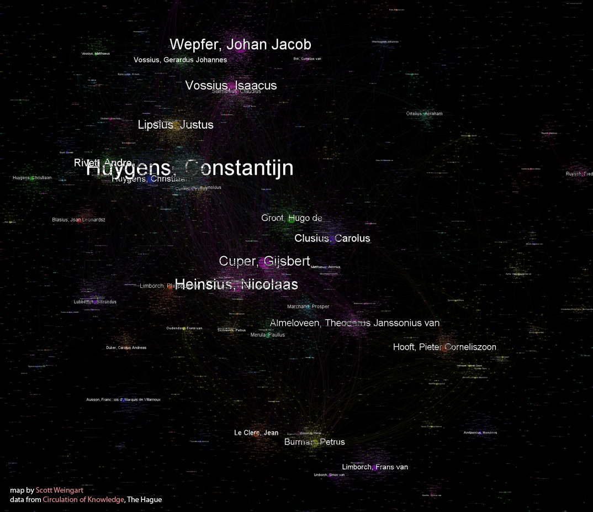

Well, it looks like [Digital Humanities Now](http://digitalhumanitiesnow.org/) scooped me on posting my own article. As some of you may have read, I recently [did not submit a paper on the Republic of Letters](/blog/on-keeping-pledges/), opting instead to hold off until I could submit it to a journal which allowed authorial preprint distribution. Preprints are a vital part of rapid knowledge exchange in our ever-quickening world, and while some disciplines have embraced the preprint culture, many others have yet to. I’d love the humanities to embrace that practice, and in the spirit of being the change you want to see in the world, I’ve decided to post a preprint of my Republic of Letters paper, which I will be submitting to another journal in the near future. **You can read the full first draft** [**here**](http://scottbot.net/uploads/weingartNetworks.pdf)**.**

The paper, briefly, is an attempt to contextualize the [Republic of Letters](http://en.wikipedia.org/wiki/Republic_of_Letters) and the [Scientific Revolution](http://en.wikipedia.org/wiki/Scientific_revolution) using modern computational methodologies. It draws from secondary sources on the Republic of Letters itself, especially from my old mentor [R.A. Hatch](http://www.clas.ufl.edu/users/ufhatch/pages/), some network analysis from sociology and statistical physics, modeling, [human dynamics](http://en.wikipedia.org/wiki/Human_dynamics), and complexity theory. All of this is combined through datasets graciously donated by the Dutch [Circulation of Knowledge](http://ckcc.huygens.knaw.nl/) group and Oxford’s [Cultures of Knowledge](http://www.history.ox.ac.uk/cofk/) project, totaling about 100,000 letters worth of metadata. Because it favors large scale quantitative analysis over an equally important close and qualitative analysis, the paper is a contribution to historiopgraphic methodology rather than historical narrative; that is, it doesn’t say anything particularly novel about history, but it does offer a (fairly) new way of looking at and contextualizing it.

A visualization of the Dutch Republic of Letters using Sci2 & Gephi

At its core, the paper suggests that by looking at how scholarly networks naturally grow and connect, we as historians can have new ways to tease out what was contingent upon the period and situation. It turns out that social networks of a certain topology are [basins of attraction](http://www.scholarpedia.org/article/Basin_of_attraction) similar to those I discussed in [Flow and Empty Space](/blog/flow-and-empty-space/). With enough time and any of a variety of facilitating social conditions and technologies, a network similar in shape and influence to the Republic of Letters will almost inevitably form. Armed with this knowledge, we as historians can move back to the microhistories and individuated primary materials to find exactly *what* those facilitating factors were, who played the key roles in the network, how the network may differ from what was expected, and so forth. Essentially, this method is one [base map](/blog/contextualizing-networks-with-maps/) we can use to navigate and situate historical narrative.

<!-- page 1 -->

Of course, I make no claims of this being the *right* way to look at history, or the only quantitative base map we can use. The important point is that it raises new kinds of questions and is one mechanism to facilitate the re-integration of the individual and the [*longue durée*](http://en.wikipedia.org/wiki/Longue_dur%C3%A9e)*,* the close and the distant reading.

The project casts a necessarily wide net. I do not yet, and probably could not ever, have mastery over each and every disciplinary pool I draw from. With that in mind, I welcome comments, suggestions, and criticisms from historians, network analysts, modelers, sociologists, and whomever else cares to weigh in. Whomever helps will get a gracious acknowledgement in the final version, good scholarly karma, and a cookie if we ever meet in person. The draft will be edited and submitted in the coming months, and if you have ideas, please post them in the comment section below. Also, if you use ideas from the paper, please cite it as an unpublished manuscript or, if it gets published, cite that version instead.

<!-- page 2 -->
