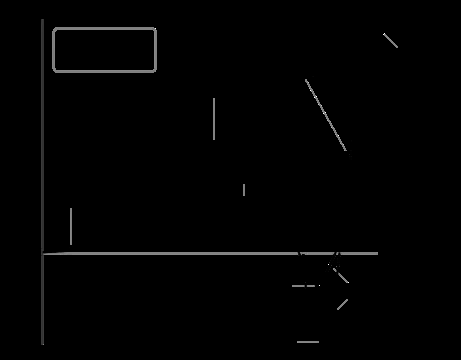

Below is some crazy, uninformed ramblings about the least-complex possible way to trick someone into thinking a computer is a human, for the purpose of history research. I’d love some genuine AI/Machine Intelligence researchers to point me to the actual discussions on the subject. These aren’t original thoughts; they spring from countless sci-fi novels and AI research from the ’70s-’90s. Humanists beware: this is super sci-fi speculative, but maybe an interesting thought experiment.

If someone’s chatting with a computer, but doesn’t realize her conversation partner isn’t human, that computer passes the [Turing Test](https://en.wikipedia.org/wiki/Turing_test). Unrelatedly, if a robot or piece of art is just close enough to reality to be creepy, but not close enough to be convincingly real, it lies in the [Uncanny Valley](https://en.wikipedia.org/wiki/Uncanny_valley). I argue there is a useful concept in the simplest possible computer which is still convincingly human, and that computer will be at the **Turing Point**.[^1]

<!-- page 2 -->

*By* [*Smurrayinchester*](https://commons.wikimedia.org/w/index.php?curid=2041097) *– self-made, based on image by* [*Masahiro Mori and Karl MacDorman*](http://www.androidscience.com/theuncannyvalley/proceedings2005/uncannyvalley.html)*, CC BY-SA 3.0*

Forgive my twisting Turing Tests and Uncanny Valleys away from their normal use, for the sake of outlining the **Turing Point** concept:

- A human simulacrum is *a simulation of a human, or some aspect of a human, in some medium, which is designed to be as-close-as-possible to that which is being modeled, within the scope of that medium.*
- A Turing Test winner is *any human simulacrum which humans consistently mistake for the real thing.*
- An occupant of the Uncanny Valley is *any human simulacrum which humans consistently doubt as representing a “real” human.*
- Between the Uncanny Valley and Turing Test winners lies the Turing Point, occupied by *the least-sophisticated human simulacrum that can still consistently pass as human in a given medium*. The Turing Point is a [hyperplane](https://en.wikipedia.org/wiki/Hyperplane) in a [hypercube](https://en.wikipedia.org/wiki/Hypercube), such that there are many points of entry for the simulacrum to “[phase-transition](https://en.wikipedia.org/wiki/Phase_transition)” from uncanny to convincing.

## Extending the Turing Test

The classic Turing Test scenario is a text-only chatbot which must, in free conversation, be convincing enough for a human to think it is speaking with another human. A piece of software named [Eugene Goostman sort-of passed this test in 2014](https://en.wikipedia.org/wiki/Eugene_Goostman), convincing a third of judges it was a 13-year-old Ukrainian boy.

There are many possible modes in which a computer can act convincingly human. It is easier to make a convincing simulacrum of a 13-year-old non-native <!-- page 3 --> English speaker who is confined to text messages than to make a convincing college professor, for example. Thus the former has a lower Turing Point than the latter.

Playing with the constraints of the medium will also affect the Turing Point threshold. The Turing Point for a flesh-covered robot is incredibly difficult to surpass, since so many little details (movement, design, voice quality, etc.) may place it into the Uncanny Valley. A piece of software posing as a Twitter user, however, would have a significantly easier time convincing fellow users it is human.

The Turing Point, then, is flexible to the medium in which the simulacrum intends to deceive, and the sort of human it simulates.

## From Type to Token

Convincing the world a simulacrum is *any old human* is different than convincing the world it is *some specific human*. This is the [token/type distinction](https://en.wikipedia.org/wiki/Type%E2%80%93token_distinction); convincingly simulating a specific person (token) is much more difficult than convincingly simulating any old person (type).

Simulations of specific people are all over the place, even if they don’t intend to deceive. Several Twitter-bots exist as [simulacra of Donald Trump](https://twitter.com/deepdrumpf), reading his tweets and creating new ones in a similar style. Perhaps imitating [Poe’s Law](https://en.wikipedia.org/wiki/Poe%27s_law), certain people’s styles, or certain types of media (e.g. Twitter), may provide such a low Turing Point that it is genuinely difficult to distinguish humans from machines.

Put differently, the way some Turing Tests may be designed, humans could easily lose.

It’ll be useful to make up and define two terms here. I imagine the concepts already exist, but couldn’t find them, so please comment if they do so I can use <!-- page 4 --> less stupid words:

- A type-bot is a *machine designed to be represent something at the type-level*. For example, a bot that can be mistaken for some random human, but not some specific human.
- A token-bot *is a machine designed to represent something at the token-level*. For example, a bot that can be mistaken for Donald Trump.

## Replaying History

Using traces to recreate historical figures (or at least things they could have done) as token-bots is not uncommon. The most recent high-profile example of this is a project to [create a new Rembrandt painting in the original style](http://www.openculture.com/2016/04/the-next-rembrandt.html). Shawn Graham and I wrote an [article on using simulations to create new plausible histories](http://www.scottbot.net/HIAL/wp-content/uploads/2011/11/Preprint-Graham-and-Weingart.pdf), among *many* other examples old and new.

This all got me thinking, if we reach the Turing Point for some social media personalities (that is, it is difficult to distinguish between their social media presence, and a simulacrum of it), what’s to say we can’t reach it for an entire social media ecosystem? **Can we take a snapshot of Twitter and project it several seconds/minutes/hours/days into the future, a bit like a meteorological model?**

A few questions and obvious problems:

- Much of Twitter’s dynamics are dependent upon exogenous forces: memes from other media, real world events, etc. Thus, no projection of Twitter *alone* would ever look like the real thing. One can, however, potentially use such a simulation to predict how certain types of events might affect the system.
- This is way overkill, and impossibly computationally complex at this scale. You can simulate the dynamics of Twitter without simulating every individual user, because people on average act pretty systematically. That said, for the <!-- page 5 --> humanities-inclined, we may gain more insight from the ground-level of the system (individual agents) than macroscopic properties.
- *This is key*. Would a set of plausibly-duplicate Twitter personalities *on aggregate* create a dynamic system that matches Twitter as an aggregate system? That is, just because the algorithms pass the Turing Test, because humans believe them to be humans, does that necessarily imply the algorithms have enough fidelity to accurately recreate the dynamics of a large scale social network? Or will small unnoticeable differences between the simulacrum and the original accrue atop each other, such that in aggregate they no longer act like a real social network?

The last point is I think a theoretically and methodologically fertile one for people working in DH, AI, and Cognitive Science: whether reducing human-[appreciable](/blog/appreciability-experimental-digital-humanities/) traits between machines and people is sufficient to simulate aggregate social behavior, or whether human-appreciability (i.e., Turing Test) is a strict enough criteria for making accurate predictions about societies.

These points aside, if we ever do manage to simulate specific people (even in a very limited scope) as token-bots based on the traces they leave, it opens up interesting pedagogical and research opportunities for historians. Scott Enderle tweeted a great metaphor for this:

> [*@scott_bot*](https://twitter.com/scott_bot) *In one of the thousand science fiction stories I’ll never write, “nachlass” is the name for an archived consciousness.*
>
> *— Scott Enderle (@scottenderle)* [*April 18, 2016*](https://twitter.com/scottenderle/status/722046286225084416)

> [*@scottenderle*](https://twitter.com/scottenderle) *That’s a compelling metaphor, an outline tracing the negative space left by the deceased, drawn with everything they touched.*
>
> *— Scott B. Weingart (@scott_bot)* [*April 18, 2016*](https://twitter.com/scott_bot/status/722051126124769281)

<!-- page 6 -->

Imagine, as a student, being able to have a plausible discussion with Marie Curie, or sitting in an Enlightenment-era salon.[^2] Or imagine, as a researcher (if individual Turing Point machines *do* aggregate well), being able to do well-grounded counterfactual history that works at the token level rather than at the type level.

## Turing Point Simulations

Bringing this slightly back into the realm of the sane, the interesting thing here is the interplay between appreciability (a person’s ability to appreciate enough difference to notice something wrong with a simulacrum) and [fidelity](https://en.wikipedia.org/wiki/Fidelity#Scientific_modelling_and_simulation).

We can specifically design simulation conditions with incredibly low-threshold Turing Points, even for token-bots. That is to say, we can create a condition where the interactions are simple enough to make a bot that acts indistinguishably from the specific human it is simulating.

At the most extreme end, this is obviously pointless. If our system is one in which a person can only answer “yes” or “no” to pre-selected preference questions (“Do you like ice-cream?”), making a bot to simulate that person convincingly would be trivial.

Putting that aside (lest we get into questions of the Turing Point of a set of Turing Points), we can potentially design reasonably simplistic test scenarios that would allow for an easy-to-reach Turing Point while still being historiographically or sociologically useful. It’s sort of a [minimization problem in topological optimizations](https://en.wikipedia.org/wiki/Mathematical_optimization#Minimum_and_maximum_value_of_a_function). Such a goal would limit the burden of the simulation while maximizing the potential research benefit (but only if, as mentioned before, the difference between true fidelity and the ability to win a token-bot Turing Test is small enough to allow for generalization).

In short, the concept of a Turing Point can help us conceptualize and build token-simulacra that are useful for research or teaching. It helps us ask the <!-- page 7 --> question: what’s the least-complex-but-still-useful token-simulacra? It’s also kind-of maybe sort-of like [Kolmogorov complexity](https://en.wikipedia.org/wiki/Kolmogorov_complexity) for human appreciability of other humans: that is, the simplest possible representation of a human that is convincing to other humans.

I’ll end by saying, once again, I realize how insane this sounds, and how far-off. And also how much an interloper I am to this space, having never so much as designed a bot. Still, as Bill Hart-Davidson wrote,

> [*@scott_bot*](https://twitter.com/scott_bot) *I agree, and that scale is more clearly plausible than it all seemed years ago reading Mona Lisa Overdrive*
>
> *— Bill Hart-Davidson (@billhd)* [*April 18, 2016*](https://twitter.com/billhd/status/721885990944681984)

the possibility seems more plausible than ever, even if not soon-to-come. I’m not even sure why I posted this on the *Irregular*, but it seemed like it’d be relevant enough to some regular readers’ interests to be worth spilling some ink.

Notes:

[^1]: The name itself is maybe too on-the-nose, being a pun for *turning point* and thus connected to the rhetoric of singularity, but ¯\\\_(ツ)\_/¯

[^2]: Yes yes I know, this is SecondLife all over again, but hopefully much more useful.
