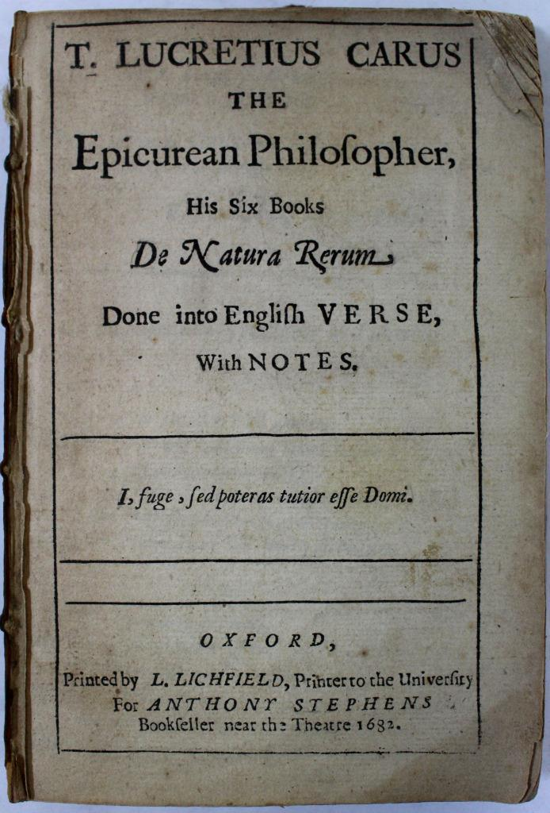
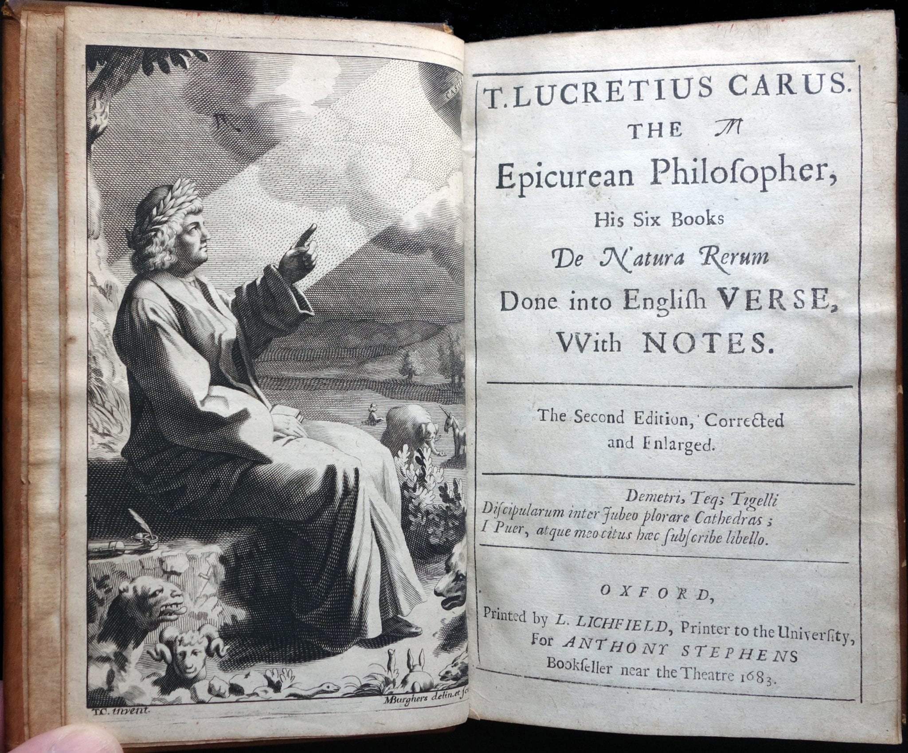

## The man

On a July evening in 1682, Leonard Lichfield received notice to stop the presses. From his shop in Oxford, Lichfield was printing a translation of the most dangerous poem in England.

A letter had come for its translator earlier that day, in the midst of a summer of terrible storms and floods. Eminent astronomy professor Edward Bernard wrote to the young scholar: "My dear friend, as you love me, and love piety, you will change your text in this place. I will cover the costs to the printer." He added "Pray signify it to the printer this night." Bernard proposed a handful of edits, softening potential insult to more pious readers.

That night, or near enough, the change went in. Because the book was stopped mid-run, both versions still survive: one bolder, one more careful. A book caught in the act of flinching.

The book deserved the caution. Lucretius's ancient poem *De rerum natura* described a universe with no caring gods and no immortal soul, just atoms and chance. The atheist's guidebook. No one had yet published a complete English translation.

The man who finally did it was just twenty one, a shopkeeper's son from Blandford Forum whose education was paid through charity. Despite Bernard's urgent letter, the translation already wrapped the atheist poison in its own antidote: forty-six pages of notes built to refute, line by line, the verses themselves. "The best method" he wrote "to overthrow the Epicurean Hypothesis... is to expose a full system of it to public view."

He knew the work carried risks.^[In *Reading Lucretius in the Renaissance* (2014), Ada Palmer compellingly argues the risks were not *quite* as great as they might seem. I'll tease the real vs. imagined risks apart another time.] In place of his name, the title page borrowed a line of Latin from the Roman poet Martial: "*I, fuge, sed poteras tutior esse Domi.*" Martial nervously told his own book, as it left for the city: "Go then, flee! But you could have been safer at home." *De rerum natura's* translation left to press with the same warning to itself written on its cover.

*image via [WorthPoint](https://www.worthpoint.com/worthopedia/de-natura-rerum-english-verse-titus-1895396467)*

The risk paid off beyond anything the young scholar could have dreamed. Readers compared him to Chaucer, Shakespeare, Spenser, and Dryden. Thousands of copies swiftly sold across multiple editions.

Emboldened, in the second edition the translator replaced Martial's meek epigraph with a bold line from Horace: "*Demetri, teque, Tigelli, discipularum inter iubeo plorare cathedras. I, puer, atque meo citus haec subscribe libello.*" Horace told his critics "Demetrius and Tigellius, I bid you go whine amidst the easy chairs of your pupils in petticoats! Go, lad, and quickly add these lines to my little book." Be off with you, haters, my book proceeds.

*image via [The Friedman Lab](https://plantmorphology.org/portfolio-item/lucretius/)*

In under a year, the book that flinched at its own daring began to swagger. Between "could have been safer at home" and "quickly add these lines to my little book," the flinch and the brag, is the story of our translator Thomas Creech.

He could have been safer at home. There was a shop in Blandford, a quiet life in his father's trade. But he left to Oxford, and none would remember his name today but for that decision. Because he left, Creech was known to English students of science for a century—attached as it was to *the* English version of the ancient theory of atomism. Indeed one German editor in 1782 named an entire era for him: *Aetas Creechiana*, the age of Creech.

Science benefited from his decision to leave Blandford. Perhaps he, himself, did not. Perhaps he should have stayed at home. At thirty nine, Thomas Creech was found dead in an Oxford attic by his own hand. For over two hundred years the false and scandalous echoes of that death followed him, often overshadowing the remarkable contributions of his life.

The book flinched and flexed, and lived. The man attempted the same, and did not.

There's a tragedy in the story for those who want to read it—and many do. Rumor-mongers at the time and since blamed heartbreak, debt, and atheism (all untrue). The likelier story was a long battle with what we'd now call depression, combined possibly with the internal theological and philosophical tensions between the sources he loved and the religion he believed with all his heart. Since he ordered his papers to be burned after his death, we'll never know for sure.

What we can piece together are the feats of his mind (one credible report has him strolling through the park translating fifty lines at a time before going home to write them all down), some scant aspects of his life, and the impact he had on his contemporaries and those who came after.

## The project

And piecing together his life is what I've been doing, on and off, for twenty years. I've amassed some seven hundred sources in a Zotero library, and read most of them. I've torn apart every primary source I've been able to track down on the web or get scanned from British archives or friends—though I've not managed to secure the funding to do my own direct archival research. As such, there are a small handful of extant pieces from his life I haven't seen or read directly.

AI does play into the project. As of 2024 I'd written maybe 20,000 words of the bio, compressed from about 100,000 words of notes. It wasn't a book. At the pace I'd been going, it wouldn't be a book before my death.

Then I started playing with LLMs, and by 2026 "agentic interfaces." Never for writing the book, but for research support. They caught some errors I made, like a miscalculation based on changing calendars. They found connections between people in the sources I hadn't noticed (situations e.g., where there was a bit evidence that two of Creech's contacts were friends, but since that evidence showed up in places beyond the context of Creech, I didn't register it when first reading it). They helped me develop a chronology that I was able to fully audit and then expand upon.

I don't *think* AI sped up my process. Checking its accuracy probably slowed me down tremendously, to be honest. But in a thousand little directions, its given me the pointers and pushes I've needed to kick my writing process into gear.

Other historians use AI creatively and carefully; I'm not breaking new ground here. But I believe my process to be an example of responsible use of AI for historical research. In a sea of irresponsible uses, it seems worthwhile to share my process alongside my research. Or hey, doing it in public might help me learn it's not so responsible, so careful, or so sound as I believe. Learning that would also be a win.

So in the grand digital humanities spirit of futzing around online and figuring out new things together, as a community, expect more on Creech and my approach to writing his life to show up on *the irregular* in the coming months. Or maybe years. Who knows?