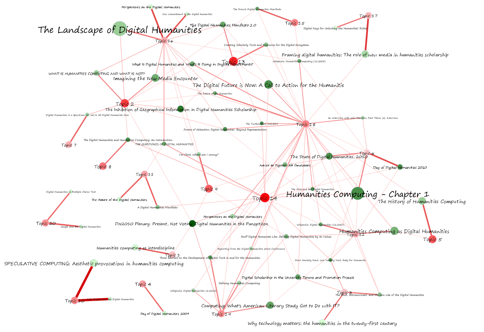

It’s that time again! Somebody else posted a [really clear and enlightening description of topic modeling](http://ariddell.org/weblog/2012/07/22/simple-topic-model/) on the internet. This time it was Allen Riddell, and it’s so good that it inspired me to write this post about topic modeling that includes no actual new information, but combines a lot of old information in a way that will hopefully be useful. If there’s anything I’ve missed, by all means let me know and I’ll update accordingly.

## Introducing Topic Modeling

Topic models represent a class of computer programs that automagically extracts topics from texts. What a topic actually *is* will be revealed shortly, but the crux of the matter is that if I feed the computer, say, the last few speeches of President Barack Obama, it’ll come back telling me that the president mainly talks about the economy, jobs, the Middle East, the upcoming election, and so forth. It’s a fairly clever and exceptionally versatile little algorithm that can be customized to all sorts of applications, and a tool that many digital humanists would do well to have in their toolbox.

From the outset it’s worth clarifying some vocabulary, and mentioning what topic models can and cannot do. “LDA” and “Topic Model” are often thrown around synonymously, but [LDA is actually a special case of topic modeling in general produced by David Blei and friends  in 2002](http://en.wikipedia.org/wiki/Latent_Dirichlet_allocation). It was not the first topic modeling tool, but is by far the most popular, and has enjoyed copious extensions and revisions in the years since. The myriad variations of topic modeling have resulted in an alphabet soup of names that might be confusing or overwhelming to the uninitiated; ignore them for now. They all pretty much work the same way.

When you run your text through a standard topic modeling tool, what comes out the other end first is several lists of words. Each of these lists is supposed to be a “topic.” Using the example from before of presidential addresses, the list might look like:

1. Job Jobs Loss Unemployment Growth
2. Economy Sector Economics Stock Banks
3. Afghanistan War  Troops Middle-East Taliban Terror
4. Election Romney Upcoming President
5. … etc.

The computer gets a bunch of texts and spits out several lists of words, and we are meant to think those lists represent the relevant “topics” of a corpus. The algorithm is constrained by the words used in the text; if Freudian psychoanalysis is your thing, and you feed the algorithm a transcription of your dream of bear-fights and big caves, the algorithm will tell you nothing about your father and your mother; it’ll only tell you things about bears and caves. It’s all text and no subtext. Ultimately, LDA is an attempt to inject semantic meaning into vocabulary; it’s a bridge, and often a helpful one. Many [dangers face those who use this bridge without fully understanding it](/blog/the-myth-of-text-analytics-and-unobtrusive-measurement/), which is exactly what the rest of this post will help you avoid.

<!-- page 1 -->

Network generated by [Elijah Meeks](https://dhs.stanford.edu/comprehending-the-digital-humanities/) to show how digital humanities documents relate to one another via the topics they share.

## Learning About Topic Modeling

<!-- page 2 -->

The pathways to topic modeling are many and more, and those with different backgrounds and different expertise will start at different places. This guide is for those who’ve started out in traditional humanities disciplines and have little background in programming or statistics, although the path becomes more strenuous as we get closer Blei’s original paper on LDA (as that is our goal.) I will try to point to relevant training assistance where appropriate. A lot of the following posts repeat information, but there are often little gems in each which make them all worth reading.

## No Experience Necessary

The following posts, read in order, should be completely understandable to pretty much everyone.

### The Fable

Perhaps the most interesting place to start is [the stylized account of topic modeling by Matt Jockers](http://www.matthewjockers.net/2011/09/29/the-lda-buffet-is-now-open-or-latent-dirichlet-allocation-for-english-majors/), who weaves a tale of authors sitting around the LDA buffet, taking from it topics with which to write their novels. According to Jockers, the story begins in a quaint town, . . .

> *somewhere in New England perhaps. The town is a writer’s retreat, a place they come in the summer months to seek inspiration. Melville is there, Hemingway, Joyce, and Jane Austen just fresh from across the pond. In this mythical town there is spot popular among the inhabitants; it is a little place called the “LDA Buffet.” Sooner or later all the writers go there to find themes for their novels. . .*

The blog post is a fun read, and gets at the general idea behind the process of a topic model without delving into any of the math involved. Start here if you are a humanist who’s never had the chance to interact with topic models.

### A Short Overview

[Clay Templeton over at MITH wrote a short, less-stylized overview of topic modeling](http://mith.umd.edu/topic-modeling-in-the-humanities-an-overview/) which does a good job discussing the trio of issues currently of importance: the process of the model, the software itself, and applications in the humanities.

> In this post I map out a basic genealogy of topic modeling in the humanities, from the highly cited paper that first articulated Latent Dirichlet Allocation (LDA) to recent work at MITH.

Templeton’s piece is concise, to the point, and offers good examples of topic models used for applications you’ll actually care about. It won’t tell you any more about the process of topic modeling than Jockers’ article did, but it’ll get you further into the world of topic modeling as it is applied in the humanities.

### An Example: The American Political Science Review

Now that you know the basics of what a topic model actually is, perhaps the best thing is to look at an actual example to ground these abstract concepts. David Blei’s team shoved all of the journal articles from *The American Political Science Review* into a topic model, [resulting in a list of 20 topics](http://topics.cs.princeton.edu/polisci-review/) that represent the content of that journal. Click around on the page; when you click one of the topics, it sends you to a page listing many of the words in that topic, and many of the documents associated with it. When you click on one of the document titles, you’ll get a list of topics related to that document, as well as a list of other documents that share similar topics.

This page is indicative of the sort of output topic modeling will yield on a corpus. It is a simple and powerful tool, but notice that none of the automated topics have labels associated with them. The model requires us to make meaning out of them, they require interpretation, and without fully understanding the underlying algorithm, one cannot hope to properly interpret the results.

### First Foray into Formal Description

Written by yours truly, [this next description of topic modeling](/blog/topic-modeling-and-network-analysis/) begins to get into the formal process the computer goes through to create the topic model, rather than simply the conceptual process behind it. The blog post begins with a discussion of the predecessors to LDA in an attempt to show a simplified version of how LDA works, and then uses those examples to show what LDA does differently. There’s no math or programming, but the post does attempt to bring up relevant vocabulary and define them in terms familiar to those without programming experiencing.

> With this matrix, LSA uses [singular value decomposition](http://en.wikipedia.org/wiki/Singular_value_decomposition) to figure out how each word is related to every other word. Basically, the more often words are used together within a document, the more related they are to one another. It’s worth noting that a “document” is defined somewhat flexibly. For example, we can call every paragraph in a book its own “document,” and run LSA over the individual paragraphs.

Only the first half of this post is relevant to our topic modeling guided tour. The second half, a section on topic modeling and network analysis, discusses various extended uses that are best left for later.

### Computational Process

Ted Underwood provides the [next step in understanding what the computer goes through](http://tedunderwood.wordpress.com/2012/04/07/topic-modeling-made-just-simple-enough/) when topic modeling a text.

> . . . it’s a long step up from those posts to the computer-science articles that explain “Latent Dirichlet Allocation” mathematically. My goal in this post is to provide a bridge between those two levels of difficulty.
>
> Computer scientists make LDA seem complicated because they care about proving that their algorithms work. And the proof is indeed brain-squashingly hard. But the *practice* of topic modeling makes good sense on its own, without proof, and does not require you to spend even a second thinking about “Dirichlet distributions.” When the math is approached in a practical way, I think humanists will find it easy, intuitive, and empowering. This post focuses on LDA as shorthand for a broader family of “probabilistic” techniques. I’m going to ask how they work, what they’re for, and what their limits are.

<!-- page 3 -->

His is the first post that talks in any detail about the iterative process going into algorithms like LDA, as well as some of the assumptions those algorithms make. He also shows the first formula appearing in this guided tour, although those uncomfortable with formulas need not fret. The formula is not essential to understanding the post, but for those curious, later posts will explicate it. And really, Underwood does a great job of explaining a bit about it there.

Be sure to read to the very end of the post. It discusses some of the important limitations of topic modeling, and trepidations that humanists would be wise to heed.  He also recommends reading Blei’s recent article on Probabilistic Topic Models, which will be coming up shortly in this tour.

### Computational Process From Another Angle

It may not matter whether you read this or the last article by Underwood first; they’re both first passes to what the computer goes through to generate topics, and they explain the process in slightly different ways. The highlight of [Edwin Chen’s blog post](http://blog.echen.me/2011/08/22/introduction-to-latent-dirichlet-allocation/) is his section on “Learning,” followed a section expanding that concept.

> And for each topic t, compute two things: 1) p(topic t | document d) = the proportion of words in document d that are currently assigned to topic t, and 2) p(word w | topic t) = the proportion of assignments to topic t over all documents that come from this word w. Reassign w a new topic, where we choose topic t with probability p(topic t | document d) \* p(word w | topic t) (according to our generative model, this is essentially the probability that topic t generated word w, so it makes sense that we resample the current word’s topic with this probability).

This post both explains the meaning of these statistical notations, and tries to actually step the reader through the process using a metaphor as an example, a bit like Jockers’ post from earlier but more closely resembling what the computer is going through. It’s also worth reading through the comments on this post if there are parts that are difficult to understand.

This ends the list of articles and posts that require pretty much no prior knowledge. Reading all of these should give you a great overview of topic modeling, but you should by no means stop here. The following section requires a very little bit of familiarity with statistical notation, most of which can be found at [this Wikipedia article on Bayesian Statistics](http://en.wikipedia.org/wiki/Bayes'_theorem).

## Some Experience Required

Not much experience! You can even probably ignore most of the formulae in these posts and still get quite a great deal out of them. Still, you’ll get the most out of the following articles if you can read signs related to probability and summation, both of which are fairly easy to look up on Wikipedia. The dirty little secret of most papers that include statistics is that you don’t actually need to understand all of the formulae to get the gist of the article. If you want to  *fully* understand everything below, however, I’d highly suggest taking an introductory course or reading a textbook on Bayesian statistics. I second Allen Riddell in suggesting Hoff’s *A First Course in Bayesian Statistical Methods* (2009), Kruschke’s *Doing Bayesian Data Analysis* (2010), or Lee’s *Bayesian Statistics: An Introduction* (2004). My own favorite is Kruschke’s; there are puppies on the cover.

### Return to Blei

David Blei co-wrote the original LDA article, and his descriptions are always informative. He recently published a [great introduction to probabilistic topic models](http://www.cs.princeton.edu/~blei/papers/Blei2012.pdf) for those not terribly familiar with it, and although it has a few formulae, it is the fullest computational description of the algorithm, gives a brief overview of Bayesian statistics, and provides a great framework with which to read the following posts in this series. Of particular interest are the sections on “LDA and Probabilistic Models” and “Posterior Computation for LDA.”

> LDA and other topic models are part of the larger field of *probabilistic modeling*. In generative probabilistic modeling, we treat our data as arising from a generative process that includes *hidden variables*. This generative process defines a *joint probability distribution* over both the observed and hidden random variables. We perform data analysis by using that joint distribution to compute the *conditional distribution* of the hidden variables given the observed variables. This conditional distribution is also called the *posterior distribution*.

Really, read this first. Even if you don’t understand all of it, it will make the following reads easier to understand.

### Back to Basics

The post that inspired this one, by Allen Riddell, [explains the *mixture of unigrams* model](http://ariddell.org/weblog/2012/07/22/simple-topic-model/) rather than the LDA model, which allows Riddell to back up and explain some important concepts. The intended audience of the post is those with an introductory background in Bayesian statistics but it offers a lot even to those who do not have that. Of particular interest is the concrete example he uses, articles from German Studies journals, and how he actually walks you through the updating procedure of the algorithm as it infers topic and document distributions.

> The second move swaps the position of our ignorance. Now we guess which documents are associated with which topics, making the assumption that we know both the makeup of each topic distribution and the overall prevalence of topics in the corpus. If we continue with our example from the previous paragraph, in which we had guessed that “literary” was more strongly associated with topic two than topic one, we would likely guess that the seventh article, with ten occurrences of the word “literary”, is probably associated with topic two rather than topic one (of course we will consider all the words, not just “literary”). This would change our topic assignment vector to z=(1,1,1,1,1,1,2,1,1,1,2,2,2,2,2,2,2,2,2,2). We take each article in turn and guess a new topic assignment (in many cases it will keep its existing assignment).

The last section, discussing the choice of number of topics, is not essential reading but is really useful for those who want to delve further.

### Some Necessary Concepts in Text Mining

<!-- page 4 -->

Both a case study and a helpful description, David Mimno’s [recent article on Computational Historiography](http://www.perseus.tufts.edu/publications/02-jocch-mimno.pdf) from *ACM Transactions on Computational Logic* goes through a hundred years of Classics journals to learn something about the field (very similar Riddell’s article on German Studies). While the article should be read as a good example of topic modeling in the wild, of specific interest to this guide is his “Methods” section, which includes an important discussion about preparing text for this sort of analysis.

> In order for computational methods to be applied to text collections, it is first necessary to represent text in a way that is understandable to the computer. The fundamental unit of text is the word, which we here define as a sequence of (unicode) letter characters. It is important to distinguish two uses of word: a word type is a distinct sequence of characters, equivalent to a dictionary headword or lemma; while a word token is a specific instance of a word type in a document. For example, the string “dog cat dog” contains three tokens, but only two types (dog and cat).

What follows is a description of the primitive objects of a text analysis, and how to deal with variations in words, spelling, various languages, and so forth. Mimno also discusses smoothed distributions and word distance, both important concepts when dealing with these sorts of analyses.

### Further Reading

By now, those who managed to get through all of this can probably understand most of [the original LDA paper by Blei, Ng, and Jordan](http://jmlr.csail.mit.edu/papers/volume3/blei03a/blei03a.pdf) (most of it will be review!), but there’s a lot more out there than that original article. Mimno has a [wonderful bibliography of topic modeling articles](http://www.cs.princeton.edu/~mimno/topics.html), and they’re tagged by topic to make finding the right one for a particular application that much easier.

## Applications: How To Actually Do This Yourself

David Blei’s website on topic modeling has a [list of available software](http://www.cs.princeton.edu/~blei/topicmodeling.html), as does a section of [Mimno’s Bibliography](http://www.cs.princeton.edu/~mimno/topics.html). Unfortunately, almost everything in those lists requires some knowledge of programming, and as yet I know of no *really simple* implementation of topic modeling. There are a few implementations for humanists that are supposed to be released soon, but to my knowledge, at the time of this writing the simplest tool to run your text through is called [MALLET](http://mallet.cs.umass.edu/index.php).

MALLET is a tool that does require a bit of comfort with the command-line, though it’s really just the same four commands or so over and over again. It’s a fairly simply software to run once you’ve gotten the hang of it, but that first part of the learning curve could be a bit more like a learning cliff.

On their website, MALLET has a link called “Tutorial” – don’t click it. Instead, [after downloading and installing the software](http://mallet.cs.umass.edu/download.php), follow the directions on the “[Importing Data](http://mallet.cs.umass.edu/import.php)” page. Then, follow the directions on the “[Topic Modeling](http://mallet.cs.umass.edu/topics.php)” page. If you’re a Windows user, [Shawn Graham has a great tutorial](http://electricarchaeology.ca/2011/08/30/getting-started-with-mallet-and-topic-modeling/) on how to get it running when you run into a problem (and if this is your first time, you will.) Unfortunately, a more detailed tutorial is beyond the scope of this tour, but between these links you’ve got a good chance of getting your first topic model up and running.

## Examples in the DH World

There are a lot of examples of topic modeling out there, and here are some that I feel are representative of the various uses it can be put to. I’ve already mentioned [David Mimno’s computational historiography of classics journals](http://www.perseus.tufts.edu/publications/02-jocch-mimno.pdf), as well as [Allen Riddell’s similar study of German Studies publications](http://ariddell.org/weblog/2012/07/18/german-studies-topic-model/). Both papers are good examples of using topic modeling as a meta-analysis of a discipline. Turning the gaze towards our collective navels, Matt Jockers used LDA to find [what’s hot in the Digital Humanities](http://www.matthewjockers.net/2010/03/19/whos-your-dh-blog-mate-match-making-the-day-of-dh-bloggers-with-topic-modeling/), and Elijah Meeks has a [great process piece](https://dhs.stanford.edu/comprehending-the-digital-humanities/) looking at topics in definitions of digital humanities and humanities computing.

Lisa Rhody has an [interesting exploratory topical analysis of poetry](http://lisa.therhodys.net/2012/04/why-use-visualizations-to-study-poetry/), and Rob Nelson as well discusses (briefly) making an argument via [topic modeling applied to poetry](http://dayofdh2012.artsrn.ualberta.ca/rnelson2/2012/03/27/poetry-and-topic-modeling/), which he expands in [this New York Times blog post](http://opinionator.blogs.nytimes.com/2011/05/29/of-monsters-men-and-topic-modeling/). Continuing in the literary vein, Ted Underwood talks a bit about [the relationship of words to topics](http://tedunderwood.wordpress.com/2012/04/01/what-kinds-of-topics-does-topic-modeling-actually-produce/), as well as a curious find [linking topic models and family relations](http://tedunderwood.wordpress.com/2012/03/25/a-touching-detail-produced-by-lda/).

One of the great and oft-cited examples of topic modeling in the humanities is Rob Nelson’s [Mining the *Dispatch*](http://dsl.richmond.edu/dispatch/pages/home), which looks at the changing discussion during the American Civil War through an analysis of primary texts. Just as Nelson looks at changing topics in the news over time, so too does Newman and Block  in an [analysis of eighteenth century newspapers](http://www.ics.uci.edu/~newman/pubs/JASIST_Newman.pdf), as well as Yang, Torget, and Mihalcea in a [more general look at topic modeling and newspapers](http://www.aclweb.org/anthology/W/W11/W11-15.pdf#page=108). In another application using primary texts, Cameron Blevins uses MALLET to run an [in-depth analysis of an eighteenth century diary](http://historying.org/2010/04/01/topic-modeling-martha-ballards-diary/).

## Future Directions

This is not actually another section of the post. This is your conscience telling you to go try topic modeling for yourself.

<!-- page 5 -->
