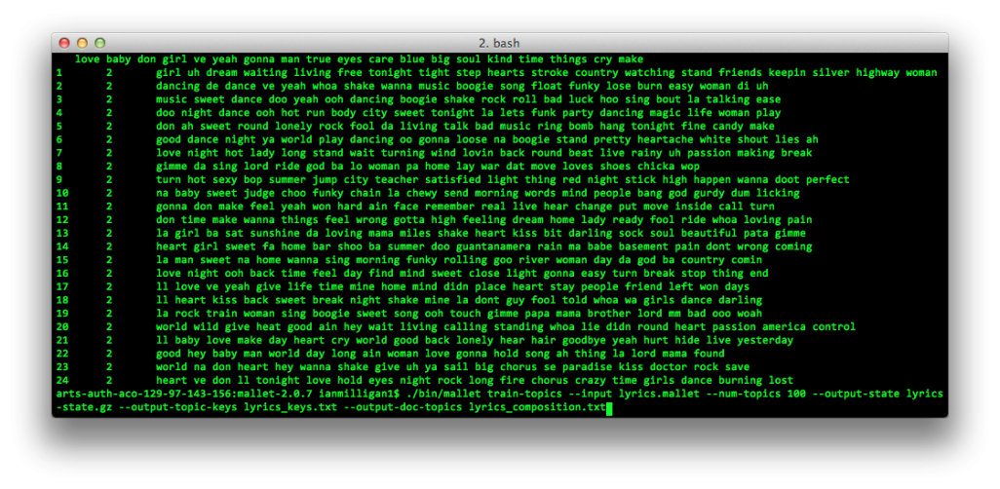

The cat is out of the bag: The Journal of Digital Humanities (2:1), [special issue on topic modeling](/works/journal-of-digital-humanities-2-1/), has been released. It’s a fairly apt phrase, because the process of editing the issue felt a bit like stuffing a cat in a bag. When [Elijah Meeks](https://dhs.stanford.edu/author/emeeks/) approached the *JDH* editors about he and I guest editing an issue on topic modeling, I don’t think either of us quite realized exactly what that would entail. This post is not about the issue or its contents; Elijah and I [already wrote that introduction](/works/dh-contribution-to-topic-modeling/), where we trace the history of topic modeling in the humanities and frame the articles in the issue. Instead, I’d like to take a short post waxing a bit more reflexive than is usual for this blog, discussing my first experience guest editing a journal and how it all came together. Elijah’s similar post can be found [here](https://dhs.stanford.edu/the-digital-humanities-as/the-digital-humanities-as-a-movement-expressed-in-a-method-enshrined-in-a-tool/).

We began with the idea that topic modeling’s relationship to the humanities was just now reaching an important historical moment. Discussions were fast-paced, interesting, and spread across a wide array of media. Better still, *humanists* were contributing to the understanding of a machine learning algorithm! If that isn’t exciting to you, then… well, you’re probably a normal, well-functioning human being. But *we* found it exciting, and we thought the *JDH*, with its catch-the-good post-publication model, would be the perfect place to bring it all together. We quickly realized the difficulty in in stuffing the DH/Topic Modeling cat into the *JDH* bag.

Firstly, there was just *so much* of it out there. Discussions meandered between twitter and blogs and conferences; no snapshot of the conversation could ever be fully inclusive. We threw around a bunch of ideas, including a 20-person Google+ Hangout Panel discussing the benefits and pitfalls of the approach, but most of our ideas proved fairly untenable. Help came from the editors of the *JDH,*  particularly Joan Fragaszy Troyano, who tirelessly worked with us and helped us to get everything organized and together, while allowing us the freedom to take the issue where we wanted it to go. She was able to help us set up something new to the journal, a space which would aggregate [tweets](http://journalofdigitalhumanities.org/2-1/responses-from-twitter/) and [comments](http://journalofdigitalhumanities.org/2-1/respond-to-jdh-2-1/) about the issue in the month following its release, which Elijah and I will then put together and release as a community appendix in May, hoping to capture some of the rich interchange on topic modeling.

Topic model from Graham & Milligan’s review of MALLET.

One particularly troublesome difficulty, which we never resolved to our liking, was one of gender and representation. It has been pointed out before that the *JDH* was not as diverse or gender-balanced as we might want it to be, despite most of its staff being women. The editors have [pointed out](http://digitalhumanitiesnow.org/2012/05/six-month-review-of-digital-humanities-now/) that DH is unfortunately homogeneous, and have worked to increase representation in their issues. Even after realizing the homogeneity in our issue (only two of our initially selected contributors were women, and all were white), we were

<!-- page 2 -->

unable to find other authors who both fit within the theme of the issue and were interested in contributing. I’m certain we must have missed someone crucial, for which I humbly apologize, but I honestly don’t know the best way to remedy this situation. Others have spoken much more eloquently on the subject and have had much better ideas than I ever could. If we had more time and space in the issue, diversity is the one area I would hope to improve.

Once the contributors were selected, the process of getting everything perfect began. Some articles, like Goldstone’s and Underwood’s piece on topic modeling the *PMLA*, were complete enough that we were happy putting the piece up as-is. One of our contributors was a bit worried, due to the post-publication process and the lack of standard peer-review, that this was more akin to a vanity press than a scholarly publication. I disagree (and hopefully we convinced the contributor to disagree as well); the *JDH* has [several layers of peer review](http://journalofdigitalhumanities.org/about/), as the editors and DH community filter the best available pieces through increasingly fine steps, until the selected articles represent the best of what was recently and publicly released. The pieces then went through a rigorous review process from the editorial staff. The original and greatly expanded posts particularly went through several iterations over a matter of months so they would fit as well as possible, and be the best they could be. Because of this process, we actually fell a bit behind schedule, but the resulting quality made the delays worth it.

I cannot stress enough how supportive the *JDH* editorial staff has been in making this issue work, particularly Joan, who helped Elijah and I figure out what we were doing and nudged us when we needed to be nudged, which was more frequently than I like admitting. I hope you all like the issue as much we do, and will contribute to the conversation on twitter or in blogs. If you post anything about the issue, just share a link in a [tweet](http://journalofdigitalhumanities.org/2-1/responses-from-twitter/) and [comment](http://journalofdigitalhumanities.org/2-1/respond-to-jdh-2-1/) and we’ll be sure to include you in the appendix.

Happy modeling!

p.s. I am sad that my favorite line of my and Elijah’s editorial was edited, though it was for good reason. The end of the first paragraph now reads “Were a critic of digital humanities to dream up the worst stereotype of the field, he or she would likely create something very much like this, and then name a popular implementation of it after a hammer.” The line (written by Elijah) originally read “Were **Stanley Fish** [emphasis added] to dream up the worst stereotype of the field, he would likely create something very much like this, and then name a popular implementation of it after a hammer.” The new version is more understandable to a wider audience, but I know some of my readers will appreciate this one more.
