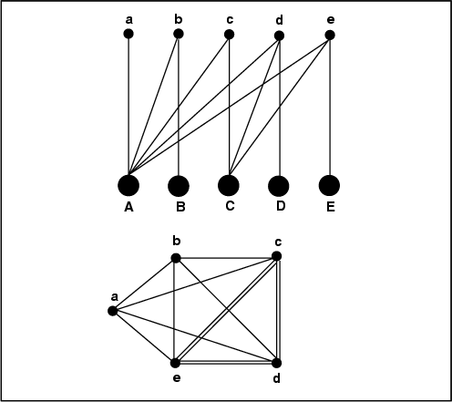

I’m sorry. I love you (you know who you are, all of you). I really do. I love your work, I think it’s groundbreaking and transformative, but the network scientist / statistician in me twitches uncontrollably whenever he sees someone creating a network out of a topic model by picking the top-*n* topics associated with each document and using those as edges in a topic-document network. This is meant to be a short methodology post for people already familiar with LDA and already analyzing networks it produces, so I won’t bend over backwards trying to re-explain networks and topic modeling. Most of my posts are written assuming no expert knowledge, so I apologize if in the interest of brevity this one isn’t immediately accessible.

MALLET, the go-to tool for topic modeling with LDA, outputs a comma separated file where each row represents a document, and each pair of columns is a topic that document is associated with. The output looks something like

```
        Topic 1 | Topic 2 | Topic 3  | ...
Doc 1 | 0.5 , 1 | 0.2 , 5 | 0.1  , 2 | ...
Doc 2 | 0.4 , 6 | 0.3 , 1 | 0.06 , 3 | ...
Doc 3 | 0.6 , 2 | 0.4 , 3 | 0.2  , 1 | ...
Doc 4 | 0.5 , 5 | 0.3 , 2 | 0.01 , 6 | ...
```

Each pair is the amount a document is associated with a certain topic followed by the topic of that association. Given a list like this, it’s pretty easy to generate a bimodal/bipartite network (a network of two types of nodes) where one variety of node is the document, and another variety of node is a topic. You connect each document to the top three (or *n*) topics associated with that document and, voila, a network!

The problem here isn’t that a giant chunk of the data is just being thrown away (although there are more elegant ways to handle that too), but the way in which a portion of the data is kept. By using the top-*n* approach, you lose the rich topic-weight data that shows how *some* documents are really only closely associated with one or two documents, whereas others are closely associated with many. In practice, the network graph generated by this approach will severely skew the results, artificially connecting documents which are topical outliers toward the center of the graph, and preventing documents in the topical core from being represented as such.

In order to account for this skewing, an equally simple (and equally arbitrary) approach can be taken whereby you only take connections that are over weight 0.2 (or whatever, *m*). Now, some documents are related to one or two topics and some are related to several, which more accurately represents the data and doesn’t artificially skew network measurements like centrality.

The real trouble comes when a top-*n* topic network is converted from a bimodal to a unimodal network, where you connect documents to one another based on the topics they share. That is, if Document 1 and Document 4 are both connected to Topics 4, 2, and 7, they get a connection to each other of weight 3 (if they were only connected to 2 of the same topics, they’d get a connection of weight 2, and so forth). In this situation, the resulting network will be as much an artifact of the choice of *n* as of the underlying document similarity network. If you choose different values of *n*, you’ll often get very different results.

<!-- page 1 -->

[](http://www.scottbot.net/HIAL/wp-content/uploads/2012/10/img211.gif)

bimodal to unimodal network. [via](http://iopscience.iop.org/0295-5075/68/2/316).

In this case, the solution is to treat every document as a vector of topics with associated weights, making sure to use *all the topics*, such that you’d have a list that looks somewhat like the original topic CSV, except this time ordered by topic number rather than individually for each document by topic weight.

```
      T1, T2, T3,...
Doc4(0.2,0.3,0.1,...)
Doc5(0.6,0.2,0.1,...)
...
```

From here you can use your favorite correlation or distance finding algorithm ([cosine similarity](http://en.wikipedia.org/wiki/Cosine_similarity), for example) to find the distance from every document to every other document. Whatever you use, you’ll come up with a (generally) symmetric matrix from every document to every other document, looking a bit like this.

```
      Doc1|Doc2|Doc3,...
Doc1  1   |0.3 |0.1
Doc2  0.3 |1   |0.4
Doc3  0.1 |0.4 |1
...
```

<!-- page 2 -->

If you chop off the bottom left or top right triangle of the matrix, you now have a network of document similarity which takes the entire topic model into account, not just the first few topics. From here you can set whatever arbitrary *m* thresholds seem legitimate to visually represent the network in an uncluttered way, for example only showing documents that are more than 50% topically similar to one another, while still being sure that the entire richness of the underlying topic model is preserved, not just the first handful of topical associations.

Of course, whether this method is any more useful than something like LSA in clustering documents is debatable, but I just had to throw my 2¢ in the ring regarding topical networks. Hope it’s useful.

<!-- page 3 -->
