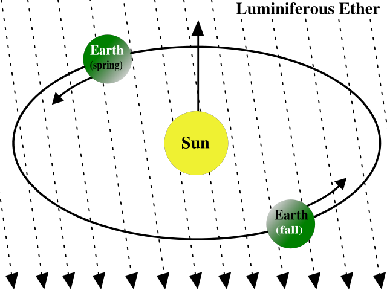
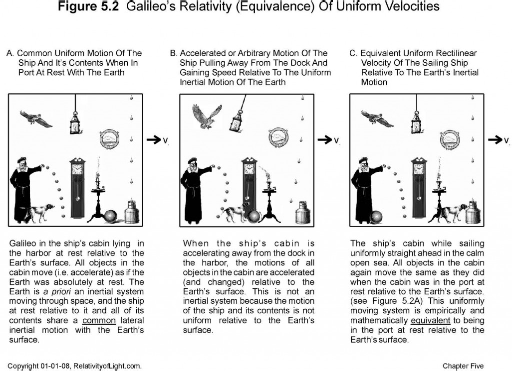
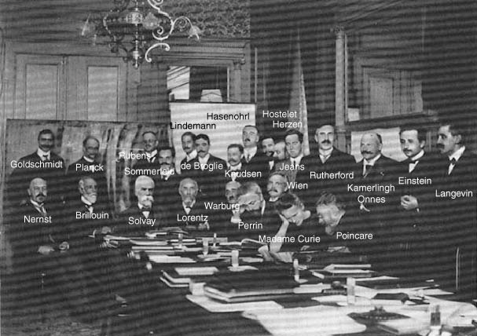

<!-- page 1 -->

We interrupt this usually-DH blog because I got in a discussion about Special Relativity with a friend, and promised it was easily understood using only the math we use for triangles. But I’m a historian, so I can’t leave a good description alone without some background.

<!-- page 2 -->

If you just want to learn how relativity works, skip ahead to the next post, **Relativity Made Simple** \[Note! I haven’t written it yet, this is a two-part post. Stay-tuned for the next section\]; if you hate science and don’t want to know how the universe functions, but love history, read only this post. If you have a month of time to kill, just skip this post entirely and read through [my 122-item relativity bibliography](https://www.zotero.org/scottbot/items/collectionKey/FFXU79XH) on Zotero. Everyone else, disregard this paragraph.

## An Oddly Selective History of Relativity

This is not a history of how Einstein came up with his Theory of Special Relativity as laid out in *Zur Elektrodynamik bewegter Körper* in 1905. It’s filled with big words like *aberration* and *electrodynamics*, and equations with occult symbols. We don’t need to know that stuff. This is a history of how others understood relativity. Eventually, you’re going to understand relativity, but first I’m going to tell you how other people, much smarter than you, did not.

There’s an infamous (potentially mythical) story about how difficult it is to understand relativity: Arthur Eddington, a prominent astronomer, was asked whether it was true that only three people in the world understood relativity. After pausing for a moment, Eddington replies “I’m trying to think who the third person is!” This was about General Relativity, but it was also a joke: good scientists know relativity isn’t incredibly difficult to grasp, and even early on, lots of people could claim to understand it.

Good historians, however, know that’s not the whole story. It turns out a lot of people who thought they understood Einstein’s conceptions of relativity actually did not, including those who agreed with him. This, in part, is that story.

### Relativity Before Einstein

<!-- page 3 -->

Einstein’s special theory of relativity relied on two assumptions: (1) **you can’t ever tell whether you’re standing still or moving at a constant velocity** (or, in physics-speak, the laws of physics in any inertial reference frame are indistinguishable from one another), and (2) **light always looks like it’s moving at the same speed** (in physics-speak, the speed of light is always constant no matter the velocity of the emitting body nor that of the observer’s inertial reference frame). Let’s trace these concepts back.

Our story begins in the 14th century. William of Occam, famous for his razor, claimed motion was merely the location of a body and its successive positions over time; motion itself was in the mind. Because position was simply defined in terms of the bodies that surround it, this meant motion was relative. Occam’s student, Buridan, pushed that claim forward, saying “If anyone is moved in a ship and imagines that he is at rest, then, should he see another ship which is truly at rest, it will appear to him that the other ship is moved.”

<!-- page 4 -->

*Galileo’s relativity \[[via](http://relativityoflight.com/)\]. The site where this comes from is a little crazy, but the figure is still useful, so here it is.*

The story movies forward at irregular speed (much like the speed of this blog, and the pacing of this post). Within a century, scholars introduced the concepts of an infinite universe without any center, nor any other ‘absolute’ location. Copernicus cleverly latched onto this relativistic thinking by showing that the math works just as well, if not better, when the Earth orbits the Sun, rather than vice versa. Galileo claimed there was no way, on the basis of mechanical experiments, to tell whether you were standing still or moving at a uniform speed.

For his part, Descartes disagreed, but did say that the only way one could discuss movement was relative to other objects. Christian Huygens takes Descartes a step forward, showing that there are no ‘privileged’ motions or speeds (that is, there is no intrinsic meaning of a universal ‘at rest’ – only ‘at rest’ relative to other bodies). Isaac Newton knew that it was impossible to measure something’s absolute velocity (rather than velocity relative to an observer), but still, like Descartes, supported the idea that there *was* an absolute space and absolute velocity – we just couldn’t measure it.

Lets skip ahead some centuries. The year is 1893; the U.S. Supreme Court declared the tomato was a vegetable, Gandhi campaigned against segregation in South Africa, and the U.S. railroad industry bubble had just popped, forcing the government to bail out AIG for $85 billion. Or something. Also, by this point, most scientists thought light traveled in waves. Given that in order for something to travel in a wave, *something* has to be waving, scientists posited there was this luminiferous ether that pervaded the universe, allowing light to travel between stars and candles and those fish with the crazy headlights. It makes perfect sense. In order for sound waves to travel, they need air to travel through; in order for light waves to travel, they need the ether.

Ernst Mach, A philosopher read by many contemporaries (including Einstein), said that Newton and Descartes were wrong: absolute space and absolute motion are meaningless. It’s all relative, and only relative motion has any meaning. It is both physically impossible to measure the an objects “real” velocity, and also philosophically nonsensical. The ether, however, was useful. According to Mach and others, we could still measure something *kind of like* absolute position and velocity by measuring things in relationship to that all-pervasive ether. Presumably, the ether was just sitting still, doing whatever ether does, so we could use its stillness as a reference point and measure how fast things were going relative to it.

<!-- page 5 -->

Well, in theory. Earth is hurtling through space, orbiting the sun at about 70,000 miles per hour, right? And it’s spinning too, at about a thousand miles an hour. But the ether is staying still. And light, supposedly, always travels at the same speed through the ether no matter what. So in theory, light should look like it’s moving a bit faster if we’re moving toward its source, relative to the ether, and a bit slower, if we’re moving away from it, relative to the ether. It’s just like if you’re in a train hurdling toward a baseball pitcher at 100 mph, and the pitcher throws a ball at you, also at 100 mph, in a futile attempt to stop the train. To you, the baseball will look like it’s going twice as fast, because you’re moving toward it.

<!-- page 6 -->

*The earth moving through the ether. \[[via](http://en.wikipedia.org/wiki/Luminiferous_aether)\]*

It turns out measuring the speed of light in relation to the ether was really difficult. A bunch of very clever people made a bunch of very clever instruments which really *should have* measured the speed of earth moving through the ether, based on small observed differences of the speed of light going in different directions, but the experiments always showed light moving at the same speed. Scientists figured this must mean the earth was actually exerting a pull on the ether in its vicinity, dragging it along with it as the earth hurtled through space, explaining why light seemed to be constant in both directions when measured on earth. They devised even cleverer experiments that would account for such an ether drag, but even those seemed to come up blank. Their instruments, it was decided, simply were not yet fine-tuned enough to measure such small variations in the speed of light.

Not so fast! shouted Lorentz, except he shouted it in Dutch. Lorentz used the new electromagnetic theory to suggest that the null results of the ether experiments were actually a result, not of the earth dragging the ether along behind it, but of physical objects compressing when they moved against the ether. The experiments weren’t showing any difference in the speed of light they sought because the measuring instruments themselves contracted to just the right length to perfectly offset the difference in the velocity of light, when measuring “into” the ether. The ether was literally squeezing the electrons in the meter stick together so it became a little shorter; short enough to inaccurately measure light’s speed. The set of equations used to describe this effect became known as Lorentz Transformations. One property of these transformations was that the physical contractions would, obviously, appear the same from any observer. No matter how fast you were going relative to your measuring device, if it were moving into the ether, you would see it contracting slightly to accommodate the measurement difference.

<!-- page 7 -->

Not so fast! shouted Poincaré, except he shouted it in French. This property of transformations to always appear the same, relative to the ether, was actually a problem. Remember that 500 years of physics that said there is no way to mechanically determine your absolute speed or absolute location in space? Yeah, so did Poincaré. He said the only way you could measure velocity or location was matter-to-matter, not matter-to-ether, so the Lorentz transformations didn’t fly.

It’s worth taking a brief aside to talk about the underpinnings of the theories of both Lorentz and Poincaré. Their theories were based on experimental evidence, which is to say, they based their reasoning on contraction on apparent experimental evidence of said contraction, and they based their theories of relativity off of experimental evidence of motion being relative.

### Einstein and Relativity

When Einstein hit the scene in 1905, he approached relativity a bit differently. Instead of trying to fit the apparent contraction of objects from the ether drift experiment to a particular theory, Einstein began with the *assumption* that light always appeared to move at the same rate, regardless of the relative velocity of the observer. The other assumption he began with was that there was no privileged frame of reference; no absolute space or velocity, only the movement of matter relative to other matter. I’ll work out the math later, but, unsurprisingly, it turned out that working out these assumptions led to *exactly the same transformation equations* as Lorentz came up with experimentally.

The math was the same. The difference was in the interpretation of the math. Einstein’s theory required no ether, but what’s more, it did not require any physical explanations at all. Because Einstein’s theory of special relativity rested on two postulates about *measurement*, the theory’s entire implications rested in its ability to affect how we measure or observe the universe. Thus, the interpretation of objects “contracting,” under Einstein’s theory, was that they were not contracting at all. Instead, objects merely *appear* as though they contract relative to the movement of the observer. Another result of these transformation equations is that, from the perspective of the observer, time appears to move slower or faster depending on the relative speed of what is being observed. Lorentz’s theory predicted the same time dilation effects, but he just chalked it up to a weird result of the math that didn’t actually manifest itself. In Einstein’s theory, however, weird temporal stretching effects were Actually What Was Going On.

<!-- page 8 -->

To reiterate: the math of Lorentz, Einstein, and Poincaré were (at least at this early stage) essentially equivalent. The result was that *no experimental result could favor one theory over another*. The observational predictions between each theory were exactly the same.

### Relativity’s Supporters in America

I’m focusing on America here because it’s rarely focused on in the historiography, and it’s about time someone did. If I were being scholarly and citing my sources, this might actually be a novel contribution to historiography. Oh well, BLOG! All my primary sources are in that Zotero library I linked to earlier.

In 1910, Daniel Comstock wrote a popular account of the relativity of Lorentz and Einstein, to some extent conflating the two. He suggested that *if* Einstein’s postulates could be experimentally verified, his special theory of relativity would be true. “If either of these postulates be proved false in the future, then the structure erected can not be true in is present form. The question is, therefore, an experimental one.” Comstock’s statement betrays a misunderstanding of Einstein’s theory, though, because, at the time of that writing, there was no experimental difference between the two theories.

Gilbert Lewis and Richard Tolman presented a paper at the 1908 American Physical Society in New York, where they describe themselves as fully behind Einstein over Lorentz. Oddly, they consider Einstein’s theory to be correct, as opposed to Lorentz’s, because his postulates were “established on a pretty firm basis of experimental fact.” Which, to reiterate, couldn’t possibly have been a difference between Lorentz and Einstein. Even more oddly still, they presented the theory not as one of physics or of measurement, but of psychology (a bit like 14th century Oresme). The two went on to separately write a few articles which supposedly experimentally confirmed the postulates of special relativity.

<!-- page 9 -->

In fact, the few Americans who did seem to engage with the actual differences between Lorentz and Einstein did so primarily in critique. Louis More, a well-respected physicist from Cincinnati, labeled the difference as metaphysical and primarily useless. This American critique was fairly standard.

At the 1909 America Physical Society meeting in Boston, one physicist (Harold Wilson) claimed his experiments showed the difference between Einstein and Lorentz. One of the few American truly theoretical physicists, W.S. Franklin, was in attendance, and the lectures he saw inspired him to write a popular account of relativity in 1911; in it, he found no theoretical difference between Lorentz and Einstein. He tended to side theoretically with Einstein, but assumed Lorentz’s theory implied the same space and time dilation effects, which they did not.

Even this series of misunderstandings should be taken as shining examples in the context of an American approach to theoretical physics that was largely antagonistic, at times decrying theoretical differences entirely. At a symposium on Ether Theories at the 1911 APS, the presidential address by William Magie was largely about the uselessness of relativity because, according to him, physics should be a functional activity based in utility and experimentation. Joining Magie’s “side” in the debate were Michelson, Morley, and Arthur Gordon Webster, the co-founder of the America Physical Society. Of those at the meeting supporting relativity, Lewis was still convinced Einstein differed experimentally from Lorentz, and Franklin and Comstock each felt there was no substantive difference between the two. In 1912, Indiana University’s R.D. Carmichael stated Einstein’s postulates were “a direct generalization from experiment.” In short, the American’s were *really focused* on experiment.

<!-- page 10 -->

Of Einstein’s theory, Louis More wrote in 1912:

> *Professor **Einstein’s theory of Relativity** \[… is\] proclaimed somewhat noisily to be the greatest revolution in scientific method since the time of Newton. That \[it is\] revolutionary there can be no doubt, in so far as \[it\] substitutes mathematical symbols as the basis of science and denies that any concrete experience underlies these symbols, thus replacing an objective by a subjective universe. The question remains whether this is a step forward or backward \[…\] **if there is here any revolution in thought, it is in reality a return to the scholastic methods of the Middle Ages**.*

More goes on to say how the “Anglo-Saxons” demand practical results, not the unfathomable theories of “the German mind.” Really, that quote about sums it up. By this point, the only Americans who even talked about relativity were the ones who trained in Germany.

I’ll end here, where most histories of the reception of relativity begin: the first Solvay Conference. It’s where this beautiful picture was taken.

<!-- page 11 -->

*First Solvay Conference. \[[via](http://hyperphysics.phy-astr.gsu.edu/hbase/phyhis/solvay2.html)\]*

To sum up: in the seven year’s following Einstein’s publication, the only Americans who agreed with Einstein were ones who didn’t quite understand him. You, however, will understand it much better, if you only read the next post \[coming this week!\].
