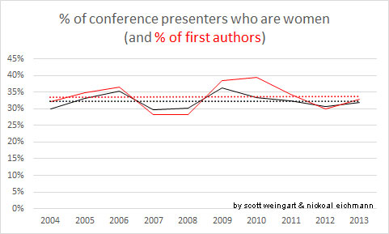
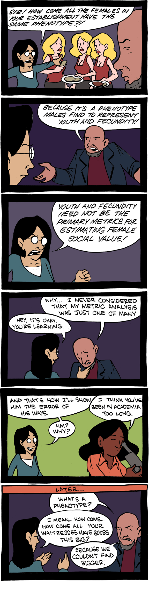
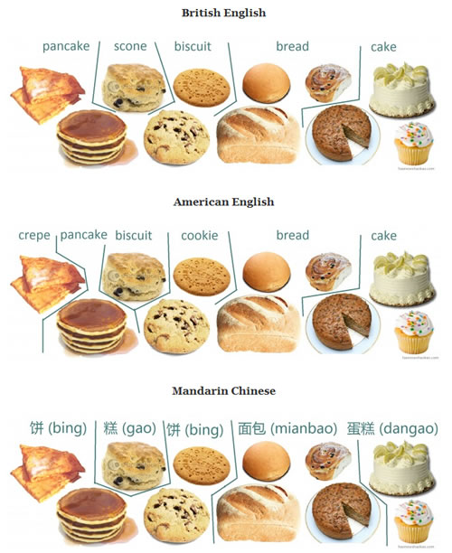
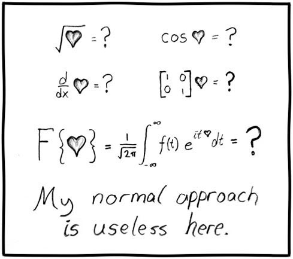

**tl;dr**. Don’t rely on data to fix the world’s injustices. An unusually self-reflective and self-indulgent post.

[Edit: this question was prompted by a series of analyses and visualizations I’ve done in collaboration with [Nickoal Eichmann](http://nickoal.com/), but I purposefully left her out of the majority of this post, as it was one of self-reflection about my own personal choices. A respected colleague pointed out in private that by doing so, I nullified my female collaborator’s contributions to the project, for which I apologize deeply. Nickoal’s input has been integral to all of this, and she and many others, including particularly [Jeana Jorgensen](http://jeanajorgensen.com/wordpress/) and [Heather Froehlich](http://hfroehli.ch/) (who has [written on this very subject](http://www.ling.lancs.ac.uk/pgconference/v07/Heather.pdf)), have played vital roles in my own learning about these issues. Recent provocations by [Miriam Posner](http://miriamposner.com/) helped solidify a lot of these thoughts and inspired this post. What follows is a self-exploration, recapping what many people have already said, but hopefully still useful to some. Mistakes below shouldn’t reflect poorly on those who influenced or inspired me. The post from this point on is as it originally appeared.]

Someone asked yesterday why I cared enough[^1] about gender equality in academia to make this chart (with [Nickoal Eichmann](http://nickoal.com/)).

<!-- page 2 -->

Gender representation as authors at DH conferences over the last decade. [Context](http://www.scottbot.net/HIAL/?tag=dhconf). (Women consistently represent around 33% of authors)

I didn’t know how to answer the question. Our culture gives some more and better opportunities than others, so in order to make things better for more people, we must reveal and work towards resolving points of inequality. “Why do I care?” Don’t most of us want to make things better, we just go about it in different ways, and have different ideas of what’s “better”?

But the question did make me consider **why I’d started with gender equality**, when there are clearly so many other equally important social issues to tackle, within and outside academia. The answer was immediately obvious: **ease**. I’d attempted to explore racial and ethnic diversity as well, but it was simply more fraught, complicated, and less amenable to my methods than gender, so I started with gender and figured I’d work my way into the weeds from there.[^2]

I’ll cut to the chase. My well-intentioned attempts at battling inequality suffer their own sort of bias: by focusing on *measurements* of inequality, I bias that which is easily measured. It’s not that gender isn’t complex (see [Miriam Posner’s wonderful recent keynote](http://miriamposner.com/blog/whats-next-the-radical-unrealized-potential-of-digital-humanities/) on these and related issues), but at least it’s a little easier to measure than race & ethnicity, when all you have available to you is what you can look up on the internet.

[scroll down]

<!-- page 3 -->

<!-- page 4 -->

<!-- page 5 -->

Saturday Morning Breakfast Cereal. [[source](http://www.smbc-comics.com/?id=2365)]

While this problem is far from new, it takes special significance in a data-driven world. That which is countable counts, and damn the rest. At its heart, this problem is one of classification and categorization: those social divides which have the clearest seams are those most easily counted. And in a data-driven world, it’s inequality along these clear divides which get noticed first, even when injustice elsewhere is far greater.

Sex is easy, compared to gender. At most 2% of people are born intersex [according to most standards](https://en.wikipedia.org/wiki/Intersex#Population_figures) (but not accounting for dysmorphia & similar). And gender is relatively easy compared to [race and ethnicity](http://ngm.nationalgeographic.com/2013/10/changing-faces/schoeller-photography). Nationality is pretty easy because of bureaucratic requirements for passports and citizenship, and country of residence is even easier, unless you live somewhere like Palestine.

But even the Palestine issue isn’t completely problematic, because counting still works fine when one thing exists in multiple categories, or may be categorized differently in different systems. That’s okay.

<!-- page 6 -->

[[source](http://haonowshaokao.com/2012/01/24/categorisation-of-baked-goods-and-pancakes-in-english-and-chinese/)]

Where math gets lost is where there are simply no good borders to draw around entities—or worse, there are borders, but those borders themselves are drawn by insensitive outgroups. We see this a lot in the history of colonialism. Have you ever been to the Pitt Rivers Museum in Oxford? It’s a 19th century museum that essentially shows what the 19th century British mind felt about the world: everything that looks like a flute is in the flute cabinet, everything that looks like a gun is in the gun cabinet, and everything that looks like a threatening foreign religious symbol is in the threatening foreign religious symbol cabinet. Counting such a system doesn’t reveal any injustice except that of the counters themselves.

<!-- page 7 -->

Pitt Rivers Museum [[source](http://www.synotrip.com/sites/default/files/imagecache/node_view/uktourz/pitt_rivers_museum_2.jpg)]

And I’ll be honest here: I want to help make the world a better place, but I’ve got to work to my strengths and know my limits. I’m a numbers guy. I’m at my best when counting stuff, and when there are no sensitive ways to classify, I avoid counting, because I don’t want to be That Colonizing White Dude who tries to fit everything into boxes of his own invention to make himself feel better about what he’s doing for the world. I probably still fall into that trap a lot anyway.

So why did I care enough to count gender at DH conferences? It was (relatively) easy. And it’s needed, as we saw at DH2015 and we’ve seen throughout the digital humanities – we have a gender issue, and a feminism issue, and they both need to be pointed out and addressed. But we also have lots of other issues that I’ll simply never be able to approach, and don’t know how to approach, and am in danger of ignoring entirely if I only rely on quantitative evidence of inequality.

<!-- page 8 -->

[useless](https://xkcd.com/55/) by xkcd

Of course, only relying on non-quantitative evidence has its own pitfalls. People evolved and are socialized to spot patterns, to extrapolate from limited information, even when those extrapolations aren’t particularly meaningful or lead to Jesus in a slice of toast. I’m not advocating we avoid metrics entirely (for one, I’d be out of a job), but echoing [Miriam Posner’s recent provocation](http://miriamposner.com/blog/whats-next-the-radical-unrealized-potential-of-digital-humanities/), we need to engage with techniques, approaches, and perspectives that don’t rely on easy classification schemes. Especially, we need to listen when people notice injustice that isn’t easily classified or counted.

“Uh, yes, Scott, who are you writing this for? We already knew this!” most of you are likely asking if you’ve read this far. I’m writing to myself in early college, an engineering student obsessed with counting, who’s slowly learned the holes in a worldview that only relies on quantitative evidence. The one who spent years quantifying his health issues, only to discover the pursuit of a number eventually took precedence over the pursuit of his own health.[^3]

Hopefully this post helps balance all the bias implicit in my fighting for a better world from a data-driven perspective, by suggesting “data-driven” is only one of many valuable perspectives.

Notes:

<!-- page 9 -->

[^1]: Upon re-reading the original question, it was actually “Why did you do it? (or why are you interested?)”. Still, this post remains relevant.

[^2]: I’m light on details here because I don’t want this to be an overlong post, but you can read some more of the details on what Nickoal and I are doing, and the decisions we make, in [this blog series](http://www.scottbot.net/HIAL/?tag=dhconf).

[^3]: A blog post on mental & physical health in academia is forthcoming.
